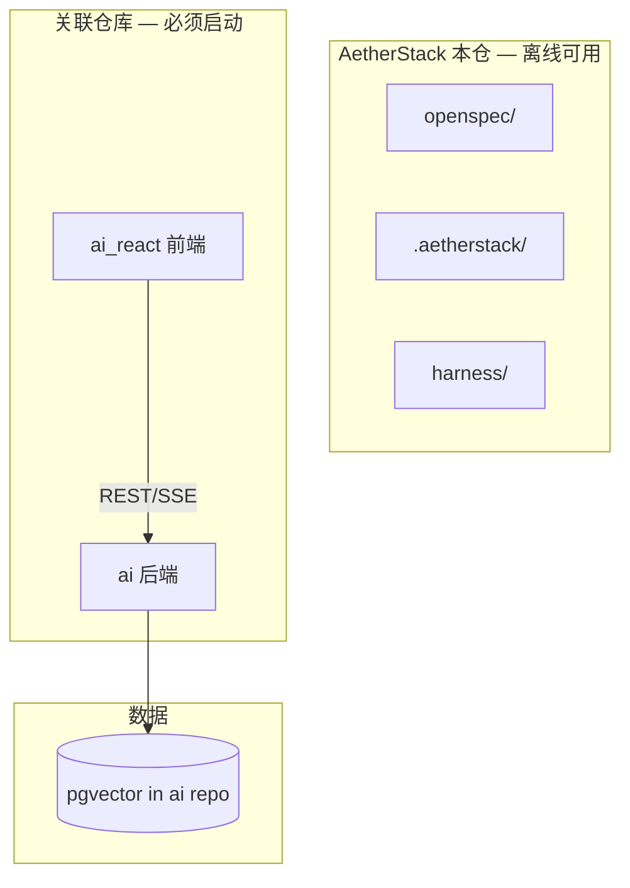

# AetherStack 架构概览

> AetherStack 为**治理层仓库**；应用代码在关联仓库 **ai** / **ai_react**。详见 [docs/REPOS.md](docs/REPOS.md)。

## 分层

## 模块

| 位置 | 内容 |
|------|------|
| AetherStack | OpenSpec、obra Superpowers 集成、Harness 配置 |
| `D:\cache\workspace\ai` | Agent Hub、KnowledgeHub |
| `D:\cache\workspace\ai_react` | Nebula Desk UI |

配置：`.aetherstack/context/repos.yaml`、`LOCALPATH.md`

## API 契约

[openspec/references/integration-contracts.md](openspec/references/integration-contracts.md)
