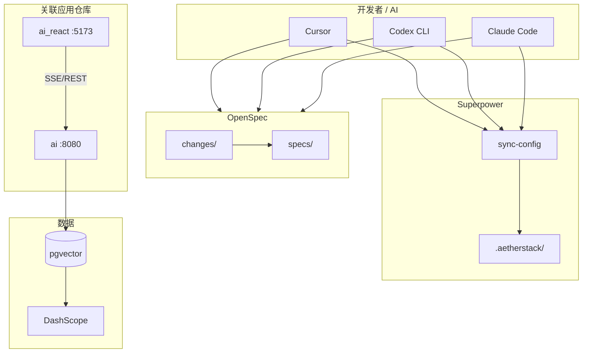
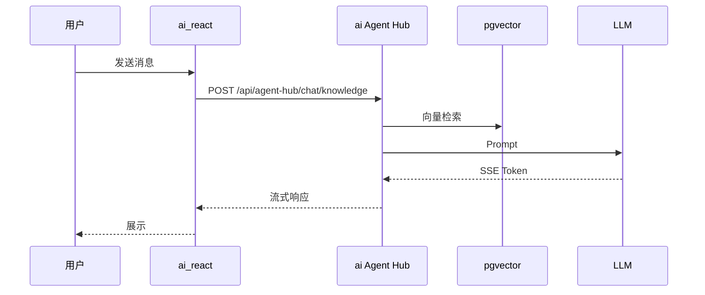
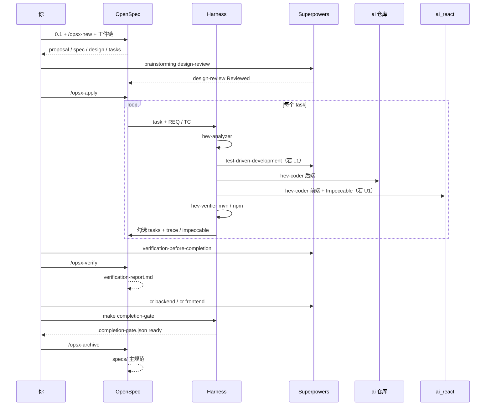

# AetherStack

> **维护说明：** 编辑本文件后运行 `make sync-config`，将同步到根目录 `README.md`（UTF-8 字节复制）。

全栈 AI **治理层仓库**：融合 **OpenSpec**、**Harness**、**obra Superpowers**；前后端代码在独立仓库 **ai** / **ai_react** 中关联使用（见 [docs/REPOS.md](docs/REPOS.md)）。

> 设计背景：[STEP1-DESIGN.md](STEP1-DESIGN.md)

---

## 核心理念

| 层次 | 职责 | 需启动服务 |
|------|------|------------|
| 治理层 | openspec、.aetherstack | 否，离线可用 |
| 应用层 | 关联仓库 ai / ai_react | **是**（在各自仓库启动） |
| 数据层 | ai 仓库内 docker compose pgvector | 联调后端时 |

---

## 系统架构



### 对话数据流



### 单需求交付时序（OpenSpec × Harness × Superpowers）

以一个功能需求为例（如 Agent SSE 流式 + 前端聊天区改版）：OpenSpec 定义范围与任务，Harness 在 **ai** / **ai_react** 执行并验证，Superpowers 提供设计审查、TDD、完成前验证与 CR。归档前须 `make completion-gate`（见 [completion-gate.md](openspec/references/completion-gate.md)）。



---

## 技术栈

Java 17 · Spring Boot 3.4 · Spring AI · React 19 · Vite 8 · PostgreSQL 16 · pgvector · OpenSpec 1.x

详见 [openspec/references/tech-stack.md](openspec/references/tech-stack.md)。

---

## 关联仓库路径配置

前后端代码不在本仓内，路径**只在一处维护**，避免 `LOCALPATH.md`、Cursor 工作区、契约文件等多处手改不一致。

### 配置入口（唯一真源）

[`.aetherstack/context/repos.yaml`](.aetherstack/context/repos.yaml)

```yaml
repositories:
  backend:
    name: ai
    local: D:/cache/workspace/ai          # 后端仓库本地路径
  frontend:
    name: ai_react
    local: D:/cache/workspace/ai_react    # 前端仓库本地路径
```

### 配置方式

1. **编辑** `repos.yaml` 中 `repositories.backend.local` / `repositories.frontend.local`（建议用正斜杠路径，如 `D:/cache/workspace/ai`）。
2. **同步** 衍生配置：

   ```powershell
   make sync-config
   ```

3. **（可选）环境变量覆盖**（优先级高于 yaml，适合 CI 或多机器）：

   ```powershell
   $env:AETHER_BACKEND_REPO = "D:\path\to\ai"
   $env:AETHER_FRONTEND_REPO = "D:\path\to\ai_react"
   ```

`make sync-config` 会根据 `repos.yaml` 自动生成或更新：

| 产出文件 | 用途 |
|----------|------|
| [`LOCALPATH.md`](LOCALPATH.md) | 路径摘要（勿手改） |
| [`aether-dev.code-workspace`](aether-dev.code-workspace) | Cursor 多根工作区（治理 + 后端 + 前端） |
| [`.cursor/sandbox.json`](.cursor/sandbox.json) | Agent 沙箱额外读写路径 |
| [`.cursor/permissions.json`](.cursor/permissions.json) | 终端 / Auto-review 策略 |
| `api-contracts.yaml` 底部 `REPO PATHS` 段 | 契约中的前后端绝对路径 |

解析脚本（供 `dev.ps1`、`verify`、规则引用）：

```powershell
.\scripts\resolve-repos.ps1 -Repo backend
.\scripts\resolve-repos.ps1 -Repo frontend
```

**Cursor 推荐**：`文件 → 从文件打开工作区 → aether-dev.code-workspace`，减少跨仓编辑时的权限确认。

更多说明：[docs/REPOS.md](docs/REPOS.md) · 生成模板：[`.aetherstack/templates/LOCALPATH.md.tpl`](.aetherstack/templates/LOCALPATH.md.tpl)

---

## 快速启动

### 1. 配置路径并同步 AI 配置

先按上一节改好 [repos.yaml](.aetherstack/context/repos.yaml)，再执行：

```powershell
make sync-config
```

### 2. 仅文档/规范（无需启动）

编辑 `openspec/`、`.aetherstack/` 即可。

### 3. 全栈联调（在关联仓库中启动）

路径以 `repos.yaml` 为准；下面用变量示例（PowerShell）：

```powershell
$Backend = .\scripts\resolve-repos.ps1 -Repo backend
$Frontend = .\scripts\resolve-repos.ps1 -Repo frontend

# 后端
cd $Backend
docker compose up -d
$env:DASHSCOPE_API_KEY="your-key"
$env:POSTGRES_JDBC_URL="jdbc:postgresql://127.0.0.1:5432/agenthub"
$env:POSTGRES_USERNAME="postgres"
$env:POSTGRES_PASSWORD="secret"
mvn spring-boot:run
```

新终端 — **前端**：

```powershell
cd (.\scripts\resolve-repos.ps1 -Repo frontend)
npm install
npm run dev
```

或在 AetherStack 根目录一键提示启动（同样解析 `repos.yaml`）：

```powershell
cd D:\cache\workspace\AetherStack
.\scripts\dev.ps1
```

- 前端 http://localhost:5173
- Swagger http://localhost:8080/swagger-ui.html

完整步骤：[docs/GETTING_STARTED.md](docs/GETTING_STARTED.md)

---

## OpenSpec

| Schema | 适用 |
|--------|------|
| standard-spec-driven | 复杂需求 |
| simple-spec-driven | 小改动 |
| bugfix-spec-driven | 缺陷 |

**快速命令链**（单需求从立项到归档）：

```text
/opsx-new → /opsx-continue → /opsx-apply → /opsx-verify → make completion-gate → /opsx-archive
```

规则：[openspec/references/aether-rules.md](openspec/references/aether-rules.md) · 门禁：[completion-gate.md](openspec/references/completion-gate.md) · 指南：[docs/guides/openspec.md](docs/guides/openspec.md)

### 快速命令链教程

| 步骤 | Cursor 命令 / 脚本 | 做什么 | 主要产出 |
|------|-------------------|--------|----------|
| 0 | （对话）OpenSpec 0.1 | 选 schema、需求材料、`aiTddMode` / `uiCraftMode` | `openspec/changes/<id>/.openspec.yaml` |
| 1 | `/opsx-new` | 创建变更目录 | `openspec/changes/<id>/` |
| 2 | `/opsx-continue` | 按 schema 生成下一工件（可多次） | `proposal` → `spec` → `design` → `design-review` → `test-cases` → `tasks` |
| 3 | `/opsx-apply` | 逐项执行 `tasks.md`（Harness 三阶段） | **ai** / **ai_react** 代码 + 勾选 task |
| 4 | Superpowers + 记录脚本 | 完成前验证并写入 gate 状态 | 见下方「收口命令」 |
| 5 | `/opsx-verify` | 对照 spec/design/tasks 审查实现 | `verification-report.md` |
| 6 | `make completion-gate` | 统一门禁（含 `make verify`） | `.completion-gate.json` → `overall: ready` |
| 7 | `/opsx-archive` | 移入 archive，可选 sync 主 spec | `openspec/changes/archive/YYYY-MM-DD-<id>/` |

**`/opsx-apply` 单条 task 微循环**（每条实现类任务重复）：

1. **Harness Analyze** — 核对 design 路径、影响仓库（ai / ai_react）
2. **Harness Code** — 改代码；L1 先 `test-driven-development`；U1 走 Impeccable
3. **Harness Verify** — `mvn -Dtest=…` 或 `npm run lint && npm run build`，通过后再 `- [x]`

**收口命令**（在 AetherStack 治理仓 PowerShell，将 `<id>` 换成变更名）：

```powershell
cd D:\cache\workspace\AetherStack

# 1) Superpowers：会话内 invoke verification-before-completion 后执行
.\.aetherstack\scripts\record-completion-step.ps1 -Change <id> -Step superpowersVerification -Status done

# 2) OpenSpec 校验（Cursor /opsx-verify），报告须落在变更目录
.\.aetherstack\scripts\record-completion-step.ps1 -Change <id> -Step openspecVerify -Status pass -ReportPath verification-report.md

# 3) 代码审查（Cursor：cr backend / cr frontend）后记录
.\.aetherstack\scripts\record-code-review.ps1 -Change <id> -Scope backend -Status approved
.\.aetherstack\scripts\record-code-review.ps1 -Change <id> -Scope frontend -Status approved  # 有前端任务时

# 4) 统一门禁（无 make 时见下方实例）
powershell -ExecutionPolicy Bypass -File .aetherstack/scripts/completion-gate.ps1 -Change <id>
```

无 `make` 时用：`powershell -ExecutionPolicy Bypass -File .aetherstack/scripts/completion-gate.ps1 -Change <id>` 代替 `make completion-gate`。

### 使用实例：新增「知识库对话 SSE + 聊天区改版」

假设变更 ID 为 `add-knowledge-sse-chat`（standard-spec-driven，`aiTddMode: enabled`，`uiCraftMode: enabled`）。

**阶段 A — 立项与工件（治理仓，无需启动 ai/ai_react）**

```text
你：做一个 OpenSpec 变更，schema 选 standard，需求：…
AI：0.1 逐项确认 → 创建 openspec/changes/add-knowledge-sse-chat/

/opsx-new
/opsx-continue          # 直到生成 tasks.md；standard 须在 design 后完成 design-review Reviewed
```

`.openspec.yaml` 示例：

```yaml
aiTddMode: enabled
uiCraftMode: enabled
```

**阶段 B — 实现（在关联仓写代码）**

```text
/opsx-apply add-knowledge-sse-chat
```

AI 按 `tasks.md` 执行，例如：

```markdown
- [x] 1.4 AUTO-AI-UT trace: TC-REQ2-01 → SseAssemblyTest#emitsOrderedChunks
- [x] 1.2a UI-CRAFT impeccable: shape+craft 聊天区主布局
```

对应动作：在 **ai** 写 `SseAssemblyTest` + 流式组装；在 **ai_react** 用 Impeccable 改聊天区并 `npm run lint`、`npm run build`。

**阶段 C — 收口与归档**

```powershell
cd D:\cache\workspace\AetherStack

# Cursor 中：/opsx-verify add-knowledge-sse-chat
# 确认 openspec/changes/add-knowledge-sse-chat/verification-report.md 含 Ready for archive

.\.aetherstack\scripts\record-completion-step.ps1 -Change add-knowledge-sse-chat -Step superpowersVerification -Status done
.\.aetherstack\scripts\record-completion-step.ps1 -Change add-knowledge-sse-chat -Step openspecVerify -Status pass -ReportPath verification-report.md
.\.aetherstack\scripts\record-code-review.ps1 -Change add-knowledge-sse-chat -Scope backend -Status approved
.\.aetherstack\scripts\record-code-review.ps1 -Change add-knowledge-sse-chat -Scope frontend -Status approved

powershell -ExecutionPolicy Bypass -File .aetherstack/scripts/completion-gate.ps1 -Change add-knowledge-sse-chat
# 输出 overall: ready 后：

# Cursor：/opsx-archive add-knowledge-sse-chat
# 可选先：/opsx-sync add-knowledge-sse-chat
```

**常见阻断与处理**

| 门禁报错 | 处理 |
|----------|------|
| 缺少 `verification-report.md` | 先 `/opsx-verify <id>` 并保存报告到变更目录 |
| `code review [backend] 须 approved` | 执行 `cr backend` 后 `record-code-review.ps1` |
| `superpowersVerification` 未记录 | 完成 `verification-before-completion` 后 `record-completion-step` |
| U1 缺少 `impeccable:` | 在已勾选 UI 任务行补上 Impeccable 验收标记 |
| AUTO-UT 缺少 `trace:` | 见 [traceability-standards.md](openspec/references/traceability-standards.md) |
| `make verify` 失败 | 在 **ai** / **ai_react** 修复测试或 lint 后重跑 gate |

**小改动 / 缺陷**可改用 `simple-spec-driven` 或 `bugfix-spec-driven`：命令链相同，工件名不同（如 `design-lite`、`bug-report`），可跳过 `design-review`。

---

## Harness

六阶段：索引 → 计划 → 执行 → 验证 → 完成 → 归档

- 配置：`harness/harness.config.yaml`
- 验证：`make verify`

指南：[docs/guides/harness.md](docs/guides/harness.md)

---

## AI 工作流（obra Superpowers + .aetherstack）

Cursor 安装插件：`/add-plugin superpowers`。项目规则只编辑 `.aetherstack/`，运行 `make sync-config`。

手册：[docs/SUPERpower.md](docs/SUPERpower.md)

---

## CI/CD

GitHub Actions，仓库 Variable `CI_ENABLED=false` 可关闭。

说明：[.github/workflows/README.md](.github/workflows/README.md)

---

## 文档索引

| 文档 | 说明 |
|------|------|
| [docs/INDEX.md](docs/INDEX.md) | 全索引 |
| [AGENTS.md](AGENTS.md) | AI 入口 |
| [ARCHITECTURE.md](ARCHITECTURE.md) | 架构 |
| [LOCALPATH.md](LOCALPATH.md) | 关联路径摘要（由 sync-config 生成） |
| [.aetherstack/context/repos.yaml](.aetherstack/context/repos.yaml) | 关联路径唯一真源 |

---

## 关联仓库（不内嵌代码）

| 来源 | 关联方式 |
|------|----------|
| qwmsspec | 框架复制 → `openspec/` |
| harness-engineering-open | 框架复制 → `harness/` |
| **ai**（后端） | **路径关联** → `repos.yaml` → `repositories.backend.local` |
| **ai_react**（前端） | **路径关联** → `repos.yaml` → `repositories.frontend.local` |

路径配置入口与同步方式见上文 **[关联仓库路径配置](#关联仓库路径配置)**。详见 [docs/REPOS.md](docs/REPOS.md)。
