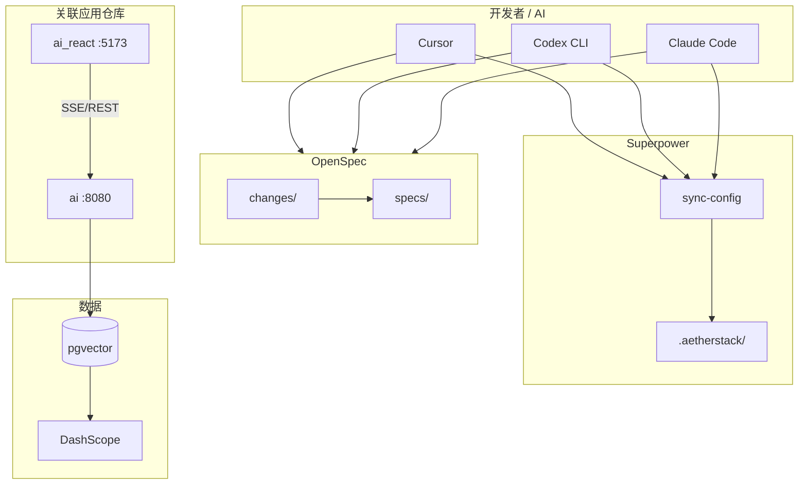
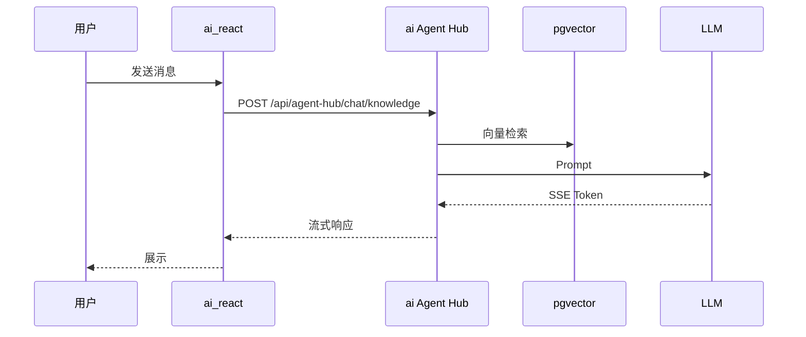

# AetherStack

> **维护说明：** 编辑本文件后运行 `make sync-config`，将同步到根目录 `README.md`（UTF-8 字节复制）。

全栈 AI **治理层仓库**：融合 **OpenSpec**、**Harness**、**obra Superpowers**；前后端代码在独立仓库 **ai** / **ai_react** 中关联使用（见 [docs/REPOS.md](docs/REPOS.md)）。

> 设计背景：[STEP1-DESIGN.md](STEP1-DESIGN.md)

---

## 核心理念

| 层次 | 职责 | 需启动服务 |
|------|------|------------|
| 治理层 | openspec、.aetherstack | 否，离线可用 |
| 应用层 | 关联仓库 ai / ai_react | **是**（在各自仓库启动） |
| 数据层 | ai 仓库内 docker compose pgvector | 联调后端时 |

---

## 系统架构



### 对话数据流



---

## 技术栈

Java 17 · Spring Boot 3.4 · Spring AI · React 19 · Vite 8 · PostgreSQL 16 · pgvector · OpenSpec 1.x

详见 [openspec/references/tech-stack.md](openspec/references/tech-stack.md)。

---

## 快速启动

### 1. 同步 AI 配置

```powershell
make sync-config
```

### 2. 仅文档/规范（无需启动）

编辑 `openspec/`、`.aetherstack/` 即可。

### 3. 全栈联调（在关联仓库中启动）

```powershell
# 后端仓库 ai
cd D:\cache\workspace\ai
docker compose up -d
$env:DASHSCOPE_API_KEY="your-key"
$env:POSTGRES_JDBC_URL="jdbc:postgresql://127.0.0.1:5432/agenthub"
$env:POSTGRES_USERNAME="postgres"
$env:POSTGRES_PASSWORD="secret"
mvn spring-boot:run
```

新终端 — **前端仓库 ai_react**：

```powershell
cd D:\cache\workspace\ai_react
npm install
npm run dev
```

或使用 AetherStack 脚本（自动解析 [repos.yaml](.aetherstack/context/repos.yaml)）：

```powershell
cd D:\cache\workspace\AetherStack
.\scripts\dev.ps1
```

- 前端 http://localhost:5173
- Swagger http://localhost:8080/swagger-ui.html

完整步骤：[docs/GETTING_STARTED.md](docs/GETTING_STARTED.md)

---

## OpenSpec

| Schema | 适用 |
|--------|------|
| standard-spec-driven | 复杂需求 |
| simple-spec-driven | 小改动 |
| bugfix-spec-driven | 缺陷 |

Cursor：`/opsx-new` → `/opsx-apply` → `/opsx-archive`

规则：[openspec/references/aether-rules.md](openspec/references/aether-rules.md)

指南：[docs/guides/openspec.md](docs/guides/openspec.md)

---

## Harness

六阶段：索引 → 计划 → 执行 → 验证 → 完成 → 归档

- 配置：`harness/harness.config.yaml`
- 验证：`make verify`

指南：[docs/guides/harness.md](docs/guides/harness.md)

---

## AI 工作流（obra Superpowers + .aetherstack）

Cursor 安装插件：`/add-plugin superpowers`。项目规则只编辑 `.aetherstack/`，运行 `make sync-config`。

手册：[docs/SUPERpower.md](docs/SUPERpower.md)

---

## CI/CD

GitHub Actions，仓库 Variable `CI_ENABLED=false` 可关闭。

说明：[.github/workflows/README.md](.github/workflows/README.md)

---

## 文档索引

| 文档 | 说明 |
|------|------|
| [docs/INDEX.md](docs/INDEX.md) | 全索引 |
| [AGENTS.md](AGENTS.md) | AI 入口 |
| [ARCHITECTURE.md](ARCHITECTURE.md) | 架构 |

---

## 关联仓库（不内嵌代码）

| 来源 | 关联方式 |
|------|----------|
| qwmsspec | 框架复制 → `openspec/` |
| harness-engineering-open | 框架复制 → `harness/` |
| **ai** | **路径关联** → `D:\cache\workspace\ai` |
| **ai_react** | **路径关联** → `D:\cache\workspace\ai_react` |

详见 [docs/REPOS.md](docs/REPOS.md)。
