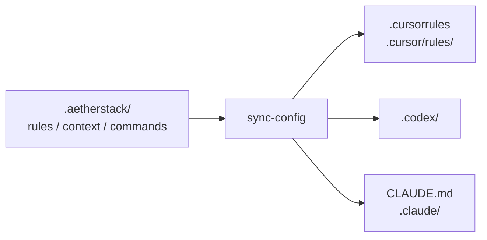
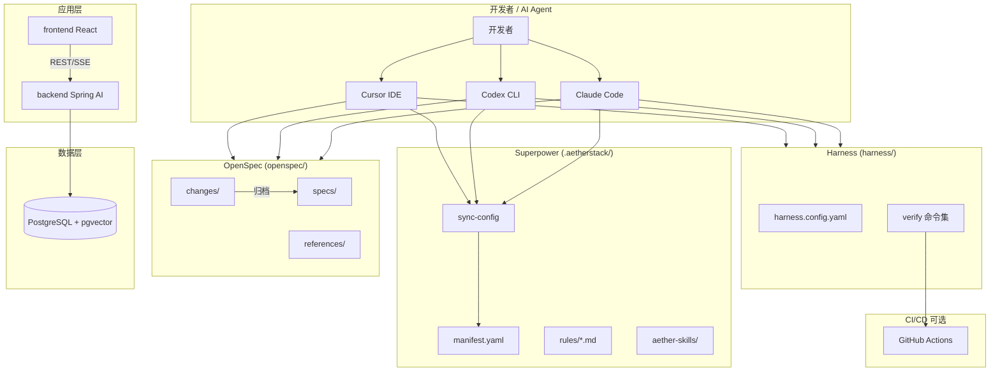

# AetherStack 整合重构 — Step 1 分析与设计结论

> 文档版本：2026-05-30  
> 状态：已确认；**§12 起前后端改为关联仓库，§1–§11 中 `backend/`、`frontend/` 为初版 Monorepo 方案（已废止）**

---

## 1. 项目背景与目标

**AetherStack** 是一个全栈 AI 项目，将以下四个来源整合到 Monorepo 单仓：

| 来源 | 原路径 | 角色 |
|------|--------|------|
| OpenSpec 规范 | `D:\cache\workspace\qwmsspec` | 需求/设计/任务规范管理 |
| Harness 工程实践 | `D:\cache\workspace\harness-engineering-open` | AI 驱动开发流程与验证闭环 |
| Java 后端 | `D:\cache\workspace\ai` | Spring Boot + Spring AI + pgvector |
| React 前端 | `D:\cache\workspace\ai_react` | Vite + React（Nebula Desk） |

**目标目录：** `D:\cache\workspace\AetherStack`

**核心理念：**

- Monorepo 单仓：规范、后端、前端、AI 配置、CI 同仓
- OpenSpec 为需求真相源，Harness 为实现编排层，Superpower 为 AI 能力层
- `.aetherstack/` 单一配置源，三工具（Cursor / Codex CLI / Claude Code）同步

---

## 2. 现状分析摘要

### 2.1 各来源画像

| 来源 | 本质 | 可复用度 |
|------|------|----------|
| qwmsspec | 规范驱动开发：schema 流程、changes/specs 生命周期、references、skills | 框架高复用，业务内容需替换 |
| harness-engineering-open | Claude Code Agent 框架：六阶段、三 Agent、验证闭环、文档模板 | 流程/验证/文档骨架高复用，**非传统 CI/CD** |
| ai | Spring Boot 3.4 + Spring AI + pgvector 单模块 Maven | 整体迁移 |
| ai_react | Vite 8 + React 19 SPA | 整体迁移 |

### 2.2 关键发现

1. **Harness ≠ CI/CD 仓库**：无 GitHub Actions / Dockerfile；工程化体现在 Agent 验证命令与六阶段文档流程。CI 需**新建**，命令从 Harness 适配器提取。
2. **OpenSpec 原与代码仓分离**：AetherStack 采用 Monorepo 同仓，保留 `changes/ → specs/` 归档生命周期。
3. **Superpower 能力分散于**：OpenSpec 追溯、Harness 编排、qwms-skills、ai_react 文档规范；整合到 `.aetherstack/` + `aether-skills/`。
4. **backend / frontend 原无 CI**：整合时新建 GitHub Actions（可配置开关）。

---

## 3. 已确认决策（待确认项闭环）

| # | 决策 | 实施影响 |
|---|------|----------|
| 1 | OpenSpec 允许「**无工单 + 需求描述**」 | `aether-rules.md` 0.1：Issue/Jira 可选；无工单时直接提供需求描述 |
| 2 | 保留 Java 包名 `com.yxy.deepseek` | 不做包名重构 |
| 3 | 保留 `springai/` Demo 模块 | README 标注为教程/演示 |
| 4 | Harness **项目内** vendoring | 放在 `harness/`，不依赖全局 `~/.claude` |
| 5 | `docker-compose.yml` 放**根目录** | 统一 `make dev` / 脚本入口 |
| 6 | **GitHub Actions + 可配置开关** | 如 `vars.CI_ENABLED != 'false'` 或 `workflow_dispatch` |
| 7 | OpenSpec CLI **文档默认说明** | README 写安装方式；validate workflow 可选 |
| 8 | 前端**先保持 JS** | 后续再升级 TypeScript |

### 3.1 启动边界（重要约束）

| 范围 | 是否必须启动 | 说明 |
|------|--------------|------|
| **AetherStack 治理层**（OpenSpec、`.aetherstack/`、`aether-skills/`、`harness/docs/`、根文档） | **不需要** | 规范/文档/OpenSpec **完全离线可用** |
| **backend/** | **必须启动** | 开发后端需跑 Spring Boot 及依赖（含 DB） |
| **frontend/** | **必须启动** | 开发前端需跑 `npm run dev`，联调真实后端 API |

> 治理层与应用层启动要求分离：写规范不要求启服务；写前后端代码必须启动对应应用。

---

## 4. 目标目录布局

```text
AetherStack/
├── README.md                          # Step 3 完成
├── AGENTS.md                          # AI 强制入口
├── CLAUDE.md                          # Claude Code 索引（生成）
├── ARCHITECTURE.md                    # 系统架构
├── LOCALPATH.md                       # Monorepo 模块路径
├── Makefile                           # 统一命令
├── docker-compose.yml                 # 根目录 pgvector
│
├── .aetherstack/                      # ★ 单一配置源
│   ├── manifest.yaml
│   ├── rules/{core,openspec,documentation,harness}.md
│   ├── context/{project,tech-stack,api-contracts}.yaml
│   ├── commands/commands.yaml
│   ├── skills-index.yaml
│   └── scripts/{sync-config.sh,sync-config.ps1,verify-all.sh}
│
├── .cursor/                           # Cursor 适配层（生成 + OpenSpec skills）
├── .cursorrules                       # 薄入口（生成）
├── .codex/                            # Codex 适配层（生成）
├── .claude/                           # Claude Code 适配层（生成）
│
├── openspec/                          # OpenSpec 规范层
│   ├── config.yaml
│   ├── schemas/                       # standard / simple / bugfix
│   ├── references/                    # aether-* 治理文档
│   ├── specs/                         # 已归档真相
│   └── changes/                       # 进行中变更
│
├── aether-skills/                     # 工具无关 Skills 真源
├── harness/                           # Harness 项目内实践
├── backend/                           # Java 后端（自 ai）
├── frontend/                          # React 前端（自 ai_react）
├── .github/workflows/                 # Step 3：ci.yml 等
├── scripts/                           # dev/init 等根级脚本
└── docs/                              # 项目文档索引
```

---

## 5. 四源合并策略

### 5.1 OpenSpec

- **复制**：`schemas/` 三套流程 + templates；`.cursor/skills/openspec-*`；`.cursor/commands/opsx-*`
- **改写**：`config.yaml`、`aether-rules.md`（自 qwms-rules）、`engineering-standards.md`（DDD 四层）
- **丢弃**：QWMS 业务 spec、GWMS/GOMS 专属 skills

### 5.2 Harness

- **定位**：AI 开发操作系统（六阶段 + hev-analyzer/coder/verifier），非 CI 配置集合
- **复制到 `harness/`**：agents、adapters（java-maven、frontend-npm）、references、config 模板
- **CI 命令**：从 adapter verify 命令提取，写入 GitHub Actions（Step 3）

### 5.3 后端 (ai → backend/)

- 保留包名 `com.yxy.deepseek`
- `artifactId` → `aetherstack-backend`
- `docker-compose` 提升至根目录（副本或移动）

### 5.4 前端 (ai_react → frontend/)

- `name` → `aetherstack-frontend`
- API 代理保持 `localhost:8080`
- 废弃独立 `.cursorrules`，由 `.aetherstack/` 统一

---

## 6. `.aetherstack/` 单一配置源

### 6.1 含义

三工具各自有配置入口（`.cursorrules`、`.codex/`、`.claude/`）。若各写一套 DDD/OpenSpec/文档规则，维护三份易不一致。

**单一配置源**：人工**只编辑** `.aetherstack/`，通过 `sync-config` 脚本生成各工具可读文件。



### 6.2 Superpower 能力矩阵

| 能力 | 实现组件 | 触发方式 |
|------|----------|----------|
| 智能代码生成 | Harness hev-coder + OpenSpec apply | `/harness-open`、`opsx-apply` |
| 自动代码审查 | obra `requesting-code-review` + `rules/superpowers.md` | 关键词 `cr`、`code review` |
| 需求/代码追溯 | OpenSpec changes/specs delta | `opsx-new/continue/sync` |
| 上下文感知 | `.aetherstack/context/` + ARCHITECTURE | rules 自动加载 |
| 自动文档 | `rules/documentation.md` | 代码变更后 |

---

## 7. 系统架构图（Mermaid 草稿）



---

## 8. 技术栈（整合后）

| 层级 | 技术 |
|------|------|
| 前端 | React 19 + Vite 8 + ESLint |
| 后端 | Spring Boot 3.4.3 + Spring AI 1.1.2 + MyBatis + Flyway |
| AI | DashScope + pgvector RAG |
| 数据库 | PostgreSQL 16 + pgvector |
| 规范 | OpenSpec 1.x CLI |
| AI 工程 | Harness Engineering v2（项目内） |
| CI | GitHub Actions（可关闭） |

---

## 9. Step 2 文件操作清单

### 新建

- `.aetherstack/` 全套配置与 `sync-config` 脚本
- `AGENTS.md`、`ARCHITECTURE.md`、`LOCALPATH.md`、`Makefile`
- `harness/`、`aether-skills/`、`openspec/references/` 骨架
- `scripts/dev.{sh,ps1}`

### 复制

- qwmsspec：`openspec/schemas/`、OpenSpec cursor skills/commands、部分 qwms-skills
- harness：`agents/`、`adapters/`、`references/`
- ai → `backend/`（排除 target）
- ai_react → `frontend/`（排除 node_modules/dist）

### 修改

- `backend/pom.xml` artifactId
- `frontend/package.json` name
- 合并 `.gitignore`；删除原 `src/Main.java` 骨架

### Step 3（后续）

- 完整 `README.md`、`docs/SUPERpower.md`
- `.github/workflows/ci.yml`
- Harness init 产物、`openspec/references/` 完整内容

---

## 10. 结论

AetherStack 采用 **Monorepo + `.aetherstack/` 单一配置源 + OpenSpec 规范层 + Harness AI 工程层 + 可选 GitHub Actions CI** 架构。治理层可离线工作；前后端开发必须启动对应服务。本结论已确认，进入 Step 2 骨架搭建。

---

## 11. 迁移策略（强制）

**所有来源项目均为「复制」到 AetherStack，不移动、不删除、不修改源目录。**

| 来源 | 原路径 | AetherStack 目标 |
|------|--------|------------------|
| OpenSpec | `D:\cache\workspace\qwmsspec` | `openspec/`、`.cursor/skills`、`aether-skills/` |
| Harness | `D:\cache\workspace\harness-engineering-open` | `harness/` |
| 后端 | `D:\cache\workspace\ai` | `backend/` |
| 前端 | `D:\cache\workspace\ai_react` | `frontend/` |

源项目保持独立可用；**前后端不在 AetherStack 内嵌**，见 [docs/REPOS.md](docs/REPOS.md)。

---

## 12. 架构调整（2026-05-30）

**前后端改为关联独立仓库，不再复制到 `backend/`、`frontend/`。**

| 仓库 | 关联路径 |
|------|----------|
| ai | `D:\cache\workspace\ai` |
| ai_react | `D:\cache\workspace\ai_react` |

配置：`.aetherstack/context/repos.yaml`、`LOCALPATH.md`
