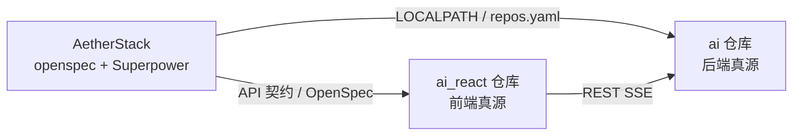

# 关联代码仓库说明

AetherStack 是 **治理层仓库**；前后端在独立 Git 仓库中维护。

## 关联关系



## 为何不在 AetherStack 内复制代码

- 各仓库独立版本、CI、发布节奏
- AetherStack 专注规范、Harness、Superpower 配置
- 源仓库 `ai` / `ai_react` 保持原有开发习惯不变

## 配置文件

| 文件 | 作用 |
|------|------|
| [LOCALPATH.md](../LOCALPATH.md) | 人类可读路径表 |
| [.aetherstack/context/repos.yaml](../.aetherstack/context/repos.yaml) | 脚本可读路径 |
| [openspec/references/integration-contracts.md](../openspec/references/integration-contracts.md) | 前后端 API 契约 |

## 日常开发

```powershell
# 1. 在 AetherStack 写规范（离线）
cd D:\cache\workspace\AetherStack

# 2. 在后端仓库改代码并启动
cd D:\cache\workspace\ai
docker compose up -d
mvn spring-boot:run

# 3. 在前端仓库启动
cd D:\cache\workspace\ai_react
npm run dev
```

或使用 AetherStack 脚本（自动解析 repos.yaml）：

```powershell
.\scripts\dev.ps1
```

## 验证

```powershell
make verify   # 在关联的后端/前端仓库中执行 test/lint/build
```

## CI（各代码仓）

| 仓库 | Workflow | 命令 |
|------|----------|------|
| **ai** | `.github/workflows/ci.yml` | `mvn -B test` |
| **ai_react** | `.github/workflows/ci.yml` | `harness lint` + `harness build` |

关闭：仓库 Settings → Actions → Variables → `CI_ENABLED=false`。

## 可选：Git Submodule

若需将关联仓库挂载到 AetherStack 子目录（仍不复制业务到本仓历史），可在确认 remote URL 后执行：

```bash
git submodule add <ai-remote-url> external/ai
git submodule add <ai_react-remote-url> external/ai_react
```

并更新 `repos.yaml` 的 `local` 为 `external/ai` 等相对路径。

当前默认使用 **同级目录绝对路径**，无需 submodule。
