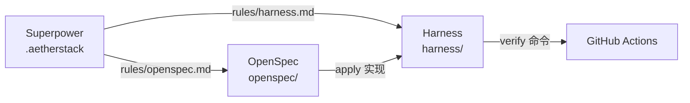

# Superpower 使用手册

Superpower 是 AetherStack 的 **AI 增强开发能力集**，通过 **单一配置源** `.aetherstack/` 统一驱动 Cursor、Codex CLI、Claude Code。

---

## 1. 能力矩阵

| 能力 | 组件 | 触发方式 |
|------|------|----------|
| 智能代码生成 | Harness `hev-coder` + OpenSpec apply | `/opsx-apply`、Harness 执行阶段 |
| 自动代码审查 | `.aetherstack/workflows/code-review.md` | 关键词：`cr`、`code review`、`cr backend` |
| 单元测试 / AUTO-UT | `.aetherstack/workflows/unit-testing.md` + Harness 适配器 | 关键词：单测、unit test |
| 需求/代码追溯 | OpenSpec changes/specs | `/opsx-new`、`/opsx-sync` |
| 上下文感知 | `.aetherstack/context/` + ARCHITECTURE | 三工具 rules 自动加载 |
| 自动文档 | `aether-skills/doc-sync/` | 「更新文档」「同步 changelog」 |

---

## 2. 单一配置源架构

```text
.aetherstack/
├── manifest.yaml           # 主清单
├── rules/
│   ├── core.md             # DDD、模块、启动边界
│   ├── openspec.md           # OpenSpec 流程
│   ├── documentation.md    # 文档同步
│   └── harness.md            # Harness 约定
├── context/
│   ├── project.yaml
│   ├── tech-stack.yaml
│   └── api-contracts.yaml
├── commands/commands.yaml  # opsx-*、cr、harness
├── skills-index.yaml       # 关键词 → 工作流/技能路由
├── workflows/              # 内置工作流（code-review、unit-testing）
├── templates/CLAUDE.md     # Claude 索引模板
└── scripts/
    ├── sync-config.ps1     # 生成三工具配置
    └── verify-all.sh       # 本地验证
```

### 同步命令

```powershell
make sync-config
# 或
.\.aetherstack\scripts\sync-config.ps1
```

**生成物（勿手改，改源后 sync）：**

| 文件 | 用途 |
|------|------|
| `.cursorrules` | Cursor 入口 |
| `.cursor/rules/aether-*.mdc` | Cursor 规则 |
| `CLAUDE.md` | Claude Code 索引 |
| `.codex/config.toml` | Codex 配置 |
| `.codex/AGENTS.md` | Codex AI 入口 |
| `.claude/settings.json` | Claude 附加目录 |

---

## 3. Cursor 使用示例

### 3.1 修改规则

1. 编辑 `.aetherstack/rules/core.md`
2. 运行 `make sync-config`
3. 新开 Cursor 对话或重载窗口

### 3.2 OpenSpec 新建变更

```
用户：走 OpenSpec，新建一个知识库重排序能力的变更
AI：  （按 aether-rules 0.1 逐项询问 schema、需求描述）
用户：使用 /opsx-new 或确认后创建 openspec/changes/add-rerank/
```

可用命令：`/opsx-new`、`/opsx-continue`、`/opsx-apply`、`/opsx-archive`、`/opsx-verify`

### 3.3 代码审查

```
用户：cr backend
AI：  读取 .aetherstack/workflows/code-review.md，审查关联仓库 ai（见 LOCALPATH.md）
      回复末尾：Skills: code-review
```

### 3.4 文档同步

```
用户：我改了 Agent Hub API，请同步文档
AI：  读取 aether-skills/doc-sync/SKILL.md
      更新 integration-contracts.yaml、api-contracts.yaml、CHANGELOG
```

---

## 4. Codex CLI 使用示例

Codex 读取项目根 `.codex/config.toml`：

```toml
[instructions]
agents = "AGENTS.md"
rules = [ ".aetherstack/rules/core.md", ... ]
```

**典型会话：**

```bash
cd D:\cache\workspace\AetherStack
# 确保已 sync-config
codex
# 在 Codex 中：
# > 阅读 AGENTS.md，按 OpenSpec 为 aether-knowledge/rerank 创建变更目录
```

修改 `.aetherstack/` 后务必 `make sync-config`，Codex 才会看到最新 rules 路径。

---

## 5. Claude Code 使用示例

1. 打开项目根目录
2. Claude 始终加载 `CLAUDE.md`（≤100 行索引）
3. 按需读取 `AGENTS.md`、`harness/harness.config.yaml`

**Harness 六阶段示例：**

```
用户：按 Harness 实现 openspec/changes/xxx 的 tasks
Claude：
  1. 读 harness/agents/hev-analyzer.md 分析影响
  2. 读 hev-coder.md 实现
  3. 读 hev-verifier.md 执行 make verify
  4. 更新 harness/docs/PLANS.md 状态
```

`.claude/settings.json` 已附加 `harness/`、`aether-skills/`、`.aetherstack/` 目录。

---

## 6. 技能与工作流路由

见 `.aetherstack/skills-index.yaml`。

| 类型 | 目录 | 说明 |
|------|------|------|
| 内置工作流 | `.aetherstack/workflows/` | 代码审查、单测（Superpower 核心，随 sync-config 生效） |
| 项目技能 | `aether-skills/` | doc-sync、DDD 设计等可扩展技能 |
| 验证编排 | `harness/agents/hev-verifier.md` | 阶段 4 自动 lint/compile/test |

新增项目技能：

1. 在 `aether-skills/<name>/SKILL.md` 编写流程
2. 在 `skills-index.yaml` 添加 keywords
3. 在 `AGENTS.md` 补充一行说明
4. `make sync-config`

**禁止**在 `.cursor/skills` 写技能正文副本（OpenSpec CLI skills 除外）。

---

## 7. 与 OpenSpec / Harness 的关系



- **OpenSpec** 管「做什么」（spec/tasks）
- **Harness** 管「怎么做、怎么验」（六阶段 + verify）
- **Superpower** 管「AI 工具怎么读同一套规则」——真源在 `.aetherstack/`（rules + workflows + context + sync-config）

---

## 8. 故障排查

| 问题 | 处理 |
|------|------|
| Cursor 规则未更新 | 运行 `make sync-config`，重开对话 |
| CLAUDE.md 乱码 | 检查 `.aetherstack/templates/CLAUDE.md`，再 sync |
| Skill 未触发 | 查 `skills-index.yaml` 关键词；直接 `@` 文件路径 |
| OpenSpec 命令不可用 | 确认 `.cursor/commands/opsx-*.md` 存在 |

---

## 9. 相关文档

- [AGENTS.md](../AGENTS.md)
- [openspec/references/aether-rules.md](../openspec/references/aether-rules.md)
- [openspec/OPENSPEC-SYNC.md](../openspec/OPENSPEC-SYNC.md)
- [docs/guides/openspec.md](guides/openspec.md)
- [docs/guides/harness.md](guides/harness.md)
