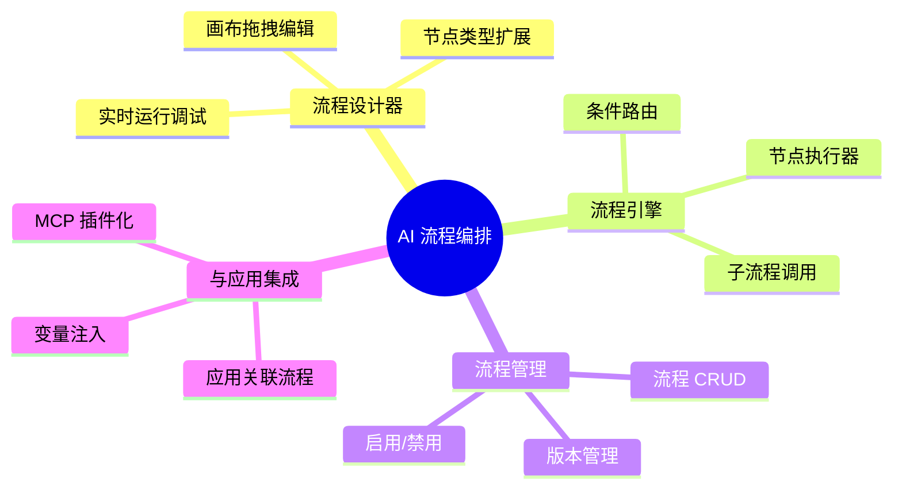

## Why
（为什么要做）

### 背景与目标
- 背景：当前 AetherStack Agent Hub 的 AI 编排逻辑完全硬编码在 `AgentHubRouter` 中，新增或修改 AI 工作流需要改代码、重新部署。对比 JeecgBoot 已提供可视化 AI 流程设计器（支持画布拖拽、多种节点类型、实时运行查看），AetherStack 在 AI 工作流编排的产品化能力上存在明显差距。
- 目标：引入可视化 AI 流程编排引擎，让用户通过拖拽画布构建 AI 工作流，降低 AI 应用搭建门槛，支持复杂业务场景的灵活编排。

## Jira / 需求链接

- 无工单

## What Changes
（变更内容）

### 需求概览（全局）

- **新增**：可视化 AI 流程设计器（前端画布，支持拖拽、连线、节点配置）
- **新增**：AI 流程引擎（后端），支持节点编排与执行
- **新增**：节点类型体系（开始/结束、AI 节点、AI 知识库节点、分类节点、分支节点、脚本节点、HTTP 请求节点、子流程节点、直接回复节点）
- **新增**：流程管理（CRUD、版本、启用/禁用、发布）
- **新增**：流程与应用集成（应用可关联流程，流程作为 MCP 插件暴露）
- **新增**：流程实时调试（在线运行、查看每节点输出）
- **修改**：Agent Hub 编排层，支持从流程引擎接收编排结果

## Capabilities
（能力范围）

### New Capabilities（新增能力）
- `aether-agent/flow-designer`：可视化流程设计器（前端画布 + 节点配置面板）
- `aether-agent/flow-engine`：AI 流程执行引擎（节点编排、条件路由、子流程、脚本执行）
- `aether-agent/flow-management`：流程 CRUD、版本管理、启用/禁用、发布
- `aether-agent/flow-integration`：流程与 AI 应用集成、MCP 插件化暴露

### Modified Capabilities（变更能力）
- `aether-agent/orchestrator`：编排路由增加流程引擎入口，支持应用关联流程后走流程编排路径

## Impact
（影响分析）

- **后端**：新增 `flow-engine` 模块或子包（`ai/.../agents/flow/`），引入流程定义存储（JSON DSL）、节点执行器抽象、CompiledGraph 适配层；`agent-hub` 模块需扩展路由逻辑
- **前端**：`ai_react` 新增流程设计器页面（画布组件、节点面板、属性配置面板、调试面板），技术选型需引入流程画布库（如 React Flow / X6）
- **数据库**：新增流程定义表、流程版本表、节点实例表
- **API**：新增流程管理 REST API + 流程执行 SSE API；应用 API 增加 flowId 关联字段
