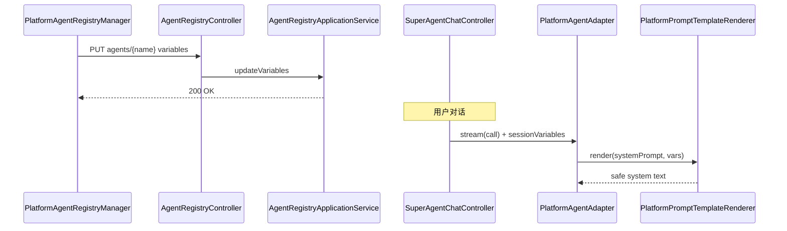

# 技术方案（简版）— AI 应用变量

## 一. 需求摘要
- **需求描述**：为 SuperAgents 平台 Agent 注册配置增加应用级变量定义，对话前收集变量值并注入 System Prompt。
- **JIRA/需求来源**：`openspec/changes/add-app-variables/proposal.md`
- **关键约束**：复用现有 `{{key}}` 渲染与注入防护；变量存 `agent_registry` JSONB；单变量 ≤1KB；租户隔离。

## 二. 影响范围和核心场景

### 2.1 本期影响范围
| 维度 | 影响点 |
|---|---|
| 前端 | `PlatformAgentRegistryManager` 变量编辑；`ChatShell` 对话前变量 Modal |
| 后端服务 | `AgentRegistryController` / `AgentRegistryApplicationService`；`PlatformAgentAdapter` Prompt 组装 |
| 异步任务 | 无 |
| 数据库 | `agent_registry.variables` JSONB 新列 |
| 配置权限 | 沿用 `X-Admin-Api-Key` 写操作鉴权 |

### 2.2 核心场景

**UC-01 管理员定义变量**
- 前置：管理员打开 Agent Hub → Platform Agents
- 验收：可 CRUD 变量清单并持久化到注册表

**UC-02 必填变量阻断对话**
- 前置：Agent 含必填变量且会话未缓存值
- 验收：发送消息前弹出表单，未填则阻断

**UC-03 Prompt 注入替换**
- 前置：System Prompt 含 `{{user_name}}`，用户已填值
- 验收：送入 LLM 的 system 文本已完成安全替换

**UC-04 变量名校验**
- 前置：管理员输入非法变量名
- 验收：API 返回 400，前端展示错误

**UC-05 超长变量拒绝**
- 前置：用户提交 >1KB 变量值
- 验收：前后端均拒绝

**UC-06 注入片段过滤**
- 前置：变量值含 Prompt 注入标记
- 验收：`PlatformPromptTemplateRenderer.sanitizeUserInput` 过滤后再渲染

## 三. 方案总览

### 3.1 整体思路
1. 在 `agent_registry` 增加 `variables` JSONB，领域层用不可变值对象列表表达。
2. 注册/更新 API 扩展 DTO；对话 API 请求体增加 `sessionVariables`（Map）。
3. 在 `PlatformAgentAdapter` 组装 systemPrompt 前，经 `PlatformPromptTemplateRenderer.render` 替换占位符。
4. 前端会话级变量缓存（Zustand 或 conversation store），Chat 入口 Modal 收集。

### 3.2 关键实现点
1. Flyway `Vxx__agent_registry_variables.sql` 增加 JSONB 列。
2. `AgentRegistryEntry` 增加 `List<AgentAppVariable>` 字段；Repository/MyBatis 映射。
3. `PUT/PATCH /agents/{name}` 或扩展 register 更新 variables + systemPrompt。
4. Chat 请求 DTO 携带 `sessionVariables`；prep 图或 `SuperAgentChatApplicationService` 传入 renderer。

### 3.3 与现有代码关系
- **复用**：`PlatformPromptTemplateRenderer`（`aether-platform/.../PlatformPromptTemplateRenderer.java`）；`AgentRegistryController` 注册链路
- **新增**：`AgentAppVariable` 值对象；变量校验领域服务；前端变量表单组件
- **变更**：`AgentRegistryEntry`、`PlatformAgentAdapter`、`PlatformAgentRegistryManager`、`ChatShell`

## 四. 方案梳理

### 4.2 时序图


## 五. 代码改造分析

### 5.1 入口链路
- **现状实现**：`AgentRegistryController` 仅 list/register/health；`PlatformAgentAdapter` 直接取 `systemPrompt` 或 capability。
- **现状代码（最小片段）**：

```java
// PlatformAgentAdapter — 现有 system 选取
String systemPrompt = input.getMetadata().getOrDefault("systemPrompt", "");
String roleBody = (systemPrompt != null && !systemPrompt.isBlank()) ? systemPrompt : capability;
```

- **改造代码（目标形态）**：

```java
Map<String, String> vars = input.getSessionVariables(); // 来自 Chat DTO
String rendered = promptTemplateRenderer.render(entry.getSystemPrompt(), vars);
String roleBody = StringUtils.isNotBlank(rendered) ? rendered : capability;
```

### 5.2 核心校验
- **现状实现**：`PlatformPromptTemplateRenderer` 已支持 `[a-zA-Z0-9_]+` 占位符与转义。
- **改造**：新增 `AgentAppVariableValidator`（领域层）：变量名 Pattern、required、type enum（STRING/NUMBER/BOOLEAN）、defaultValue 长度。

### 5.3 数据落点
- **迁移**：

```sql
ALTER TABLE agent_registry ADD COLUMN IF NOT EXISTS variables JSONB NOT NULL DEFAULT '[]'::jsonb;
```

- **JSON 元素**：`{ "name", "type", "defaultValue", "description", "required" }`

## 六. 接口与交互契约

### 6.1 前后端交互契约
- **接口**：`PUT /springai/super-agents/agents/{name}`（路径以 `SuperAgentApiPaths` 为准）
- **请求示例**：

```json
{
  "variables": [
    { "name": "user_name", "type": "STRING", "defaultValue": "访客", "description": "称呼", "required": true }
  ]
}
```

- **Chat 请求扩展**：

```json
{
  "message": "你好",
  "sessionVariables": { "user_name": "张三" }
}
```

### 6.3 错误码
| code | 含义 |
|---|---|
| 400 | 变量名非法 / 值超长 |
| 409 | Agent 不存在或并发更新冲突 |

## 七. 非功能性需求设计

### 7.8 可观测性清单
| 观测点 | 验证口径 | 关联场景 |
|---|---|---|
| 接口返回 | 400/200 与 variables 字段回显 | UC-01 |
| 日志 | traceId + agentName + 变量 key（脱敏 value） | UC-03 |

### 7.9 并发与性能验收口径
#### 7.9.1 并发与幂等
- 变量更新与 register 同事务行锁；重复 PUT 全量覆盖 variables 数组（幂等）

#### 7.9.2 性能与容量
- 单 Agent 变量数建议 ≤20；渲染 O(n) 占位符替换，对话路径无额外 HTTP

### 7.10 Spring AI / 铁三角
- **编排选型**：ChatClient 路径（`PlatformAgentAdapter`），不新增 Graph
- **安全**：变量值经 `sanitizeUserInput` + `escapeVariable` 双重处理

## 前端 UI 界面清单（uiCraftMode: enabled）

| 页面/组件 | 类型 | 说明 |
|---|---|---|
| `PlatformAgentRegistryManager` 变量 Drawer | U1 UI-CRAFT | Agent 行操作「变量」→ 列表 + 新增/编辑 |
| `ChatVariableFormModal`（新） | U1 UI-CRAFT | 对话前必填变量表单 |
| `platformAgentRegistryService` 扩展 | U3 UI-FUNC | API 客户端与类型 |
