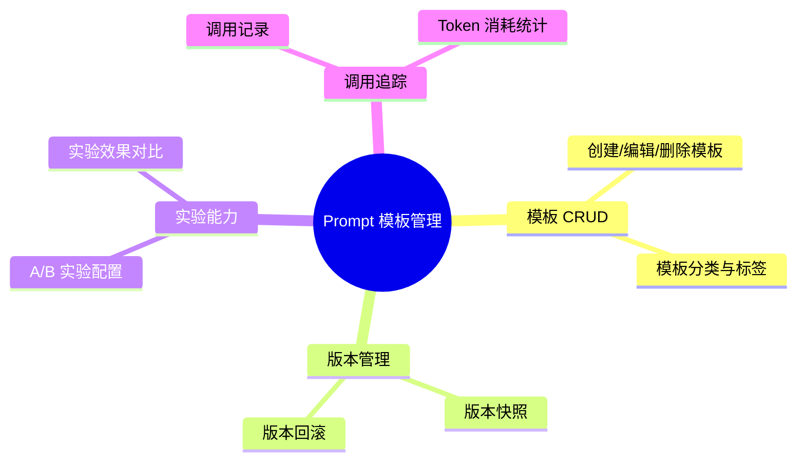

## Why

### 背景与目标
- 背景：当前 AetherStack 的 Prompt 硬编码在各 Service 和 Demo 中（如 `RagDemo`、`AgentChatService` 的 system prompt），无法统一管理、版本化和实验。对比 JeecgBoot 提供了完整的 Prompt 模板管理 + 实验 + 评估器能力。
- 目标：引入 Prompt 模板管理模块，支持模板 CRUD、版本管理、A/B 实验和调用记录追踪。

## What Changes

### 需求概览

- **新增**：Prompt 模板 CRUD（名称、内容、变量占位符、分类标签）
- **新增**：模板版本管理（每次保存生成新版本，支持回滚）
- **新增**：A/B 实验（同一场景配置多个模板版本，按比例分流）
- **新增**：调用记录追踪（模板 ID、版本、输入/输出、Token 消耗）

## Capabilities

### New Capabilities
- `aether-agent/prompt-management`：Prompt 模板 CRUD、版本管理、实验、调用追踪

## Impact
- **后端**：agent-hub 新增 `prompt/` 子包，新增 3 张表
- **前端**：ai_react 新增 Prompt 管理页面
- **API**：新增模板管理 REST API
