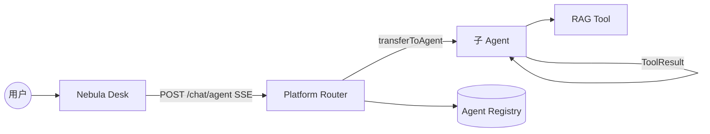
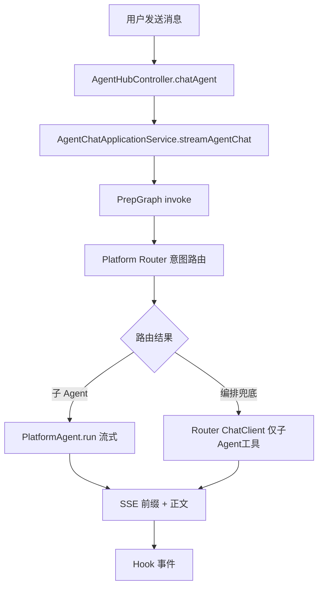
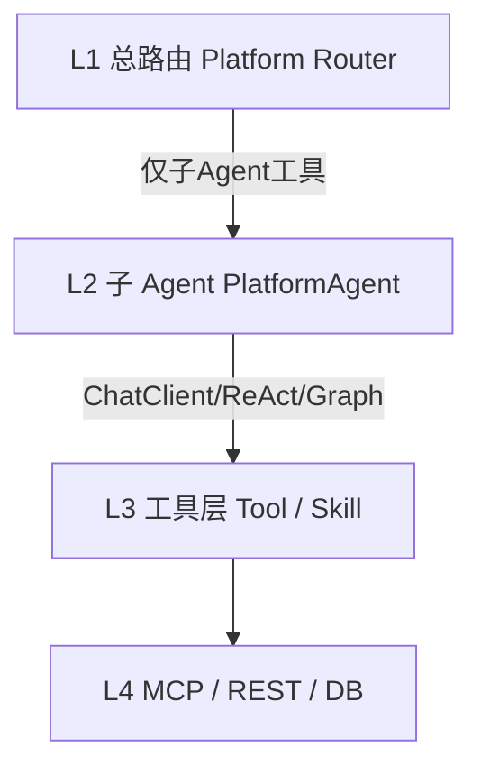
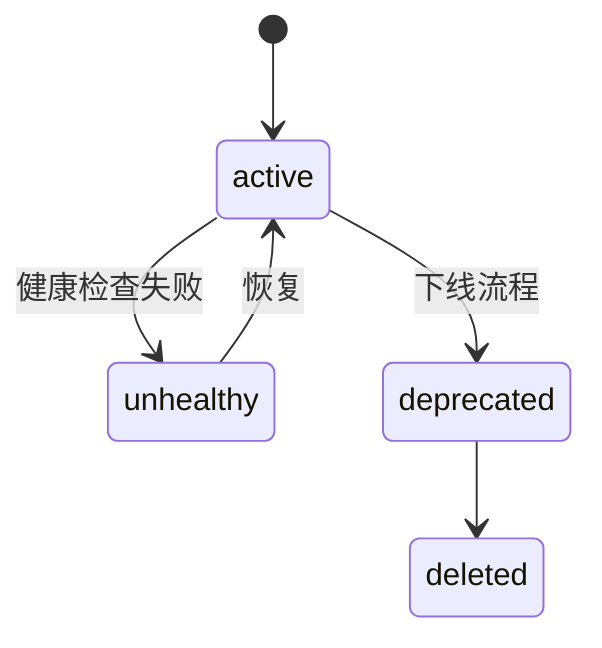
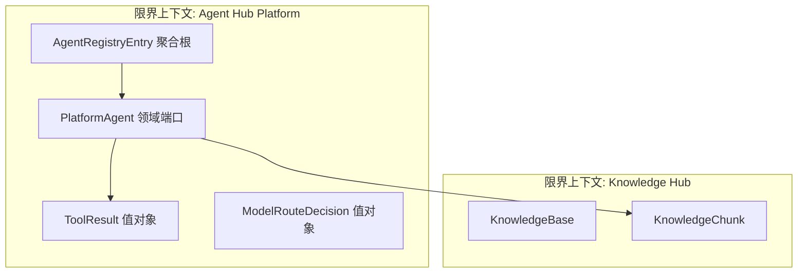
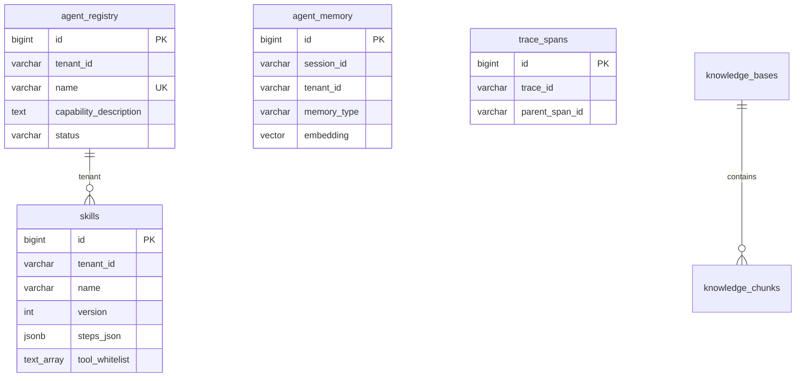
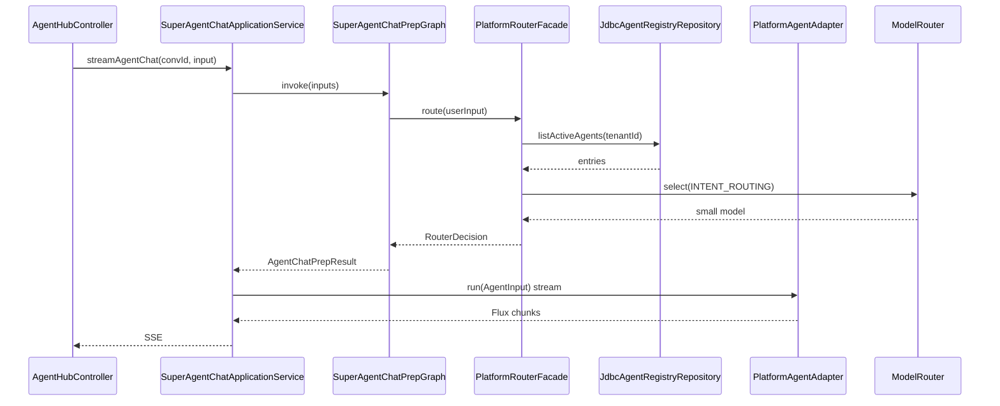

# Agent 平台基础 — 技术设计

> **变更 ID**：`aether-agent-platform-foundation`  
> **Schema**：`standard-spec-driven`  
> **design-draft**：用户选择 **C 跳过**；本 design 直接基于 proposal + specs 编写。  
> **Status**：`Reviewed`（v0.3：用户确认 + 代码落点 `superAgents`）  
> **配置**：`aiTddMode: enabled` | `uiCraftMode: auto`

---

## 一. 概述

### 1.1 术语

| 术语 | 英文 | 说明 |
|------|------|------|
| 总路由 Agent | Platform Router | 四层第一层；ChatClient + 仅子 Agent 工具 |
| 子 Agent | Domain Agent | 实现统一 `PlatformAgent` 接口的垂直能力单元 |
| 原子 Tool | Atomic Tool | `@Tool` 函数，返回 `ToolResult` |
| 代码 Skill | Code Skill | CompiledGraph 封装的可调用 Skill |
| DB Skill | DB Prompt Skill | 存于 `skills` 表的步骤化提示词 Skill |
| AgentRegistry | Agent Registry | 子 Agent 元数据注册表（P1 起 DB + 内存缓存） |
| ToolResult | Tool Result | 统一工具返回：success/data/errorCode/errorMessage |

### 1.2 需求背景

**需求描述**：在 **ai** 仓库建设企业级多 Agent 平台内核——四层混合执行、动态注册、多模型路由、Skill/RAG/记忆/治理/可观测，分 P1–P4 交付。

**产品 PRD**：用户桌面需求文档（无工单）。

**现状痛点**（`backend-design-guide.md`）：
- Agent Hub 编排与 Knowledge Hub Graph 分裂；`ToolRegistry` 聚合原子 Tool + MCP，总路由易直连底层 Tool。
- `AgentRegistry`（`agent/router/AgentRegistry.java`）为**硬编码白名单** + Spring Bean，无 DB 持久化与健康检查。
- 自研 `Skill` 接口仅文档占位，无 DB Skill / skill_router。
- RAG 三套路径并存；记忆分散在 `session_memory` / `user_longterm_memory` / agents.knowledge。

### 1.3 本期目标

| 序号 | 阶段 | 内容 | 任务点 |
|------|------|------|--------|
| 1 | **P1** | 平台内核可跑通 | `PlatformAgent`/`ToolResult`/`ModelProvider`/`PersistentAgentRegistry`/Platform Router/子 Agent 适配/RAG Tool/ Flyway V5 |
| 2 | **P2** | Skill & 记忆 & SSE Progress | `skills` 表、skill_router、CompileGraph Skill、分层 memory、`AgentProgress` SSE |
| 3 | **P3** | 平台化 | 多租户强隔离、限流、trace/audit/cost、异步挂起恢复 |
| 4 | **P4** | 治理 & DX | Skill 灰度/冲突、LastResort、Dev SDK |

**P1 准入（apply 首版）**：上表第 1 行全部完成 + `POST /chat/agent` 非 BREAKING + L1 单测（AI-TDD enabled）。

**代码落点（强制，用户确认）**：本变更**所有新增 Java 类**（含 domain / application / infrastructure / web / graph / agent / tool / config / job）均位于：

`D:\cache\workspace\ai\src\main\java\com\yxy\deepseek\superAgents\`

单测位于：`src/test/java/com/yxy/deepseek/superAgents/`。四层分包结构不变；`agents/**` 仅保留存量 HTTP 入口**薄委托**（见 §4.2.1），**禁止**在 `agents` 下新增平台业务类。

### 1.4 影响分析

**受影响的系统：**
- [x] **ai** — `agents/**` 主改造；`knowledgehub/**` RAG Tool 封装
- [x] **ai_react** — P1 无 U1；P2 可选 UI-FUNC 解析 `AgentProgress`（见 §1.5）
- [x] **PostgreSQL** — Flyway V5+ 新表；存量表 P3 补 `tenant_id`
- [ ] 外部 MCP — P2 安全加固
- [x] **integration-contracts** — 增量登记 Agent Registry API、SSE Progress（P2）

### 1.5 前端 UI 界面清单（uiCraftMode: auto 判定）

| 路径（ai_react） | 类型 | 阶段 | 说明 |
|------------------|------|------|------|
| — | — | P1 | **无 U1 界面**；后端 + SSE 正文兼容 |
| `src/api/request.js` | UI-FUNC | P2 | 解析 SSE `AgentProgress` JSON 事件（可选展示步骤条） |
| `src/pages/` Skill 管理台 | UI-CRAFT | P4+ | **不在 P1–P3**；若产品确认再开 Impeccable |

**结论**：P1 保持 `uiCraftMode: auto`，design 不触发 U1 Impeccable；P2 Progress 为 UI-FUNC。

---

## 二. 业务分析

### 2.1 业务用例



### 2.2 业务流程

#### 2.2.1 活动图 — P1 智能体对话



#### 2.2.2 四层执行模型



### 2.3 业务场景

详见：`openspec/changes/aether-agent-platform-foundation/specs/**/spec.md`

---

## 三. 系统设计

### 3.1 业务实体状态图 — AgentRegistry 记录



### 3.2 领域模型图



**新增领域端口（P1，`superAgents/domain/`）**：

| 类型 | 名称 | 职责 |
|------|------|------|
| 端口 | `PlatformAgent` | `AgentResponse run(AgentInput)`（同步）；`Flux<String> stream(AgentInput)`（SSE 主路径） |
| 端口 | `AgentRegistryRepository` | CRUD + 发现活跃 Agent |
| 端口 | `LlmCompletionPort` | 领域层 LLM 抽象（**无** Spring 类型） |
| 端口 | `KnowledgeRetrievalPort` | RAG 检索防腐层（agents → knowledgehub） |
| 端口 | `ModelRouter` | 按 `ModelTaskType` 选择 LLM 通道（实现在 infrastructure） |
| 值对象 | `AgentInput` / `AgentResponse` | 标准字段（spec 定义） |
| 值对象 | `ToolResult` | success/data/errorCode/errorMessage |

### 3.3 数据模型图



**P1 仅新建**：`agent_registry`（完整 DDL 见 §4.1）。其余表 P2–P3 迁移脚本占位。

---

## 四. 详细设计

### 4.1 数据表定义

#### 新增表：agent_registry（P1）

| 字段 | 类型 | 说明 |
|------|------|------|
| id | BIGSERIAL PK | 主键 |
| tenant_id | VARCHAR(64) NOT NULL DEFAULT 'default' | 租户（P3 强制校验） |
| name | VARCHAR(128) NOT NULL | Agent 唯一名 |
| display_name | VARCHAR(256) | 展示名 |
| capability_description | TEXT NOT NULL | 路由/Tool 描述 |
| permission_tags | TEXT[] | 权限标签 |
| version | VARCHAR(32) | 版本 |
| status | VARCHAR(32) NOT NULL | active/unhealthy/deprecated |
| health_check_url | VARCHAR(512) | 可选健康检查 |
| bean_name | VARCHAR(128) | Spring ReactAgent Bean 名 |
| created_at | TIMESTAMPTZ | 创建时间 |
| updated_at | TIMESTAMPTZ | 更新时间 |

**索引**：`UNIQUE (tenant_id, name)`；`idx_agent_registry_status (tenant_id, status)`

**Flyway**：`V5__agent_platform_registry.sql`

**初始化 DML（P1）**：插入客服/数据分析/代码生成三条，对齐现有 `SubAgentNames` 与 `AgentHubReactAgentConfiguration` Bean 名。

#### 新增表：skills（P2）

| 字段 | 类型 | 说明 |
|------|------|------|
| id | BIGSERIAL PK | |
| tenant_id | VARCHAR(64) NOT NULL | |
| name | VARCHAR(128) NOT NULL | |
| description | TEXT | |
| version | INT NOT NULL | |
| status | VARCHAR(32) | active/deprecated/... |
| steps_json | JSONB NOT NULL | 步骤数组 |
| tool_whitelist | TEXT[] NOT NULL | |
| created_by | VARCHAR(64) | |
| created_at / updated_at | TIMESTAMPTZ | |

**Flyway**：`V6__agent_platform_skills.sql`

#### 新增表：agent_memory（P2）

| 字段 | 类型 | 说明 |
|------|------|------|
| id | BIGSERIAL PK | |
| session_id | VARCHAR(64) NOT NULL | |
| tenant_id | VARCHAR(64) NOT NULL | |
| user_id | VARCHAR(64) | |
| memory_type | VARCHAR(16) NOT NULL | short/long/working |
| content | TEXT NOT NULL | |
| embedding | vector(1024) | 与 `knowledge_chunks` 维度一致 |
| metadata | JSONB | |
| created_at | TIMESTAMPTZ | |

**说明**：embedding 维度沿用存量 **1024**（`V1__knowledge_schema.sql`），非 PRD 1536，避免双维度；若切换模型须独立 migration。

#### P3 表（概要，DDL 在 P3 变更展开）

- `audit_log`、`trace_spans`、`cost_records`、`rate_limit_config`、`skill_conflicts`

### 4.2 应用内部组件划分（P1 — `superAgents` 模块）

**根路径**：`com.yxy.deepseek.superAgents`（`ai/src/main/java/com/yxy/deepseek/superAgents/`）

```
superAgents/
├── domain/                          # 领域层（仅 JDK）
│   ├── agent/PlatformAgent.java, AgentInput.java, AgentResponse.java
│   ├── tool/ToolResult.java
│   ├── registry/AgentRegistryEntry.java, AgentRegistryRepository.java
│   ├── model/ModelRouter.java, ModelTaskType.java, LlmCompletionPort.java, LlmRequest.java
│   └── knowledge/KnowledgeRetrievalPort.java
├── application/                     # 应用层
│   ├── SuperAgentChatApplicationService.java   # chat/agent 用例编排（从 agents 迁入逻辑）
│   ├── PlatformRouterFacade.java
│   └── AgentRegistryApplicationService.java
├── infrastructure/                # 基础设施层
│   ├── registry/JdbcAgentRegistryRepository.java
│   ├── registry/AgentRegistryStartupValidator.java
│   ├── registry/AgentHealthCheckJob.java
│   ├── model/SpringAiLlmCompletionAdapter.java
│   ├── model/SuperAgentChatClientConfiguration.java  # 命名 ChatClient Bean
│   ├── model/NamedChatClientModelRouter.java
│   ├── knowledge/KnowledgeRetrievalAdapter.java
│   ├── agent/PlatformAgentAdapter.java           # ReactAgent → PlatformAgent.stream
│   ├── agent/LegacySubAgentBridge.java           # 包装存量 agents SubAgent/ReactAgent Bean
│   └── cache/InMemoryPlatformCache.java
├── web/                             # 接口层
│   ├── AgentRegistryController.java
│   └── dto/AgentRegistryDtos.java
├── graph/                           # Graph 配置与节点（平台 prep）
│   ├── SuperAgentGraphConfiguration.java
│   ├── SuperAgentGraphStateKeys.java
│   └── chat/PrepareSuperAgentChatNode.java
├── agent/                           # Agent/Router 装配
│   ├── router/SuperAgentHubLlmRouter.java
│   ├── router/RouterDecision.java          # 自 superAgents 域模型，agents 侧 deprecated 委托
│   └── config/SuperAgentReactAgentConfiguration.java  # P1 可复用存量 Bean 名，适配器引用
├── tool/                            # @Tool
│   └── RagPlatformTool.java
└── config/
    └── SuperAgentsModuleConfiguration.java       # @ComponentScan superAgents

classpath:/prompts/super-agents/                 # Prompt 资源（非 Java，同模块归属）
```

#### 4.2.1 与存量 `agents/**` 边界

| 位置 | 策略 |
|------|------|
| `agents/web/AgentHubController` | **保留**；`chatAgent()` 改为注入 `SuperAgentChatApplicationService`（superAgents） |
| `agents/application/AgentChatApplicationService` | P1 标记 `@Deprecated`；逻辑迁移至 superAgents，agents 类可留空委托 1 行 |
| `agents/agent/router/*` | **不新增**平台类；superAgents 通过 `LegacySubAgentBridge` 调用存量 ReactAgent Bean |
| `agents/graph/*` | Prep 节点迁移至 `superAgents/graph/chat/`；agents Graph 配置改为 `@Import` superAgents Graph Bean |
| `agents/tool/ToolRegistry` | 不变；服务 MCP/status；chat 不再经 ToolCatalog |

**依赖方向**：`superAgents` → 可调 `agents` 存量 Bean（Bridge）；`agents` → 仅依赖 `superAgents.application` 入口，**禁止** agents domain 依赖 superAgents infrastructure。

### 4.3 组件时序图 — P1 chat/agent



### 4.4 核心算法逻辑

#### 4.4.1 Platform Router 工具面约束（P1）

```
tools = registry.listActive(tenantId)
        .map(entry -> toTransferTool(entry))  // 仅子 Agent，无原子 Tool
assert tools ∩ atomicTools == ∅
```

#### 4.4.2 ModelRouter 策略（P1 简化）

| ModelTaskType | 默认模型 | 说明 |
|---------------|----------|------|
| INTENT_ROUTING | qwen-turbo 类小模型 | 总路由 |
| AGENT_REASONING | qwen-plus | 子 Agent ReAct |
| EMBEDDING | text-embedding-v3 | 与 knowledgehub 一致 |

配置前缀：`aether.platform.model.*`（`@ConfigurationProperties`）

#### 4.4.3 会话粘性路由（P1 简化）

```
stickyKey = conversationId + detectedDomain
if (sameDomainAsPreviousTurn) keep currentSubAgent
else route via PlatformRouterFacade
```

实现：`StickyRouteContext` 存于 prep Graph State（`SuperAgentGraphStateKeys` 扩展），仅内存 + `conversationId` 关联，不新增表。

#### 4.4.4 STREAM_ROUTE 映射（P1）

| RouterDecision.transferTarget | STREAM_ROUTE（P1） | 说明 |
|------------------------------|-------------------|------|
| 具名 SubAgent | `SUB_AGENT` | 走 `PlatformAgentAdapter.stream` |
| orchestrator / 无匹配 | `PLATFORM_ROUTER` | 新增枚举值；ChatClient 仅子 Agent 工具 |
| 遗留直答（兼容） | `DIRECT_WEATHER` / `DIRECT_DATETIME` | **保留 deprecated**；P2 移除 |

`PrepareSuperAgentChatNode`（`superAgents/graph/chat/`）改造：调用 `PlatformRouterFacade.route()` 写回 `RouterDecision` + `STREAM_ROUTE`。

### 4.5 定时任务

| Job 名称 | 触发 | 功能 | 阶段 |
|----------|------|------|------|
| AgentHealthCheckJob | fixedDelay 60s | 探测 health_check_url | P1 |
| SkillConflictScanJob | cron 0 2 * * * | 向量相似度冲突 | P4 |
| CostAggregateJob | cron 0 1 * * * | cost_records 日聚合 | P3 |

---

## 五. 接口设计

### 5.1 本期新增/更新接口列表

| 接口 | 变更 | 阶段 |
|------|------|------|
| `POST /api/agent-hub/chat/agent` | 修改（内部实现，**非 BREAKING**） | P1 |
| `GET /api/agent-hub/platform/agents` | 新增 | P1 |
| `POST /api/agent-hub/platform/agents` | 新增 | P1 |
| `POST /api/agent-hub/platform/agents/{name}/health` | 新增 | P1 |
| SSE `AgentProgress` 事件 | 修改契约 | P2 |

### 5.2 接口详细设计

#### GET /api/agent-hub/platform/agents

**功能**：列出当前租户活跃 Agent 注册记录（管理/调试）。

**请求**：Header `X-Tenant-Id`（P1 默认 `default`）

**响应**：
```json
{
  "items": [
    {
      "name": "customer-service",
      "displayName": "客服助手",
      "status": "active",
      "version": "1.0.0"
    }
  ]
}
```

**错误码**：
- `AGENT_REGISTRY_001`：租户无权限

#### POST /api/agent-hub/platform/agents

**功能**：注册或更新 Agent 元数据。

**请求**：
```json
{
  "name": "customer-service",
  "displayName": "客服助手",
  "capabilityDescription": "处理订单、售后咨询；不处理代码生成",
  "beanName": "customerServiceReactAgent",
  "healthCheckUrl": "http://localhost:8080/actuator/health",
  "permissionTags": ["agent:chat"]
}
```

**响应**：`201` + 完整 entry；重复 `(tenantId,name)` → `409 AGENT_REGISTRY_002`

#### POST /api/agent-hub/platform/agents/{name}/health

**功能**：对指定 Agent **即时**触发健康探测（与 `AgentHealthCheckJob` 周期任务互补，供运维手动验证）。

**响应**：`200` + `{ "name": "...", "status": "active|unhealthy", "checkedAt": "ISO8601" }`

#### POST /api/agent-hub/chat/agent（存量，P1 内部变更）

**契约**：与 `integration-contracts.md` 一致；请求/响应 JSON 与 SSE 正文**不变**。

**P2 增量 SSE 事件**（同连接）：
```json
{
  "eventType": "AgentProgress",
  "stepName": "调用查询订单",
  "status": "running",
  "thoughtSummary": "需要订单号",
  "toolResultSummary": null
}
```

老客户端忽略非文本 event 即可（spec `aether-integration-chat-sse-contract`）。

---

## 六. 代码改造分析

### 6.1 入口链路

**代码位置**：`AgentHubController.java:chatAgent`（agents/web）→ 委托 `SuperAgentChatApplicationService`（superAgents/application）

**现状代码**：
```java
// agents/web/AgentHubController.java
@Autowired
private AgentChatApplicationService agentChatApplicationService;
return agentChatApplicationService.streamAgentChat(...);
```

**风险点**：Controller 已符合分层；平台逻辑若继续写在 agents 下会违反落点约束。

**改造要点**：
```java
// agents/web/AgentHubController — 仅改注入类型
@Autowired
private SuperAgentChatApplicationService superAgentChatApplicationService;
return superAgentChatApplicationService.streamAgentChat(...);

// superAgents/application/SuperAgentChatApplicationService — 承载原 prep+流式逻辑
public Flux<String> streamAgentChat(String conversationId, String userInput) {
    AgentChatPrepResult prep = runPrepGraph(conversationId, userInput);
    Flux<String> body = resolveBodyStream(prep);
    ...
}
```

---

### 6.2 核心校验/分支 — 路由与工具边界

**代码位置**：`superAgents/application/PlatformRouterFacade.java`、`superAgents/graph/chat/PrepareSuperAgentChatNode.java`；参考存量 `agents/agent/router/AgentHubRouter.java`

**现状代码**（agents 存量，superAgents 迁移后 deprecated）：
```java
// agents/agent/router/AgentHubRouter
public RouterDecision route(String userInput) {
    return llmRouter.route(userInput, agentRegistry.chatSubAgents());
}
```

**风险点**：路由候选来自内存 Bean 白名单；ORCHESTRATOR 路径暴露 ToolCatalog 原子 Tool。

**改造要点**（**均在 superAgents 包下新建**）：
```java
// superAgents/graph/chat/PrepareSuperAgentChatNode
RouterDecision decision = platformRouterFacade.route(userInput, tenantId, stickyContext);
state.put(SuperAgentGraphStateKeys.STREAM_ROUTE, decision.streamRoute().name());

// superAgents/application/SuperAgentChatApplicationService.resolveBodyStream
case PLATFORM_ROUTER, ORCHESTRATOR -> platformRouterFacade.streamRoute(prep);
case SUB_AGENT -> platformAgentAdapter.stream(prep);
case DIRECT_WEATHER, DIRECT_DATETIME -> Flux.just(prep.directAnswer());

// superAgents/application/PlatformRouterFacade
public RouterDecision route(String userInput, String tenantId, StickyRouteContext sticky) {
    List<AgentRegistryEntry> agents = agentRegistryRepository.listActiveForChat(tenantId);
    return superAgentHubLlmRouter.route(userInput, agents);
}
```

---

### 6.3 数据落点 — Registry 与健康检查

**代码位置**：`superAgents/infrastructure/registry/JdbcAgentRegistryRepository.java`、`AgentHealthCheckJob.java`

**现状代码**：无 DB 表；SubAgent 仅 Spring `@Component` 注册。

**风险点**：DB 与 Bean 不一致时路由到不存在 Bean → 500。

**改造要点**：
```java
@Transactional
public AgentRegistryEntry save(AgentRegistryEntry entry) {
    validateUnique(entry.getTenantId(), entry.getName());
    validateBeanExists(entry.getBeanName()); // 启动时或注册时校验 ReactAgent Bean
    return jdbc.upsert(entry);
}

// AgentHealthCheckJob
@Scheduled(fixedDelayString = "${aether.platform.registry.health-interval-ms:60000}")
void checkHealth() {
    repository.findWithHealthUrl().forEach(entry -> {
        boolean ok = healthProbe.ping(entry.getHealthCheckUrl());
        repository.updateStatus(entry.getId(), ok ? ACTIVE : UNHEALTHY);
    });
    cache.invalidateAll();
}
```

---

### 6.4 ToolResult 与 RAG Tool（P1）

**代码位置**：`superAgents/tool/RagPlatformTool.java`；`superAgents/infrastructure/knowledge/KnowledgeRetrievalAdapter.java`

**现状代码**：Tool 返回类型多为 `String` 或自定义 DTO，无统一 `ToolResult`。

**改造要点**：
```java
public record ToolResult(boolean success, Object data, String errorCode, String errorMessage) {
    public static ToolResult ok(Object data) { return new ToolResult(true, data, null, null); }
    public static ToolResult fail(String code, String msg) { return new ToolResult(false, null, code, msg); }
}

@Component
public class RagPlatformTool {
    @Autowired private KnowledgeRetrievalPort retrievalPort;

    @Tool(description = "...四段式...")
    public ToolResult searchKnowledge(...) { ... }
}

// superAgents/infrastructure/knowledge/KnowledgeRetrievalAdapter
// 实现 KnowledgeRetrievalPort，内部调用 knowledgehub 应用服务（防腐层）
```

---

### 6.5 ModelProvider（P1）

**代码位置**：`superAgents/infrastructure/model/NamedChatClientModelRouter.java`、`SpringAiLlmCompletionAdapter.java`

**现状代码**：各 Service 直接注入 `ChatClient` / `ChatModel` Bean。

**改造要点**：
```java
// domain — 无 Spring 依赖
public interface LlmCompletionPort {
    String complete(ModelTaskType taskType, LlmRequest request);
    Flux<String> stream(ModelTaskType taskType, LlmRequest request);
}

@Component
public class NamedChatClientModelRouter implements ModelRouter {
    @Qualifier("intentRoutingChatClient") ChatClient routingClient;
    @Qualifier("agentReasoningChatClient") ChatClient reasoningClient;
    public LlmCompletionPort asPort(ModelTaskType taskType) { /* 委托对应 Bean */ }
}
```

L1 单测（AI-TDD，包路径 `superAgents`）：
- `src/test/java/com/yxy/deepseek/superAgents/application/PlatformRouterFacadeTest.java`
- `src/test/java/com/yxy/deepseek/superAgents/infrastructure/model/NamedChatClientModelRouterTest.java`
- `src/test/java/com/yxy/deepseek/superAgents/graph/chat/PrepareSuperAgentChatNodeTest.java`
- `src/test/java/com/yxy/deepseek/superAgents/application/SuperAgentChatApplicationServiceTest.java`

---

## 七. 非功能性需求设计

### 7.1 权限影响（P3 完整，P1 占位）

| 权限路径 | 名称 | 阶段 |
|----------|------|------|
| `agent:chat` | 智能体对话 | 已有 |
| `platform:agent:register` | 注册 Agent | P1（非 prod 可 `aether.platform.registry.admin-api-key` 保护） |
| `platform:skill:write` | 管理 DB Skill | P2 |

### 7.2 数据清洗、迁移

- [x] P1：`V5` 初始化 agent_registry 三条，与存量 SubAgent Bean 对齐
- [x] P3：存量 `knowledge_*` 表加 `tenant_id` 默认 `default`，可回滚 migration
- [ ] agents.knowledge 向量路径：P2 设计防腐层写入 knowledgehub 或标记 deprecated

### 7.3 缓存设计

| 缓存 Key | 过期 | 阶段 |
|----------|------|------|
| `{tenantId}:agent-registry:active` | 5min + 健康 Job 失效 | P1 |
| `{tenantId}:skill-menu` | 5min | P2 |
| `{tenantId}:model-route-config` | 10min | P1 |

实现：`InMemoryPlatformCache`（接口 `PlatformCache`），后续 Redis 实现同接口。

### 7.4 安全评估

- [x] Registry API 需租户上下文（P1 Header，P3 强制）
- [x] DB Skill 入库清洗 + tool_whitelist（P2）
- [x] Prompt 参数化，防注入（`spring-ai-core-standards`）
- [x] P1 `AgentChatApplicationService` 生成 traceId 写入 MDC/Micrometer（P3 trace_spans 铺垫）
- [ ] MCP TLS（P3）

### 7.5 限流降级（P3）

- [ ] `rate_limit_config` 表驱动令牌桶
- [ ] 429 → Agent 友好文案
- P1 预期 QPS：沿用 Spring Boot 默认；无数值承诺

---

## 八. 开发补充要求

### 8.1 Spring AI / 铁三角设计清单

- [x] **编排选型**
  - L1 总路由：**ChatClient** + 子 Agent ToolCallback（无 ReAct 循环）
  - L2 子 Agent：**ReactAgent**（存量 `AgentHubReactAgentConfiguration`）/ 简单查询 **ChatClient** / 流程 **CompiledGraph**（P2 Skill）
  - 对照 `backend-design-guide.md` P2 Agent Hub Graph 化；P1 保留 PrepGraph + 替换 ORCHESTRATOR 分支
- [x] **Spring AI 核心**：DashScope 密钥 `${DASHSCOPE_API_KEY}`；Prompt 在 `classpath:/prompts/super-agents/`；异常→ToolResult/友好 SSE
- [x] **多 Agent**：`AgentHubLlmRouter` 演进 transferToAgent；子 Agent 描述来自 DB；总路由工具 ≤ 子 Agent 数（通常 ≤5）
- [x] **RAG**：复用 knowledgehub；阈值/Top-K 读 `application-knowledge.yml`；来源 `[来源: xxx]`
- [x] **React/Graph**：PrepGraph **单例 Bean**（已满足）；ReactAgent `maxIterations=10`；Graph Skill P2 单例 compile

### 8.2 AI-TDD L1 模块与测试类（enabled）

| L1 模块 | 测试类（P1，superAgents 包） |
|---------|----------------|
| Platform Router 决策 | `superAgents/.../PlatformRouterFacadeTest` |
| ModelRouter | `superAgents/.../NamedChatClientModelRouterTest` |
| PrepGraph 路由分支 | `superAgents/.../PrepareSuperAgentChatNodeTest` |
| 流式 ApplicationService | `superAgents/.../SuperAgentChatApplicationServiceTest` |

### 8.3 存量兼容与演进

| 存量 | P1 策略 |
|------|---------|
| `agents/web/AgentHubController` | 保留；注入 `superAgents.application.SuperAgentChatApplicationService` |
| `agents/application/AgentChatApplicationService` | `@Deprecated` 空壳委托 superAgents（可选保留 1 版本） |
| `agents/agent/router/AgentRegistry` | **不迁移**；superAgents 用 DB Registry；Bridge 按 bean_name 关联 ReactAgent |
| `agents/tool/ToolRegistry` | 不变；MCP/status；chat 不经 ToolCatalog |
| `agents/graph/*` | Prep 迁至 `superAgents/graph/`；agents 侧 `@Import` superAgents Graph Bean |

### 8.4 P2–P4 设计占位（不在 P1 apply）

- **P2**：`V6` skills、`SkillRouterTool`、`LayeredChatMemoryAdvisor`、`AgentProgressSseEmitter`
- **P3**：`V7` trace/audit/cost/rate_limit、TenantContextFilter、WebhookResumeController
- **P4**：SkillGovernanceService、LastResortHandler、Maven archetype 模块

---

## design.md 修订记录

| 版本 | 日期 | 说明 |
|------|------|------|
| 0.1 | 2026-06-02 | 初稿；跳过 design-draft（用户选 C） |
| 0.2 | 2026-06-02 | design-review 阻塞项修订（DR-01~06 等） |
| 0.3 | 2026-06-02 | 用户确认 design-review；**代码落点统一 superAgents 包**（DR-20） |
