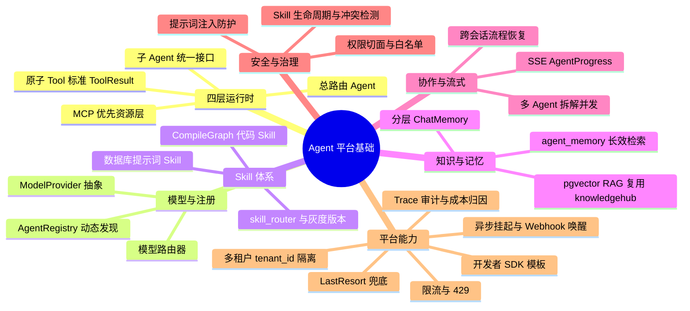

## Why
（为什么要做）

### 背景与目标
- **背景**：AetherStack 后端（**ai** 仓库）已具备 Agent Hub 对话、Knowledge Hub RAG、CompiledGraph/ReactAgent 局部实践，但编排范式分裂（手写 Orchestrator vs Graph）、三套 RAG 路径并存、自研 Skill/ToolRegistry 与 Spring AI 规范未对齐（见 `backend-design-guide.md`）。需求方提出**企业级多 Agent 平台**愿景：四层混合执行模式（ChatClient / ReActAgent / CompiledGraph）、动态 Agent 注册、数据库 Skill、多模型路由、分层记忆、多租户、全链路可观测与治理——当前代码与数据模型均无法直接承载。
- **目标**：在 **ai** 仓库内建设 **Agent 平台基础能力（Platform Foundation）**，统一 Agent/Tool/Skill 抽象与注册发现机制，对齐 Spring AI 铁三角规范（core / multi-agent / rag / react-graph），复用并增强既有 **knowledgehub** RAG 主路径，为 Nebula Desk 及后续集成（MCP、Webhook）提供可配置、可观测、可恢复的多 Agent 运行时。本变更以**平台内核**为 scope，分阶段交付，避免一次性大爆炸式重写。

## Jira / 需求链接

- 无工单

## What Changes
（变更内容）

### 需求概览（全局）

- **四层运行时**：建立总路由 Agent（仅暴露子 Agent 工具，不直连底层 Tool）→ 子 Agent（统一 `Agent` 接口，内部按需选用 ChatClient / ReActAgent / CompiledGraph）→ 工具层（标准 `@Tool` + `ToolResult`；代码 Skill 与 DB Skill）→ 服务层（MCP 优先，REST 兼容）。
- **模型与注册**：引入 `ModelProvider` 适配层与模型路由器（按复杂度/成本/延迟选模型）；`AgentRegistry` 基于 PostgreSQL 存储元数据，支持运行时注册、发现与健康检查。
- **Skill 体系**：CompileGraph 实现代码 Skill；`skills` 表存储 DB 提示词 Skill（版本、灰度、tool_whitelist）；`skill_router` / `listAllSkills` 工具供 ReAct 循环调用。
- **知识与记忆**：RAG 复用 **knowledgehub** 生产主路径（禁止第三套存储）；扩展 `agent_memory` 分层记忆（短期/长期/工作记忆）与 pgvector 检索；MessageChatMemoryAdvisor 扩展为分层记忆管理器。
- **协作与流式**：总路由支持任务拆分与并发/串行子 Agent 调用；SSE 推送 `AgentProgress`（步骤、思考链、工具结果）；挂起流程与会话状态持久化，支持跨实例恢复。
- **安全与治理**：Tool/Skill/子 Agent 权限声明与租户校验；DB Skill 入库清洗 + 工具白名单；高危操作 CompileGraph 审批节点；Skill 版本/灰度/冲突检测（`skill_conflicts`）。
- **平台能力**：核心表统一 `tenant_id`；内置限流（429）；`trace_spans` / `audit_log` / `cost_records` 可观测与计费；EventBus/Webhook 唤醒；LastResortHandler FAQ 兜底；Prometheus 指标；内存缓存抽象（后续可换 Redis）。
- **开发者体验**：CLI/Maven 插件生成 Agent/Tool/Skill 模板；本地 Trace 回放（后续 phase）。
- **前端（uiCraftMode: auto）**：若 design 列出 U1 界面（如 AgentProgress 监控、Skill 管理台），则走 Impeccable；本期默认以 **SSE 协议扩展 + 后端 API** 为主，Nebula Desk 对话页按需增量适配。

### 分期策略（proposal 级边界）

| 阶段 | 交付重点 | 说明 |
|------|----------|------|
| **P1 内核** | Agent 接口、ToolResult、总路由、ModelProvider、AgentRegistry、子 Agent 模板、RAG 复用 | 可跑通端到端对话与工具调用 |
| **P2 Skill & 记忆** | DB Skill、skill_router、分层 memory、CompileGraph Skill | ReAct + Skill 决策链闭环 |
| **P3 平台化** | 多租户强隔离、限流、Trace/审计/成本、异步挂起恢复 | 生产可观测与合规 |
| **P4 治理 & DX** | Skill 灰度/冲突、LastResort、Dev SDK、自适应建议（离线） | 运维与持续优化 |

> design 阶段须将 PRD 二十节映射到具体 phase，明确 P1 准入范围；未纳入 P1 的能力在 spec 中标注 phase，避免 scope 失控。

## Capabilities
（能力范围）

### New Capabilities（新增能力）
- `aether-agent/platform-router`：四层总路由 Agent（意图识别、任务拆分、子 Agent 工具暴露、回复合并）
- `aether-agent/registry`：Agent 元数据注册、发现与健康检查（`agent_registry`）
- `aether-agent/model-routing`：LLM `ModelProvider` 抽象与动态模型路由
- `aether-agent/skill-engine`：Skill 混合机制（CompileGraph 代码 Skill + DB 提示词 Skill + skill_router）
- `aether-agent/collaboration`：多 Agent 协作编排（并发/串行拆解、会话粘性路由）
- `aether-agent/governance`：Skill 生命周期（版本、灰度、冲突检测、废弃流程）
- `aether-agent/observability`：全链路 Trace、决策日志、审计与成本归因
- `aether-agent/resilience`：错误回退、Saga 补偿、LastResort 兜底、限流与 HA 会话恢复
- `aether-agent/async-resume`：长时间 Skill 挂起、EventBus/Webhook 唤醒
- `aether-platform/multi-tenant`：多租户数据隔离（表级 tenant_id、缓存 Key、向量过滤）
- `aether-platform/dev-sdk`：Agent/Tool/Skill 脚手架与 OpenAPI 摘要生成
- `aether-integration/mcp-security`：MCP 认证、能力声明校验与安全传输

### Modified Capabilities（变更能力）
- `aether-agent/orchestrator`：存量 Orchestrator/SubAgent 路径对齐四层规范与 RouterAgent 语义
- `aether-knowledge/rag`：增强为平台原生 RAG 工具（复用 knowledgehub，统一 `@Tool` 与来源引用）
- `aether-knowledge/memory`：扩展分层记忆与 `agent_memory` 向量检索，收敛 agents.knowledge 存量路径
- `aether-integration/chat-sse-contract`：SSE 增加 `AgentProgress` 中间状态事件（与 Nebula Desk 联调口径）

## Impact
（影响分析）

> proposal.md 不做技术分析，仅简述影响。完整 Impact 清单在 design.md 中展开（详见 `openspec/references/architecture.md`）。

- **后端（ai）**：`agents/**` 为核心改造面（router、registry、skill、tool、application、graph/agent config）；`knowledgehub/**` RAG 与记忆扩展；新增 PostgreSQL 表（`agent_registry`、`skills`、`agent_memory`、`audit_log`、`trace_spans`、`cost_records`、`rate_limit_config`、`skill_conflicts` 等）；Flyway 迁移；**AI-TDD enabled** 覆盖 L1（路由决策、Prompt 组装、Graph prep、流式 ApplicationService）。
- **前端（ai_react）**：**uiCraftMode: auto** — 若 design 确认 U1（Skill 管理、Trace 看板、Progress UI），则 Impeccable 任务纳入 tasks；默认最小变更为 SSE 解析 `AgentProgress`（UI-FUNC）。
- **契约**：新增/扩展 REST 与 SSE 事件；`integration-contracts.md` 与 `.aetherstack/context/api-contracts.yaml` 须同步；存量 `/chat/agent` 行为保持兼容为默认目标（破坏性变更须显式 **BREAKING** 标记）。
- **范围外（本变更 proposal 不承诺）**：PostgreSQL Patroni 集群运维、Redis 生产部署（仅抽象接口）、沙箱动态脚本执行（默认禁用，design 留扩展点）、跨区域灾备演练执行。
