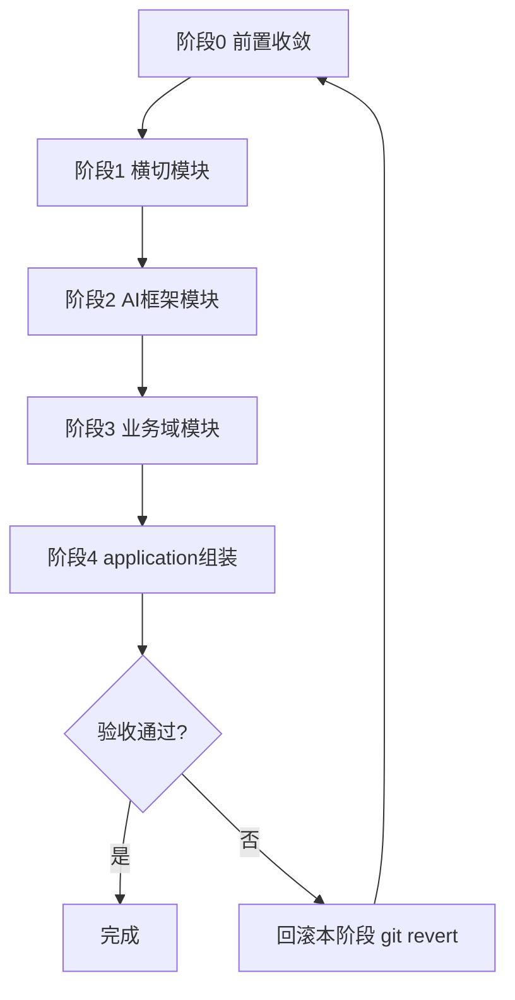
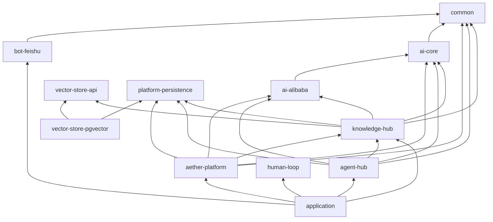

# ai-platform Maven 多模块重构 — 技术设计

> **Change**：`ai-platform-modular-refactor`  
> **版本**：v1.0（2026-06-06）  
> **需求真源**：`docs/重构方案-合并版.md`  
> **关联仓库**：`D:\cache\workspace\ai`（backend）  
> **aiTddMode**：`enabled` | **uiCraftMode**：`disabled`（无 U1 界面）

---

## 一. 概述

### 1.1 术语

| 术语 | 说明 |
|------|------|
| ai-platform | 重构后 Maven 父工程根 POM  artifactId |
| 横切模块 | common、ai-core、vector-store-*、platform-persistence、nosql、bot-*、mcp-integration、human-loop |
| 业务域模块 | knowledge-hub、agent-hub、aether-platform |
| 防腐 Port | `KnowledgeRetrievalPort`、`KnowledgeAdminPort` 等跨域调用接口 |
| learning | 原 springai/base/demo 教程模块，生产禁止依赖 |

### 1.2 需求背景

**需求描述**：将 ai 仓库单模块（724 Java 文件）拆分为 19 个 Maven 子模块，按业务域与技术横切面划分，消除知识库代码重复与依赖倒置违规，为扩展向量库/机器人/AI 框架提供插件化结构。

**产品 PRD**：`docs/重构方案-合并版.md`（治理仓）

### 1.3 本期目标

| 序号 | 内容 | 任务点 |
|------|------|--------|
| 1 | 阶段 0 前置收敛 | staged 回滚、Repository 接口化、Flyway 梳理、密钥环境变量化 |
| 2 | 阶段 1 横切提取 | 10 个基础设施子模块独立编译 |
| 3 | 阶段 2 AI 框架 | ai-spring / ai-alibaba / ai-langchain + learning 隔离 |
| 4 | 阶段 3 业务域 | knowledge-hub / agent-hub / aether-platform 提取 |
| 5 | 阶段 4 组装验收 | application 启动、E2E、dependency:tree 无环 |

### 1.4 影响分析

**受影响的系统：**
- [x] 后端 ai 仓库（全量 pom + 源码搬迁）
- [ ] 前端 ai_react（无变更）
- [ ] integration-contracts（非 BREAKING，无字段变更）
- [x] Flyway 脚本物理位置（SQL 语义不变）
- [x] CI/CD 构建命令（根目录 `mvn clean install`）

**不受影响的范围：**
- REST/SSE 路径与 JSON 契约
- PostgreSQL 表结构与数据
- 领域业务规则与 Graph 编排逻辑（仅包所在模块变化）

### 1.5 前端 UI 界面清单

无 U1 界面（`uiCraftMode: disabled`）。

---

## 二. 业务分析

### 2.1 业务用例

本变更为**纯工程结构**迁移，不新增业务用例。存量用例（知识库上传/问答、Agent 对话、平台 Skill、飞书回调）行为保持不变。

### 2.2 业务流程

#### 2.2.1 迁移活动图



#### 2.2.2 运行时调用链（不变）

模块化后运行时仍为**单进程 Spring Boot**，调用链与 `backend-design-guide.md` As-Is 一致；仅 classpath 由多 JAR 组成。

### 2.3 业务场景

详见：`openspec/changes/ai-platform-modular-refactor/specs/aether-platform-modular-structure/spec.md`

---

## 三. 系统设计

### 3.1 模块总览

```
ai-platform/（父 POM）
├── common/
├── ai-core/
├── ai-spring/
├── ai-alibaba/
├── ai-langchain/
├── vector-store-api/
├── vector-store-pgvector/
├── platform-persistence/
├── nosql/
├── mcp-integration/
├── bot-api/
├── bot-feishu/
├── human-loop/
├── knowledge-hub/
├── agent-hub/
├── aether-platform/
├── learning/
└── application/
```

### 3.2 模块依赖拓扑



**依赖禁令（强制）：**
- `knowledge-hub`、`agent-hub`、`aether-platform`、`bot-feishu` **不得**依赖 `learning`
- `agent-hub` **不得**依赖 `knowledge-hub` 的 `infrastructure` 包（仅 domain Port + 自身 Adapter）
- `ai-core` **不得**依赖 Spring AI / LangChain / Alibaba 具体 starter

### 3.3 各模块职责摘要

| 模块 | 来源包 | 核心职责 |
|------|--------|----------|
| common | common, config, helper | 工具、异常、Jackson、线程池 |
| ai-core | superAgents.domain.model（LlmCompletionPort 等） | 框架无关 AI 端口 |
| ai-spring | springai.config, springai.rag | ChatClient/Embedding 实现 |
| ai-alibaba | knowledgehub.graph 基类 | CompiledGraph 基础设施 |
| ai-langchain | base/, springai LangChain 部分 | LangChain4j 实现 |
| vector-store-api | （新建接口） | VectorStore 抽象 |
| vector-store-pgvector | springai.config PgVector 等 | pgvector 实现 |
| platform-persistence | 全局 DataSource/Flyway/MyBatis 基类 | 共享持久化基础设施 |
| nosql | Redis/Caffeine 工具 | CacheStore |
| mcp-integration | agents.mcp + superAgents.mcp 公共部分 | MCP Client/Server |
| bot-api | （新建接口） | 机器人抽象 |
| bot-feishu | feishu | 飞书实现 |
| human-loop | humanLoop | HIL Tool 反馈 |
| knowledge-hub | knowledgehub | 知识库 DDD 四层 + Graph |
| agent-hub | agents | 多智能体编排 |
| aether-platform | superAgents | 平台治理 |
| learning | springai, base, demo | 教程 Demo |
| application | DeepseekApplication | 启动与配置聚合 |

### 3.4 跨域防腐设计

```java
// knowledge-hub/domain/ 或共享 domain 包（design 落点：knowledge-hub/domain/port/）
public interface KnowledgeRetrievalPort {
    List<RetrievedChunk> retrieve(KnowledgeSearchQuery query);
}

public interface KnowledgeAdminPort {
    void storeDocument(KnowledgeDocumentCommand command);
}
```

- **agent-hub**：`infrastructure/knowledge/KnowledgeRetrievalAdapter` 实现注入，调用 `KnowledgeRetrievalPort` Bean（由 knowledge-hub 或 aether-platform 提供实现）
- **aether-platform**：同样通过 Port 访问，禁止直接 import `knowledgehub.infrastructure`

### 3.5 Bean 扫描与自动配置

```java
@SpringBootApplication(scanBasePackages = "com.yxy.deepseek")
public class DeepseekApplication { }
```

- 各子模块保留 `@Component`/`@Service`/`@Repository` 注解不变
- 若某模块需独立 AutoConfiguration，添加 `META-INF/spring/org.springframework.boot.autoconfigure.AutoConfiguration.imports`

### 3.6 配置聚合

```yaml
# application/src/main/resources/application.yml
spring:
  config:
    import:
      - "classpath:application-ai-spring.yml"
      - "classpath:application-knowledge.yml"
      - "classpath:application-feishu.yml"
      - "classpath:application-platform.yml"
```

各子模块配置：`application-<模块名>.yml` 置于各自 `src/main/resources/`。

### 3.7 Flyway 归属

| 脚本范围 | 归属模块 | 说明 |
|----------|----------|------|
| V1～V2 | platform-persistence | 共享基础表 |
| V3～V7（估计） | knowledge-hub | 知识库、文档、分块、记忆 |
| V8～V16（估计） | aether-platform | Registry、Skill、租户、成本、HA |

```yaml
# platform-persistence 聚合
spring:
  flyway:
    locations:
      - classpath:db/migration
      - classpath:db/migration/knowledge
      - classpath:db/migration/platform
```

> 执行前须逐一核对 V1～V16 脚本内容确认归属（以表前缀/注释为准）。

---

## 四. 详细设计

### 4.1 阶段 0：前置收敛

#### 4.1.1 消灭 staged 副本

```bash
git restore --staged src/main/java/com/yxy/deepseek/agents/knowledgehub/
git restore --staged src/main/java/com/yxy/deepseek/agents/knowledge/
```

#### 4.1.2 agents.knowledge 保留清单

保留：`KnowledgeRetriever`、`VectorStoreKnowledgeRetriever`、`KnowledgeStoreService`、`KnowledgeCaptureService`、`LayeredMemoryCompressionService`、`memory/*`、`vectorstore/KnowledgePersistenceHook`

移除/合并：与 knowledgehub domain 重复的 `KnowledgeBase`、`KnowledgeChunk`、`ChatMessage` 等 → 改 import `com.yxy.deepseek.knowledgehub.domain.*`

#### 4.1.3 Repository 接口化（knowledge-hub）

```
Before: knowledgehub/repository/KnowledgeBaseRepository.java（具体类）
After:
  domain/KnowledgeBaseRepository.java（interface）
  infrastructure/repository/MyBatisKnowledgeBaseRepository.java（implements）
```

同步接口化：`KnowledgeDocumentRepository`、`KnowledgeChunkRepository`。

#### 4.1.4 密钥迁移

```yaml
spring:
  ai:
    dashscope:
      api-key: ${DASHSCOPE_API_KEY}
```

### 4.2 阶段 1～3：提取顺序与验证点

每步流程：
1. 创建子模块 `pom.xml` 并加入父 `<modules>`
2. `git mv` 源码目录
3. 调整模块间 `<dependency>`
4. `mvn clean compile -pl <module> -am`
5. 记录「旧路径 → 新路径」映射表（附录 A）

**阶段 3 额外验证：**
- Graph 节点 Bean：`@Component` 类在新模块下仍被扫描
- MyBatis `@MapperScan`：覆盖各域 `infrastructure.repository`
- `@ConditionalOnBean` / `@Profile` 行为与搬迁前一致

### 4.3 父 POM 要点

```xml
<packaging>pom</packaging>
<modules>
  <module>common</module>
  <!-- ... 19 modules ... -->
  <module>application</module>
</modules>
```

- `dependencyManagement`：Spring Boot 3.4.3、Spring AI 1.1.2、Alibaba AI 1.1.2.2、LangChain4j 0.36.2 BOM
- `spring-boot-maven-plugin` **仅**在 `application` 模块 `executions` 中启用

### 4.4 AI-TDD 范围（L1）

搬迁后须保持/迁移以下 L1 单测（`AUTO-AI-UT`）：

| 模块 | L1 范围 |
|------|---------|
| knowledge-hub | Graph prep 节点、QueryKnowledgeService 流式分支、Prompt 组装 |
| agent-hub | AgentChatApplicationService 流式、路由决策 |
| aether-platform | SuperAgentChatApplicationService、Skill Graph prep |
| ai-core | PromptTemplate 渲染、端口接口契约测试 |

Mock 策略：DashScope/ChatClient/EmbeddingModel 用 Mockito；Flux 用 StepVerifier。

---

## 五. 接口设计

### 5.1 对外 REST/SSE

**无变更**。基线路径（验收用）：

| 方法 | 路径 | 说明 |
|------|------|------|
| POST | `/api/agent-hub/chat/agent` | Agent 对话 |
| POST | `/api/agent-hub/chat/knowledge` | 知识库问答 |
| POST | `/api/super-agents/chat` | 平台对话 |
| * | 知识库上传/CRUD API | KnowledgeHubController 系列 |
| * | 飞书事件订阅端点 | bot-feishu |

### 5.2 模块间 Java 接口（新增内部契约）

| 接口 | 定义模块 | 消费模块 |
|------|----------|----------|
| `ChatService` | ai-core | 各业务域 |
| `EmbeddingService` | ai-core | knowledge-hub |
| `VectorStore` | vector-store-api | knowledge-hub |
| `KnowledgeRetrievalPort` | knowledge-hub domain | agent-hub, aether-platform |
| `KnowledgeAdminPort` | knowledge-hub domain | agent-hub, aether-platform |
| `CacheStore` | nosql | aether-platform |
| `BotMessageHandler` | bot-api | bot-feishu |

### 5.3 错误码

无新增错误码；沿用现有 HTTP 状态与业务异常体系。

---

## 六. 代码改造分析

### 6.1 现状代码位置（As-Is，基于重构方案实测）

| 包 | 文件数 | 说明 |
|----|--------|------|
| `com.yxy.deepseek.agents` | ~200 | Agent Hub |
| `com.yxy.deepseek.knowledgehub` | ~87 | Knowledge Hub |
| `com.yxy.deepseek.superAgents` | ~273 | Aether Platform |
| `com.yxy.deepseek.springai` | ~113 | Demo/教程 |
| `com.yxy.deepseek.humanLoop` | ~13 | HIL |
| `com.yxy.deepseek.feishu` | ~8 | 飞书 |

启动类：`com.yxy.deepseek.DeepseekApplication`

### 6.2 改造要点

1. **不全局重命名包**：仅 Maven 模块 + `pom.xml` 依赖边界
2. **可见性提升**：跨模块引用时 package-private → public，注释 `/* 重构提升可见性，原为 package-private */`
3. **git mv**：每次阶段完成后提交，映射表写入 `ai/docs/modular-refactor-path-map.md`（实施时创建）
4. **testExclude 逐步解除**：模块化完成后评估解除范围

### 6.3 关键技术决策

| 决策 | 选择 | 理由 | 后果 |
|------|------|------|------|
| 包名保留 | `com.yxy.deepseek` | 降低 724 文件 import 修改量 | 模块名与包名不完全对应，需文档说明 |
| Repository 接口化 | knowledge-hub 先行 | 消除最高优先级 DDD 违规 | 阶段 0 增加工作量，但降低阶段 3 风险 |
| learning 隔离 | POM 级禁止依赖 | 对齐 backend-design-guide Demo 隔离 | Demo API 仍可通过 application 可选依赖加载 |
| 单进程部署 | 不拆微服务 | 本期仅结构重构 | 后续可再拆部署单元 |

---

## 七. 非功能性需求

### 7.1 可观测性

- 搬迁后 Micrometer 指标 Bean 仍正常注册（`agent_iterations_total`、`rag_search_duration_seconds` 等）
- 启动日志须无 `BeanDefinitionOverrideException`

### 7.2 性能

- 模块化不增加运行时序列化/网络开销（仍单 JVM）
- classpath 扫描范围不变（`com.yxy.deepseek`）

### 7.3 安全

- 仓库无明文 API Key（req-8）
- 跨模块 Port 调用仍须租户/权限校验（行为不变）

### 7.4 回滚策略

- 每阶段独立 Git 提交/tag，失败时 `git revert` 本阶段
- 阶段 3 前完成阶段 0，避免 Bean 冲突不可回滚

### 7.5 验收命令

| 标准 | 命令 |
|------|------|
| 全量编译 | `mvn clean install` |
| 无环依赖 | `mvn dependency:tree` |
| 健康检查 | Actuator `/health` → UP |
| 测试 | `mvn test`（逐步解除 testExclude） |

### 7.6 Assumptions

- 开发环境 Java 17、PostgreSQL + pgvector、Redis 可用性与搬迁前一致
- V3～V7 / V8～V16 Flyway 归属为估计值，实施前须逐脚本核对
- 单模块 `testExclude` 列表在实施 tasks 中逐项评估

---

## 附录 A：路径映射规则（实施时填充）

每阶段完成后更新 `ai/docs/modular-refactor-path-map.md`，格式：

```text
旧路径: src/main/java/com/yxy/deepseek/knowledgehub/domain/KnowledgeBase.java
新路径: knowledge-hub/src/main/java/com/yxy/deepseek/knowledgehub/domain/KnowledgeBase.java
模块:   knowledge-hub
阶段:   3
```
