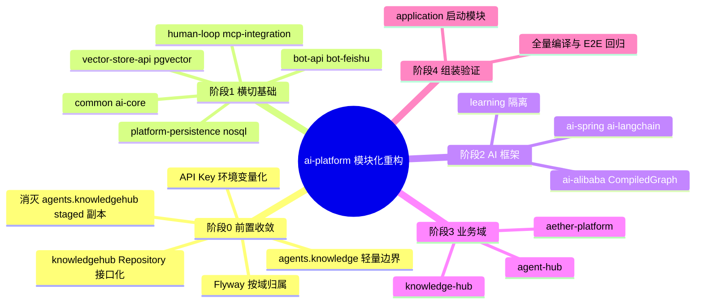

## Why
（为什么要做）

### 背景与目标
- **背景**：关联仓库 **ai**（`D:\cache\workspace\ai`）当前为单模块 Maven 项目（724 个 Java 源文件），三个成熟业务域（`knowledgehub` ~87 文件、`agents` ~200 文件、`superAgents` ~273 文件）与多套 AI 框架（Spring AI / Alibaba CompiledGraph / LangChain4j）共存于同一 JAR，存在以下阻塞性技术债：
  - **知识库代码三份并存**：`knowledgehub`（生产）+ `agents.knowledge`（轻量适配）+ Git staged 的 `agents.knowledgehub`（全量副本，磁盘未落盘），模块化前若不收敛将必然 Bean 冲突；
  - **Repository 贫血**：`knowledgehub` 的 `KnowledgeBaseRepository` 等为具体类而非领域接口，违反依赖倒置；
  - **Flyway V1～V16 混用**：三业务域脚本未按域归属，模块化后无法独立演进；
  - **多 AI 框架无统一抽象**：业务代码直接耦合具体框架实现，扩展向量库/机器人/模型供应商成本高。
- **目标**：将单模块拆分为 **Maven 多模块**（根 POM `ai-platform`，19 个子模块），**按业务域边界 + 技术横切面**划分；包名前缀**保留** `com.yxy.deepseek`；**所有现有功能行为完全不变**（非 BREAKING）；为后续向量库/机器人/AI 框架扩展提供插件化接入点。详细方案见 `docs/重构方案-合并版.md`。

本变更是 `backend-design-guide.md` **工程结构演进**的基础工程，不引入新业务 API，不修改 REST/SSE 契约。

## Jira / 需求链接

- 无工单

## What Changes
（变更内容）

### 需求概览（全局）

- **阶段 0（前置收敛，1 周）**：回滚 staged 副本；明确 `agents.knowledge` 轻量适配层；`knowledgehub` Repository 改为 domain 接口 + infrastructure MyBatis 实现；Flyway 脚本按域分配到各模块 `resources/db/migration/`；`application.yaml` 明文密钥迁移环境变量。
- **阶段 1（横切基础，2 周）**：提取 `common`、`ai-core`、`vector-store-api`/`vector-store-pgvector`、`platform-persistence`、`nosql`、`bot-api`/`bot-feishu`、`human-loop`、`mcp-integration`；每步 `mvn clean compile` 门禁。
- **阶段 2（AI 框架，2 周）**：提取 `ai-alibaba`（CompiledGraph 基类）、`ai-spring`、`ai-langchain`；剥离 `learning`（原 `springai`/`base`/`demo`），禁止业务模块依赖。
- **阶段 3（业务域，3 周）**：提取 `knowledge-hub`、`agent-hub`、`aether-platform`；跨域调用经 `KnowledgeRetrievalPort`/`KnowledgeAdminPort` 防腐接口；验证 Graph 节点 Bean 扫描与 Repository 注入。
- **阶段 4（组装，1 周）**：`application` 模块统一 `@SpringBootApplication(scanBasePackages = "com.yxy.deepseek")`；`spring.config.import` 聚合子模块配置；`mvn clean install` + 启动 + API/飞书/知识库 E2E 验证；`mvn dependency:tree` 无环依赖。

## Capabilities
（能力范围）

### New Capabilities（新增能力）
- `aether-platform/modular-structure`：Maven 多模块工程结构、模块依赖治理、分阶段迁移与验收

### Modified Capabilities（变更能力）
- （无需求层面行为变更；业务 API、SSE 契约、领域规则均保持不变）

## Impact
（影响分析）

> proposal.md 不做技术分析，仅简述影响。完整 Impact 清单在 design.md 中展开。

- **后端（ai）**：全仓库 `pom.xml` 由单模块改为父子 POM + 19 子模块；724 个 Java 文件按模块搬迁（`git mv`）；`knowledgehub`/`agents`/`superAgents` 等包路径保留，仅模块边界与 Maven 依赖变化；L1 相关模块（Graph prep、防腐 Port、ApplicationService）在搬迁后须补/迁 **AUTO-AI-UT**（`aiTddMode: enabled`）。
- **前端（ai_react）**：无变更（`uiCraftMode: disabled`）；HTTP/SSE 契约不变，无需联调改版。
- **治理仓（AetherStack）**：本 OpenSpec 变更目录；`docs/重构方案-合并版.md` 为需求真源；归档后可能更新 `ARCHITECTURE.md` 模块索引。
- **契约**：**非 BREAKING**；`integration-contracts.md` 路径与字段不变。
- **范围外**：新业务功能；Agent Hub Graph/ReactAgent 规范对齐（见 `refactor-agent-hub-controller` 等独立变更）；前端 Umi 重构；数据库表结构变更（仅 Flyway 脚本**物理位置**迁移，SQL 内容不变）。
