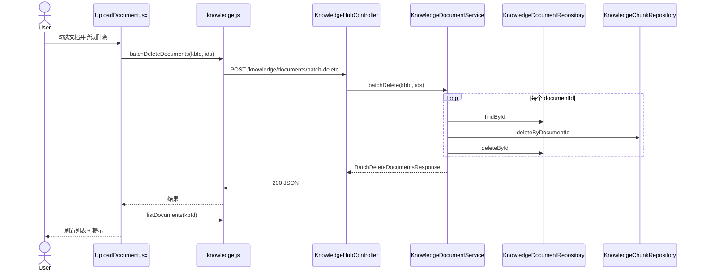

# 技术方案（简版）

> 写作原则：结合现有代码可落地；删除链路复用 `StoreDocumentNode` 已验证的 chunks + document 清理模式；本需求为纯 CRUD，不引入 CompiledGraph。

## 一. 需求摘要
- **需求描述**：知识库上传页增加文档列表、多选与批量删除，删除前二次确认。
- **JIRA/需求来源**：无工单
- **关键约束**：
  1. 删除前必须二次确认，弹窗展示将删除数量 N
  2. 批量删除支持部分成功：已成功项从列表移除，失败项保留
  3. 删除后 chunks 与向量数据须同步清理，RAG 不再命中

## 二. 影响范围和核心场景

### 2.1 本期影响范围（必填）
| 维度 | 影响点 |
|---|---|
| 前端 | `ai_react/src/components/UploadDocument.jsx`：文档列表、多选、确认弹窗、结果提示；`ai_react/src/api/knowledge.js`、`ai_react/src/api/index.js`：新增 API |
| 后端服务 | `KnowledgeDocumentRepository` 增 list；新增 `KnowledgeDocumentService`；`KnowledgeHubController` 或 `KnowledgeBaseController` 增 2 个 REST 端点 |
| 异步任务 | 无 |
| 数据库 | 读写 `knowledge_documents`、`knowledge_chunks`（`ON DELETE CASCADE` 已存在，仍显式删 chunks 与存量 `StoreDocumentNode` 一致） |
| 配置权限 | 无新增配置；沿用现有 Knowledge Hub 无鉴权边界（与知识库 CRUD 一致） |

### 2.2 核心场景（必填）

**UC-01 加载文档列表（正常）**
- 前置：用户进入上传页，已选中某知识库且该库有文档
- 验收：`GET .../knowledge-bases/{id}/documents` 返回文档列表；页面展示文件名、分段数、上传时间

**UC-02 空列表（边界）**
- 前置：选中知识库下无文档
- 验收：接口返回空数组；页面展示空状态文案，批量删除按钮不可用

**UC-03 切换知识库（边界）**
- 前置：用户已勾选部分文档
- 验收：切换 `select` 后重新拉取列表；勾选状态清空

**UC-04 二次确认后全部删除成功（正常）**
- 前置：勾选 N 条文档，确认弹窗展示 N
- 验收：`batch-delete` 返回 `failedDocumentIds=[]`；列表刷新；成功提示；勾选清空

**UC-05 部分删除失败（异常）**
- 前置：批量请求含不存在或不属于当前 KB 的 documentId
- 验收：合法项已删；响应含 `failedDocumentIds`；页面部分失败提示；失败项仍可见

**UC-06 用户取消确认（边界）**
- 前置：已勾选文档，点击批量删除
- 验收：`window.confirm`（或等价弹窗）点取消；不发起 DELETE/POST；列表与勾选不变

## 三. 方案总览

### 3.1 整体思路（必填）
1. **同步 REST**：列表查询 + 批量删除均为同步 HTTP，无 MQ/Graph。
2. **复用优先**：删除单文档逻辑抽取为 Service 私有方法，与 `StoreDocumentNode` 同序：`deleteByDocumentId` → `deleteById`。
3. **部分成功口径**：逐条删除、捕获异常，汇总 `deletedCount` / `failedDocumentIds` 返回前端。

### 3.2 关键实现点（必填）
1. Repository 新增 `findByKnowledgeBaseId(long kbId)`，按 `updated_at DESC` 排序
2. `KnowledgeDocumentService.batchDelete(kbId, ids)` 校验 KB 存在、逐条校验 document 归属 kbId
3. 前端上传成功后调用 `loadDocuments()` 刷新列表；批量删除用 `window.confirm(t.uploadBatchDeleteConfirm.replace('{count}', N))`（与 `KnowledgeBaseManager` 一致）

### 3.3 与现有代码关系（必填）
- **复用**：`KnowledgeDocumentRepository.deleteById`、`KnowledgeChunkRepository.deleteByDocumentId`、`listKnowledgeBases`、`KnowledgeHubExceptionHandler`
- **新增**：`KnowledgeDocumentService`、DTO（`DocumentSummaryResponse`、`BatchDeleteDocumentsRequest/Response`）、REST 端点、前端列表 UI
- **变更**：`UploadDocument.jsx`、`knowledge.js`、`KnowledgeHubApiPaths`、`KnowledgeHubExceptionHandler` 的 `basePackageClasses`（若新建 Controller）

## 四. 方案梳理（按需）

### 4.2 时序图
说明：批量删除同步链路，组件级粒度。



## 五. 代码改造分析【强制】

### 5.1 入口链路
- **现状实现**：`KnowledgeHubController` 仅有 `uploadKnowledgeDocument`；`UploadDocument.jsx` 仅上传，无列表/删除。
- **现状代码（最小片段）**：

```44:50:D:\cache\workspace\ai\src\main\java\com\yxy\deepseek\knowledgehub\web\KnowledgeHubController.java
    @PostMapping(path = "/knowledge/upload", consumes = MediaType.MULTIPART_FORM_DATA_VALUE)
    public DocumentUploadResponse uploadKnowledgeDocument(
            @RequestParam("file") MultipartFile file,
            @RequestParam("knowledgeBaseId") long knowledgeBaseId,
            @RequestParam(value = "replace", defaultValue = "false") boolean replace) {
        return documentUploadService.upload(file, knowledgeBaseId, replace);
    }
```

- **改造代码（目标形态）**：

```java
// KnowledgeHubApiPaths 新增
public static final String KNOWLEDGE_DOCUMENTS = BASE + "/knowledge/documents";

// KnowledgeBaseController 或 KnowledgeHubController
@GetMapping("/{knowledgeBaseId}/documents")
public List<DocumentSummaryResponse> listDocuments(@PathVariable long knowledgeBaseId) {
    return knowledgeDocumentService.listByKnowledgeBase(knowledgeBaseId);
}

@PostMapping("/knowledge/documents/batch-delete")
public BatchDeleteDocumentsResponse batchDelete(@RequestBody BatchDeleteDocumentsRequest request) {
    return knowledgeDocumentService.batchDelete(
            request.knowledgeBaseId(), request.documentIds());
}
```

### 5.2 核心校验
- **现状实现**：`StoreDocumentNode` 替换同名文件时先删 chunks 再删 document；Repository 无按 KB 列表、无批量删除。
- **现状代码（最小片段）**：

```72:77:D:\cache\workspace\ai\src\main\java\com\yxy\deepseek\knowledgehub\graph\upload\StoreDocumentNode.java
        Optional<KnowledgeDocument> existingByName = documentRepository.findByKbAndFileName(knowledgeBaseId, fileName);
        if (existingByName.isPresent()) {
            long oldId = existingByName.get().id();
            chunkRepository.deleteByDocumentId(oldId);
            documentRepository.deleteById(oldId);
        }
```

- **改造代码（目标形态）**：

```java
// KnowledgeDocumentService
public BatchDeleteDocumentsResponse batchDelete(long knowledgeBaseId, List<Long> documentIds) {
    knowledgeBaseRepository.findById(knowledgeBaseId)
            .orElseThrow(() -> new IllegalArgumentException("知识库不存在: " + knowledgeBaseId));
    if (documentIds == null || documentIds.isEmpty()) {
        throw new IllegalArgumentException("documentIds 不能为空");
    }
    List<Long> failed = new ArrayList<>();
    int deleted = 0;
    for (Long id : documentIds) {
        try {
            deleteOne(knowledgeBaseId, id);
            deleted++;
        } catch (IllegalArgumentException ex) {
            failed.add(id);
        }
    }
    return new BatchDeleteDocumentsResponse(deleted, failed, buildMessage(deleted, failed));
}

private void deleteOne(long knowledgeBaseId, long documentId) {
    KnowledgeDocument doc = documentRepository.findById(documentId)
            .orElseThrow(() -> new IllegalArgumentException("文档不存在: " + documentId));
    if (!doc.knowledgeBaseId().equals(knowledgeBaseId)) {
        throw new IllegalArgumentException("文档不属于当前知识库: " + documentId);
    }
    chunkRepository.deleteByDocumentId(documentId);
    documentRepository.deleteById(documentId);
}
```

### 5.3 数据落点/后置处理
- **现状实现**：`KnowledgeDocumentRepository` 无 `findByKnowledgeBaseId`；表结构已支持级联（`knowledge_chunks.document_id` → `ON DELETE CASCADE`）。
- **现状代码（最小片段）**：

```92:94:D:\cache\workspace\ai\src\main\java\com\yxy\deepseek\knowledgehub\repository\KnowledgeDocumentRepository.java
    public void deleteById(long documentId) {
        jdbcTemplate.update("DELETE FROM knowledge_documents WHERE id = ?", documentId);
    }
```

- **改造代码（目标形态）**：

```java
// KnowledgeDocumentRepository 新增
public List<KnowledgeDocument> findByKnowledgeBaseId(long knowledgeBaseId) {
    return jdbcTemplate.query(
            """
            SELECT id, knowledge_base_id, file_name, content_hash, language, chunk_count, created_at, updated_at
            FROM knowledge_documents WHERE knowledge_base_id = ?
            ORDER BY updated_at DESC
            """,
            ROW_MAPPER, knowledgeBaseId);
}
```

```jsx
// UploadDocument.jsx — 二次确认（对齐 KnowledgeBaseManager 模式）
async function handleBatchDelete() {
  if (selectedIds.size === 0) return
  const count = selectedIds.size
  if (!window.confirm(t.uploadBatchDeleteConfirm.replace('{count}', String(count)))) {
    return
  }
  const result = await batchDeleteDocuments({
    knowledgeBaseId: Number(selectedKbId),
    documentIds: [...selectedIds],
  })
  // 按 result.failedDocumentIds 展示成功/部分失败/全失败，再 loadDocuments()
}
```

## 六. 接口与交互契约【按需填写】

### 6.1 前后端交互契约（涉及则必填）

- **列表接口**：`GET /api/agent-hub/knowledge-bases/{knowledgeBaseId}/documents`
- **响应示例**：

```json
[
  {
    "id": 101,
    "fileName": "manual.pdf",
    "language": "zh",
    "chunkCount": 12,
    "createdAt": "2026-05-30T08:00:00Z",
    "updatedAt": "2026-05-30T08:00:00Z"
  }
]
```

- **批量删除**：`POST /api/agent-hub/knowledge/documents/batch-delete`
- **请求示例**：

```json
{
  "knowledgeBaseId": 1,
  "documentIds": [101, 102, 103]
}
```

- **响应示例**：

```json
{
  "deletedCount": 2,
  "failedDocumentIds": [103],
  "message": "已删除 2 条，1 条失败"
}
```

> 实现完成后同步更新 `openspec/references/integration-contracts.md` 与 `.aetherstack/context/api-contracts.yaml`。

### 6.2 外部系统交互（涉及则必填）
无。

### 6.3 错误码（推荐）
| code | 含义 |
|---|---|
| HTTP 400 + ProblemDetail | 知识库不存在、documentIds 为空、单条校验失败（批量时记入 failedDocumentIds，不整批 400） |
| HTTP 400 | 列表接口 knowledgeBaseId 对应 KB 不存在 |

## 七. 非功能性需求设计

### 7.1 边界与异常分支（汇总）
| 场景 | 处理策略 | 结果 |
|---|---|---|
| documentIds 为空 | 请求级校验，400 | 不执行删除 |
| 文档不存在 | 记入 failedDocumentIds | 其余继续 |
| 文档不属于当前 KB | 记入 failedDocumentIds | 防止跨库误删 |
| 用户取消确认 | 前端拦截 | 不调用 API |
| DB 删除异常 | 记入 failedDocumentIds + 日志 | 部分成功响应 |

### 7.2 权限影响（推荐）
无新增权限；与现有 Knowledge Hub 接口一致（本期内网/演示环境，无用户级 KB 隔离）。

### 7.3 数据清洗、迁移（复杂）
- [ ] 是否需要数据迁移脚本 — **否**
- [ ] 迁移是否可回滚 — **不适用**
- [ ] 迁移对线上业务的影响 — **无**

### 7.4 缓存设计（复杂）
无。

### 7.5 安全评估（推荐）
- [x] 查询操作是否存在越权风险 — 本期无用户维度隔离，与存量 KB API 一致
- [x] 修改操作是否存在越权风险 — 通过 `knowledgeBaseId` + document 归属校验降低跨库误删
- [ ] 敏感数据是否加密 — 不涉及

### 7.6 限流降级评估（复杂）
- [ ] 是否需要限流 — 否（管理端低频操作）
- [ ] 是否需要降级策略 — 否
- [ ] 预期 QPS/TPS — 个位数

### 7.7 日志审计（涉及则必填）
无。

### 7.8 可观测性清单（必填）
| 观测点 | 验证口径 | 关联场景 |
|---|---|---|
| 接口返回 | 列表 200 + 数组；删除 200 + deletedCount/failedDocumentIds | UC-01、UC-04、UC-05 |
| 任务中心 | 无 | — |
| 数据库 | `knowledge_documents` 行减少；对应 `knowledge_chunks` 同步减少 | UC-04 |
| 向量检索 | 删除后对该文档 chunks 的 `searchByKnowledgeBase` 不再命中 | UC-04 |
| 外部反馈 | 无 | — |

### 7.9 并发与性能验收口径（必填）
#### 7.9.1 并发与幂等
- 同一 documentId 并发删除：第二次 `findById` 失败 → 记入 failedDocumentIds，无脏数据
- 重复提交相同 ids：已删文档再次删除记失败，不产生副作用
- 幂等语义：**删除操作本身幂等**（目标态为不存在）

#### 7.9.2 性能与容量
- 批量规模：单次 ≤ 100 条（前端无分页前提下合理上限；超出可后续加分页）
- 处理时长：100 条串行删除，P95 < 3s（本地 PG）
- 失败策略：逐条继续，不整批回滚

## 八. 配置影响矩阵（推荐）
| 配置项 | 常规流程 | 本方案 |
|---|---|---|
| 无新增配置 | — | 行为不变 |
