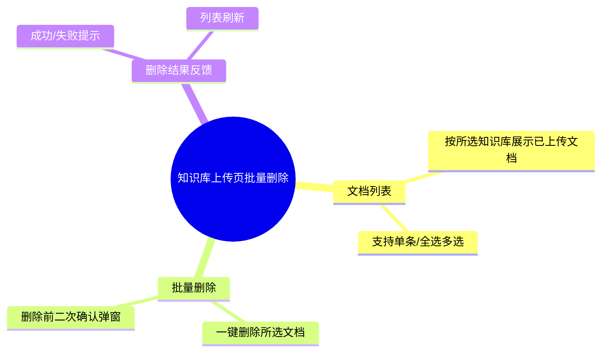

## Why
（为什么要做）

### 背景与目标
- **背景**：当前知识库上传页面仅支持单文件上传，用户无法查看已上传文档列表，也无法批量清理不再需要的文档。随着知识库文档增多，维护成本上升，误删风险也需要通过交互设计加以控制。
- **目标**：在上传页面提供已上传文档的可视化列表，支持多选后一键批量删除；删除操作必须经过二次确认，避免误操作。

<!-- 1-2 句话说明问题/机会。为什么现在要做？ -->
知识库文档管理缺少批量清理能力，影响日常维护效率；同时删除是不可逆操作，需通过二次确认保障安全。

## Jira / 需求链接

<!-- 在开始提案前提供 Jira/需求链接 -->
- 无工单

## What Changes
（变更内容）

### 需求概览（全局）

<!-- 用要点列出新增/修改/删除的内容，破坏性变更标记 **BREAKING** -->
- 上传页面新增「已上传文档列表」，按当前所选知识库展示文档
- 列表支持复选框多选（含全选/取消全选）
- 提供「批量删除」操作入口，仅在有选中项时可点击
- **删除前弹出二次确认**，明确告知将删除的文档数量，用户确认后才执行
- 删除完成后刷新列表并给出结果反馈（成功或部分/全部失败提示）
- 不涉及知识库本身的增删改（仍由知识库管理页负责）

## Capabilities
（能力范围）

### New Capabilities（新增能力）
<!-- 遵循 DDD 目录： [系统]-[领域]/[子域]/[功能] -->
- （无新增独立能力）

### Modified Capabilities（变更能力）
<!-- 仅当需求层面发生变化才填写 -->
- `aether-knowledge/upload`：上传页面扩展为「上传 + 文档管理」，新增文档列表展示、多选与批量删除（含二次确认）能力

## Impact
（影响分析）

> proposal.md 不做技术分析，仅简述影响。完整 Impact 清单在 design-lite.md 中展开（详见 openspec/references/qwms-rules.md）。

<!-- 简述影响范围（1-3 句即可） -->
- **前端（ai_react）**：`UploadDocument` 上传页面需增加文档列表、多选交互与确认弹窗
- **后端（ai）**：Knowledge Hub 需暴露文档查询与批量删除接口（当前上传页无文档列表与删除 API）
- **数据**：删除文档需同步清理关联分段（chunks）及向量索引，保证 RAG 检索不再命中已删内容
