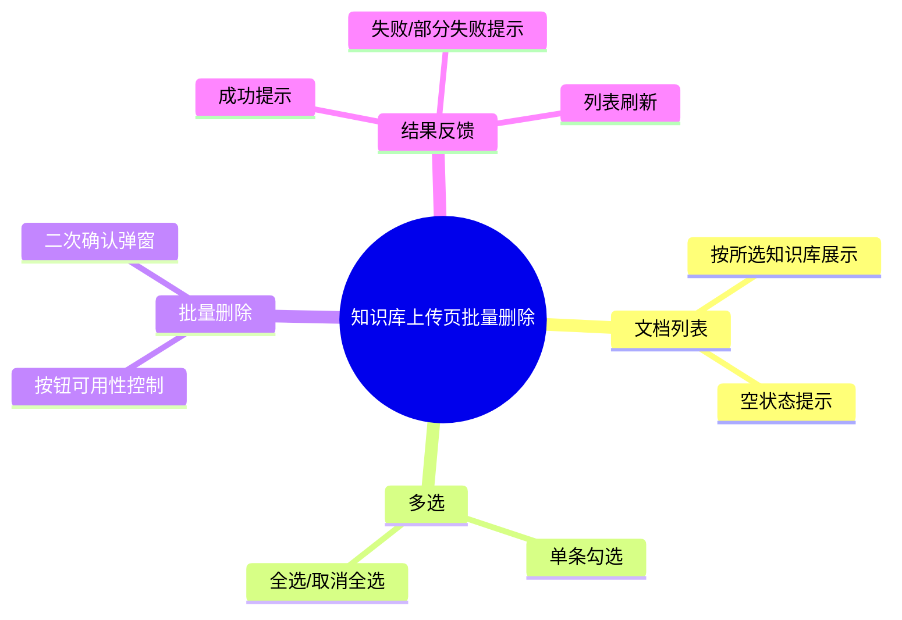

# 知识库上传-文档批量删除

## 知识库/上传 需求说明（前提/操作/结果）
> 本能力扩展知识库上传页面，使用户可在同一页面查看已上传文档、多选并批量删除。
> 删除为不可逆操作，必须经过二次确认。规范仅描述业务口径与边界，不包含技术实现细节。

---

## ADDED Requirements
（新增用户故事）

### 功能组 1：文档列表展示

### Requirement: 1. 按所选知识库展示已上传文档列表

系统应当（SHALL）在知识库上传页面，根据用户当前选中的知识库，展示该知识库下已上传的文档列表；列表至少包含文档标识与文件名等可识别信息。

#### 场景: 选中知识库后加载文档列表
- **前提**：用户已进入知识库上传页面；系统中存在至少一个知识库，且当前选中的知识库下已有上传文档。
- **操作**：页面加载完成或用户切换知识库选择。
- **结果**：系统展示当前知识库下的已上传文档列表。

#### 场景: 知识库下无文档
- **前提**：用户已选中某个知识库；该知识库下尚未上传任何文档。
- **操作**：页面加载完成或用户切换到该知识库。
- **结果**：系统展示空状态提示，告知当前知识库暂无文档；不展示可删除的文档条目。

#### 场景: 切换知识库后刷新列表
- **前提**：用户已在列表中勾选了部分文档。
- **操作**：用户将知识库选择切换为另一个知识库。
- **结果**：系统加载并展示新选中知识库下的文档列表；此前勾选状态被清空。

---

### 功能组 2：文档多选

### Requirement: 2. 支持单条与全选多选文档

系统应当（SHALL）在文档列表中提供复选框，支持用户对单条文档进行勾选或取消勾选，并支持一键全选或取消全选当前列表中的全部文档。

#### 场景: 单条勾选与取消
- **前提**：文档列表中存在至少一条文档。
- **操作**：用户勾选某条文档，随后取消勾选。
- **结果**：勾选时该文档纳入待操作集合；取消勾选后从待操作集合中移除。

#### 场景: 全选与取消全选
- **前提**：文档列表中存在多条文档。
- **操作**：用户点击全选，随后点击取消全选。
- **结果**：全选后当前列表全部文档被纳入待操作集合；取消全选后待操作集合为空。

---

### 功能组 3：批量删除与二次确认

### Requirement: 3. 批量删除所选文档且删除前必须二次确认

系统应当（SHALL）提供「批量删除」操作入口；仅当用户至少选中一条文档时该入口可用。用户触发批量删除时，系统必须先弹出二次确认，明确告知将删除的文档数量；用户确认后才执行删除，取消则不执行任何删除。

#### 场景: 未选中文档时不可删除
- **前提**：文档列表已展示；用户未勾选任何文档。
- **操作**：用户查看批量删除入口。
- **结果**：批量删除入口处于不可用状态，用户无法发起删除。

#### 场景: 二次确认后执行删除
- **前提**：用户已勾选一条或多条文档。
- **操作**：用户点击批量删除；在二次确认弹窗中确认删除。
- **结果**：系统删除用户选中的文档；删除完成后文档不再出现在列表中，且不再参与知识库检索。

#### 场景: 二次确认弹窗展示删除数量
- **前提**：用户已勾选 N 条文档（N ≥ 1）。
- **操作**：用户点击批量删除。
- **结果**：系统弹出二次确认，文案中明确包含将删除的文档数量 N；用户未确认前不执行删除。

#### 场景: 用户在确认弹窗中取消
- **前提**：用户已勾选一条或多条文档，并已触发批量删除。
- **操作**：用户在二次确认弹窗中选择取消或关闭。
- **结果**：系统不执行任何删除；文档列表与勾选状态保持不变。

---

### 功能组 4：删除结果反馈

### Requirement: 4. 删除完成后给出结果反馈并刷新列表

系统应当（SHALL）在批量删除操作完成后，刷新文档列表并向用户反馈删除结果；若部分文档删除失败，应明确告知失败情况，已成功删除的文档不再展示于列表中。

#### 场景: 全部删除成功
- **前提**：用户已确认批量删除，且所选文档均可成功删除。
- **操作**：系统完成删除处理。
- **结果**：系统展示删除成功提示；列表刷新，已删文档不再出现；勾选状态被清空。

#### 场景: 部分删除失败
- **前提**：用户已确认批量删除；所选文档中存在无法删除的条目。
- **操作**：系统完成删除处理。
- **结果**：系统展示部分失败提示，说明存在未能删除的文档；列表刷新，已成功删除的文档不再出现；未能删除的文档仍保留在列表中。

#### 场景: 全部删除失败
- **前提**：用户已确认批量删除；所选文档均无法删除。
- **操作**：系统完成删除处理。
- **结果**：系统展示删除失败提示；文档列表内容保持不变；勾选状态保持不变或按产品设计合理保留，便于用户重试。
