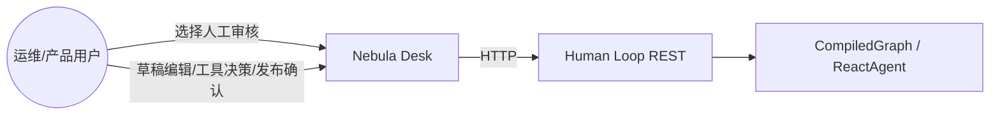
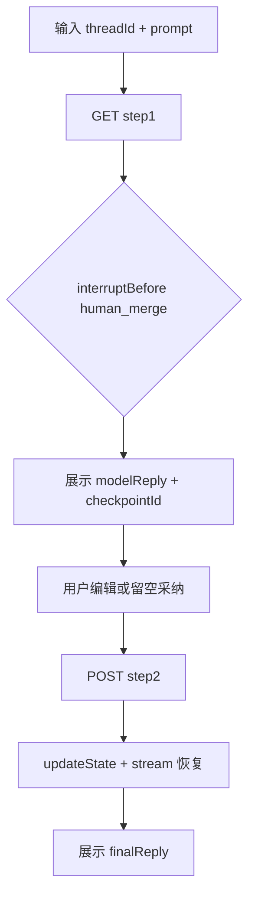
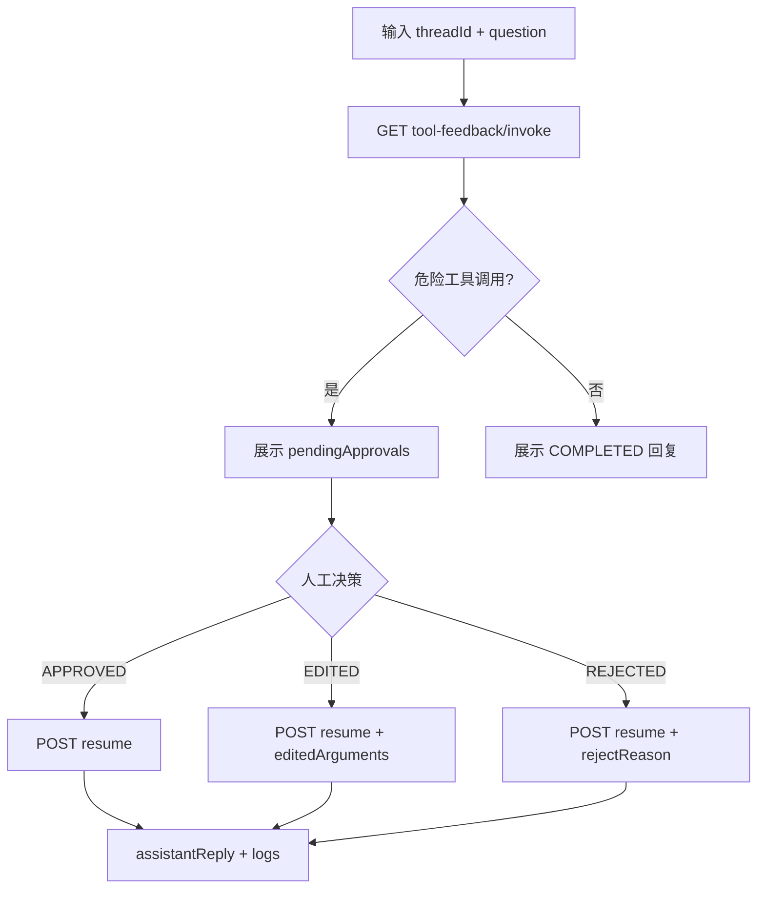
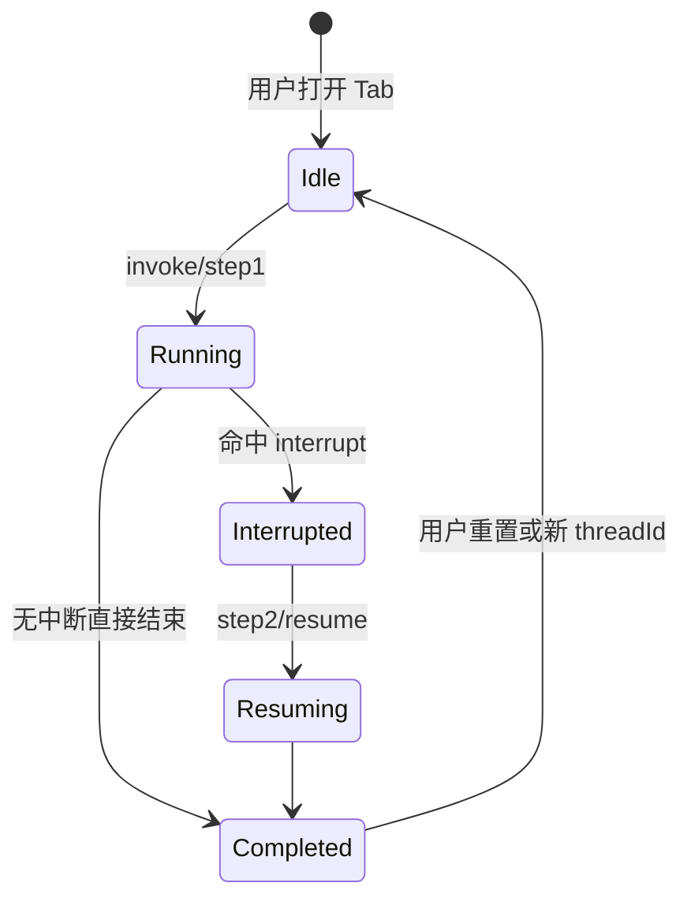
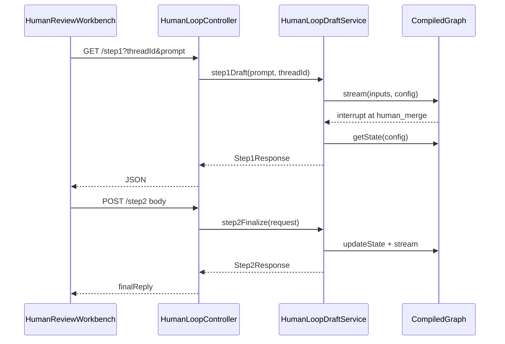

# 人工审核 Human Loop - 技术方案

> 基于 design-draft.md（AI 起草，用户「继续」确认）。  
> 业务需求详见：`openspec/changes/human-loop-refactor-ui/specs/aether-agent-human-loop/spec.md`

## 一. 概述

### 1.1 术语

| 术语 | 英文 | 说明 |
|------|------|------|
| HIL | Human-in-the-loop | 人工介入 Graph/Agent 执行：中断 → 人工决策 → resume |
| threadId | Thread ID | Graph/Agent 检查点会话标识，step1 与 step2 须一致 |
| checkpointId | Checkpoint ID | 框架写回的检查点指针，step2 建议原样带回 |
| interruptBefore | — | StateGraph 在指定节点前暂停，等待 updateState + stream |

### 1.2 需求背景

**需求描述**：将 `AlibabaGraphHumanLoopController` 及 HIL 关联类迁移至 `com.yxy.deepseek.humanLoop`，并在 Nebula Desk「对话」分组下提供 Impeccable 人工审核工作台，覆盖草稿 HIL、工具审批、企业工作流三类演示 API。

**产品 PRD**：无工单；proposal + spec 为需求来源。

### 1.3 本期目标

| 序号 | 内容 | 任务点 |
|------|------|--------|
| 1 | 后端包迁移与分层 | humanLoop 包、Bean 可用、引用更新 |
| 2 | REST 契约兼容 | URL/JSON/HTTP 状态码不变 |
| 3 | 侧边栏入口 | 对话分组「人工审核」菜单 + i18n |
| 4 | 审核工作台 U1 | 三 Tab 页面 + api/humanLoop.js |
| 5 | AI-TDD（auto→enabled） | L1 Demo Service 单测 |
| 6 | 契约登记 | integration-contracts 增量 |

### 1.4 影响分析

**受影响的系统：**
- [x] 后端 **ai**（`com.yxy.deepseek.humanLoop` 新包）
- [x] 前端 **ai_react**（HomePage、新页面、API）
- [x] 治理层 **AetherStack**（integration-contracts）
- [ ] 数据库 — 无
- [ ] Agent Hub 生产对话 — 无（范围外）
- [ ] Knowledge Hub — 无

**AI-TDD 评估（aiTddMode: auto）**：触及 L1 — `HumanLoopDraftService`（CompiledGraph stream/updateState）、`ToolFeedbackService`（Agent invoke/resume）、`EnterpriseWorkflowService`（CompiledGraph invoke）。**design 结论：等同 `enabled`**，tasks 须含 `AUTO-AI-UT`。

---

## 二. 业务分析

### 2.1 业务用例



### 2.2 业务流程

#### 2.2.1 Graph 草稿 HIL



#### 2.2.2 工具审批



### 2.3 业务场景

详见：`openspec/changes/human-loop-refactor-ui/specs/aether-agent-human-loop/spec.md`

---

## 三. 系统设计

### 3.1 业务实体状态图

HIL 会话无持久化聚合；运行时状态由 Graph MemorySaver / Agent Memory 持有。



### 3.2 领域模型图

本期为**演示模块迁移**，不引入新聚合根；逻辑仍委托 Spring AI Alibaba Graph/Agent。

| 层次 | 职责 |
|------|------|
| web | HTTP 入参校验、ResponseStatusException 映射 |
| application | invoke/stream/updateState 编排（原 Demo 类） |
| config | CompiledGraph / ReactAgent Bean 装配 |
| contract | HTTP DTO record |
| tool | 危险工具定义（sendEmailTool 等） |

### 3.3 数据模型图

**无数据模型变更。** 无新增表、无 Redis。

### 3.4 前端 UI 界面清单（uiCraftMode: enabled）

| 路径 | 类型 | Impeccable | 说明 |
|------|------|------------|------|
| `ai_react/src/pages/HumanReviewWorkbench.jsx` | U1 新页面 | **UI-CRAFT** | 三 Tab 工作台主容器 |
| `ai_react/src/components/humanLoop/DraftHilPanel.jsx` | U1 子面板 | **UI-CRAFT** | 草稿 step1/step2 |
| `ai_react/src/components/humanLoop/ToolFeedbackPanel.jsx` | U1 子面板 | **UI-CRAFT** | 工具审批列表与决策 |
| `ai_react/src/components/humanLoop/EnterpriseWorkflowPanel.jsx` | U1 子面板 | **UI-CRAFT** | 三企业场景子区 |
| `ai_react/src/pages/HomePage.jsx` | U1 改动 | **UI-AUDIT** | 侧边栏菜单 + 视图路由 |
| `ai_react/src/i18n/messages.js` | U3 | UI-FUNC | 中英文键值 |
| `ai_react/src/constants/chatMode.js` | U3 | UI-FUNC | `SIDEBAR_CHAT_VIEW.HUMAN_REVIEW` |
| `ai_react/src/api/humanLoop.js` | U3 | UI-FUNC | REST 客户端 |

**Impeccable 执行顺序（apply）**：
1. `node .cursor/skills/impeccable/scripts/context.mjs`
2. `/impeccable shape HumanReviewWorkbench`（信息架构：Tab + 各场景表单/结果区）
3. `/impeccable craft HumanReviewWorkbench`（实现组件 + 样式，对齐 Nebula Desk token）
4. `/impeccable audit HomePage`（侧边栏新项与选中态）

---

## 四. 详细设计

### 4.1 数据表定义

**无数据表变更。**

### 4.2 应用内部组件划分（后端）

```
com.yxy.deepseek.humanLoop
├── web
│   └── HumanLoopController.java          ← AlibabaGraphHumanLoopController
├── application
│   ├── HumanLoopDraftService.java        ← AlibabaGraphHumanLoopDemo
│   ├── ToolFeedbackService.java          ← AlibabaGraphHumanFeedbackToolDemo
│   └── EnterpriseWorkflowService.java    ← AlibabaGraphEnterpriseWorkflowDemo
├── config
│   ├── HumanLoopGraphConfiguration.java  ← AlibabaGraphHumanLoopConfiguration
│   ├── HumanFeedbackAgentConfiguration.java
│   └── EnterpriseGraphConfigurations.java ← 合同/客服/发布三个 Configuration 可合并或保留独立类
├── contract
│   ├── HumanLoopContracts.java
│   ├── HumanFeedbackToolContracts.java
│   └── EnterpriseWorkflowContracts.java
└── tool
    └── DangerousOperationTools.java
```

**迁移后删除**（或留 `@Deprecated` 空壳一版后删）：
- `springai.controller.projectPractice.humanloop.AlibabaGraphHumanLoopController`
- `springai.graph` 下对应 9 个 HIL 类

**Spring 扫描**：`DeepseekApplication` 位于 `com.yxy.deepseek`，默认扫描子包，`humanLoop` 无需额外 `@ComponentScan`。

### 4.3 组件时序图（草稿 HIL）



### 4.4 核心算法逻辑

无新增复杂算法；沿用现有：
- step2：`humanEditedReply` 为空则采纳 `modelReply`
- 工具 resume：按 `Decision` 映射 `InterruptionMetadata.ToolFeedback`
- 自媒体：合规节点命中敏感词 → `interruptBefore human_review`

### 4.5 定时任务

**无定时任务变更。**

---

## 五. 接口设计

### 5.1 本期新增接口 & 更新接口列表

**无 URL 变更。** 以下为存量端点登记（供前端 `humanLoop.js` 与 integration-contracts 对齐）。

| 方法 | 路径 | 说明 |
|------|------|------|
| GET | `/springai/demo/alibaba-graph/human-loop/step1` | 草稿 HIL step1 |
| POST | `/springai/demo/alibaba-graph/human-loop/step2` | 草稿 HIL step2 |
| GET | `/springai/demo/alibaba-graph/human-loop/tool-feedback/invoke` | 工具审批 invoke |
| POST | `/springai/demo/alibaba-graph/human-loop/tool-feedback/resume` | 工具审批 resume |
| POST | `/springai/demo/alibaba-graph/human-loop/tool-feedback/resume/approve` | 快捷批准 |
| POST | `/springai/demo/alibaba-graph/human-loop/tool-feedback/resume/reject` | 快捷拒绝 |
| POST | `/springai/demo/alibaba-graph/human-loop/tool-feedback/resume/edit` | 快捷改参 |
| GET | `/springai/demo/alibaba-graph/human-loop/enterprise/contract-review` | 合同审核 |
| GET | `/springai/demo/alibaba-graph/human-loop/enterprise/ecommerce-cs` | 电商客服 |
| GET | `/springai/demo/alibaba-graph/human-loop/enterprise/publishing/step1` | 自媒体 step1 |
| POST | `/springai/demo/alibaba-graph/human-loop/enterprise/publishing/step2` | 自媒体 step2 |

**后续演进（本期不做）**：可增加 `/api/agent-hub/human-loop/**` 别名 Controller 委托同一 Service。

### 5.2 接口详细设计

#### GET `/springai/demo/alibaba-graph/human-loop/step1`

**功能**：生成 LLM 草稿并在 `human_merge` 前中断。

**请求参数**：
- `threadId`：string，必填
- `prompt`：string，选填，默认空

**响应**：
```json
{
  "threadId": "demo-hil-1",
  "checkpointId": "xxx",
  "modelReply": "模型草稿正文",
  "status": "INTERRUPTED_BEFORE_HUMAN_MERGE",
  "nextStepHint": "POST .../step2 ..."
}
```

**错误**：400 — `threadId` 为空（`IllegalArgumentException`）

---

#### POST `/springai/demo/alibaba-graph/human-loop/step2`

**请求**：
```json
{
  "threadId": "demo-hil-1",
  "checkpointId": "xxx",
  "humanEditedReply": ""
}
```

**响应**：
```json
{
  "finalReply": "【人工审核后】..."
}
```

---

#### GET `/springai/demo/alibaba-graph/human-loop/tool-feedback/invoke`

**请求**：`threadId`（必填），`question`（选填，有默认演示文案）

**响应**：
```json
{
  "threadId": "demo-tf-1",
  "status": "INTERRUPTED_PENDING_TOOL_APPROVAL",
  "assistantPreview": "...",
  "pendingApprovals": [
    {
      "toolCallId": "call_1",
      "toolName": "sendEmailTool",
      "arguments": "{\"message\":\"...\"}",
      "approvalPrompt": "..."
    }
  ],
  "nextStepHint": "POST .../tool-feedback/resume"
}
```

**错误**：400 参数；500 Agent/Graph 执行失败

---

#### POST `/springai/demo/alibaba-graph/human-loop/tool-feedback/resume`

**请求**：
```json
{
  "threadId": "demo-tf-1",
  "decision": "APPROVED",
  "editedArguments": null,
  "rejectReason": null
}
```

`decision` 枚举：`APPROVED` | `EDITED` | `REJECTED`

**响应**：
```json
{
  "threadId": "demo-tf-1",
  "status": "COMPLETED",
  "assistantReply": "...",
  "toolExecutionLogs": ["sendEmailTool: ok"]
}
```

**错误**：400 参数；409 未先 invoke；500 恢复失败

---

#### GET `/enterprise/contract-review` / `ecommerce-cs`

**请求**：`contractText` 或 `userMessage`（均可空，有默认）

**响应**：见 `EnterpriseWorkflowContracts` 各 record 字段（design 与现网 JSON 一致）

---

#### GET/POST `/enterprise/publishing/step1|step2`

**step1 响应关键字段**：`selectedTitle`, `articleDraft`, `suspectedWords`, `status`, `checkpointId`

**step2 请求**：
```json
{
  "threadId": "pub-1",
  "checkpointId": "...",
  "humanApproved": true,
  "humanComment": "已审"
}
```

**step2 响应**：`publishStatus`, `publishLog`

---

**统一 HTTP 错误映射**（Controller 现状，迁移后保留）：

| HTTP | 触发条件 |
|------|----------|
| 400 | `IllegalArgumentException` |
| 409 | `IllegalStateException`（如未 invoke 即 resume） |
| 500 | `GraphRunnerException` |

---

## 六. 代码改造分析

### 6.1 入口链路 — HumanLoopController

**代码位置**：`AlibabaGraphHumanLoopController.java:35-220` → `humanLoop/web/HumanLoopController.java`

**现状代码**：
```java
@RestController
@RequestMapping("/springai/demo/alibaba-graph/human-loop")
public class AlibabaGraphHumanLoopController {
    @Autowired
    private AlibabaGraphHumanLoopDemo humanLoopDemo;
    // ... 三个 Demo 字段 + 各 endpoint 委托
}
```

**风险点**：`@Autowired` 字段注入 + `@RequiredArgsConstructor` 并存（现类有冗余注解）；迁移时易漏改 `@Qualifier` Bean 名。

**改造要点**：
```java
@RestController
@RequiredArgsConstructor
@RequestMapping("/springai/demo/alibaba-graph/human-loop")
public class HumanLoopController {
    private final HumanLoopDraftService humanLoopDraftService;
    private final ToolFeedbackService toolFeedbackService;
    private final EnterpriseWorkflowService enterpriseWorkflowService;
    // 方法体不变，仅类名与依赖类型更新；保留 ResponseStatusException 映射
}
```

---

### 6.2 核心校验 — threadId 与 resume 状态

**代码位置**：`AlibabaGraphHumanLoopDemo.java:31-60`（validateThread）、`AlibabaGraphHumanFeedbackToolDemo` resume 分支

**现状代码**：
```java
private void validateThread(String threadId) {
    if (threadId == null || threadId.isBlank()) {
        throw new IllegalArgumentException("threadId 不能为空");
    }
}
```

**风险点**：工具 resume 在未 invoke 时抛 `IllegalStateException` → 409；前端须区分 400/409。

**改造要点**：校验逻辑迁入各 Service 私有方法或 package-private `HumanLoopValidation`，**行为不变**；单测覆盖空 threadId 与非法 resume。

---

### 6.3 配置 Bean — CompiledGraph 名称

**代码位置**：`AlibabaGraphHumanLoopConfiguration.java` — `HUMAN_LOOP_COMPILED_GRAPH_BEAN_NAME`

**现状代码**：
```java
@Qualifier(AlibabaGraphHumanLoopConfiguration.HUMAN_LOOP_COMPILED_GRAPH_BEAN_NAME)
private CompiledGraph humanLoopGraph;
```

**风险点**：迁移后 `@Qualifier` 仍引用旧类名常量会导致编译失败。

**改造要点**：
```java
// HumanLoopGraphConfiguration.java
public static final String HUMAN_LOOP_COMPILED_GRAPH_BEAN_NAME = "humanLoopCompiledGraph";
// Service 中 @Qualifier 指向新 Configuration 类
```

---

### 6.4 存量引用更新

**代码位置**：
- `AlibabaGraphTutorialController.java:7,43`
- `SpringAiDemoController.java:52`
- `HumanInTheLoopToolFeedback知识点总结.md`

**改造要点**：`import` 与 `@see` 改为 `com.yxy.deepseek.humanLoop.web.HumanLoopController`；文档路径更新。

---

### 6.5 前端 — HomePage 侧边栏与路由

**代码位置**：`HomePage.jsx:739-771`（对话分组按钮）、`961-1001`（主内容区分支）

**现状代码**：
```jsx
<SidebarModuleDropdown title={t.sidebarChatGroup} ...>
  {/* knowledgeChat, agentChat, projectManagerChat 三个 button */}
</SidebarModuleDropdown>
// ...
{isChatView(sidebarView) ? ( /* chat UI */ ) : ...}
```

**风险点**：`isChatView` 未包含人工审核时，新视图可能被误判；`resolveChatMode` 需排除 HUMAN_REVIEW。

**改造要点**：
```jsx
// chatMode.js
export const SIDEBAR_CHAT_VIEW = {
  // ...
  HUMAN_REVIEW: 'humanReview',
}

// HomePage.jsx — 对话分组新增 button
<button onClick={() => handleSidebarViewChange(SIDEBAR_CHAT_VIEW.HUMAN_REVIEW)}>
  {t.humanReview}
</button>

// chat-main 分支
) : sidebarView === SIDEBAR_CHAT_VIEW.HUMAN_REVIEW ? (
  <HumanReviewWorkbench language={language} />
) : isChatView(sidebarView) ? (
```

更新 `isChatView` / `resolveModuleId`：HUMAN_REVIEW 归属 `SIDEBAR_MODULE.CHAT` 但不走 SSE 聊天。

---

### 6.6 前端 — API 客户端

**代码位置**：新建 `ai_react/src/api/humanLoop.js`

**改造要点**：
```javascript
const BASE = '/springai/demo/alibaba-graph/human-loop'

export function hilStep1(threadId, prompt) {
  const q = new URLSearchParams({ threadId, prompt: prompt ?? '' })
  return fetch(buildUrl(`${BASE}/step1?${q}`)).then(handleJson)
}

export function hilStep2(body) {
  return fetch(buildUrl(`${BASE}/step2`), {
    method: 'POST',
    headers: { 'Content-Type': 'application/json' },
    body: JSON.stringify(body),
  }).then(handleJson)
}
// 同理 toolFeedbackInvoke/resume、enterprise* 方法；错误时解析 response.status 供 UI 展示
```

---

## 七. 非功能性需求设计

### 7.1 权限影响

无新增权限；演示 API 与现有 springai demo 同级，沿用当前部署暴露策略。

### 7.2 数据清洗、迁移

无。

### 7.3 缓存设计

无。

### 7.4 安全评估

- [ ] 查询越权：N/A（无用户数据隔离）
- [x] 危险工具演示：仅 demo 环境；页面说明禁止生产误用
- [x] 敏感信息：工具参数可能含邮件内容，不在 UI 持久化

### 7.5 限流降级评估

- [ ] 限流：否（演示流量）
- [x] 降级：LLM 失败时前端展示 500 与重试；不阻塞其他 Tab

---

## 八. 开发补充要求

- 迁移 PR 分两步可选：**(1) 纯包迁移编译通过** → **(2) 前端工作台**，降低联调风险
- `AUTO-AI-UT` 优先覆盖：`HumanLoopDraftServiceTest`（mock CompiledGraph）、`ToolFeedbackServiceTest`（mock Agent）
- 完成后更新 `.aetherstack/context/api-contracts.yaml` HIL 端点段落
- `npm run lint && npm run build`（ai_react）作为 U1 验收门禁
