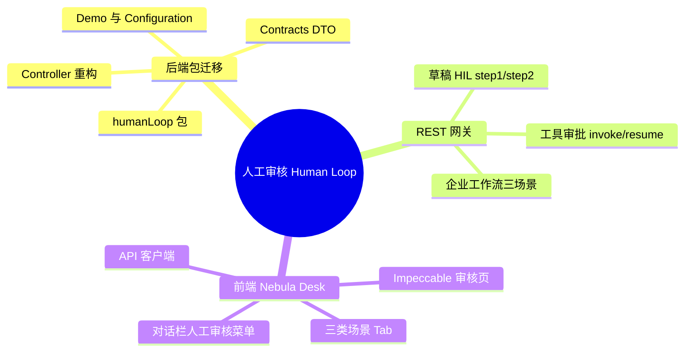

## Why
（为什么要做）

### 背景与目标
- **背景**：Graph / Agent 人工审核（Human-in-the-loop，HIL）能力当前散落在 `springai` 教程包（Controller 在 `projectPractice.humanloop`，编排与 DTO 在 `springai.graph`），缺少独立领域边界，前端 Nebula Desk 无对应操作入口，运维/产品无法通过 UI 触发草稿审核、工具审批与企业级工作流演示。
- **目标**：将 HIL 相关后端类收敛至 `com.yxy.deepseek.humanLoop` 包并重构 Controller 分层；在 Nebula Desk 侧边栏「对话」分组下新增「人工审核」菜单，用 Impeccable 设计并实现覆盖现有 REST 接口的操作页面，使三类 HIL 场景可在工作台内完成 invoke / 决策 / resume。

Human Loop 是从演示代码走向可复用能力模块的第一步：后端包结构清晰化，前端提供统一人工审核工作台。

## Jira / 需求链接

- 无工单

## What Changes
（变更内容）

### 需求概览（全局）

- **后端重构**：将 `AlibabaGraphHumanLoopController` 及 HIL 关联类（Demo 编排、Graph Configuration、Contracts、危险工具定义等）迁移至 `com.yxy.deepseek.humanLoop` 包，按接口层 / 应用编排 / 配置 / 契约分层；更新存量引用（如 `SpringAiDemoController`、`AlibabaGraphTutorialController` 等 `@see` 与 import）。
- **REST 行为保持**：首期保持现有路径前缀 `/springai/demo/alibaba-graph/human-loop` 与请求/响应语义不变（**非 BREAKING**），仅调整代码归属与内部分层；是否在 design 阶段增加 `/api/agent-hub/human-loop` 别名由 design 评估。
- **前端菜单**：在 `ai_react` 侧边栏「对话」分组（与知识库对话、智能体对话、需求开发对话并列）新增「人工审核」入口。
- **前端页面（Impeccable U1）**：单页多 Tab 覆盖三类场景：
  1. **Graph 草稿审核**：输入 threadId / prompt → step1 展示草稿与 checkpoint → 人工编辑后 step2 恢复；
  2. **工具审批**：invoke 展示待审批工具列表 → 支持 APPROVED / EDITED / REJECTED 及快捷 approve/reject/edit；
  3. **企业工作流**：合同审核、电商客服（同步 GET）、自媒体发布 step1/step2（含 humanApproved / humanComment）。
- **国际化**：中英文菜单与页面文案对齐现有 `messages.js` 模式。
- **文档**：迁移后更新 ai 仓库内 HIL 知识点总结文档路径引用（若保留）。

## Capabilities
（能力范围）

### New Capabilities（新增能力）
- `aether-agent/human-loop`：Graph / Agent 人工审核模块（后端包迁移、REST 网关、Nebula Desk 审核工作台 UI）

### Modified Capabilities（变更能力）
- （无独立 MODIFIED capability；存量 springai 教程 Controller 的 `@see` 与路由说明随迁移更新，行为不变）

## Impact
（影响分析）

> proposal.md 不做技术分析，仅简述影响。完整 Impact 清单在 design.md 中展开。

- **后端（ai）**：新增 `com.yxy.deepseek.humanLoop` 包；自 `springai.controller.projectPractice.humanloop` 与 `springai.graph` 迁入约 10+ 类；Spring Bean 扫描与 Configuration 包路径变更；L1 编排（Demo invoke/stream/resume）可能触发 AI-TDD（`aiTddMode: auto`）。
- **前端（ai_react）**：`HomePage` 侧边栏、`chatMode.js` 常量、路由/视图切换、新页面组件与 API 模块；`uiCraftMode: enabled`，U1 须 Impeccable shape → craft。
- **契约**：首期 REST JSON 结构不变；integration-contracts 增量登记 HIL 端点供前端联调。
- **范围外**：不改造 Agent Hub 生产对话链路嵌入 HIL；不新增数据库存储；企业工作流仍为演示级 CompiledGraph，不做生产 SLA 承诺。
