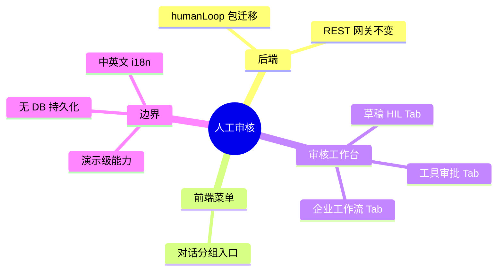

# 人工审核 Human Loop

## Agent Hub / 人工审核 需求说明（前提/操作/结果）
> 将 Graph / Agent 人工审核（Human-in-the-loop）能力从教程演示代码收敛为独立模块，并在 Nebula Desk 提供统一操作工作台。
> 覆盖三类场景：Graph 草稿中断审核、危险工具审批、企业级工作流演示（合同审核、电商客服、自媒体发布）。
> 首期 REST 契约与现有演示接口语义保持一致，不改造生产 Agent Hub 主对话链路。

---

## ADDED Requirements
（新增用户故事）

### 功能组 1：后端模块收敛

### Requirement: 1. HIL 相关代码迁移至 humanLoop 独立包

系统应当（SHALL）将人工审核 REST 网关及其关联编排、配置、契约类从 `springai` 教程包迁移至 `com.yxy.deepseek.humanLoop` 包，并按接口层、应用编排、配置、契约分层组织；迁移后 Spring 容器能正常装配 Graph / Agent Bean，存量教程 Controller 的文档引用指向新包路径。

#### 场景: 包迁移完成且应用可启动
- **前提**：迁移前 HIL 演示接口在 `springai` 包下可正常调用。
- **操作**：开发完成类迁移并启动 ai 应用。
- **结果**：应用启动无 Bean 缺失或循环依赖错误；HIL 相关 Configuration 仍注册 CompiledGraph / ReactAgent Bean。

#### 场景: 存量引用更新
- **前提**：其他教程 Controller 或文档通过 `@see` / import 引用旧路径。
- **操作**：执行迁移并编译。
- **结果**：编译通过；引用指向 `humanLoop` 新路径；无残留指向已删除旧类的 import。

---

### 功能组 2：REST 契约兼容

### Requirement: 2. 首期保持现有 HIL REST 路径与语义

系统应当（SHALL）在首期重构中保持前缀 `/springai/demo/alibaba-graph/human-loop` 下全部端点的 HTTP 方法、路径、请求体与响应 JSON 字段语义不变；调用方（含新前端页面）无需修改 URL 即可联调。

#### 场景: 草稿 HIL 二段式调用
- **前提**：用户提供有效 `threadId` 与非空 `prompt`。
- **操作**：调用 `GET .../step1`，再 `POST .../step2` 提交人工编辑（或空字符串表示采纳草稿）。
- **结果**：step1 返回草稿、checkpoint 与下一步提示；step2 返回最终答复；行为与迁移前一致。

#### 场景: 工具审批 invoke 与 resume
- **前提**：用户提供有效 `threadId` 与触发危险工具的 `question`。
- **操作**：调用 `GET .../tool-feedback/invoke`；若返回待审批列表，再 `POST .../tool-feedback/resume`（或 approve/reject/edit 快捷接口）。
- **结果**：中断时返回待审批工具摘要；resume 后返回助手最终回复与工具执行日志；决策类型 APPROVED / EDITED / REJECTED 均可用。

#### 场景: 企业工作流三场景
- **前提**：用户分别触发合同审核、电商客服、自媒体发布。
- **操作**：调用 `GET .../enterprise/contract-review`、`GET .../enterprise/ecommerce-cs`、`GET .../enterprise/publishing/step1` 及对应 step2。
- **结果**：各场景返回与迁移前一致的 JSON 结构；自媒体发布在命中敏感词时 step1 中断、step2 可人工放行或驳回。

#### 场景: 参数校验与错误码
- **前提**：调用方缺少必填参数（如空 `threadId`）或未先 invoke 即 resume。
- **操作**：发起对应请求。
- **结果**：返回 HTTP 400（参数错误）或 409（状态冲突）及可读错误信息；不返回 200 伪装成功。

---

### 功能组 3：侧边栏入口

### Requirement: 3. 对话分组下新增人工审核菜单

系统应当（SHALL）在 Nebula Desk 侧边栏「对话」分组内，与知识库对话、智能体对话、需求开发对话并列，新增「人工审核」菜单项；点击后切换至人工审核工作台视图，不影响其他对话模式的会话状态。

#### 场景: 菜单可见与切换
- **前提**：用户已打开 Nebula Desk 主界面。
- **操作**：用户展开或查看「对话」分组，点击「人工审核」。
- **结果**：当前视图切换为人工审核工作台；菜单项呈现选中态；主内容区不再显示聊天输入框（或显示工作台专属布局）。

#### 场景: 中英文文案
- **前提**：用户切换界面语言为中文或英文。
- **操作**：查看侧边栏「对话」分组。
- **结果**：菜单项分别展示「人工审核」与等价英文文案（如 Human Review）；与 `messages.js` 现有 i18n 模式一致。

---

### 功能组 4：审核工作台页面结构

### Requirement: 4. 单页三 Tab 审核工作台（Impeccable U1）

系统应当（SHALL）提供人工审核工作台页面，采用单页多 Tab 布局覆盖三类场景（Graph 草稿审核、工具审批、企业工作流）；页面须按 Impeccable U1 标准完成 shape → craft，视觉与交互与 Nebula Desk 现有侧边栏、表单、按钮风格协调，并满足基本可访问性（焦点可见、对比度、响应式窄屏可用）。

#### 场景: Tab 切换
- **前提**：用户已进入人工审核工作台。
- **操作**：用户在三个 Tab 间切换。
- **结果**：各 Tab 保留已填写的 threadId 等会话级输入（同页状态）；切换不触发整页刷新；当前 Tab 标题与内容区一致。

#### 场景: 加载与空态
- **前提**：用户刚进入某 Tab，尚未发起请求。
- **操作**：用户查看页面初始状态。
- **结果**：展示该场景的操作说明与空态引导；无报错占位；主要操作按钮可用。

#### 场景: 请求进行中反馈
- **前提**：用户已点击触发后端调用的按钮。
- **操作**：等待接口响应（Graph / LLM 可能较慢）。
- **结果**：按钮或区域展示 loading 态；禁止重复提交；完成后展示结果或错误。

---

### 功能组 5：Graph 草稿审核 Tab

### Requirement: 5. 草稿 HIL 可在 UI 完成 step1 与 step2

系统应当（SHALL）在「Graph 草稿审核」Tab 提供 threadId、prompt 输入，一键触发 step1；展示模型草稿、checkpointId 与状态；提供人工编辑区与「提交并恢复」操作完成 step2，并展示最终答复。

#### 场景: 生成草稿并中断
- **前提**：用户填写有效 threadId 与 prompt。
- **操作**：用户点击生成草稿（step1）。
- **结果**：界面展示 modelReply 草稿文本、checkpointId、status 与 nextStepHint；step2 表单自动带入 threadId 与 checkpointId。

#### 场景: 采纳草稿恢复
- **前提**：step1 已成功返回草稿。
- **操作**：用户不修改人工编辑区（或留空），提交 step2。
- **结果**：调用 step2 接口；展示 finalReply 最终答复。

#### 场景: 人工改写后恢复
- **前提**：step1 已成功返回草稿。
- **操作**：用户在编辑区修改正文后提交 step2。
- **结果**：系统将 humanEditedReply 传给后端；展示改写后的 finalReply。

---

### 功能组 6：工具审批 Tab

### Requirement: 6. 危险工具审批可在 UI 完成 invoke 与决策

系统应当（SHALL）在「工具审批」Tab 提供 threadId、question 输入并触发 invoke；当返回待审批工具列表时，逐条展示工具名、参数与审批说明；用户可选择批准、改参后执行或拒绝，并展示 resume 后的助手回复与工具日志。

#### 场景: 触发工具中断
- **前提**：用户填写 threadId 与会触发 sendEmailTool 等危险工具的 question。
- **操作**：用户点击 invoke。
- **结果**：若 Agent 中断，界面列出 pendingApprovals（工具名、arguments、approvalPrompt）；展示 assistantPreview（若有）。

#### 场景: 批准全部待审批工具
- **前提**：invoke 返回待审批列表且 status 为中断态。
- **操作**：用户点击「批准」。
- **结果**：调用 resume（APPROVED 或 approve 快捷接口）；展示 assistantReply 与 toolExecutionLogs。

#### 场景: 改参后执行
- **前提**：存在待审批工具。
- **操作**：用户编辑工具参数 JSON 并选择改参执行。
- **结果**：以 EDITED 决策调用 resume；展示执行结果。

#### 场景: 拒绝并说明原因
- **前提**：存在待审批工具。
- **操作**：用户填写拒绝原因并提交拒绝。
- **结果**：以 REJECTED 决策调用 resume；助手回复反映拒绝上下文；不执行原危险操作。

#### 场景: 无工具中断直接完成
- **前提**：question 未触发危险工具。
- **操作**：用户 invoke。
- **结果**：界面展示 COMPLETED 类 status 与 assistantPreview；不展示审批按钮组。

---

### 功能组 7：企业工作流 Tab

### Requirement: 7. 企业级三场景可在 UI 触发与查看结果

系统应当（SHALL）在「企业工作流」Tab 分块提供合同审核、电商客服、自媒体发布三个子区域；用户可输入各场景所需参数并触发对应接口，结构化展示返回字段（风险等级、客服回复、发布日志等）；自媒体发布支持 step1/step2 人工放行流程。

#### 场景: 合同审核
- **前提**：用户输入或粘贴合同文本。
- **操作**：用户触发合同审核。
- **结果**：展示 riskLevel、riskDetails、auditReport（若有）、status 与耗时；无风险时展示短路说明。

#### 场景: 电商客服
- **前提**：用户输入用户咨询内容。
- **操作**：用户触发电商客服。
- **结果**：展示 intent、双库命中摘要与 finalReply。

#### 场景: 自媒体发布需人工审核
- **前提**：用户输入 threadId 与含敏感词倾向的热词。
- **操作**：用户触发 publishing step1。
- **结果**：展示 articleDraft、suspectedWords 与 INTERRUPTED 状态；提供 humanApproved、humanComment 输入与 step2 提交；step2 后展示 publishStatus 与 publishLog。

#### 场景: 自媒体发布无需人工审核
- **前提**：热词不触发敏感词合规。
- **操作**：用户触发 publishing step1。
- **结果**：直接展示 COMPLETED 类 status 与 publishLog；不强制 step2。

---

### 功能组 8：错误处理与范围边界

### Requirement: 8. 前端错误可感知且能力边界明确

系统应当（SHALL）在人工审核工作台对后端 4xx/5xx 与网络失败展示用户可理解的错误提示，不静默失败；并在帮助文案中说明本页为 HIL 演示工作台，不替代生产 Agent Hub 对话中的自动审核策略。

#### 场景: 后端 400 参数错误
- **前提**：用户未填 threadId 即提交 step1 或 step2。
- **操作**：用户点击提交。
- **结果**：界面展示校验错误或后端返回的错误信息；不展示虚假成功结果。

#### 场景: 后端 409 状态冲突
- **前提**：用户未 invoke 即对工具审批 Tab 点击 resume。
- **操作**：用户提交 resume。
- **结果**：界面展示「请先 invoke」或后端 conflict 消息；引导用户回到正确步骤。

#### 场景: 网络或服务不可用
- **前提**：后端不可达或返回 500。
- **操作**：用户触发任意 HIL 请求。
- **结果**：界面展示失败提示与重试建议；loading 态结束。

#### 场景: 能力边界说明
- **前提**：用户首次进入人工审核工作台。
- **操作**：用户查看页面说明区域。
- **结果**：文案明确：本功能对接演示级 Graph HIL API；配置与审核记录不落库；生产对话链路变更不在本期范围。
