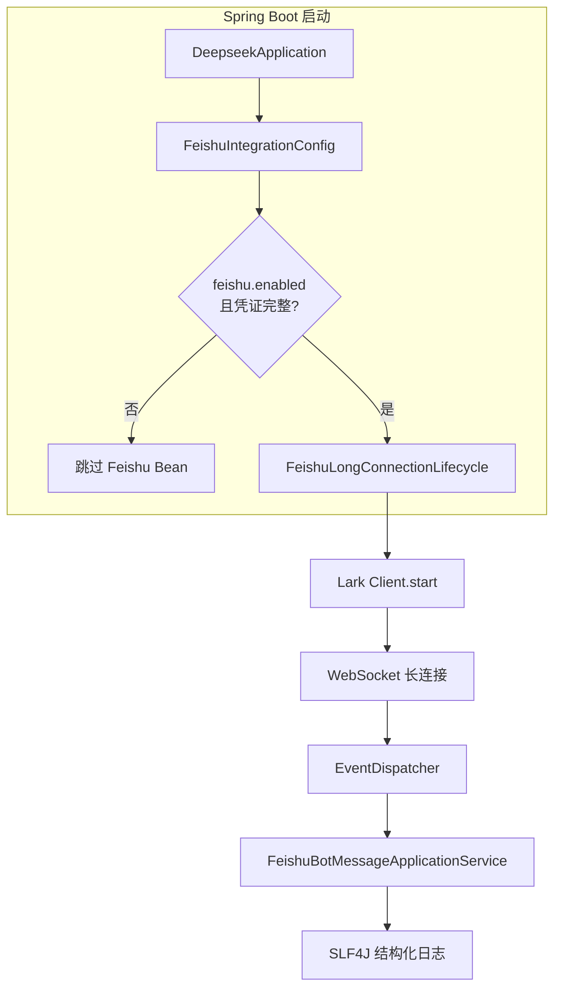
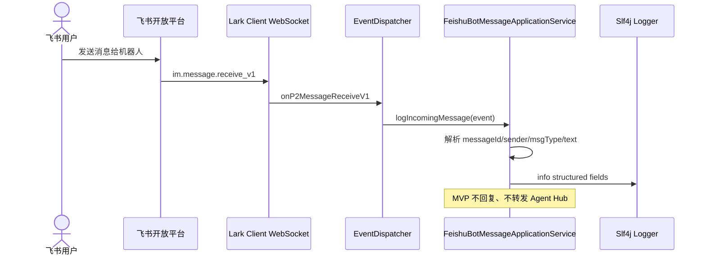
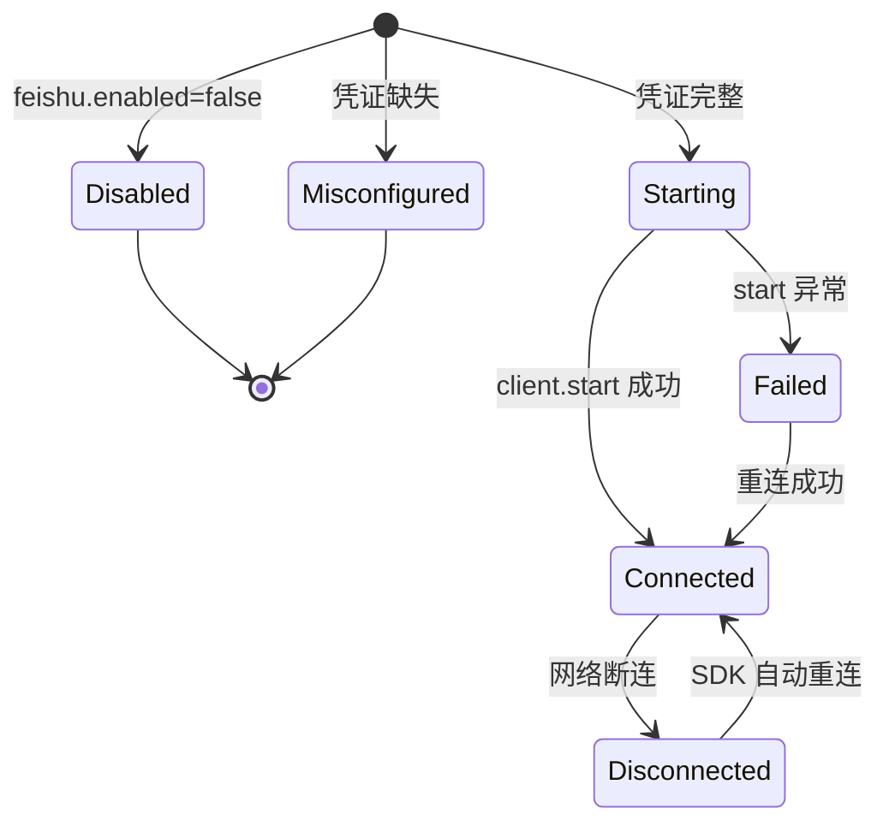

# 技术方案（简版）

> 结合 `ai` 仓库现有 Spring Boot 3.4 结构与配置惯例；飞书长连接由官方 `oapi-sdk` 封装，MVP 仅日志，不接入 Agent Hub。

## 一. 需求摘要
- **需求描述**：集成飞书 Java SDK，以长连接（WebSocket）接收机器人 `im.message.receive_v1` 事件，收到消息后输出结构化日志。
- **JIRA/需求来源**：无工单
- **关键约束**：
  1. App ID / App Secret **仅环境变量或本地配置**，禁止入库
  2. 飞书连接失败**不得拖垮** Spring Boot 主进程
  3. MVP 不做自动回复、Agent 路由、持久化、前端变更

## 二. 影响范围和核心场景

### 2.1 本期影响范围（必填）
| 维度 | 影响点 |
|---|---|
| 前端 | 无 |
| 后端服务 | 新增 `com.yxy.deepseek.feishu` 包：配置、长连接生命周期、消息日志应用服务；`pom.xml` 增加 `oapi-sdk` |
| 异步任务 | 无 |
| 数据库 | 无 |
| 配置权限 | 新增 `feishu.enabled` / `feishu.app-id` / `feishu.app-secret`（环境变量占位）；无新增 HTTP 权限点 |

### 2.2 核心场景（必填）

**UC-01 启动建立长连接（正常）**
- 前置：`feishu.enabled=true`；凭证完整；飞书后台已订阅 `im.message.receive_v1` 且选择「长连接」；本机可访问公网
- 验收：日志出现 `feishu long connection started`（或等价）；向机器人发消息后 3 秒内出现结构化消息日志

**UC-02 单聊文本消息日志（正常）**
- 前置：UC-01 已连接
- 操作：用户私聊机器人发送「你好」
- 验收：日志含 `eventType`、`messageId`、`senderId`、`msgType=text`、文本内容；无自动回复

**UC-03 群聊 @ 消息日志（正常）**
- 前置：机器人在群内且 UC-01 已连接
- 操作：群成员 @ 机器人发消息
- 验收：结构化日志含发送者与消息摘要；连接不中断

**UC-04 非文本消息（边界）**
- 前置：UC-01 已连接
- 操作：发送图片/文件
- 验收：日志标注非文本 `msgType`；不抛未捕获异常；长连接保持

**UC-05 凭证缺失（异常）**
- 前置：`feishu.enabled=true` 但 `app-id` 或 `app-secret` 为空
- 操作：应用启动
- 验收：WARN 级配置缺失日志；不创建 SDK Client；HTTP/SSE 等业务正常

**UC-06 集成关闭（边界）**
- 前置：`feishu.enabled=false`
- 操作：应用启动
- 验收：无飞书相关 Bean 初始化；无 ERROR 日志

**UC-07 启动连飞书失败（异常）**
- 前置：凭证完整但网络/飞书不可用
- 操作：应用启动
- 验收：ERROR 含失败摘要；主应用仍 Running；SDK 内置重连继续尝试（见 7.9）

**UC-08 日志不泄露 Secret（安全）**
- 前置：任意飞书运行态
- 验收：全量飞书相关日志 grep `app-secret` 无命中；Secret 不出现在异常栈

## 三. 方案总览

### 3.1 整体思路（必填）
1. **独立 feishu 包**：在 `com.yxy.deepseek.feishu` 新增限界上下文（路径 `ai/src/main/java/com/yxy/deepseek/feishu`），与 `agents` / `knowledgehub` 解耦，后续可接 Agent Hub 而不污染现有 Controller。
2. **SDK 长连接为主路径**：使用官方 `com.larksuite.oapi:oapi-sdk` 的 `Client` + `EventDispatcher`，不实现 Webhook Controller。
3. **条件装配 + 失败隔离**：`feishu.enabled` 与凭证校验通过才启动 Client；`client.start()` 包在 try/catch，异常仅记日志。

### 3.2 关键实现点（必填）
1. `FeishuProperties`（`@ConfigurationProperties(prefix = "feishu")`）+ `FeishuIntegrationConfig`（对齐 `AgentHubCliConfig` / `CliInvokeProperties` 模式）
2. `FeishuLongConnectionLifecycle`：`ApplicationRunner` 启动 `Client.start()`，`@PreDestroy` 调用 `Client.stop()`（若 SDK 提供）
3. `EventDispatcher.newBuilder("", "").onP2MessageReceiveV1(...)` 注册 handler，委托 `FeishuBotMessageApplicationService.logIncomingMessage(P2MessageReceiveV1)`
4. 结构化日志字段：`eventType=im.message.receive_v1`、`messageId`、`senderId`、`chatId`、`msgType`、`textPreview`（文本截断至 500 字符）

### 3.3 与现有代码关系（必填）
- **复用**：`DeepseekApplication` 组件扫描（根包 `com.yxy.deepseek` 已覆盖子包）；`ApplicationRunner` 启动模式（参考 `AgentPluginLoader`）；`@ConfigurationProperties` 惯例（参考 `CliInvokeProperties`）
- **新增**：`feishu/**` 全套（`com.yxy.deepseek.feishu`）；`pom.xml` 依赖；`application-knowledge.yml`（或独立 `application-feishu.yml`）配置段
- **变更**：无现有类行为变更；无 `integration-contracts.md` REST 变更

## 四. 方案梳理

### 4.1 组件级流程图



### 4.2 时序图（消息接收）



### 4.3 长连接状态（SDK 托管 + 可观测）



## 五. 代码改造分析【强制】

### 5.1 入口链路（启动与长连接）
- **现状实现**：`DeepseekApplication` 仅 `SpringApplication.run`；启动期扩展点由 `@Component` + `ApplicationRunner` 承担（如 `AgentPluginLoader`）。
- **现状代码（最小片段）**：

```java
// DeepseekApplication.java — 无第三方 IM 集成
@SpringBootApplication
public class DeepseekApplication {
    public static void main(String[] args) {
        SpringApplication.run(DeepseekApplication.class, args);
    }
}
```

- **改造代码（目标形态）**：

```java
// FeishuLongConnectionLifecycle.java — 新增
@Component
@ConditionalOnProperty(prefix = "feishu", name = "enabled", havingValue = "true")
@RequiredArgsConstructor
public class FeishuLongConnectionLifecycle implements ApplicationRunner, DisposableBean {

    private final FeishuProperties properties;
    private final FeishuBotMessageApplicationService messageService;
    private Client larkClient;

    @Override
    public void run(ApplicationArguments args) {
        if (!properties.isCredentialsPresent()) {
            log.warn("feishu integration enabled but credentials missing, skip long connection");
            return;
        }
        EventDispatcher handler = EventDispatcher.newBuilder("", "")
            .onP2MessageReceiveV1(event -> messageService.logIncomingMessage(event))
            .build();
        try {
            larkClient = new Client.Builder(properties.getAppId(), properties.getAppSecret())
                .eventHandler(handler)
                .build();
            larkClient.start();
            log.info("feishu long connection started appId={}", properties.getAppId());
        } catch (Exception ex) {
            log.error("feishu long connection start failed appId={}", properties.getAppId(), ex);
        }
    }

    @Override
    public void destroy() {
        if (larkClient != null) {
            larkClient.stop(); // 以 SDK 实际 API 为准
        }
    }
}
```

### 5.2 核心校验（配置与凭证）
- **现状实现**：各模块通过 `@ConfigurationProperties` 读取 YAML，无飞书段。
- **现状代码（最小片段）**：

```java
// CliInvokeProperties.java — 配置惯例参考
@ConfigurationProperties(prefix = "agenthub.cli")
public class CliInvokeProperties {
    private String codexExecutable = "";
    // ...
}
```

- **改造代码（目标形态）**：

```java
// FeishuProperties.java — 新增
@ConfigurationProperties(prefix = "feishu")
public class FeishuProperties {
    private boolean enabled = false;
    private String appId = "";
    private String appSecret = "";

    public boolean isCredentialsPresent() {
        return appId != null && !appId.isBlank()
            && appSecret != null && !appSecret.isBlank();
    }
}

// application-knowledge.yml 追加（占位，不含真实 Secret）
// feishu:
//   enabled: ${FEISHU_ENABLED:false}
//   app-id: ${FEISHU_APP_ID:}
//   app-secret: ${FEISHU_APP_SECRET:}
```

### 5.3 数据落点/后置处理（消息日志，无持久化）
- **现状实现**：无飞书消息入站处理；`harness` 测试模板曾提及 `FeishuMessageService` 为 Mock 示例，**生产代码中尚不存在**。
- **现状代码（最小片段）**：

```java
// 无对应生产类 — MVP 全新增
```

- **改造代码（目标形态）**：

```java
// FeishuBotMessageApplicationService.java — 新增（应用层仅编排日志）
@Service
@RequiredArgsConstructor
@Slf4j
public class FeishuBotMessageApplicationService {

    public void logIncomingMessage(P2MessageReceiveV1 event) {
        var msg = event.getEvent().getMessage();
        String msgType = msg.getMessageType();
        String textPreview = extractTextPreview(msg);
        log.info(
            "feishu message received eventType=im.message.receive_v1 messageId={} senderId={} chatId={} msgType={} textPreview={}",
            msg.getMessageId(),
            event.getEvent().getSender().getSenderId().getOpenId(),
            msg.getChatId(),
            msgType,
            textPreview
        );
    }

    private String extractTextPreview(Message message) {
        if (!"text".equals(message.getMessageType())) {
            return "";
        }
        // 解析 content JSON 中 text 字段，截断 500 字符
        return "...";
    }
}
```

**Maven 依赖（`pom.xml` 新增）**：

```xml
<dependency>
    <groupId>com.larksuite.oapi</groupId>
    <artifactId>oapi-sdk</artifactId>
    <version>2.4.24</version><!-- 实施时取 Maven Central 最新稳定版 -->
</dependency>
```

## 六. 接口与交互契约【按需填写】

### 6.1 前后端交互契约
- 无（本阶段无 REST/SSE 变更）

### 6.2 外部系统交互（涉及则必填）
| 系统 | 交互方向 | 协议/接口 | 关键字段 | 失败处理 |
|---|---|---|---|---|
| 飞书开放平台 | 入站 | WebSocket 长连接 + `im.message.receive_v1` | `message_id`、`sender_id`、`message_type`、`content` | 启动失败记 ERROR 不阻断应用；SDK 断线自动重连；handler 内 catch 防单条消息拖垮连接 |

**飞书后台配置（MANUAL 联调前置）**：
1. 开发者后台 → 事件订阅 → 添加 `im.message.receive_v1`
2. **先本地启动**带长连接的 Spring Boot 进程
3. 订阅方式选择「使用长连接接收事件」并保存
4. 机器人需启用且具备接收消息权限

### 6.3 错误码
- 无新增 HTTP 错误码

## 七. 非功能性需求设计

### 7.1 边界与异常分支（汇总）
| 场景 | 处理策略 | 结果 |
|---|---|---|
| enabled=false | `@ConditionalOnProperty` 不装配 | 零开销 |
| 凭证缺失 | `isCredentialsPresent()` 短路 | WARN + 不连 |
| start 异常 | try/catch | 应用 Running |
| 单条 handler 异常 | handler 内 catch + ERROR | 连接保持 |
| 非 text 消息 | 只记 msgType | 不解析 content |

### 7.2 权限影响
- 无新增 HTTP 权限；飞书侧需应用「接收消息」能力与事件订阅

### 7.3 数据清洗、迁移
- 无

### 7.4 缓存设计
- 无

### 7.5 安全评估
- [x] Secret 仅配置注入，日志/异常不打印
- [x] 消息日志可配置截断，避免超大 payload 刷屏
- [ ] 无用户越权 HTTP 面（无新接口）

### 7.6 限流降级
- [ ] 无限流（MVP 仅日志）
- [x] 降级：`feishu.enabled=false` 一键关闭
- 飞书要求：**事件 handler 3 秒内返回**；日志逻辑须轻量，后续 Agent 接入需异步化

### 7.7 日志审计（涉及则必填）
| 日志类型 | 触发点 | 关键字段 | 用途 |
|---|---|---|---|
| 连接生命周期 | start/stop/失败 | `appId`、状态 | 排障 |
| 消息接收 | onP2MessageReceiveV1 | `messageId`、`senderId`、`msgType`、`textPreview` | MVP 验收 / 后续审计 |

### 7.8 可观测性清单（必填）
| 观测点 | 验证口径 | 关联场景 |
|---|---|---|
| 应用日志 | grep `feishu long connection started` | UC-01 |
| 消息日志 | grep `feishu message received` + 字段完整 | UC-02/03/04 |
| 配置缺失 | grep `credentials missing` | UC-05 |
| 启动失败 | grep `start failed` 且进程仍 Running | UC-07 |
| 数据库 | 无 | — |
| 外部反馈 | 飞书发消息 3s 内本地有日志 | UC-01 |

### 7.9 并发与性能验收口径（必填）
#### 7.9.1 并发与幂等
- 飞书长连接**集群模式**推送，多实例各自一条连接（注意单应用连接数上限 50）
- MVP 无写库，**幂等 N/A**；重复日志可接受，后续持久化需 `messageId` 去重

#### 7.9.2 性能与容量
- 假设单机器人 QPS < 10；handler 仅日志，P99 < 50ms
- 文本 preview 上限 500 字符
- 重连：依赖 SDK 内置策略；应用层仅补充断连/重连日志（若 SDK 暴露回调则挂钩）

## 八. 配置影响矩阵（推荐）
| 配置项 | 常规流程 | 本方案 |
|---|---|---|
| `feishu.enabled` | 不存在 | `false` 默认，不启飞书 |
| `feishu.app-id` | 不存在 | 环境变量 `FEISHU_APP_ID` |
| `feishu.app-secret` | 不存在 | 环境变量 `FEISHU_APP_SECRET`，不入库 |
| Agent Hub HTTP | 不变 | 不变 |

## 九. 包结构（新增）

```text
ai/src/main/java/com/yxy/deepseek/feishu/
├── config/
│   ├── FeishuProperties.java
│   └── FeishuIntegrationConfig.java
├── application/
│   └── FeishuBotMessageApplicationService.java
└── infrastructure/
    └── FeishuLongConnectionLifecycle.java

ai/src/test/java/com/yxy/deepseek/feishu/
├── FeishuPropertiesTest.java          # AUTO-UT：凭证判定
└── FeishuBotMessageApplicationServiceTest.java  # AUTO-UT：日志字段解析
```
