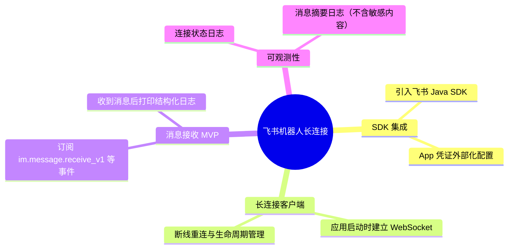

## Why
（为什么要做）

### 背景与目标
- **背景**：AetherStack 当前仅通过 Nebula Desk（Web UI）接收用户对话，缺少与企业 IM（飞书）的集成通道。飞书机器人支持**长连接（WebSocket）**模式接收事件，无需公网回调 URL，适合本地开发与内网部署场景。
- **目标**：在后端（`ai` 仓库）集成飞书官方 SDK，以长连接模式订阅机器人消息事件；**MVP 阶段收到消息后打印结构化日志**，为后续对接 Agent Hub 编排预留接入点。

<!-- 1-2 句话说明问题/机会。为什么现在要做？ -->
打通飞书 IM 入站通道，使 Agent Hub 可扩展为「飞书机器人」触达方式；本阶段仅验证连通性与消息接收，不做自动回复与业务编排。

## Jira / 需求链接

<!-- 在开始提案前提供 Jira/需求链接 -->
- 无工单

## What Changes
（变更内容）

### 需求概览（全局）

<!-- 用要点列出新增/修改/删除的内容，破坏性变更标记 **BREAKING** -->
- 新增飞书 SDK 依赖（`com.larksuite.oapi:oapi-sdk` 或官方推荐版本）
- 新增飞书 App 凭证配置项（`app-id`、`app-secret`），**从环境变量或本地配置文件读取，禁止硬编码或提交仓库**
- 应用启动时初始化飞书长连接客户端，订阅机器人消息事件
- 收到消息后输出结构化日志（事件类型、消息 ID、发送者、消息类型、文本摘要等）
- **本阶段不包含**：消息自动回复、Agent Hub 路由、持久化、前端 UI
- **本阶段不包含**：Webhook 回调模式（仅长连接）

## Capabilities
（能力范围）

### New Capabilities（新增能力）
<!-- 遵循 DDD 目录： [系统]-[领域]/[子域]/[功能] -->
- `aether-integration/feishu-bot-message`：飞书机器人长连接消息接收与日志记录（MVP）

### Modified Capabilities（变更能力）
<!-- 仅当需求层面发生变化才填写 -->
- （无）

## Impact
（影响分析）

> proposal.md 不做技术分析，仅简述影响。完整 Impact 清单在 design-lite.md 中展开（详见 openspec/references/qwms-rules.md）。

<!-- 简述影响范围（1-3 句即可） -->
- **后端（ai）**：在 `com.yxy.deepseek.feishu` 包新增配置类、长连接生命周期 Bean；应用启动流程增加飞书客户端初始化
- **配置**：`application.yml` / 环境变量新增 `feishu.app-id`、`feishu.app-secret`（及可选开关 `feishu.enabled`）；凭证不入库、不进 Git
- **前端（ai_react）**：无变更
- **API 契约**：无新增 REST/SSE 接口（本阶段纯入站监听）
- **运维**：需保证应用进程持续运行以维持长连接；日志量随消息频率增长
