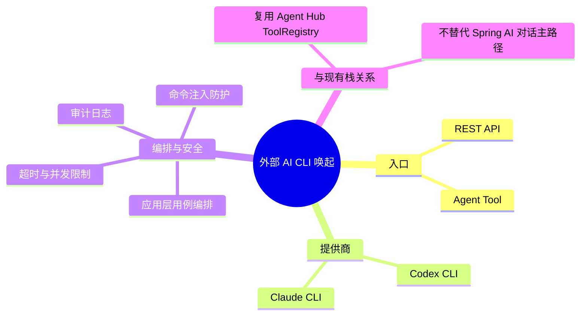

## Why
（为什么要做）

### 背景与目标
- **背景**：当前 Agent Hub 主要通过 Spring AI（ChatClient / Orchestrator / 内置 `@Tool`）完成对话与工具调用，无法在受控环境下唤起本机已安装的 **Codex CLI** 或 **Claude CLI**，以利用 CLI 独有能力（本地工程上下文、厂商 CLI 工作流等）。
- **目标**：在后端 `ai` 仓库新增统一「外部 AI CLI 唤起」能力，支持在运维可控前提下选择 **codex** 或 **claude** 提供商执行一次性命令，并通过 **REST API** 与 **Agent Tool** 两种入口对外暴露，供人工/自动化集成及智能体编排调用。

## Jira / 需求链接

- 无工单

## What Changes
（变更内容）

### 需求概览（全局）

- 新增 **REST API**：提交 CLI 调用请求（提供商、提示/参数、可选工作目录与超时），返回结构化结果（退出码、stdout/stderr 摘要或全文、耗时）。
- 新增 **Agent Tool**：在智能体对话链路中，由 LLM 按需调用「唤起 Codex/Claude CLI」工具（注册至现有 `ToolRegistry` / Orchestrator 工具计划）。
- 支持 **双提供商**：`codex`、`claude`（可配置可执行路径与环境变量，禁止调用方任意拼接 shell）。
- **同步执行为主**：首期以阻塞式进程执行 + HTTP 同步响应为主；流式 stdout 可作为 design-lite 中的演进项，不在 proposal 范围承诺。
- **部署前提**：运行环境需预装对应 CLI 且具备合法认证配置；未安装或不可执行时返回明确业务错误。
- **非目标（本期）**：前端 Nebula Desk 新界面（`uiCraftMode: disabled`）；将 CLI 输出接入 SSE 流式对话；替代现有 DashScope/ChatClient 主路径。

## Capabilities
（能力范围）

### New Capabilities（新增能力）
- `aether-agent/cli-invoke`：受控唤起 Codex 或 Claude CLI（REST + Agent Tool，提供商路由、超时、审计）

### Modified Capabilities（变更能力）
- （无独立 MODIFIED capability；Orchestrator 工具列表扩展在 design-lite 中说明，不改变既有对话契约语义）

## Impact
（影响分析）

> proposal.md 不做技术分析，仅简述影响。完整 Impact 清单在 design-lite.md 中展开。

- **后端（ai / Agent Hub）**：新增 CLI 唤起应用服务、领域/基础设施防腐层（进程执行）、REST Controller、Agent Tool Bean 并注册至 `ToolRegistry`。
- **配置与运维**：需配置 CLI 可执行文件路径、默认超时、并发上限；部署镜像/主机须安装 `codex` / `claude` CLI 及凭据。
- **安全**：需限制可传入参数、工作目录沙箱、禁止任意 shell；调用审计（谁、何时、何种提供商、退出码）。
- **前端（ai_react）**：本期无 UI 变更；后续可由其他需求调用 REST。
- **测试**：常规 `AUTO-UT`（进程层 Mock）；`aiTddMode: disabled`，不强制 AI-TDD。
