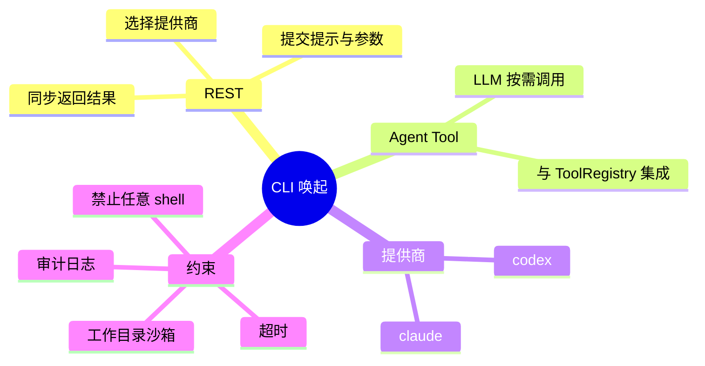

# 外部 AI CLI 唤起（Codex / Claude）

## Agent Hub / CLI 唤起 需求说明（前提/操作/结果）
> 后端在受控条件下唤起本机 Codex CLI 或 Claude CLI，供运维集成与智能体工具调用。
> 双入口：REST API（同步）与 Agent Tool（纳入现有 Orchestrator 工具计划）。
> 不替代 Spring AI 对话主路径；本期无前端 UI。

---

## ADDED Requirements
（新增用户故事）

### 功能组 1：REST API 入口

### Requirement: 1. 通过 REST API 同步唤起外部 AI CLI

系统应当（SHALL）提供 REST API，允许调用方指定 **codex** 或 **claude** 提供商、输入提示或等价业务参数，并在配置的超时时间内同步执行对应 CLI，返回包含退出码、标准输出与标准错误（或经策略截断的摘要）及执行耗时的结构化响应。

#### 场景: REST 成功唤起 Codex
- **前提**：运行环境已安装并配置 Codex CLI；请求参数合法且在超时内完成。
- **操作**：调用方通过 REST 提交 `provider=codex` 及有效提示内容。
- **结果**：HTTP 成功；响应体包含 `exitCode=0`（或 CLI 实际退出码）、stdout 内容及耗时；写入审计记录。

#### 场景: REST 成功唤起 Claude
- **前提**：运行环境已安装并配置 Claude CLI；请求参数合法。
- **操作**：调用方通过 REST 提交 `provider=claude` 及有效提示内容。
- **结果**：与 Codex 场景等价，使用 Claude CLI 可执行文件与默认环境。

#### 场景: REST 请求超时
- **前提**：CLI 执行时间超过配置的最大超时。
- **操作**：调用方发起 REST 请求。
- **结果**：系统终止子进程；返回明确超时错误（非 200 业务成功）；审计记录标记失败原因。

#### 场景: REST 提供商不可用
- **前提**：所选提供商 CLI 未安装、路径无效或不可执行。
- **操作**：调用方指定该提供商发起请求。
- **结果**：不启动任意 shell；返回明确「提供商不可用」类错误；不产生挂起进程。

---

### 功能组 2：Agent Tool 入口

### Requirement: 2. 通过 Agent Tool 供智能体调用 CLI

系统应当（SHALL）在 Agent Hub 工具体系中注册「唤起外部 AI CLI」工具，使智能体对话链路中的 LLM 在工具计划允许时，可选择 **codex** 或 **claude** 提供商并传入提示内容，获得与 REST 路径一致的受控执行结果（供模型继续推理使用）。

#### 场景: 智能体对话中调用 Codex 工具
- **前提**：当前会话 Orchestrator 计划包含外部 CLI 工具；Codex CLI 可用。
- **操作**：用户消息触发模型选择该工具并传入提示参数。
- **结果**：工具返回结构化文本结果（含退出码与输出摘要）；对话可继续；产生审计记录。

#### 场景: 智能体对话中调用 Claude 工具
- **前提**：工具已注册；Claude CLI 可用。
- **操作**：模型选择 Claude 提供商并调用工具。
- **结果**：与 REST 共用同一应用层用例与执行策略，结果格式一致。

#### 场景: 工具调用受 Orchestrator 计划约束
- **前提**：当前编排计划未授权外部 CLI 工具。
- **操作**：模型尝试调用该工具（若暴露）。
- **结果**：工具不对该计划暴露或调用被拒绝；不执行 CLI。

---

### 功能组 3：提供商路由与安全约束

### Requirement: 3. 仅允许受控的提供商与参数

系统应当（SHALL）仅接受预定义的 **codex**、**claude** 两种提供商枚举；由配置指定可执行路径与环境变量；调用方不得传入任意 shell 命令、管道或重定向字符串；工作目录须限制在配置的沙箱根路径之内。

#### 场景: 拒绝非法提供商
- **前提**：调用方传入未定义的 provider 值。
- **操作**：REST 或 Agent Tool 发起调用。
- **结果**：参数校验失败；不创建子进程；返回明确校验错误。

#### 场景: 工作目录越界
- **前提**：请求指定的工作目录解析后位于沙箱根之外。
- **操作**：发起调用。
- **结果**：拒绝执行；返回目录不允许类错误。

#### 场景: 禁止命令注入
- **前提**：提示内容包含 shell 元字符或换行拼接企图。
- **操作**：系统组装 CLI 参数。
- **结果**：按白名单/转义策略处理或拒绝；不得以字符串拼接方式交给 `/bin/sh -c` 类接口。

---

### 功能组 4：配置、并发与审计

### Requirement: 4. 可配置的 CLI 路径、超时与并发上限

系统应当（SHALL）支持通过应用配置指定各提供商 CLI 可执行路径、默认超时秒数及最大并发执行数；超出并发上限的新请求应快速失败并提示资源繁忙。

#### 场景: 使用配置中的可执行路径
- **前提**：运维在配置中设置 `codex` 与 `claude` 的绝对路径。
- **操作**：执行任意合法调用。
- **结果**：系统使用配置路径启动进程，而非依赖 PATH 中不可控名称。

#### 场景: 并发达到上限
- **前提**：当前运行中 CLI 进程数已达配置上限。
- **操作**：新 REST 或 Tool 请求到达。
- **结果**：立即返回资源繁忙错误，不排队阻塞 HTTP 线程过久。

---

### Requirement: 5. 记录 CLI 唤起审计日志

系统应当（SHALL）对每次 REST 与 Agent Tool 触发的 CLI 执行记录审计信息，至少包含：时间、入口类型（REST/Tool）、提供商、退出码、是否超时、执行耗时；不得将完整 API Key 或 CLI 凭据明文写入日志。

#### 场景: REST 调用产生审计
- **前提**：一次成功的 REST 调用。
- **操作**：调用完成。
- **结果**：应用日志或等价审计存储中出现上述字段；无密钥明文。

#### 场景: Tool 调用产生审计
- **前提**：智能体通过工具完成一次调用。
- **操作**：工具返回。
- **结果**：审计中入口类型标识为 Tool，其余字段与 REST 一致。

---

### Requirement: 6. 与现有 Agent Hub 能力边界清晰

系统应当（SHALL）将 CLI 唤起实现为独立应用用例，由 REST Controller 与 Agent Tool 共同委托；不得改变现有 `/api/agent-hub/chat/agent`、知识库对话 SSE 及 DashScope 主链路的默认行为；未调用 CLI 接口时零副作用。

#### 场景: 未使用 CLI 时行为不变
- **前提**：用户仅使用既有智能体或知识库对话。
- **操作**：正常聊天，不触发 CLI REST 或工具。
- **结果**：与变更前行为一致；无额外进程启动。
