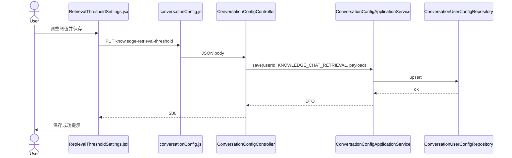
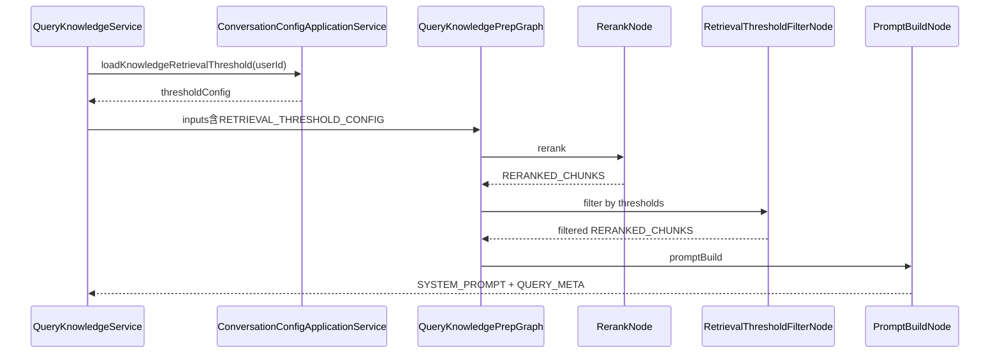

# 技术方案（简版）

> 结合 `ai` / `ai_react` 现有知识库对话链路；过滤节点插入 Query Prep Graph（`rerank` 之后、`promptBuild` 之前）；配置持久化新建领域表，不污染 `KnowledgeProperties` 全局 YAML。

## 一. 需求摘要
- **需求描述**：知识库对话可配置「最低相关度 / 最低向量相似度」，低于阈值片段不进入 Prompt 与 citations；配置存后端，首期系统默认用户，模型可扩展。
- **JIRA/需求来源**：无工单
- **关键约束**：
  1. 默认 50%（双阈值均为 50%）
  2. 双阈值 AND 关系同时满足才保留
  3. `aiTddMode: enabled`：阈值过滤为 L1 Graph 节点，须 AUTO-AI-UT
  4. `uiCraftMode: enabled`：配置组件走 Impeccable U1

## 二. 影响范围和核心场景

### 2.1 本期影响范围（必填）
| 维度 | 影响点 |
|---|---|
| 前端 | 新增 `RetrievalThresholdSettings.jsx`（或等价）；挂载于知识库对话侧栏/设置入口；`src/api/conversationConfig.js` |
| 后端服务 | 新增 `ConversationConfig` 领域 + Repository + ApplicationService + Controller；Graph 新增 `RetrievalThresholdFilterNode`；`QueryKnowledgeService` 注入配置到 Graph state |
| 异步任务 | 无 |
| 数据库 | 新表 `conversation_user_config`（`user_id`, `config_type`, `config_json`, `updated_at`）；Liquibase/Flyway 迁移脚本 |
| 配置权限 | 系统默认用户常量 `SYSTEM_DEFAULT_USER = "__system__"`；读取顺序：当前 `userId` → 系统默认 → 硬编码 50/50 |

### 2.2 核心场景（必填）

**UC-01 默认 50% 过滤（正常）**
- 前置：无 DB 配置；片段分数 0.45 / 0.55
- 验收：0.45 被剔除；0.55 保留

**UC-02 相关度过滤（正常）**
- 前置：`minRelevancePercent=70`；片段 A rerank=0.55，B rerank=0.82
- 验收：仅 B 进入 `RERANKED_CHUNKS` 下游；meta citations 仅含 B

**UC-03 向量分过滤（正常）**
- 前置：`minVectorSimilarityPercent=40`；A vector=0.35，B vector=0.62
- 验收：仅 B 保留

**UC-04 双阈值 AND（边界）**
- 前置：相关度 50%、向量 50%；片段仅满足其一
- 验收：该片段被剔除

**UC-05 过滤后为空（边界）**
- 前置：阈值 99%，所有片段低于阈值
- 验收：`PromptBuildNode` 上下文块为「未检索到…」；SSE 正常；citations=[]

**UC-06 保存并复读（正常）**
- 前置：用户改阈值为 60/30 并保存
- 验收：`PUT` 成功；`GET` 返回相同值；下次对话 Graph 使用新阈值

**UC-07 非法值（异常）**
- 前置：`PUT` body 含 `minRelevancePercent=150`
- 验收：400 + 校验消息；DB 不变

**UC-08 Agent 对话不受影响（边界）**
- 前置：用户处于 Agent 模式
- 验收：不调用检索阈值 API；Orchestrator 链路无变更

## 三. 方案总览

### 3.1 整体思路（必填）
1. **配置与过滤分离**：持久化在 ApplicationService + Repository；过滤在 Graph 节点（L1，可单测）。
2. **可扩展 configType**：枚举 `KNOWLEDGE_CHAT_RETRIEVAL`；JSON payload `{ "minRelevancePercent": int, "minVectorSimilarityPercent": int }`。
3. **Prep 前注入**：`QueryKnowledgeService.streamAnswer` 加载配置写入 `KnowledgeGraphStateKeys.RETRIEVAL_THRESHOLD_CONFIG`，各节点只读 state。

### 3.2 关键实现点（必填）
1. 新 Graph 节点 `RetrievalThresholdFilterNode`（`nodeId=retrievalThresholdFilter`），插入 `KnowledgeProperties.defaultQueryPrepNodes()` 中 `rerank` 与 `promptBuild` 之间
2. 分数口径：相关度用 `RetrievedChunk.rerankScore()`（null 视为 0）；向量用 `vectorScore()`（null 视为 0）；比较 `score >= threshold/100.0`
3. REST：`GET/PUT /api/agent-hub/conversation-config/knowledge-retrieval-threshold`（路径可挂 `KnowledgeHubApiPaths` 或新建 `ConversationConfigController`）
4. 前端：知识库模式可见的配置面板，双 slider + 保存；i18n 中英文

### 3.3 与现有代码关系（必填）
- **复用**：`UserContextHolder.currentUserId()`、`KnowledgeHubController` 路径前缀、`QueryKnowledgeService` Graph 编排、`PromptBuildNode` citations 构建、`formatSimilarityPercent`（前端展示一致）
- **新增**：`ConversationUserConfig` 实体/表、Repository、Service、DTO、FilterNode、前端组件与 API
- **变更**：`KnowledgeProperties.QueryGraph.defaultQueryPrepNodes()`、`QueryKnowledgeService.streamAnswer`（加载配置）、`application-knowledge.yml` 无需改全局 retrieval 参数

## 四. 方案梳理

### 4.2 时序图（配置保存）



### 4.3 时序图（对话过滤）



## 五. 代码改造分析

### 5.1 后端新增

**领域值对象** `KnowledgeRetrievalThresholdConfig`：
```java
public record KnowledgeRetrievalThresholdConfig(
    int minRelevancePercent,      // 0-100
    int minVectorSimilarityPercent // 0-100
) {
    public static KnowledgeRetrievalThresholdConfig defaults() {
        return new KnowledgeRetrievalThresholdConfig(50, 50);
    }
}
```

**Graph 节点** `RetrievalThresholdFilterNode`（L1，AUTO-AI-UT）：
- 读 `RETRIEVAL_THRESHOLD_CONFIG`、`RERANKED_CHUNKS`
- 过滤后写回 `RERANKED_CHUNKS`
- 纯函数逻辑可抽取 `RetrievalThresholdFilter` 便于单测

**State Key** 新增 `KnowledgeGraphStateKeys.RETRIEVAL_THRESHOLD_CONFIG`

**DB** `conversation_user_config`：
| 列 | 说明 |
|----|------|
| id | PK |
| user_id | varchar，系统默认 `__system__` |
| config_type | varchar，首期 `KNOWLEDGE_CHAT_RETRIEVAL` |
| config_json | jsonb/text |
| updated_at | timestamp |
| UNIQUE(user_id, config_type) | |

### 5.2 后端变更点

`KnowledgeProperties.defaultQueryPrepNodes()`：
```java
nodes.add("rerank");
nodes.add("retrievalThresholdFilter"); // 新增
nodes.add("promptBuild");
```

`QueryKnowledgeService.streamAnswer`：在 `graphBuilder.invoke` 前：
```java
KnowledgeRetrievalThresholdConfig threshold =
    conversationConfigService.resolveKnowledgeRetrievalThreshold(userId);
inputs.put(KnowledgeGraphStateKeys.RETRIEVAL_THRESHOLD_CONFIG, threshold);
```

### 5.3 前端新增

| 文件 | 职责 |
|------|------|
| `src/components/RetrievalThresholdSettings.jsx` | 双 slider、说明文案、保存/重置 |
| `src/api/conversationConfig.js` | GET/PUT 封装 |
| `src/i18n/messages.js` | 中英文键 |

**挂载位置**：知识库对话视图（`HomePage` 在 `SIDEBAR_CHAT_VIEW.KNOWLEDGE`）侧栏或聊天区顶部可折叠「检索设置」面板（与 `KnowledgeCitationPanel` 同级区域）。

### 5.4 前端 UI 界面清单（UI-Craft 强制）

| 界面 | 类型 | Impeccable 阶段 |
|------|------|-----------------|
| 检索阈值配置面板 | U1 新增 | shape → craft |
| 保存成功/失败 toast | U2 | polish（随 craft 一并） |
| API 客户端 | U3 | 跳过 Impeccable |

## 六. 影响范围详表

| 模块 | 文件/组件 |
|------|-----------|
| ai Graph | `RetrievalThresholdFilterNode.java`, `KnowledgeGraphStateKeys.java`, `KnowledgeProperties.java` |
| ai 配置域 | `conversationconfig/` 包（domain, repository, service, web） |
| ai 测试 | `RetrievalThresholdFilterNodeTest.java` 或 `RetrievalThresholdFilterTest.java`（AUTO-AI-UT） |
| ai_react | `RetrievalThresholdSettings.jsx`, `HomePage.jsx`, `conversationConfig.js`, `messages.js`, `index.css` |

## 七. 非功能性需求

| 项 | 口径 |
|----|------|
| 并发与幂等 | `upsert` 按 `(user_id, config_type)` 幂等；无并发写冲突业务 |
| 性能 | 过滤为内存 List 操作，O(n)，n ≤ rerankTopK（默认 5），可忽略 |
| 安全 | 本期无鉴权；后续登录后按 userId 隔离；校验 0–100 防注入 |
| 可观测性 | 过滤后 chunk 数量 DEBUG 日志 `traceId, before, after, thresholds` |

## 八. 数据落点

- **conversation_user_config**：保存/读取阈值；验收：`GET` 与 DB 一致
- **无变更**：`knowledge_chunks`、向量索引

## 九. 外部系统改造点

无

## 十. 演进预留

- `config_type` 枚举扩展：`AGENT_CHAT_RETRIEVAL` 等
- `UserContextHolder` 登录后真实 userId 自动生效，无需改表结构
- 可选：配置面板移入 `SettingsPage` 独立区块（本期可放在知识库对话上下文内更易发现）
