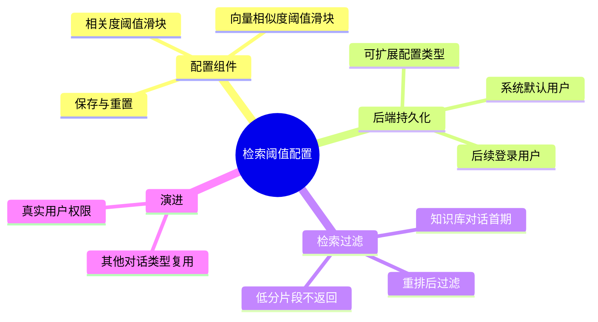

## Why
（为什么要做）

### 背景与目标
- **背景**：知识库对话当前对所有召回/重排后的片段一律注入 Prompt 并展示引用，用户无法按相关度或向量相似度剔除低质量片段，检索噪声可能影响回答质量。
- **目标**：提供可配置的「相关度阈值」与「向量相似度阈值」，低于阈值的片段不参与生成与引用展示；配置持久化于后端，先以系统默认用户维度生效，后续扩展登录用户与多对话类型。

知识库 RAG 需要可调的召回质量门禁，同时为后续 Agent 对话等场景预留统一配置模型。

## Jira / 需求链接

- 无工单

## What Changes
（变更内容）

### 需求概览（全局）

- 新增会话检索阈值配置 UI（相关度 + 向量相似度，0%–100%）
- 低于阈值的检索片段不进入 Prompt、不出现在 citations
- 默认 **50%**（相关度与向量相似度均为 50%；低于 50% 的片段不返回）
- 配置保存至后端；配置模型按 `configType` 可扩展
- 首期权限：读写均绑定**系统默认用户**；登录后按真实 `userId` 读写（预留）
- 首期仅应用于**知识库对话**检索链路；架构预留 Agent 等对话类型

## Capabilities
（能力范围）

### New Capabilities（新增能力）
- `aether-knowledge/retrieval-threshold`：会话检索阈值配置（持久化、读取、过滤应用）

### Modified Capabilities（变更能力）
- （无独立 MODIFIED；过滤逻辑内聚于新能力，知识库 query Graph 行为变更在 design-lite 说明）

## Impact
（影响分析）

> proposal.md 不做技术分析，仅简述影响。完整 Impact 清单在 design-lite.md 中展开。

- **前端（ai_react）**：知识库对话区域或设置页新增阈值配置组件；调用配置读写 API
- **后端（ai）**：新增用户会话配置存储与 REST；Query Graph 在重排后增加阈值过滤（L1，AI-TDD）
- **数据**：新增会话配置表（或等价结构），按 `userId + configType` 唯一
- **行为变更**：未保存过配置时默认阈值 50%，较现网（无过滤）更严格
