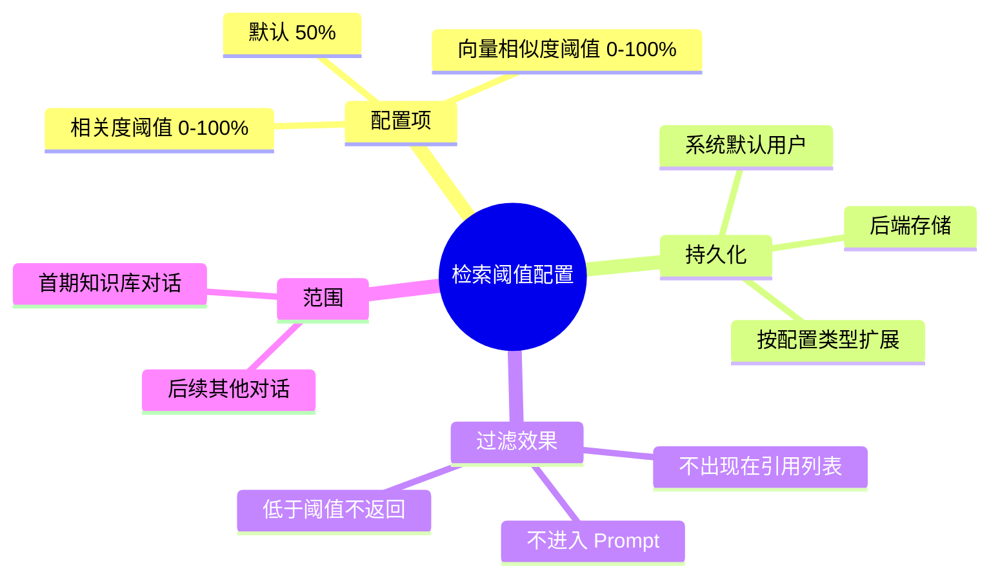

# 知识库对话-检索阈值配置

## 知识库/检索阈值 需求说明（前提/操作/结果）
> 用户可配置知识库对话中检索片段的「相关度」与「向量相似度」最低保留线；低于阈值的片段不参与回答生成与引用展示。
> 配置持久化于后端，首期以系统默认用户生效，模型可扩展至其他对话类型与登录用户。

---

## ADDED Requirements
（新增用户故事）

### 功能组 1：阈值配置展示与编辑

### Requirement: 1. 提供相关度与向量相似度双阈值配置

系统应当（SHALL）提供配置界面，允许用户分别设置「最低相关度」与「最低向量相似度」，取值范围为 0%–100%（整数或等价精度）；两项独立生效。

#### 场景: 查看默认配置
- **前提**：用户首次使用，后端尚无该用户（或系统默认用户）的已保存配置。
- **操作**：用户进入知识库对话的配置入口。
- **结果**：两项阈值均展示为 **50%**（系统默认值）。

#### 场景: 调整相关度阈值
- **前提**：用户已进入配置界面。
- **操作**：用户将「最低相关度」调整为 60%。
- **结果**：界面展示 60%；待用户保存后，后续知识库对话中相关度（重排分）严格低于 0.60 的片段被过滤。

#### 场景: 调整向量相似度阈值
- **前提**：用户已进入配置界面。
- **操作**：用户将「最低向量相似度」调整为 40%。
- **结果**：界面展示 40%；待用户保存后，向量相似度严格低于 0.40 的片段被过滤。

#### 场景: 双阈值同时生效
- **前提**：用户已保存相关度阈值 50%、向量相似度阈值 30%。
- **操作**：用户发起知识库对话，检索返回多条片段。
- **结果**：仅当片段**同时**满足「相关度 ≥ 50%」且「向量相似度 ≥ 30%」时保留；任一维度低于阈值则剔除。

---

### 功能组 2：配置持久化与读取

### Requirement: 2. 配置保存至后端并可再次读取

系统应当（SHALL）将用户的检索阈值配置持久化于后端；用户再次打开配置或发起对话时，系统应加载已保存的配置而非丢失。

#### 场景: 保存配置成功
- **前提**：用户已修改阈值。
- **操作**：用户点击保存。
- **结果**：系统将配置写入后端；展示保存成功反馈；刷新页面后仍展示相同阈值。

#### 场景: 读取已保存配置
- **前提**：后端已存在该配置主体的保存记录。
- **操作**：用户进入配置界面或前端初始化知识库对话。
- **结果**：系统从后端加载并展示已保存的相关度与向量相似度阈值。

#### 场景: 配置类型可扩展
- **前提**：产品后续新增其他对话类型或参数项。
- **操作**：开发新增另一种 `configType` 及对应参数结构。
- **结果**：现有知识库对话配置不受影响；新类型可独立存储与读取（本需求仅交付知识库对话一种类型）。

---

### 功能组 3：权限与配置主体

### Requirement: 3. 首期以系统默认用户承载配置

系统应当（SHALL）在未接入完整登录鉴权前，使用固定的**系统默认用户**标识读写检索阈值配置；所有未登录会话共享该默认配置。架构须预留按真实用户 ID 隔离配置的能力。

#### 场景: 未登录用户使用默认配置
- **前提**：当前请求无登录用户，系统使用系统默认用户标识。
- **操作**：用户修改并保存阈值。
- **结果**：配置绑定系统默认用户；其他未登录用户读取到相同配置。

#### 场景: 预留登录用户隔离
- **前提**：后续版本接入登录，请求携带真实 `userId`。
- **操作**：已登录用户保存个人阈值。
- **结果**：配置绑定该 `userId`；与系统默认用户及其他用户配置相互独立（本期可不实现 UI 差异，但数据模型须支持）。

---

### 功能组 4：知识库对话检索过滤

### Requirement: 4. 知识库对话中低于阈值的片段不返回

系统应当（SHALL）在知识库对话检索流程中，于片段进入 Prompt 组装与引用元数据之前，按当前生效的阈值过滤片段；被过滤的片段不得出现在助手引用列表中，也不得进入生成上下文。

#### 场景: 全部片段高于阈值
- **前提**：阈值均为 0% 或检索片段分数均不低于阈值。
- **操作**：用户提问并触发检索。
- **结果**：行为与现网一致，全部保留片段参与生成与引用。

#### 场景: 部分片段低于阈值被剔除
- **前提**：用户设置相关度阈值 70%；检索结果中含相关度 0.55 与 0.85 的片段。
- **操作**：用户提问。
- **结果**：0.55 的片段不出现于 citations，不进入 Prompt；0.85 的片段正常展示与使用。

#### 场景: 过滤后无可用片段
- **前提**：阈值设置较高，所有召回片段均低于阈值。
- **操作**：用户提问。
- **结果**：系统仍正常流式回答；Prompt 中检索上下文为空或等价「未检索到相关知识库片段」；citations 为空列表；不因过滤导致接口报错。

#### 场景: 仅应用于知识库对话
- **前提**：用户处于智能体对话或其他非知识库模式。
- **操作**：用户发起对话。
- **结果**：本期不应用知识库检索阈值配置；其他对话类型行为不变。

---

### 功能组 5：配置说明与边界

### Requirement: 5. 配置界面提供阈值语义说明

系统应当（SHALL）在配置界面以简短文案说明两项阈值的含义、取值范围及「低于阈值不展示、不参与回答」的规则，避免与引用面板中的分数展示混淆。

#### 场景: 展示帮助说明
- **前提**：用户打开阈值配置。
- **操作**：用户查看各阈值控件旁的说明文案。
- **结果**：文案明确：相关度来自重排模型分数；向量相似度来自向量检索分数；默认 50%；0% 表示不过滤。

#### 场景: 非法输入校验
- **前提**：用户通过 API 或界面提交阈值。
- **操作**：提交小于 0 或大于 100 的值。
- **结果**：系统拒绝保存并返回可理解的校验错误；不写入非法配置。
