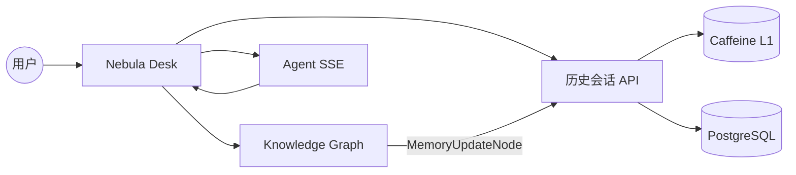
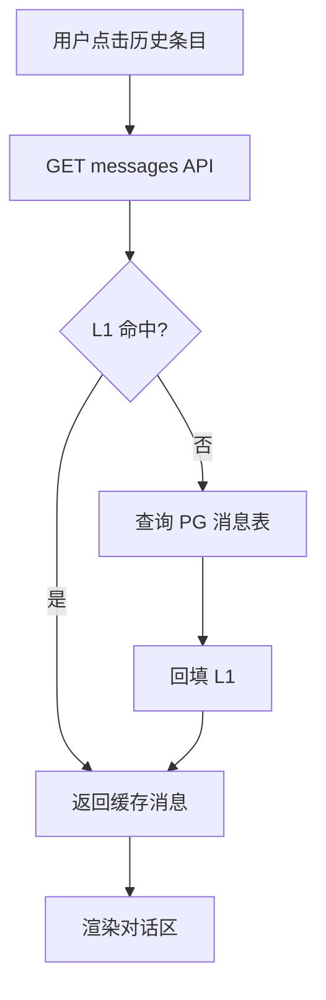
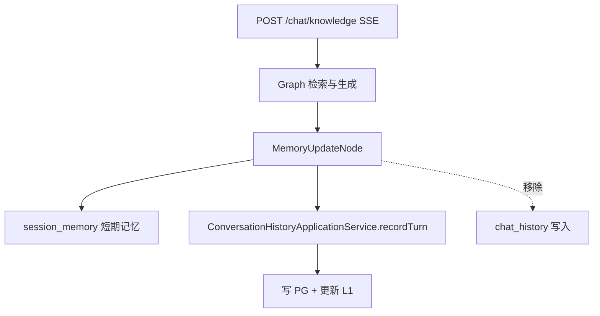
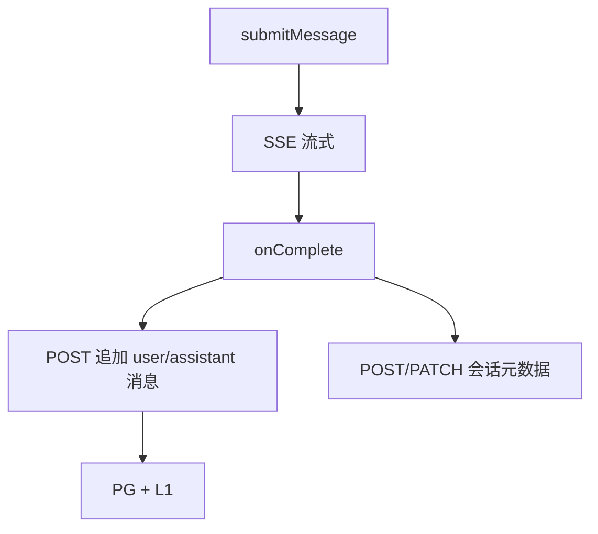
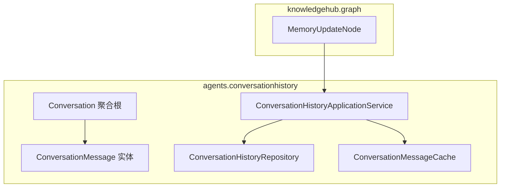
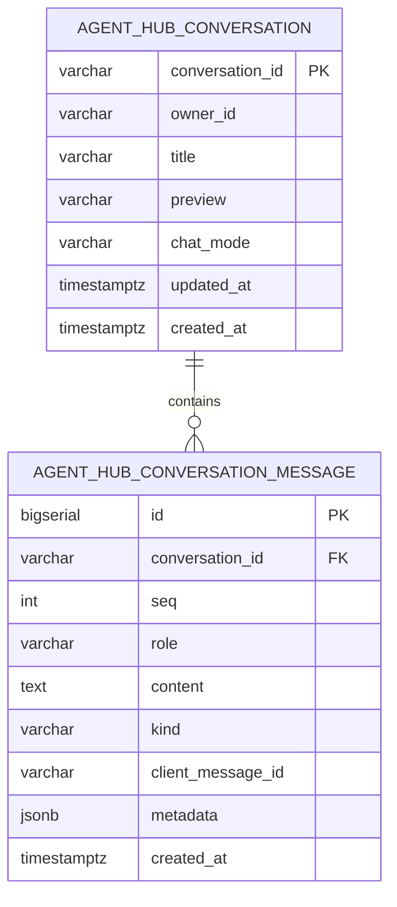
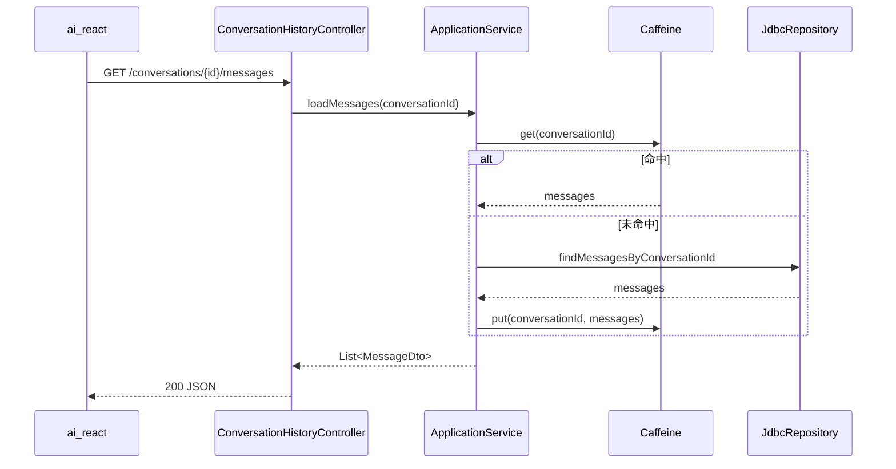
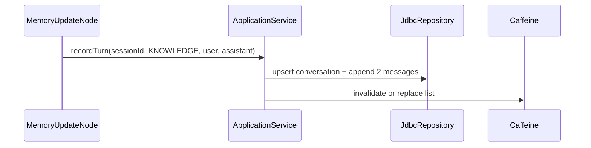

# 历史会话持久化 - 技术设计

> 基于 `design-draft.md`（用户选择 **B**）与 `specs/aether-agent/conversation-history/spec.md`。  
> 关联仓库：`ai`（后端）、`ai_react`（前端）。路径见 `LOCALPATH.md`。

---

## 一. 概述

### 1.1 术语

| 术语 | 说明 |
|------|------|
| 历史会话（UI History） | 侧边栏可见的会话列表与消息正文，供用户回放、重命名、删除 |
| `conversationId` | 前端生成的会话业务主键，与 `AgentHubChatRequest` / `KnowledgeHubChatRequest` 一致 |
| L1 缓存 | 历史子域 Caffeine，按 `conversationId` 缓存消息列表 |
| L2 永久存储 | PostgreSQL 表 `agent_hub_conversation` / `agent_hub_conversation_message` |
| `session_memory` | Knowledge Hub Graph **短期**多轮上下文（`ShortTermMemoryService`），**非** UI 历史 |
| `chat_history`（存量） | 原 Knowledge Hub `MemoryUpdateNode` 追加表；本期 **停止 UI 写入** |

### 1.2 需求背景

**需求描述**：将 Nebula Desk 历史会话从 `localStorage` 迁至 PostgreSQL；相同 `conversationId` 读取时 **缓存优先、库兜底**；知识库对话 `MemoryUpdateNode` 的 UI 历史落库一并迁入统一存储。

**产品 PRD**：无工单；见 `openspec/changes/persist-partial-chat-history/proposal.md`。

### 1.3 本期目标

| 序号 | 内容 | 任务点 |
|------|------|--------|
| 1 | 新增 PG 表与 Flyway V3 | 会话 + 消息 DDL |
| 2 | 实现 `agents.conversationhistory` 四层模块 | Repository、L1、ApplicationService、Controller |
| 3 | 暴露历史 REST API | 列表/消息/追加/重命名/删除 |
| 4 | 改造 `MemoryUpdateNode` | 写统一历史服务，停用 `chat_history` UI 写入 |
| 5 | 改造 `ai_react` 历史模块 | 移除 localStorage；知识库模式不落库双写 |
| 6 | 更新契约 | `integration-contracts.md`、`api-contracts.yaml` |

### 1.4 影响分析

**受影响的系统：**

- [x] **ai**（Agent Hub + Knowledge Hub 历史落库点）
- [x] **ai_react**（`conversationHistory`、`HomePage`）
- [x] **AetherStack 治理层**（接口契约文档）
- [ ] GOMS / 消息队列 / 外部 ERP（无）
- [ ] 现有 SSE `/chat/*` 协议（**无 BREAKING**）

**不受影响的系统/模块：**

- OrchestratorAgent、`QueryKnowledgeService` Graph 检索/生成主路径
- `session_memory`、`ChatMemory`（`InMemoryChatMemoryRepository`）
- 知识库上传、向量检索、长期记忆提取（`LongTermMemoryService`）

---

## 二. 业务分析

### 2.1 业务用例



### 2.2 业务流程

#### 2.2.1 打开历史会话（活动图）



#### 2.2.2 知识库一轮对话落库



#### 2.2.3 智能体/需求开发落库



### 2.3 业务场景

详见：`openspec/changes/persist-partial-chat-history/specs/aether-agent/conversation-history/spec.md`（REQ-1～REQ-9）。

---

## 三. 系统设计

### 3.1 业务实体状态图

会话无复杂状态机：`active`（存在）→ `deleted`（物理删除）。消息随会话级联删除，无独立状态流转。

### 3.2 领域模型图



| 元素 | 说明 |
|------|------|
| **Conversation** | `conversationId`、`ownerId`、`title`、`preview`、`chatMode`、`updatedAt` |
| **ConversationMessage** | `role`、`content`、`kind`、`clientMessageId`、`metadata`、`seq` |
| **ConversationHistoryRepository** | 领域层接口；基础设施 JDBC 实现 |
| **ConversationHistoryApplicationService** | 用例：列表、加载消息、recordTurn、重命名、删除 |

**选型说明**：本需求为 CRUD + 缓存，**不采用** CompiledGraph/ReactAgent（无 LLM 编排）；符合 `backend-ai.md` 例外（纯持久化）。

### 3.3 数据模型图



---

## 四. 详细设计

### 4.1 数据表定义

#### 新增表：`agent_hub_conversation`

| 字段 | 类型 | 说明 |
|------|------|------|
| conversation_id | VARCHAR(64) | 主键，业务会话 ID |
| owner_id | VARCHAR(64) | 本期默认 `SYSTEM_DEFAULT` |
| title | VARCHAR(256) | 侧边栏标题 |
| preview | VARCHAR(512) | 最近预览文本 |
| chat_mode | VARCHAR(32) | `knowledge` / `agent` / `requirement-dev` |
| updated_at | TIMESTAMPTZ | 最近活跃时间 |
| created_at | TIMESTAMPTZ | 创建时间 |

**索引：**

- `idx_agent_hub_conv_owner_mode_updated` — `(owner_id, chat_mode, updated_at DESC)`

#### 新增表：`agent_hub_conversation_message`

| 字段 | 类型 | 说明 |
|------|------|------|
| id | BIGSERIAL | 主键 |
| conversation_id | VARCHAR(64) | FK → `agent_hub_conversation`，ON DELETE CASCADE |
| seq | INT | 会话内顺序，从 1 递增 |
| role | VARCHAR(16) | `user` / `assistant` |
| content | TEXT | 消息正文 |
| kind | VARCHAR(32) | 默认 `text` |
| client_message_id | VARCHAR(64) | 幂等键，可空（知识库由服务端生成） |
| metadata | JSONB | 如 citations、error、pending 终态 |
| created_at | TIMESTAMPTZ | 创建时间 |

**索引：**

- `idx_agent_hub_msg_conv_seq` — `(conversation_id, seq)`
- `uq_agent_hub_msg_client` — `UNIQUE (conversation_id, client_message_id)` WHERE `client_message_id IS NOT NULL`

#### Flyway 脚本

路径：`ai/src/main/resources/db/migration/V3__agent_hub_conversation_history.sql`

```sql
CREATE TABLE IF NOT EXISTS agent_hub_conversation (
    conversation_id VARCHAR(64)  PRIMARY KEY,
    owner_id        VARCHAR(64)  NOT NULL,
    title           VARCHAR(256) NOT NULL,
    preview         VARCHAR(512),
    chat_mode       VARCHAR(32)  NOT NULL,
    updated_at      TIMESTAMPTZ  NOT NULL DEFAULT NOW(),
    created_at      TIMESTAMPTZ  NOT NULL DEFAULT NOW()
);

CREATE INDEX IF NOT EXISTS idx_agent_hub_conv_owner_mode_updated
    ON agent_hub_conversation (owner_id, chat_mode, updated_at DESC);

CREATE TABLE IF NOT EXISTS agent_hub_conversation_message (
    id                 BIGSERIAL PRIMARY KEY,
    conversation_id    VARCHAR(64)  NOT NULL REFERENCES agent_hub_conversation (conversation_id) ON DELETE CASCADE,
    seq                INT          NOT NULL,
    role               VARCHAR(16)  NOT NULL,
    content            TEXT         NOT NULL,
    kind               VARCHAR(32)  NOT NULL DEFAULT 'text',
    client_message_id  VARCHAR(64),
    metadata           JSONB,
    created_at         TIMESTAMPTZ  NOT NULL DEFAULT NOW(),
    CONSTRAINT uq_agent_hub_msg_conv_seq UNIQUE (conversation_id, seq)
);

CREATE UNIQUE INDEX IF NOT EXISTS uq_agent_hub_msg_client
    ON agent_hub_conversation_message (conversation_id, client_message_id)
    WHERE client_message_id IS NOT NULL;

CREATE INDEX IF NOT EXISTS idx_agent_hub_msg_conv_seq
    ON agent_hub_conversation_message (conversation_id, seq);
```

**存量表 `chat_history`：** 不删表；停止新写入。可选后续迁移脚本将旧 `knowledge_chat` 行导入新表（**本期不做**）。

### 4.2 应用内部组件划分

```
com.yxy.deepseek.agents.conversationhistory
├── domain
│   ├── model/Conversation.java
│   ├── model/ConversationMessage.java
│   └── repository/ConversationHistoryRepository.java
├── application
│   └── ConversationHistoryApplicationService.java
├── infrastructure
│   ├── cache/ConversationMessageCache.java
│   └── repository/JdbcConversationHistoryRepository.java
└── web
    ├── ConversationHistoryController.java
    └── dto/*.java
```

### 4.3 组件时序图

#### 加载消息（L1→L2）



#### 知识库 recordTurn



### 4.4 核心算法逻辑

#### 4.4.1 `loadMessages`（缓存优先）

```text
1. list = cache.get(conversationId)
2. if list != null → return list
3. list = repository.findMessagesOrdered(conversationId)
4. if list empty → return empty（不缓存负向结果超过 60s 可选）
5. cache.put(conversationId, list)
6. return list
```

#### 4.4.2 `recordTurn`（知识库一轮）

```text
1. upsert conversation(conversationId, ownerId, mode, title←truncate(userMsg), preview←userMsg)
2. append message role=user, content=userMsg, clientMessageId=null
3. append message role=assistant, content=answer
4. cache.invalidate(conversationId)  // 或重建完整列表
5. 同一 @Transactional 边界内完成 2 表写入
```

#### 4.4.3 `chat_mode` 映射

| 前端 `CHAT_MODE` | 存库 `chat_mode` |
|------------------|------------------|
| `knowledge` | `knowledge` |
| `agent` | `agent` |
| `requirementDev` | `requirement-dev` |

### 4.5 定时任务

无定时任务变更。

---

## 五. 接口设计

### 5.1 本期新增接口列表

| 方法 | 路径 | 变更类型 |
|------|------|----------|
| GET | `/api/agent-hub/conversations` | 新增 |
| POST | `/api/agent-hub/conversations` | 新增 |
| GET | `/api/agent-hub/conversations/{conversationId}/messages` | 新增 |
| POST | `/api/agent-hub/conversations/{conversationId}/messages` | 新增 |
| PATCH | `/api/agent-hub/conversations/{conversationId}` | 新增 |
| DELETE | `/api/agent-hub/conversations/{conversationId}` | 新增 |

**常量类**：`AgentHubApiPaths` 增加 `CONVERSATIONS = BASE + "/conversations"`。

**默认 `ownerId`**：请求未传时使用 `SYSTEM_DEFAULT`（与 `UserContextHolder` 未来对齐）。

### 5.2 接口详细设计

#### GET `/api/agent-hub/conversations`

**功能**：按 `ownerId` + 可选 `mode` 查询会话列表，按 `updated_at` 降序，默认 `limit=50`。

**Query**：

| 参数 | 类型 | 必填 | 说明 |
|------|------|------|------|
| mode | string | 否 | `knowledge` / `agent` / `requirement-dev` |
| ownerId | string | 否 | 默认 `SYSTEM_DEFAULT` |
| limit | int | 否 | 默认 50 |

**响应 200**：

```json
[
  {
    "id": "1748592000000",
    "title": "如何配置知识库",
    "preview": "如何配置知识库？",
    "mode": "knowledge",
    "updatedAt": 1748592000123
  }
]
```

#### GET `/api/agent-hub/conversations/{conversationId}/messages`

**功能**：加载会话全部消息（L1→L2）。

**响应 200**：

```json
[
  {
    "id": "user-1748592000001",
    "role": "user",
    "kind": "text",
    "text": "你好",
    "pending": false,
    "error": false,
    "meta": null
  },
  {
    "id": "assistant-1748592000002",
    "role": "assistant",
    "kind": "text",
    "text": "你好，有什么可以帮您？",
    "pending": false,
    "error": false,
    "meta": { "citations": [] }
  }
]
```

**错误**：

- `404` — 会话不存在（ProblemDetail，`title=Conversation not found`）

#### POST `/api/agent-hub/conversations/{conversationId}/messages`

**功能**：追加单条消息（智能体/需求开发模式使用）；知识库模式 **不调用**（由 `recordTurn` 负责）。

**请求**：

```json
{
  "role": "user",
  "kind": "text",
  "text": "消息正文",
  "clientMessageId": "user-1748592000001",
  "metadata": {}
}
```

**响应 201**：返回带 `seq` 的消息 DTO。

**幂等**：相同 `(conversationId, clientMessageId)` 重复提交返回已有记录（不重复插入）。

#### POST `/api/agent-hub/conversations`

**功能**：创建或更新会话元数据（首条消息前/后均可）。

**请求**：

```json
{
  "conversationId": "1748592000000",
  "title": "新对话",
  "preview": "首条消息摘要",
  "mode": "agent",
  "ownerId": "SYSTEM_DEFAULT"
}
```

**响应 200**：会话摘要 DTO。

#### PATCH `/api/agent-hub/conversations/{conversationId}`

**请求**：

```json
{
  "title": "重命名后的标题"
}
```

**校验**：`title` 去空白后非空，否则 `400`。

#### DELETE `/api/agent-hub/conversations/{conversationId}`

**功能**：级联删除消息；失效 L1 缓存。

**响应 204**。

**错误码汇总**：

| HTTP | 场景 |
|------|------|
| 400 | 参数非法、标题为空 |
| 404 | 会话不存在 |
| 409 | 可选：并发 seq 冲突（本期单线程写入可省略） |

异常处理：`ConversationHistoryController` 纳入 `AgentHubExceptionHandler` 或新建 `@RestControllerAdvice(basePackageClasses = ConversationHistoryController.class)`，复用 `ProblemDetail` 风格。

---

## 六. 代码改造分析

### 6.1 入口链路 — 前端历史加载

**代码位置**：`ai_react/src/services/conversationHistory.js:35-52`

**现状代码**：

```javascript
export function loadConversationHistory() {
  return safeParse(localStorage.getItem(STORAGE_KEY)).map(normalizeItem).filter(Boolean)
}
```

**风险点**：浏览器本地为唯一数据源，无法跨端；与后端知识库落库割裂。

**改造要点**：

```javascript
// 改为 async API：ai_react/src/api/conversationHistory.js
export async function loadConversationHistory(mode) {
  return listConversations({ mode }) // GET /api/agent-hub/conversations
}
```

`HomePage.jsx` 初始化 `historyItems` 改为 `useEffect` 内 `await loadConversationHistory(chatMode)`。

---

### 6.2 入口链路 — 知识库 Graph 落库

**代码位置**：`ai/src/main/java/com/yxy/deepseek/knowledgehub/graph/query/MemoryUpdateNode.java:36-39`

**现状代码**：

```java
chatHistoryRepository.append(sessionId, userId, "user", message, Map.of("type", "knowledge_chat"));
chatHistoryRepository.append(sessionId, userId, "assistant", answer, Map.of("type", "knowledge_chat"));
```

**风险点**：写入 `chat_history` 无会话元数据，侧边栏无法统一 CRUD；与 UI 历史表重复。

**改造要点**：

```java
conversationHistoryApplicationService.recordTurn(
    sessionId,
    ConversationHistoryOwner.SYSTEM_DEFAULT,
    ChatModeConstants.KNOWLEDGE,
    message,
    answer);
// 删除 ChatHistoryRepository 注入与 append 调用
```

`ownerId`：本期固定 `SYSTEM_DEFAULT`；`userId` 来自 `UserContextHolder` 仅用于 `session_memory`，**不**用于 UI 历史 owner（无登录统一系统账号）。

---

### 6.3 入口链路 — 智能体/需求开发消息落库

**代码位置**：`ai_react/src/pages/HomePage.jsx:433-476`

**现状代码**：

```javascript
saveConversationMessages(conversationId, nextMessages)
// onComplete 内再次 saveConversationMessages → localStorage
```

**风险点**：仅本地持久化；流式中间态频繁写 localStorage。

**改造要点**：

```javascript
// 发送时：可选乐观 UI，不落库 pending 助手正文
// onComplete：
await appendConversationMessage(conversationId, { role: 'user', clientMessageId: userMessageId, text: message })
await appendConversationMessage(conversationId, { role: 'assistant', clientMessageId: assistantMessageId, text: finalText })
await upsertConversation({ conversationId, title, preview: message, mode: resolveModeLabel(chatMode) })
```

**知识库模式**：删除 `onComplete` 内对历史 API 的 append（**仅**保留 `MemoryUpdateNode.recordTurn`）；`submitMessage` 中移除 `saveConversationMessages`。

---

### 6.4 核心分支 — 会话 ID 对齐（知识库）

**代码位置**：`ai_react/src/pages/HomePage.jsx:478-485`、`ai_react/src/api/chat.js:42-46`

**现状代码**：

```javascript
if (meta.sessionId && meta.sessionId !== conversationId) {
  localStorage.setItem(`knowledge_session_${conversationId}`, meta.sessionId)
}
```

```javascript
sessionId: payload.sessionId || payload.conversationId,
```

**风险点**：后端若生成新 UUID 与前端 `conversationId` 不一致，历史分裂。

**改造要点**：

- 前端始终传 `conversationId`；`buildRequestBody` 已设 `sessionId: conversationId`（保持）。
- **删除** `knowledge_session_*` localStorage 逻辑。
- `KnowledgeHubChatRequest.effectiveSessionId()` 已优先 `sessionId`/`conversationId`（`KnowledgeHubChatRequest.java:20-28`），无需改 Graph；禁止依赖 meta 改写会话主键。

---

### 6.5 数据落点 — ApplicationService + 缓存

**代码位置**：新建 `ConversationHistoryApplicationService.java`

**改造要点**：

```java
@Transactional
public void recordTurn(String conversationId, String ownerId, String chatMode,
                       String userContent, String assistantContent) {
    repository.upsertConversation(...);
    int nextSeq = repository.maxSeq(conversationId);
    repository.insertMessage(conversationId, ++nextSeq, "user", userContent, null, null);
    repository.insertMessage(conversationId, ++nextSeq, "assistant", assistantContent, null, null);
    messageCache.invalidate(conversationId);
}

public List<ConversationMessageDto> loadMessages(String conversationId) {
    return messageCache.get(conversationId, id -> repository.findMessagesOrdered(id));
}
```

**事务**：仅 PG 写入；**禁止**在事务内调 LLM。

---

### 6.6 数据落点 — 删除 / 重命名

**代码位置**：`ai_react/src/pages/HomePage.jsx:396-413`

**现状**：`updateConversationHistory` / `deleteConversationHistory` 仅改 localStorage。

**改造要点**：

```javascript
await patchConversation(id, { title: nextTitle })
await deleteConversation(id) // DELETE API，后端 CASCADE + cache.invalidate
```

---

### 6.7 清理存量

| 文件 | 动作 |
|------|------|
| `ChatHistoryRepository.java` | 无引用后 **删除** |
| `conversationHistory.js` | 移除 `STORAGE_KEY`、`MESSAGE_STORAGE_KEY` 及 localStorage 函数 |
| `messages.js` | 删除或改写「Auto-save local chat history」文案 |

---

## 七. 非功能性需求设计

### 7.1 权限影响

本期无登录；所有接口默认 `ownerId=SYSTEM_DEFAULT`。后续认证接入时：

- 从 SecurityContext 解析 `ownerId` 覆盖默认值；
- 列表/加载/删除校验资源归属。

### 7.2 数据迁移

- [x] 需要 Flyway V3 新表
- [ ] 本期不迁移 `chat_history` 旧数据
- [x] 可回滚：删除 V3 表（仅开发环境；生产需评估）

### 7.3 缓存设计

| 缓存 Key | 策略 | 说明 |
|----------|------|------|
| `conv:messages:{conversationId}` | Caffeine `maximumSize=500`，`expireAfterAccess=30m` | 消息列表 |
| 失效 | `delete/rename/recordTurn/append` | 显式 `invalidate(conversationId)` |

服务重启后 L1 清空，依赖 L2 恢复（满足 spec REQ-3）。

### 7.4 安全评估

- [x] 本期无用户隔离，多用户共享历史（已知风险，登录后修复）
- [ ] 消息正文可能含敏感信息，DB 访问遵循既有 PG 权限
- [ ] 暂不加密 at-rest（与项目其他业务表一致）

### 7.5 限流降级

- 预期 QPS 低（桌面单用户）；暂不限流
- 降级：L1 故障可直读 L2

---

## 八. 开发补充要求

1. **依赖方向**：`knowledgehub` → `agents.conversationhistory.application` 允许（与现有 `AgentHubChatMode` 引用一致）；`agents` **不得**依赖 `knowledgehub`。
2. **验证**：`make verify` 覆盖 ai 单测（Repository + ApplicationService）与 ai_react `lint/build`。
3. **契约同步**：实现完成后更新 `openspec/references/integration-contracts.md` 与 `.aetherstack/context/api-contracts.yaml`。
4. **REQ 映射**：REQ-8 由 `MemoryUpdateNode` + 知识库前端不写历史 API 满足；REQ-1～7 由 REST + 前端改造满足。

---

## 附录：与 design-draft 差异说明

| draft 项 | design 定稿 |
|----------|-------------|
| 双写去重 | **采用方案（1）**：知识库仅 `MemoryUpdateNode` 落库 |
| 表名 | 定为 `agent_hub_conversation` / `agent_hub_conversation_message` |
| `ChatHistoryRepository` | 确认删除（仅 `MemoryUpdateNode` 引用） |
