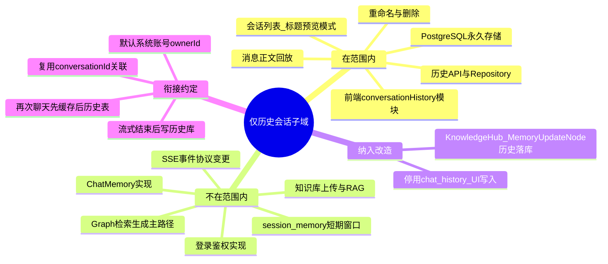

## Why
（为什么要做）

### 背景与目标

- **背景**：Nebula Desk（`ai_react`）当前将历史会话列表与消息正文存放在浏览器 `localStorage`（`conversationHistory.js`），换设备/清缓存即丢失，且代码中已标注待替换为后端 API。侧边栏支持按模式（知识库 / 智能体等）筛选、重命名、删除会话，但操作仅作用于本地存储。
- **目标**：**仅针对「历史会话」能力**——将侧边栏可见的会话列表与消息正文从浏览器迁到后端 **PostgreSQL** 永久存储；列表、回放、**重命名**、**删除**由后端承担，前端不再用 `localStorage`。现阶段无登录，数据挂**默认系统账号**，并预留 `ownerId` 扩展。
- **范围边界（强制）**：本变更**不改造**实时对话编排主路径（CompiledGraph 节点逻辑、SSE 事件协议、检索与生成）；但 **Knowledge Hub 知识库对话** 既有「历史落库」实现（`MemoryUpdateNode` → `chat_history` 表）须**一并改为**统一历史会话存储；`session_memory` 短期记忆（Graph 上下文窗口）本期保持，仅替换 **UI 可见历史** 的写入与读取路径。

## Jira / 需求链接

- 无工单

## What Changes
（变更内容）

### 需求概览（全局）



### 变更范围（仅历史会话）

**在范围内**

| 层级 | 内容 |
|------|------|
| 后端 | 历史会话专用表（PostgreSQL）、Repository、应用服务、REST API；**Knowledge Hub** `MemoryUpdateNode` 改为写入统一历史服务，**停止**向存量 `chat_history` 追加 UI 历史 |
| 前端 | `conversationHistory` 服务、侧边栏历史列表与相关交互；知识库/智能体/需求开发模式均走同一历史 API；发消息与流式结束后落库 |
| 数据 | 该子域内**全部**已保存会话及其消息正文（非摘要截断） |

**不在范围内（本变更不修改其行为或存储）**

- CompiledGraph **检索、生成、ContextPrepare** 等节点逻辑（除 `MemoryUpdateNode` 的 **UI 历史落库** 分支）
- `ChatMemory`、`ConversationKnowledgeService`、向量库长期记忆
- `session_memory` 短期记忆表及其裁剪策略（Graph 多轮上下文仍用）
- 知识库文档上传、分段、embedding、批量删除
- 用户登录、鉴权、按人隔离（仅表字段预留）
- 设置页除「本地历史」以外的能力

**衔接约定**：沿用现有 `conversationId` 作为历史会话主键，与对话请求参数一致；**不**要求本变更统一或迁移 LLM 记忆存储。

### 消息读取策略（相同 conversationId 再次发起/打开）

当用户使用**相同 `conversationId`** 再次进入会话或发起新一轮聊天、需要加载已存在消息时，采用 **缓存优先、历史表兜底**：

```text
conversationId
  → ① 查会话消息缓存（L1，热数据）
  → ② 未命中 → 查 PostgreSQL 历史消息表（L2，永久存储）
  → ③ 可选：自 L2 回填 L1，加速后续同会话读取
```

| 层级 | 职责 | 说明 |
|------|------|------|
| **L1 缓存** | 加速同会话重复读取 | 历史子域专用（如进程内按 `conversationId` 索引）；design 阶段定具体实现；**不以缓存替代 PG 持久化** |
| **L2 历史表** | 权威永久数据 | 服务重启、缓存淘汰或过期后仍可恢复完整消息 |

- **写入**：流式结束/消息落库时 **同时** 更新 L1（若存在）与 L2，保证再次打开时 L1 通常命中。
- **边界**：本策略仅作用于**历史会话子域**的消息加载 API；**不改造** Orchestrator/SSE；是否只读复用既有 `ChatMemory` 窗口由 design 评估（若格式不一致则独立 L1，避免耦合 LLM 记忆实现）。

### 变更要点

- **新增** `aether-agent/conversation-history` 子域：PostgreSQL 会话表 + 消息表（L2）+ 会话消息 L1 缓存；永久存储以 PG 为准。
- **新增** 历史会话 REST API（CRUD + 消息追加 + **按 conversationId 加载消息**）；加载路径实现「先缓存、后历史表」。
- **Knowledge Hub**：`POST /api/agent-hub/chat/knowledge` 流式完成后，`MemoryUpdateNode` 通过统一 **ConversationHistory** 应用服务落库（`chat_mode=knowledge`），**移除**对 `ChatHistoryRepository` → `chat_history` 的 UI 历史写入；`sessionId`/`conversationId` 与前端会话标识对齐。
- **前端**：仅改造历史会话读写路径；移除 `localStorage`（含 `knowledge_session_*` 会话映射）；知识库模式与智能体模式共用历史 API。
- **账号（本期）**：`ownerId = SYSTEM_DEFAULT`（命名在 design 定稿），预留后续登录覆盖。

### 非目标（本期不做）

- 用户注册、登录、鉴权、多租户隔离实现（仅预留字段）。
- 改造 `ChatMemory`、向量会话记忆、Orchestrator/Graph 流水线。
- 变更 SSE 事件类型、流式协议或 SubAgent 工具链。
- 历史全文检索、导出、归档策略。
- 以缓存作为**唯一**持久化源（L2 必须为 PostgreSQL）；禁止退回 `localStorage` 作为数据源。

## Capabilities
（能力范围）

### New Capabilities（新增能力）

- `aether-agent/conversation-history`：**仅**历史会话子域——消息 PostgreSQL 持久化；相同 `conversationId` 再次访问时**缓存优先、历史表兜底**；列表/回放/重命名/删除（不含对话编排改造）。

### Modified Capabilities（变更能力）

- （无 OpenSpec 主规格层既有能力的行为变更；实现层面变更 Nebula Desk 历史模块与 Agent Hub 新增 API，在 design / integration-contracts 中体现。）

## Impact
（影响分析）

- **后端（`ai`）**：新增历史会话模块；**修改** `knowledgehub.graph.query.MemoryUpdateNode` 的历史落库调用；`QueryKnowledgeService` / Graph 主流程不变；OrchestratorAgent 行为不变。
- **前端（`ai_react`）**：**仅触及** `conversationHistory.js` 与 `HomePage` 中历史侧边栏相关逻辑；聊天 API/SSE 客户端保持既有协议，仅增加历史落库调用点。
- **契约**：增补**历史会话专用** REST 路径至 `integration-contracts.md` / `api-contracts.yaml`；不标记现有 `/chat/*` SSE 接口为 BREAKING。
- **数据**：历史消息正文 PG 永久存储；默认系统账号下为共享视图。
- **读取性能**：同 `conversationId` 重复访问走 L1→L2；PG 为持久权威，L1 可淘汰重建。
- **隔离**：历史 L1/L2 服务于 UI 回放；与 `ChatMemory`/向量记忆逻辑解耦，不替代模型上下文存储（是否只读复用 ChatMemory 由 design 定）。
