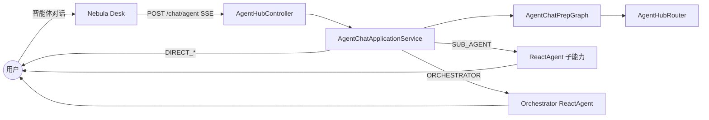
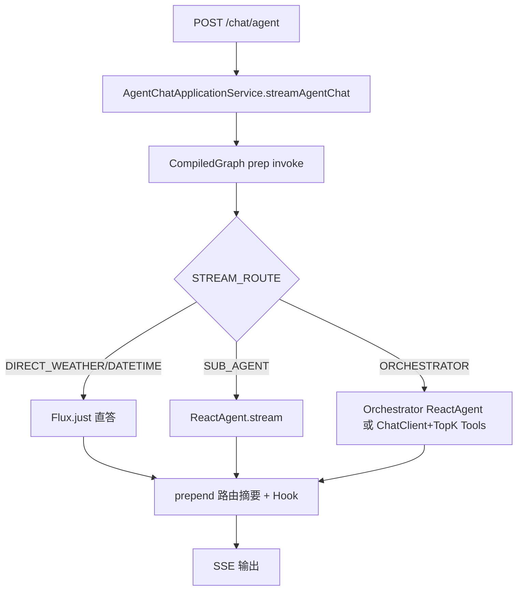
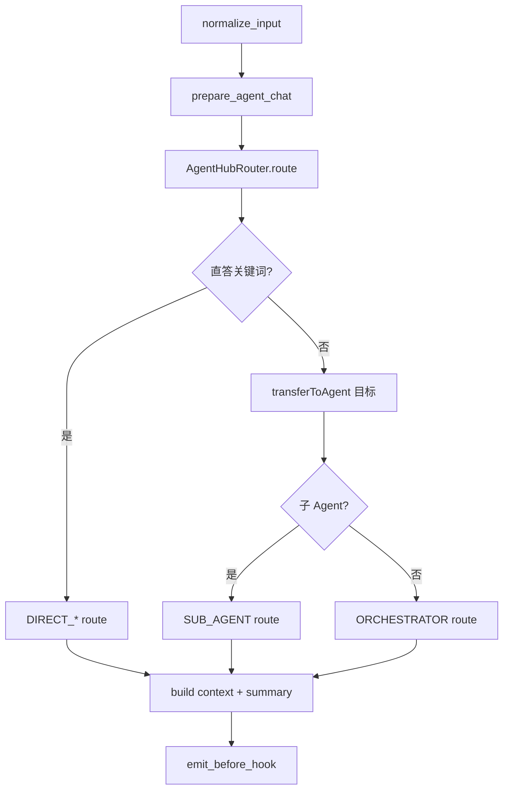
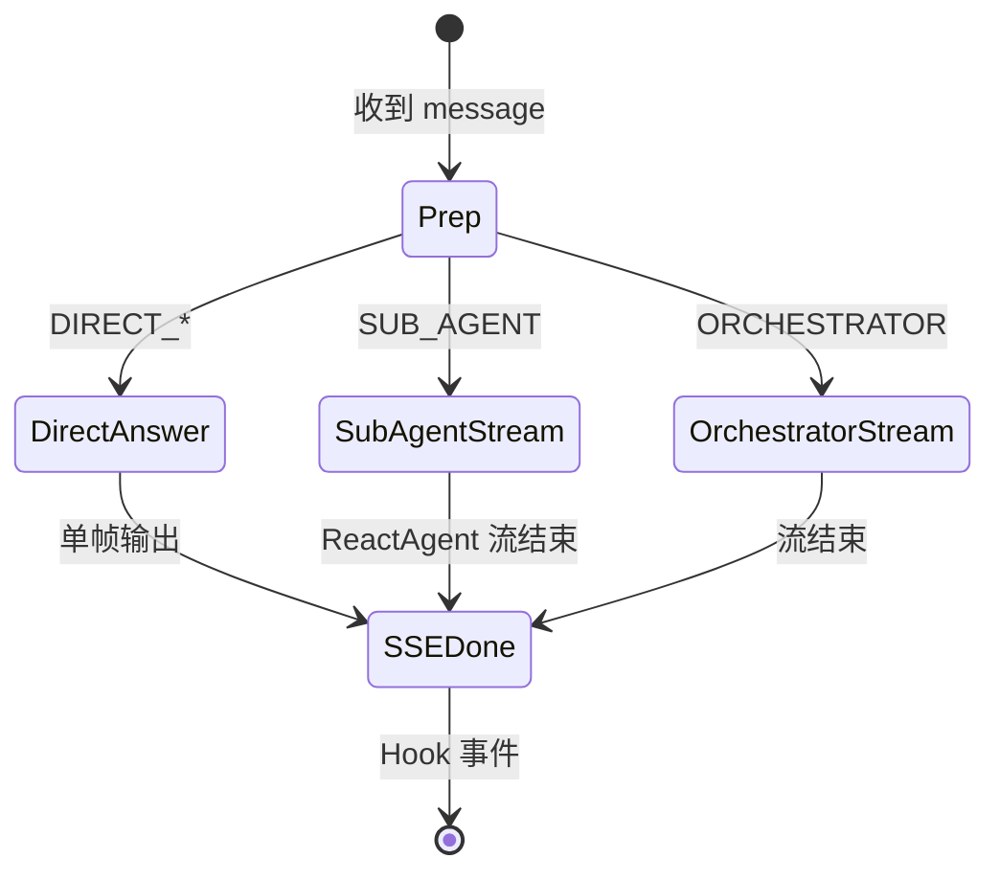
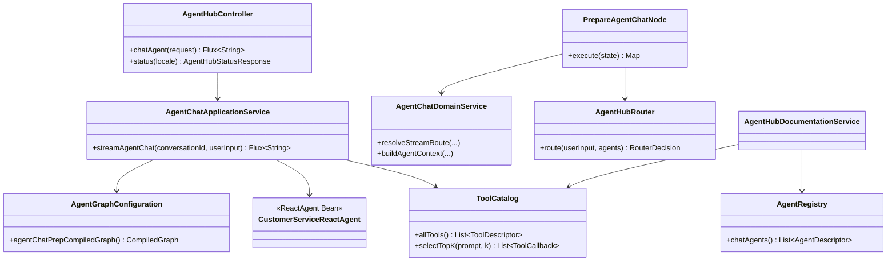
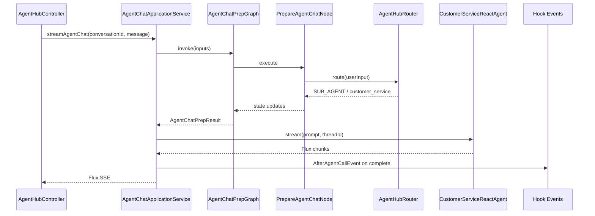
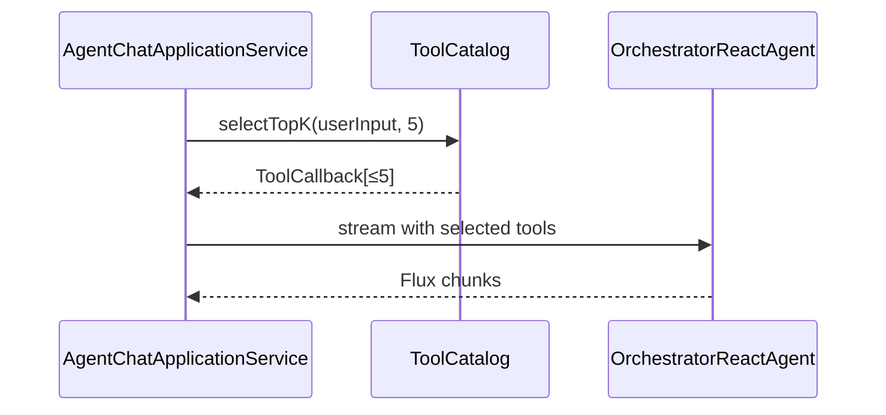

# Agent Hub 智能体对话规范重构 - 技术方案

> 基于 `design-draft.md`（用户选择 **C** 跳过 draft 评审，直接生成 design）。  
> 业务需求详见：`openspec/changes/refactor-agent-hub-controller/specs/aether-agent-agent-chat/spec.md`

## 一. 概述

### 1.1 术语

| 术语 | 英文 | 说明 |
|------|------|------|
| Prep Graph | AgentChatPrepGraph | 智能体对话前置 CompiledGraph，单例 Bean，同步 invoke |
| STREAM_ROUTE | — | prep 产出：`DIRECT_WEATHER` / `DIRECT_DATETIME` / `SUB_AGENT` / `ORCHESTRATOR` |
| RouterAgent | — | 多 Agent 统一调度，唯一路由工具 `transferToAgent` |
| ReactAgent | — | ReAct + 工具循环，用于垂直子能力与工具密集编排 |
| ToolRegistry | — | 存量自研工具发现与 Skill 聚合；本变更 chat 主路径移除依赖 |
| Skill | — | 自研可插拔提示词+工具包；chat 主路径废弃依赖 |
| ToolCatalog | — | 新增只读工具目录，供 `/status` 与动态注入索引 |

### 1.2 需求背景

**需求描述**：按 AetherStack 规范重构 `AgentHubController.chatAgent`（`POST /api/agent-hub/chat/agent`）全链路，清理不规范 agents / skills / tools，替换为 RouterAgent + ReactAgent + 规范 `@Tool`，保持 REST/SSE 契约不变。

**产品 PRD**：无工单；proposal + spec 为需求来源。

### 1.3 本期目标

| 序号 | 内容 | 任务点 |
|------|------|--------|
| 1 | Controller / Application 分层对齐 | chatAgent 仅 HTTP+指标；去除 chat 对 OrchestratorAgent/Skill 依赖 |
| 2 | Router 规范 | 新增 `AgentHubRouter` + transferToAgent；prep 节点接入 |
| 3 | 子 Agent ReactAgent 化 | 客服 / 数据分析 / 代码生成三 SubAgent chat 路径 |
| 4 | 工具链收敛 | AgentChatService 去 ToolRegistry；@Tool 四段式；>5 动态 Top-K |
| 5 | 遗留清理 | OrchestratorAgent chat/knowledge 死代码；ModuleGuide / domain-models |
| 6 | AI-TDD | L1 prep / 流式 / 路由 AUTO-AI-UT |
| 7 | 契约登记 | integration-contracts 注释增量（paths 不变） |

### 1.4 影响分析

**受影响的系统：**
- [x] 后端 **ai**（`agents/web|application|graph|domain|agent|tool`）
- [x] 治理层 **AetherStack**（`domain-models.md`、integration-contracts 注释）
- [ ] 前端 **ai_react** — 无 UI 变更（`uiCraftMode: disabled`）
- [ ] 数据库 — 无
- [ ] Knowledge Hub — 无（范围外）
- [ ] `/requirement-dev` — 无（`subagent.requirement` 包排除）

**AI-TDD 评估（aiTddMode: auto）**：触及 L1 — `PrepareAgentChatNode`、`AgentChatDomainService`（路由/STREAM_ROUTE）、`AgentChatApplicationService`（流式分支与 Hook）。**design 结论：等同 `enabled`**，tasks 须含 `AUTO-AI-UT` 且先于 L1 实现任务勾选。

**前端 UI**：无 U1 界面（`uiCraftMode: disabled`）。

---

## 二. 业务分析

### 2.1 业务用例



图例：实线为本变更主路径；Router 为 **新增** 组件（`style` 语义上为新能力）。

### 2.2 业务流程

#### 2.2.1 智能体对话端到端



#### 2.2.2 Prep 阶段路由（新增 Router 决策）



### 2.3 业务场景

详见：`openspec/changes/refactor-agent-hub-controller/specs/aether-agent-agent-chat/spec.md`

---

## 三. 系统设计

### 3.1 业务实体状态图

单轮对话无持久化聚合状态机；运行时由 `ConversationContext` + `ChatMemory` 持有。



### 3.2 领域模型图

本期**不新增聚合根**；领域逻辑仍在 `AgentChatDomainService`（路由规则、上下文装配、直答判定）。

| 层次 | 组件 | 职责 |
|------|------|------|
| web | `AgentHubController` | HTTP/SSE、DTO、指标 |
| application | `AgentChatApplicationService` | prep invoke + 流式分支 + Hook |
| domain | `AgentChatDomainService` | 路由辅助、STREAM_ROUTE、Context 装配 |
| graph | `PrepareAgentChatNode` 等 | State 适配器，禁止 web.dto |
| agent.router | `AgentHubRouter`（新） | transferToAgent 语义、Agent 边界描述 |
| agent.react | `*ReactAgent` Configuration（新） | 子 Agent / 编排器 ReAct |
| tool | `@Tool` functions + `ToolCatalog` | 工具实现与只读目录 |
| infrastructure | `McpManager` | MCP ToolCallback（不变） |

### 3.3 数据模型图

**无数据模型变更。** 无新增表、无 Redis 强制依赖。工具动态 Top-K 首期使用**启动期内存索引**（工具 description embedding 缓存于 `ToolCatalog`）。

### 3.4 前端 UI 界面清单

**无 U1 界面**（`uiCraftMode: disabled`）。前端 `ai_react/src/api/chat.js` 无需修改。

---

## 四. 详细设计

### 4.1 数据表定义

**无数据表变更。**

### 4.2 应用内部组件划分



**新增包结构（ai 仓库）**：

```text
com.yxy.deepseek.agents.agent.router
  AgentHubRouter.java              // 路由决策（规则+transferToAgent 描述）
  AgentRegistry.java               // chat 子 Agent 元数据注册
  AgentHubRouterConfiguration.java // Router ReactAgent（可选 LLM tie-breaker）
com.yxy.deepseek.agents.agent.react
  CustomerServiceReactAgentConfiguration.java
  DataAnalysisReactAgentConfiguration.java
  CodeGenerationReactAgentConfiguration.java
  OrchestratorReactAgentConfiguration.java
com.yxy.deepseek.agents.tool.catalog
  ToolCatalog.java                 // 只读目录 + Top-K 选择
  ToolDescriptor.java
```

### 4.3 组件之间的时序图

#### 4.3.1 智能体对话（SUB_AGENT 路径）



#### 4.3.2 编排器路径（工具 Top-K）



### 4.4 核心算法逻辑

#### 4.4.1 AgentHubRouter 决策（prep 同步，禁止阻塞 LLM）

**输入**：`userInput`、已注册 `AgentDescriptor` 列表（含 keywords、description、反例摘要）。

**步骤**：
1. **直答优先**：调用现有 `WeatherDirectAnswerService` / `DatetimeDirectAnswerService`；命中则返回 `DIRECT_*`（与现 `AgentChatDomainService.resolveStreamRoute` 一致）。
2. **规则路由**：对各 chat SubAgent 计算 `SubAgent.matchScore`（保留为**信号**，非唯一决策）。
3. **transferToAgent 映射**：得分最高且超过阈值的 SubAgent → `RouterDecision.subAgent(name)`；否则 → `RouterDecision.orchestrator()`。
4. **冲突消解**：`exclusiveRoutingKeywords`、`routingPriority` tie-breaker（沿用存量常量）。
5. **日志**：结构化 INFO `agentHub.route selectedAgent={} conversationId={}`。

**说明**：prep 阶段**不调用 LLM Router**（避免同步 invoke 延迟）；`RouterAgent` 的 LLM 能力留待后续迭代或仅用于 `/status` 文档生成。design 采用「**规范 Router 组件 + 规则决策**」，满足 spec REQ-4「不得仅依赖 matchScore」：决策输出经 `AgentHubRouter` 统一封装并记录 transfer 目标，matchScore 仅为输入特征之一。

#### 4.4.2 工具动态 Top-K（>5 注册工具时）

**输入**：用户 `userInput`、全量 `ToolDescriptor`（name + description embedding）。

**步骤**：
1. 启动期：`ToolCatalog` 对所有 chat 可见 `@Tool` description 计算 embedding（DashScope EmbeddingModel，与 knowledgehub 共用 Bean）。
2. 请求期：对 `userInput` 计算 embedding， cosine Top **K=min(5, 候选数)**。
3. 合并 MCP：若 `OrchestrationPlan.includeExternalToolCallbacks()` 且 MCP 工具名在 plan 白名单，MCP 工具**优先占位**（最多占 2 槽），剩余槽位给本地 Top-K。
4. 注入：`ReactAgent` / `ChatClient.toolCallbacks(selected)`。

**边界**：候选 ≤5 时跳过向量检索，全量注入（与现 `allowedToolNames` 白名单交集）。

### 4.5 定时任务

**无定时任务变更。**

### 4.6 Router 子 Agent 清单（design 必填）

| 子 Agent | Bean 名 | 路由名 | 边界摘要 | 反例摘要 |
|----------|---------|--------|----------|----------|
| 客服 | `customerServiceReactAgent` | `customer_service` | 订单、售后、投诉、退款 | 代码生成、SQL 分析 |
| 数据分析 | `dataAnalysisReactAgent` | `data_analysis` | 指标、报表、统计解读 | 文件写入、前端代码 |
| 代码生成 | `codeGenerationReactAgent` | `code_generation` | Java/React 源码、文件 IO | 纯客服话术 |
| 编排器 | `orchestratorReactAgent` | `orchestrator` | 通用问答、多工具组合 | 已明确垂直域且子 Agent 命中 |

`transferToAgent` 工具 description（Router 配置）须列出上表全部子 Agent 及边界（四段式）。

### 4.7 @Tool 清单（chat 可见，须四段式）

| 工具类 | 方法 | 所属 Agent 路径 | 改造 |
|--------|------|-----------------|------|
| `DateTimeTools` | `now`, `plusDays` | 编排器 / 直答 | 补齐四段式中文 description |
| `WeatherTools` | `getWeather` | 直答 / 编排器 | 补齐四段式 |
| `FileTools` | read/write 系列 | 代码生成 | 补齐四段式 |
| `ExternalAiCliTools` | invokeCli | 编排器（白名单 plan） | 补齐四段式 |

> 运行 ` .aetherstack/scripts/check-spring-ai-tools.ps1` 验收 agents 模块。

---

## 五. 接口设计

### 5.1 本期新增接口 & 更新接口列表

**无对外 REST 路径变更。**

| 方法 | 路径 | 变更类型 | 说明 |
|------|------|----------|------|
| POST | `/api/agent-hub/chat/agent` | **行为不变** | 内部编排重构；JSON/SSE 非 BREAKING |
| GET | `/api/agent-hub/status` | **响应结构不变** | 数据源改 AgentRegistry + ToolCatalog；Skill 列表可为空或 deprecated |

### 5.2 接口详细设计

#### POST /api/agent-hub/chat/agent

**功能**：智能体模式 SSE 对话（**契约不变**）。

**请求参数**：
```json
{
  "conversationId": "string, 选填, 会话 ID；空则服务端生成 UUID",
  "message": "string, 必填, 用户自然语言输入"
}
```

**响应格式**：`Content-Type: text/event-stream`；body 为纯文本 chunk 序列（非 JSON 包装）。首帧通常为路由摘要前缀，例如 `路由：智能体：customer_service\n`（格式与 `AgentRoutingSummaryFormatter` 保持一致）。

**错误码**：与存量一致（空 message 等校验失败返回 4xx；流中异常走 `doOnError` 指标 + Hook）。

#### GET /api/agent-hub/status

**功能**：诊断已注册 Agent / Tool / MCP（**JSON 字段不变**）。

**变更说明**：`skills` 数组改为空列表或每项标记 `deprecated: true`；`subAgents` 改来自 `AgentRegistry`；`tools` 改来自 `ToolCatalog.registeredTools()`。

---

## 六. 代码改造分析

### 6.1 入口链路 — AgentHubController.chatAgent

**代码位置**：`AgentHubController.java:chatAgent:61-69`

**现状代码**：
```java
@PostMapping(value = "/chat/agent", produces = MediaType.TEXT_EVENT_STREAM_VALUE)
public Flux<String> chatAgent(@RequestBody AgentHubChatRequest request) {
    Timer.Sample sample = agentHubMetrics.startChat(AgentHubChatMode.AGENT);
    return agentChatApplicationService.streamAgentChat(request.conversationId(), request.message())
            .doOnComplete(() -> agentHubMetrics.recordChat(sample, AgentHubChatMode.AGENT, "success"))
            .doOnError(error -> agentHubMetrics.recordChat(sample, AgentHubChatMode.AGENT, "error"));
}
```

**风险点**：类级仍注入 `OrchestratorAgent`、`List<Skill>`（L39-50）供 `/status` 使用，违反 REQ-2 精神且易误导维护者以为 chat 依赖 OrchestratorAgent。

**改造要点**：
```java
// 移除字段：OrchestratorAgent orchestratorAgent; List<Skill> skills;
// status 改注入 AgentHubDocumentationService 或 AgentRegistry + ToolCatalog
@PostMapping(value = "/chat/agent", produces = MediaType.TEXT_EVENT_STREAM_VALUE)
public Flux<String> chatAgent(@RequestBody AgentHubChatRequest request) {
    Timer.Sample sample = agentHubMetrics.startChat(AgentHubChatMode.AGENT);
    return agentChatApplicationService.streamAgentChat(
            request.conversationId(), request.message())
        .doOnComplete(() -> agentHubMetrics.recordChat(sample, AgentHubChatMode.AGENT, "success"))
        .doOnError(error -> agentHubMetrics.recordChat(sample, AgentHubChatMode.AGENT, "error"));
}
// chatAgent 方法体不变；类级依赖清理
```

---

### 6.2 入口链路 — AgentChatApplicationService 流式分支

**代码位置**：`AgentChatApplicationService.java:streamAgentChat:56-65`、`delegateToSubAgent:85-93`、`streamOrchestratorDirect:95-100`

**现状代码**：
```java
public Flux<String> streamAgentChat(String conversationId, String userInput) {
    AgentChatPrepResult prep = runPrepGraph(conversationId, userInput);
    Flux<String> body = resolveBodyStream(prep);
    Flux<String> withPrefixes = prependUserVisiblePrefixes(prep, body);
    return attachLifecycleHooks(withPrefixes, prep);
}

private Flux<String> delegateToSubAgent(AgentChatPrepResult prep) {
    SubAgent agent = subAgents.stream()
            .filter(candidate -> prep.subAgentName().equals(candidate.getName()))
            .findFirst().orElseThrow(...);
    return agent.process(prep.userInput(), prep.conversationContext());
}

private Flux<String> streamOrchestratorDirect(AgentChatPrepResult prep) {
    // ... promptService.render + agentChatService.stream(...)
}
```

**风险点**：SUB_AGENT 仍走 `SubAgent.process` → `AgentChatService` → `ToolRegistry`；ORCHESTRATOR 同理。

**改造要点**：
```java
@Autowired
private AgentRegistry agentRegistry;
@Autowired
private Map<String, ReactAgent> chatReactAgents; // 或按名 Qualifier 注入

private Flux<String> delegateToSubAgent(AgentChatPrepResult prep) {
    ReactAgent agent = agentRegistry.requireReactAgent(prep.subAgentName());
    return agentChatStreamAdapter.stream(agent, prep); // 新建 adapter，统一 Flux<String>
}

private Flux<String> streamOrchestratorDirect(AgentChatPrepResult prep) {
    List<ToolCallback> tools = toolCatalog.selectForPlan(
            prep.userInput(), prep.conversationContext());
    return orchestratorReactAgent.stream(..., tools);
}
```

---

### 6.3 核心分支 — PrepareAgentChatNode / AgentChatDomainService 路由

**代码位置**：`PrepareAgentChatNode.java:execute:31-71`、`AgentChatDomainService.java:resolveAgentPlan:56-61`

**现状代码**：
```java
// PrepareAgentChatNode
OrchestrationPlan plan = domainService.resolveAgentPlan(userInput);
Optional<SubAgent> subAgent = domainService.findSubAgent(plan);
// ...
AgentChatDomainService.StreamRouteDecision routeDecision =
        domainService.resolveStreamRoute(userInput, plan, subAgent);

// AgentChatDomainService.resolveAgentPlan
return chatModePlanResolver.resolve(userInput, sorted, AgentHubChatMode.AGENT);
// → IntentRouter.routeAgentPlan (纯关键词+内置能力得分)
```

**风险点**：路由决策分散在 `IntentRouter` + `ChatModePlanResolver`，无统一 Router 日志与 transferToAgent 语义。

**改造要点**：
```java
// PrepareAgentChatNode 新增
@Autowired
private AgentHubRouter agentHubRouter;

RouterDecision decision = agentHubRouter.route(userInput);
OrchestrationPlan plan = decision.toOrchestrationPlan(); // 适配存量 plan 字段
Optional<SubAgent> subAgent = domainService.findSubAgent(plan); // 过渡期保留
// resolveStreamRoute 仍用 domainService，输入改 decision
updates.put(AgentGraphStateKeys.ROUTER_TARGET, decision.targetAgentName());
```

```java
// AgentHubRouter.route 伪代码
public RouterDecision route(String userInput) {
    if (weatherDirectAnswerService.tryDirectAnswer(userInput).isPresent())
        return RouterDecision.directWeather(...);
    if (datetimeDirectAnswerService.tryDirectAnswer(userInput).isPresent())
        return RouterDecision.directDatetime(...);
    Optional<AgentDescriptor> best = agentRegistry.rankBySignals(userInput); // matchScore+priority
    return best.map(a -> RouterDecision.subAgent(a.name()))
               .orElse(RouterDecision.orchestrator());
}
```

---

### 6.4 核心分支 — AgentChatService 工具注入

**代码位置**：`AgentChatService.java:stream:44-75`

**现状代码**：
```java
OrchestrationPlan plan = OrchestrationPlan.fromAttributes(context.attributes());
List<Object> tools = toolRegistry.toolObjectsForNames(plan.allowedToolNames());
ToolCallback[] externalCallbacks = toolRegistry.externalToolCallbacksForPlan(plan);
var prompt = chatClientBuilder.clone().build().prompt()
    // ...
    .tools(tools.toArray());
if (externalCallbacks.length > 0) {
    prompt = prompt.toolCallbacks(externalCallbacks);
}
```

**风险点**：依赖 `ToolRegistry` + `Skill` 聚合；工具数无 Top-K；description 不规范。

**改造要点**：
```java
// 编排器/SubAgent 路径改由 ReactAgent 或 ToolCatalog 提供 ToolCallback[]
List<ToolCallback> selected = toolCatalog.selectForPlan(userInput, plan);
var prompt = chatClientBuilder.clone().build().prompt()
    // ...
    .toolCallbacks(selected.toArray(ToolCallback[]::new));
// 删除 toolRegistry 字段；FileTools 等仍作为 @Component Bean 被 ToolCatalog 索引
```

---

### 6.5 遗留清理 — OrchestratorAgent

**代码位置**：`OrchestratorAgent.java:process:74-76`、`processKnowledgeMode` 等

**现状代码**：
```java
public Flux<String> process(String conversationId, String userInput) {
    return process(conversationId, userInput, AgentHubChatMode.AGENT);
}
// chat 路径已无 Controller 调用；类仍完整存在含 KNOWLEDGE 模式
```

**风险点**：死代码误导；`KnowledgeModuleGuide` 仍描述「OrchestratorAgent 自动 retrieve」。

**改造要点**：
```java
@Deprecated(forRemoval = true)
public Flux<String> process(...) { ... } // 若 requirement-dev 仍引用则暂保留并文档标注

// 删除 processKnowledgeMode 或 @Deprecated + 抛 UnsupportedOperationException
// AgentHubDocumentationService 不再传入 orchestratorAgent
// grep 确认 chat 路径零引用
```

---

### 6.6 遗留清理 — Skill / ProductivitySkill

**代码位置**：`ToolRegistry.java:afterSingletonsInstantiated:70-77`、`ProductivitySkill.java`

**现状代码**：
```java
for (Skill skill : skills) {
    for (Object tool : skill.getTools()) {
        if (containsToolMethod(tool) && seenToolObjects.add(tool)) {
            toolObjects.add(tool);
        }
    }
}
```

**风险点**：chat 间接依赖 Skill 才能注册 DateTimeTools（虽 DateTimeTools 也是独立 Bean，但 Skill 路径违反 REQ-5）。

**改造要点**：
```java
// ToolRegistry.afterSingletonsInstantiated 移除 Skill 循环
// 或 ToolRegistry 整体收窄为 @Deprecated，由 ToolCatalog 替代
// ProductivitySkill 标记 @Deprecated；prompt augmentation 迁入 AgentHubPromptPaths 模板
```

---

### 6.7 旁路 — AgentHubDocumentationService / status

**代码位置**：`AgentHubDocumentationService.java:buildStatus:35-58`、`AgentHubController.java:status:94-97`

**现状代码**：
```java
return documentationService.buildStatus(locale, orchestratorAgent, skills, toolRegistry, mcpManager);
```

**改造要点**：
```java
return documentationService.buildStatus(locale, agentRegistry, toolCatalog, mcpManager);
// skills 段返回 List.of() 或 deprecated 占位
// subAgents 来自 agentRegistry.chatAgentDescriptors()
```

---

### 6.8 数据落点 — 生命周期 Hook

**代码位置**：`AgentChatApplicationService.java:attachLifecycleHooks:110-128`

**现状代码**：
```java
return stream
    .doOnNext(answer::append)
    .doOnComplete(() -> events.publishEvent(new AfterAgentCallEvent(...)))
    .doOnError(error -> events.publishEvent(new OnErrorAgentEvent(...)));
```

**风险点**：ReactAgent 流式 adapter 若改变 thread/conversationId 传递，Hook 字段可能不一致。

**改造要点**：**保持不变**；`AgentChatStreamAdapter` 必须传递相同 `prep.conversationId()`、`prep.routedAgentName()` 至 Hook。单测验证 `AfterAgentCallEvent` 仍发布。

---

## 七. 非功能性需求设计

### 7.1 权限影响

无新增权限模型；沿用现有 Agent Hub 开放 API（内网/demo 部署）。

### 7.2 性能

| 项 | 目标 |
|----|------|
| Prep Graph invoke | P95 < 200ms（无 LLM） |
| 工具 Top-K | embedding 单次 < 50ms；启动期预计算 description 向量 |
| SSE 首 token | 不因 Router 重构显著劣化（ReactAgent 与现 ChatClient 同级） |

### 7.3 可观测性

- 路由：`agentHub.route` 结构化日志（agentName, conversationId）
- 工具：`agentHub.tool.invoke`（toolName, 参数脱敏）
- 指标：保留 `AgentHubMetrics` chat timer（不变）

### 7.4 安全

- Prompt 注入防护：沿用 `spring-ai-core-standards.md`
- 工具参数日志脱敏：API Key、路径中的用户信息
- 禁止 `@Transactional` 内 LLM 调用

### 7.5 测试策略

| 类型 | 范围 | 标记 |
|------|------|------|
| AUTO-AI-UT | `AgentChatDomainServiceTest`、`PrepareAgentChatNodeTest`、`AgentChatApplicationServiceTest` | L1 强制 |
| AUTO-UT | `AgentHubRouterTest` 路由分支 | 规则路由 |
| AUTO-UT | `ToolCatalogTest` Top-K 边界 | ≤5 / >5 |
| MANUAL | Nebula Desk 智能体对话冒烟 | SSE 前缀、三子 Agent、工具调用 |

**Mock 要求**：ChatModel/ChatClient/ReactAgent 用 Mockito；禁止真实 DashScope。

### 7.6 文档同步

| 文件 | 动作 |
|------|------|
| `ai/docs/flowcharts/AgentHubController.md` | 更新 As-Is 图 |
| `agents/agent/AgentModuleGuide.java` | 移除 OrchestratorAgent chat 主路径描述 |
| `agents/skill/SkillModuleGuide.java` | 标注 Skill chat 路径 deprecated |
| `openspec/references/domain-models.md` | §2 智能体对话改为 Graph+Router+ReactAgent |
| `.aetherstack/context/api-contracts.yaml` | 注释：内部重构，path 不变 |

### 7.7 回滚策略

- 保留 Git 分支可 revert；无 DB migration
- 若 ReactAgent 流式异常，feature flag `agenthub.chat.use-legacy-subagent`（`application.yml`，默认 false）可临时回退 `SubAgent.process` 路径（tasks 可选，非必须）

---

## 附录 A：SubAgent → ReactAgent 映射表

| 存量类 | 包 | chat 路径 | ReactAgent Configuration | 工具 |
|--------|-----|-----------|--------------------------|------|
| `CustomerServiceAgent` | subagent.customer | 是 | `CustomerServiceReactAgentConfiguration` | 无/轻量 ChatClient |
| `DataAnalysisAgent` | subagent.data | 是 | `DataAnalysisReactAgentConfiguration` | 无 |
| `CodeGenerationAgent` | subagent.code | 是 | `CodeGenerationReactAgentConfiguration` | FileTools |
| `ProjectManagerAgent` 等 | subagent.requirement | **否** | 不创建 | — |

## 附录 B：aiTddMode 判定记录

| L1 模块 | 理由 |
|---------|------|
| `PrepareAgentChatNode` | Graph prep 节点，路由 state 写入 |
| `AgentChatDomainService` | STREAM_ROUTE 三分支决策 |
| `AgentChatApplicationService` | 流式 SSE 组装 + Hook |

**结论**：`aiTddMode: auto` → **enabled**
