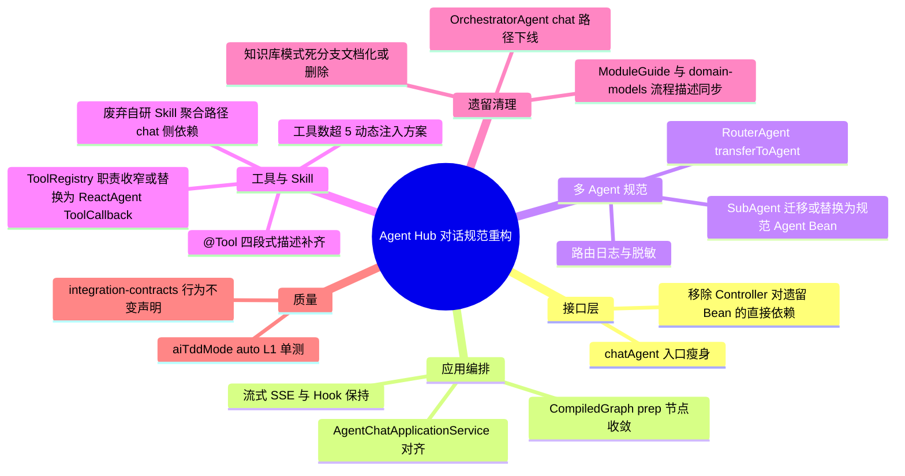

## Why
（为什么要做）

### 背景与目标
- **背景**：Agent Hub 智能体对话入口 `POST /api/agent-hub/chat/agent`（`AgentHubController.chatAgent`）虽已委托 `AgentChatApplicationService` 并引入 **CompiledGraph prep**（`AgentGraphConfiguration` / `PrepareAgentChatNode`），但调用链上下游仍大量依赖**存量自研编排范式**：手写 `OrchestratorAgent`（含知识库模式等遗留分支）、关键词路由 `SubAgent`、自研 `Skill` 接口 + `ToolRegistry` 聚合工具、以及不符合四段式描述的 `@Tool`。这与 AetherStack 目标架构（`backend-design-guide.md` P2 Agent Hub Graph/ReactAgent 化、`spring-ai-multi-agent-standards.md` RouterAgent + 规范 `@Tool`）不一致，导致同一产品内 Knowledge Hub 已 Graph 化而 Agent Hub 仍「半迁移半遗留」，观测、测试与后续 HIL/多 Agent 扩展成本高。
- **目标**：以 `/chat/agent` 为边界，完成智能体对话链路的**规范对齐重构**：清理 `/chat/agent` 路径上不再需要的遗留 agents / skills / tools 及死代码引用；将子能力调度与工具调用替换为符合规范的 **RouterAgent / ReactAgent + Spring AI `@Tool`** 实例（参考 `springai/projectpractice/recommendedpackaging` 与 `spring-ai-multi-agent-standards.md`）；保持 **REST/SSE 契约不变**（非 BREAKING）；使 Controller 仅承担 HTTP/SSE 与 DTO 转换，业务编排在 ApplicationService + Graph/Agent Configuration。

本变更是 `backend-design-guide.md` **P2 Agent Hub Graph 化**的首个可交付切片：聚焦生产对话主路径，而非需求开发工作流或 springai Demo。

## Jira / 需求链接

- 无工单

## What Changes
（变更内容）

### 需求概览（全局）

- **接口层**：`AgentHubController.chatAgent` 保持路径与 SSE 语义；移除该接口及直接关联路径对 `OrchestratorAgent`、`List<Skill>` 等遗留组件的不必要依赖（`/status` 等旁路接口的文档展示逻辑可单独在 design 评估，不在本变更扩大 scope 除非阻塞主路径）。
- **编排对齐**：巩固 `AgentChatApplicationService` + `AgentChatPrepGraph` 为唯一 prep 入口；`ORCHESTRATOR` / `SUB_AGENT` / 直答分支按规范重构——工具密集子路径优先 **ReactAgent**，多步有状态扩展保留 **CompiledGraph** 节点适配器模式（节点禁止 import `web.dto`、禁止节点内业务规则）。
- **多 Agent**：引入或对齐 **RouterAgent** 模式（`transferToAgent` + 子 Agent 边界描述）；将现有 `CustomerServiceAgent`、`DataAnalysisAgent`、`CodeGenerationAgent` 等 SubAgent 的 chat 侧调用改为规范 Agent 实例（design 阶段对照 `recommendedpackaging` 给出逐一映射表）。
- **Skill / Tool 清理**：`/chat/agent` 链路不再依赖自研 `Skill.getPromptAugmentation()` + `Skill.getTools()` 注入编排器；保留的生产工具统一为 Spring AI `@Tool` Bean，描述符合四段式；`ToolRegistry` 若仍服务 MCP/状态页则收窄职责，chat 主路径改由 ReactAgent / ChatClient 官方 ToolCallback 集成。
- **遗留下线**：`OrchestratorAgent.process(…, AGENT)` 及 chat 相关分支标记废弃并移除调用；`processKnowledgeMode` 等无 HTTP 入口的死路径一并清理或 `@Deprecated` 文档化（与 `domain-models.md`「知识库对话唯一入口」一致）。
- **契约**：`POST /api/agent-hub/chat/agent` 请求/响应/SSE 事件序列 **不变**（**非 BREAKING**）；OpenSpec 与 `integration-contracts.yaml` 仅增量登记内部重构说明。
- **文档**：更新 ai 仓库 `AgentHubController` 流程图、`AgentModuleGuide` / `SkillModuleGuide` / `ToolModuleGuide` 中与 chat 路径矛盾的描述；同步治理仓 `domain-models.md` 智能体对话流程为 Graph + Router/ReactAgent。

## Capabilities
（能力范围）

### New Capabilities（新增能力）
- （无新增业务能力；本变更为存量能力规范对齐）

### Modified Capabilities（变更能力）
- `aether-agent/agent-chat`：Agent Hub 智能体模式对话（`/chat/agent`）的编排、路由、工具调用与遗留组件清理

## Impact
（影响分析）

> proposal.md 不做技术分析，仅简述影响。完整 Impact 清单在 design.md 中展开。

- **后端（ai）**：`agents/web/AgentHubController`、`agents/application/AgentChatApplicationService`、`agents/graph/**`、`agents/agent/orchestrator/OrchestratorAgent`（chat 路径下线）、`agents/agent/subagent/**`、`agents/skill/**`、`agents/tool/ToolRegistry` 及 `tool/functions/**`；可能新增 `agents/agent/router/**` 或 `agents/agent/react/**` Configuration Bean；L1 模块（prep 节点、ApplicationService 流式分支、路由决策）触发 **AI-TDD auto**。
- **前端（ai_react）**：无 UI 变更（`uiCraftMode: disabled`）；若 SSE 前缀文本格式有微调需联调验证，design 须明确是否属 BREAKING（默认保持）。
- **契约**：HTTP 路径与 JSON 字段不变；SSE chunk 顺序与 `[路由摘要]` 前缀语义默认保持。
- **范围外**：`POST /api/agent-hub/requirement-dev` 工作流 Graph 化；Knowledge Hub RAG；springai Demo 包改造；MCP 管理 UI；数据库结构变更。
