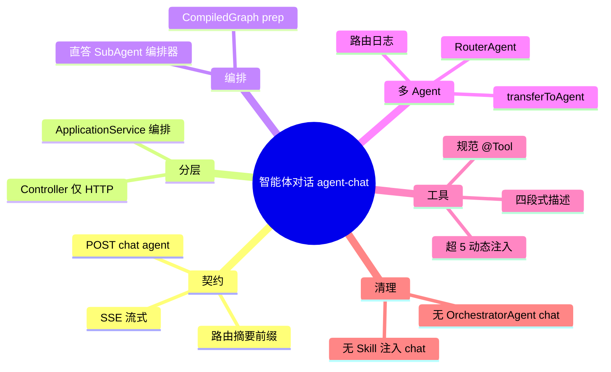

# Agent Hub 智能体对话

## Agent Hub / 智能体模式对话 需求说明（前提/操作/结果）
> 用户在 Nebula Desk 选择「智能体对话」后，通过 SSE 与多智能体系统交互：系统识别意图、路由至合适子能力或编排器，按需调用工具并流式返回答案。
> 本 spec 定义 `/chat/agent` 链路在**规范对齐重构后**的目标行为；HTTP 路径与对外 SSE 语义保持不变（非 BREAKING）。
> 范围外：知识库问答（`/chat/knowledge`）、需求开发（`/requirement-dev`）、springai Demo。

---

## MODIFIED Requirements
（存量能力规范对齐——重构后目标行为）

### 功能组 1：接口契约与分层

### Requirement: 1. 智能体对话 REST/SSE 契约保持不变

系统应当（SHALL）继续通过 `POST /api/agent-hub/chat/agent` 接收 JSON 请求体（含 `conversationId` 与 `message`），并以 `text/event-stream` 流式返回文本分片；请求字段名、HTTP 状态码语义与成功路径下的 SSE 帧格式与重构前保持一致，调用方（Nebula Desk）无需修改 URL 或请求结构。

#### 场景: 正常发起智能体对话
- **前提**：用户已在 Nebula Desk 选择智能体模式，后端服务可用。
- **操作**：前端 POST `/api/agent-hub/chat/agent`，body 含非空 `message` 与可选 `conversationId`。
- **结果**：HTTP 200，`Content-Type` 为 SSE；响应体持续输出文本 chunk 直至流结束；无 JSON 包装整段答案。

#### 场景: 缺少必填消息
- **前提**：调用方 omit 或传空 `message`。
- **操作**：POST `/api/agent-hub/chat/agent`。
- **结果**：返回 4xx 客户端错误或等价校验失败响应；不返回 200 空流伪装成功（具体错误码由 design 对齐存量行为）。

---

### Requirement: 2. Controller 仅承担 HTTP/SSE 与指标

系统应当（SHALL）使 `AgentHubController.chatAgent` 仅负责接收 DTO、调用应用层 `streamAgentChat`、记录对话指标（如 Micrometer Timer），不在 Controller 内执行意图路由、工具选择、Prompt 拼装或 LLM 调用；Controller 对 `/chat/agent` 路径不得直接依赖 `OrchestratorAgent` 或 `List<Skill>`。

#### 场景: 入口委托应用层
- **前提**：应用已启动，CompiledGraph 与 Agent Bean 已装配。
- **操作**：调用 `POST /api/agent-hub/chat/agent`。
- **结果**：请求经 `AgentChatApplicationService.streamAgentChat` 处理；Controller 方法体无业务分支除指标 Hook。

#### 场景: Controller 依赖瘦身
- **前提**：代码审查或静态依赖分析针对 `AgentHubController`。
- **操作**：检查 `/chat/agent` 相关 import 与字段注入。
- **结果**：chat 路径不注入 `OrchestratorAgent`；chat 路径不注入 `List<Skill>`；`ToolRegistry` 若仍存在仅服务 `/status` 等非 chat 旁路（design 明确清单）。

---

### 功能组 2：编排与 Graph Prep

### Requirement: 3. CompiledGraph Prep 为智能体对话唯一 Prep 入口

系统应当（SHALL）通过启动期编译的单例 `AgentChatPrepGraph`（CompiledGraph Bean）完成每轮对话的 prep 阶段（上下文加载、意图路由决策、流式路径选择、路由摘要生成），由 `AgentChatApplicationService` 同步 `invoke` 后按 `STREAM_ROUTE` 分支输出正文流；不得在 `/chat/agent` 路径调用 `OrchestratorAgent.process` 作为 prep 或正文来源。

#### 场景: Prep 图单次 invoke
- **前提**：用户发送一条新消息。
- **操作**：`AgentChatApplicationService.streamAgentChat` 处理该轮。
- **结果**：每轮恰好 invoke 一次 prep CompiledGraph（单例 Bean，非每次请求 compile）；产出含 `streamRoute` 与可选 `directAnswer` 的 prep 结果。

#### 场景: 流式路径三分支
- **前提**：Prep 已完成，路由决策已写入 state。
- **操作**：ApplicationService 解析 `STREAM_ROUTE`。
- **结果**：`DIRECT_WEATHER` / `DIRECT_DATETIME` 输出确定性直答；`SUB_AGENT` 委托规范子 Agent；`ORCHESTRATOR` 走编排器 LLM 流式路径；三路均经统一前缀与生命周期 Hook 包装。

#### 场景: SSE 前缀与 Hook 保持
- **前提**：路由产生用户可见摘要或记忆压缩提示。
- **操作**：完成一轮对话流。
- **结果**：正文流前仍输出路由摘要前缀（及可选压缩提示）；流结束或异常时仍发布 `AfterAgentCallEvent` / `OnErrorAgentEvent`（语义与重构前一致）。

---

### 功能组 3：多 Agent 路由

### Requirement: 4. 规范 RouterAgent 调度子能力

系统应当（SHALL）在智能体对话编排路径采用符合 `spring-ai-multi-agent-standards.md` 的路由机制：统一 RouterAgent（或等价 Router 组件）通过 `transferToAgent` 将用户意图分发至垂直子 Agent（如客服、数据分析、代码生成）；每个子 Agent 在 Router 描述中声明能力边界与反例；`/chat/agent` 不得再依赖纯关键词 `SubAgent.matchScore` 作为唯一路由机制（可保留为 Router 输入信号之一，但不得替代规范 Router 决策）。

#### 场景: 路由至客服子 Agent
- **前提**：用户输入明确属于客服域（如订单、售后咨询）。
- **操作**：发起智能体对话。
- **结果**：Router 选择客服子 Agent；SSE 前缀展示路由到的智能体名称；回答由该子 Agent 流式产出。

#### 场景: 路由至编排器兜底
- **前提**：用户输入无明确垂直域命中或属通用问答。
- **操作**：发起智能体对话。
- **结果**：Router 选择编排器路径；LLM 流式回答；前缀标识为编排器或等价文案。

#### 场景: 路由决策可观测
- **前提**：系统开启结构化日志。
- **操作**：完成一次含路由的对话。
- **结果**：日志记录选中子 Agent 名称、traceId/sessionId（或 conversationId）；不记录完整用户密钥或 PII 明文。

---

### 功能组 4：工具与 Skill 规范

### Requirement: 5. Chat 路径不依赖自研 Skill 聚合

系统应当（SHALL）使 `/chat/agent` 编排链路不再通过自研 `Skill` 接口的 `getPromptAugmentation()` / `getTools()` 向编排器注入能力；Prompt 增强与工具暴露改由规范 Agent Configuration、外部化 Prompt 模板或 Spring AI `@Tool` Bean 承担；存量 `ProductivitySkill` 等若仍保留，不得作为 chat 主路径必需依赖。

#### 场景: 无 Skill 注入编排器
- **前提**：Spring 容器中 `List<Skill>` 为空或 Skill Bean 未启用。
- **操作**：调用 `/chat/agent` 完成一轮需工具或子 Agent 的对话。
- **结果**：对话仍可完成；不因 Skill 缺失导致 NPE 或启动失败（chat 路径）。

#### 场景: 工具经 ReactAgent 或 ChatClient 集成
- **前提**：子 Agent 或编排器需调用本地 `@Tool`。
- **操作**：用户提问触发工具调用（如日期、天气、文件操作）。
- **结果**：工具通过 Spring AI ToolCallback / ReactAgent 官方机制执行；不经 chat 主路径调用 `ToolRegistry.resolveForPlan` 手写拼装。

---

### Requirement: 6. 生产 @Tool 描述符合四段式规范

系统应当（SHALL）确保 `/chat/agent` 链路可能被 LLM 选中的全部 `@Tool` 方法 description 包含四段：功能说明、典型问法（≥2）、反例（不适用场景）、前提条件（可选）；静态检查脚本 `check-spring-ai-tools.ps1` 对 agents 模块扫描无新增违规。

#### 场景: 存量工具描述补齐
- **前提**：某 `@Tool` 原 description 仅一句话。
- **操作**：执行 `make verify` 或 `check-spring-ai-tools.ps1`。
- **结果**：该工具 description 已补齐四段；脚本通过或仅报告 scope 外存量项（design 列出豁免清单）。

#### 场景: 新增工具默认合规
- **前提**：本变更新增 chat 可用 `@Tool`。
- **操作**：代码审查与静态检查。
- **结果**：新工具创建时即含四段描述；design 工具清单表已登记。

---

### Requirement: 7. 单次 LLM 工具候选不超过 5 个

系统应当（SHALL）保证任一 `/chat/agent` 路径下单次 LLM Function Calling 上下文注入的工具定义不超过 5 个；当注册工具总数超过 5 时，必须按用户 prompt 经向量检索动态注入 Top 3~5 命中工具，而非全量注入。

#### 场景: 工具总数不超过上限
- **前提**：当前会话可用工具 ≤5。
- **操作**：用户发起可能触发工具调用的对话。
- **结果**：LLM 请求中工具定义数量 ≤5；调用行为正确。

#### 场景: 工具总数超过上限
- **前提**：注册工具 >5（含 MCP 与本地工具合计，按 design 计数口径）。
- **操作**：用户输入与某子集工具语义相关。
- **结果**：仅 Top 3~5 相关工具注入当次 LLM 上下文；未命中工具不参与本轮候选；design 说明向量索引更新策略。

---

### 功能组 5：遗留清理与文档

### Requirement: 8. 移除 OrchestratorAgent 在 Chat 路径的调用

系统应当（SHALL）移除或废弃 `/chat/agent` 对 `OrchestratorAgent.process(conversationId, userInput, AGENT)` 及等价入口的一切调用；`OrchestratorAgent` 中无 HTTP 入口的知识库模式分支（`processKnowledgeMode`）须标记废弃或删除，并与 `domain-models.md`「知识库对话唯一入口为 KnowledgeHubController」一致。

#### 场景: Chat 不经过 OrchestratorAgent
- **前提**：代码库已完成重构。
- **操作**：静态搜索 `/chat/agent` 调用链。
- **结果**：无 `OrchestratorAgent.process` 自 Controller 或 `AgentChatApplicationService` 调用；grep 仅余 `/status` 或 requirement-dev 等 scope 外引用（若有须在 design Impact 说明）。

#### 场景: 知识库模式无 Agent Hub Chat 入口
- **前提**：用户期望在智能体模式做知识库 RAG。
- **操作**：仅调用 `/chat/agent`。
- **结果**：不触发 agents.knowledge 向量 RAG 主路径；产品文档指引用户使用 `/chat/knowledge`；无静默降级为旧 KNOWLEDGE 模式。

---

### Requirement: 9. 模块文档与领域流程描述同步

系统应当（SHALL）更新 ai 仓库内 Agent Hub 流程图与 ModuleGuide（`AgentModuleGuide`、`SkillModuleGuide`、`ToolModuleGuide`），以及治理仓 `domain-models.md` 中「智能体对话」流程描述，使其反映 Graph prep + Router/ReactAgent 目标架构，不再表述为「OrchestratorAgent → SubAgent」单一手写链路。

#### 场景: 流程图与实现一致
- **前提**：重构已合并。
- **操作**：阅读 `AgentHubController` 流程图与 `domain-models.md` §智能体对话。
- **结果**：文档调用链与代码一致；明确 CompiledGraph prep 与 ApplicationService 流式分支。

#### 场景: ModuleGuide 无矛盾指引
- **前提**：新开发者阅读 Skill/Tool 模块指南。
- **操作**：按指南扩展 chat 能力。
- **结果**：指南指向 `@Tool` + Agent Configuration 模式；不再要求「新增 Skill 即可注入 OrchestratorAgent」作为 chat 主路径。

---

### Requirement: 10. L1 模块具备 AI-TDD 单测覆盖（auto 评估）

当 design 阶段判定本变更触及 L1 模块（CompiledGraph prep 节点、ApplicationService 流式分支、路由决策）时，系统应当（SHALL）为这些模块提供 `AUTO-AI-UT` 单元测试：Mock ChatClient/LLM 外部依赖，断言 Prompt 关键片段与 `STREAM_ROUTE` 分支行为，Flux 路径使用 `StepVerifier`；测试通过后方可标记对应实现任务完成。

#### 场景: Prep 路由分支单测
- **前提**：`aiTddMode: auto` 且 design 判定 L1 命中。
- **操作**：运行 `AgentChatDomainService` 或 prep 节点相关 `*Test.java`。
- **结果**：覆盖直答 / SubAgent / 编排器三路决策；无真实 DashScope 调用；`mvn -Dtest=... test` 通过。

#### 场景: ApplicationService 流式组装单测
- **前提**：同上。
- **操作**：运行 `AgentChatApplicationServiceTest`（或等价）。
- **结果**：验证路由摘要前缀顺序、Hook 事件发布；Mock prep 结果驱动流式输出。
