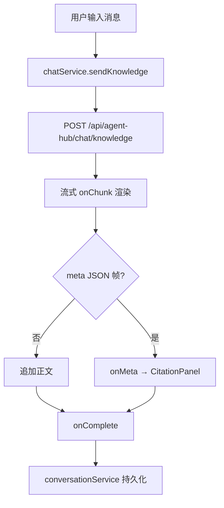
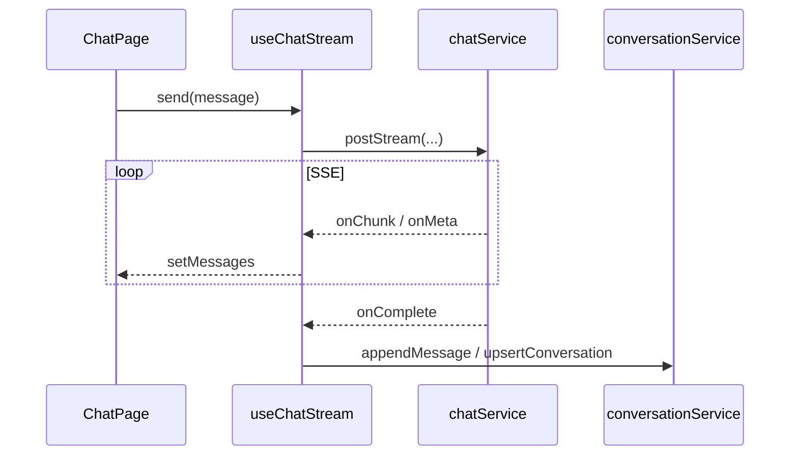

# Nebula Desk Umi 重构 - 技术方案

> 基于 `design-draft.md`（用户「继续」→ 选项 B AI 起草）。  
> 业务需求详见：`openspec/specs/aether-frontend-umi-desk/spec.md`

## 一. 概述

### 1.1 术语

| 术语 | 英文 | 说明 |
|------|------|------|
| Nebula Desk | — | ai_react 前端产品名 |
| harness | — | 项目工程 CLI 封装（install/dev/build/lint） |
| SSE | Server-Sent Events | 三种聊天模式的流式响应 |
| meta 帧 | — | 知识库模式流结束后 JSON citations 事件 |
| HIL | Human-in-the-loop | 人工审核演示 REST（`/springai/demo/...`） |

### 1.2 需求背景

**需求描述**：弃用 ai_react 存量 Vite + JS 实现，以 Umi 4 + TypeScript + Ant Design 5 全量重写，保留 API 语义与页面信息架构，对齐 `frontend-umi-standards.md`。

**产品 PRD**：无工单；`React重构.md` + proposal/spec 为需求来源。

### 1.3 本期目标

| 序号 | 内容 | 任务点 |
|------|------|--------|
| 1 | Umi 4 + harness 骨架 | `.umirc.ts`、约定式路由、env、代理 |
| 2 | OpenAPI + services | typings、request 拦截、SSE 封装、域服务 |
| 3 | 全局 Layout U1 | 侧边栏三模块、历史会话、i18n |
| 4 | 聊天工作台 U1 | 三 SSE 模式 + citations + 防重复发送 |
| 5 | 知识库模块 | CRUD、上传、批量删除 |
| 6 | 人工审核 U1 | 三 Tab HIL |
| 7 | Agent Hub + 设置 | status 浏览、主题/语言/阈值 |
| 8 | 状态分层 | Zustand 客户端 + React Query 服务端 |
| 9 | 文档与契约 | ARCHITECTURE、integration-contracts 引用更新 |

### 1.4 影响分析

**受影响的系统：**
- [x] 前端 **ai_react**（全仓库级重构）
- [x] 治理层 **AetherStack**（integration-contracts、api-contracts.yaml、tech-stack 引用）
- [ ] 后端 **ai** — 无 BREAKING；springdoc 供类型生成
- [ ] 数据库 — 无

**AI-TDD 评估（aiTddMode: disabled）**：不涉及后端 L1 AI 模块，**不适用**。

**UI-Craft 评估（uiCraftMode: enabled）**：design 含大量 U1 界面；apply 阶段 U1 任务须 Impeccable + `impeccable:` 验收标记。

---

## 二. 业务分析

### 2.1 业务用例

```mermaid
flowchart LR
  User((用户))
  Desk[Nebula Desk Umi]
  AH[/api/agent-hub/*]
  SA[/api/super-agents/*]
  HIL[/springai/demo/human-loop/*]

  User --> Desk
  Desk -->|SSE REST| AH
  Desk -->|SSE| SA
  Desk -->|REST| HIL
```

### 2.2 业务流程

#### 2.2.1 知识库 SSE 对话



#### 2.2.2 页面导航（Umi 路由）

```mermaid
flowchart TD
  L[BasicLayout] --> C1[/chat/knowledge]
  L --> C2[/chat/agent]
  L --> C3[/chat/requirement-dev]
  L --> C4[/chat/human-review]
  L --> K1[/knowledge/upload]
  L --> K2[/knowledge/bases]
  L --> A1[/agent-hub/skills]
  L --> A2[/agent-hub/agents]
  L --> A3[/agent-hub/tools]
  L --> A4[/agent-hub/mcp]
  L --> S[/settings]
```

### 2.3 业务场景

详见：`openspec/specs/aether-frontend-umi-desk/spec.md`

---

## 三. 系统设计

### 3.1 目标目录结构（ai_react）

```text
ai_react/
├── .umirc.ts
├── .env / .env.example
├── package.json              # scripts → harness 转发
├── scripts/harness.mjs       # install|dev|build|lint 入口
├── src/
│   ├── app.tsx               # ConfigProvider + QueryClientProvider
│   ├── global.less
│   ├── layouts/
│   │   └── BasicLayout/
│   │       ├── index.tsx
│   │       ├── index.less
│   │       └── types.ts
│   ├── pages/
│   │   ├── chat/knowledge/index.tsx
│   │   ├── chat/agent/index.tsx
│   │   ├── chat/requirement-dev/index.tsx
│   │   ├── chat/human-review/index.tsx
│   │   ├── knowledge/upload/index.tsx
│   │   ├── knowledge/bases/index.tsx
│   │   ├── agent-hub/skills/index.tsx
│   │   ├── agent-hub/agents/index.tsx
│   │   ├── agent-hub/tools/index.tsx
│   │   ├── agent-hub/mcp/index.tsx
│   │   └── settings/index.tsx
│   ├── components/           # 按域分子目录
│   ├── hooks/
│   ├── models/               # useAppStore.ts 等
│   ├── services/
│   ├── types/
│   ├── utils/                # StreamSse.ts 等
│   ├── openapi/              # 自动生成 + request.ts 配置
│   └── locales/              # zh-CN.ts en-US.ts（或等价）
└── legacy-vite/              # 可选：归档旧 Vite 源码至 cutover 前参考
```

**存量对照（将废弃）**：

| 存量路径 | 问题 | 目标 |
|----------|------|------|
| `src/pages/HomePage.jsx` (~1100 行) | 视图+聊天+历史+API 耦合 | 拆至 layout + pages + hooks |
| `src/api/*.js` | 无类型、页面可间接 fetch | `services/` + openapi |
| `src/utils/request.js` | Vite import.meta.env | 迁入 openapi/request + StreamSse |
| `src/app/App.jsx` | 仅包装 HomePage | Umi `app.tsx` 根 providers |

### 3.2 领域模型图（前端边界）

无 DDD 聚合；按 **UI 域 + services 域** 划分：

| 域 | services | 页面 |
|----|----------|------|
| Chat | chatService, conversationService | pages/chat/* |
| Knowledge | knowledgeService | pages/knowledge/* |
| AgentHub | agentHubService | pages/agent-hub/* |
| HumanLoop | humanLoopService | pages/chat/human-review |
| App | conversationConfigService | pages/settings |

### 3.3 状态管理边界

| 状态 | 存储 | 说明 |
|------|------|------|
| theme, language, sidebarCollapsed | Zustand `useAppStore` | 持久化 localStorage |
| 当前 chatMode | **URL 路由** | 替代 `sidebarView` 字符串 |
| conversationId（当前会话） | 页面级 state 或 URL query | 与现网一致可 page state |
| 历史列表、KB 列表、status | React Query | key 含 mode/tenant |
| 流式 messages | 组件 useState + useChatStream hook | 不进入 Zustand |

### 3.4 前端 UI 界面清单（uiCraftMode: enabled）

| 界面/组件 | 路径（ai_react） | UI 类型 | Impeccable | 说明 |
|-----------|------------------|---------|------------|------|
| 全局布局 | `src/layouts/BasicLayout/` | U1 | **UI-CRAFT** | 侧栏三模块、历史列表槽、顶栏 |
| 知识库对话页 | `src/pages/chat/knowledge/` | U1 | **UI-CRAFT** | 消息流 + 输入 + citations |
| 智能体对话页 | `src/pages/chat/agent/` | U1 | **UI-CRAFT** | 可复用 ChatShell 组件 |
| 需求开发对话页 | `src/pages/chat/requirement-dev/` | U1 | **UI-CRAFT** | 复用 ChatShell |
| 引用来源面板 | `src/components/chat/KnowledgeCitationPanel/` | U1 | **UI-AUDIT** | 对齐现网 citations UX |
| 知识库管理 | `src/pages/knowledge/bases/` | U1 | **UI-CRAFT** | Table + 表单 Modal |
| 文档上传 | `src/pages/knowledge/upload/` | U1 | **UI-CRAFT** | Upload Dragger + 进度 |
| 人工审核工作台 | `src/pages/chat/human-review/` | U1 | **UI-CRAFT** | 三 Tab（复刻现网能力） |
| HIL 子面板 | `src/components/humanLoop/*` | U1 | **UI-CRAFT** | Draft/Tool/Enterprise |
| 设置页 | `src/pages/settings/` | U1 | **UI-AUDIT** | 主题/语言/检索阈值 |
| Agent Hub 浏览 | `src/pages/agent-hub/*` | U1 | **UI-AUDIT** | status JSON 展示 |
| openapi/services | `src/services/**` | U3 | UI-FUNC | 无视觉 |
| harness/scripts | `scripts/harness.mjs` | U3 | UI-FUNC | 工程 |

**Impeccable 执行顺序（apply）**：
1. `node .cursor/skills/impeccable/scripts/context.mjs`（在 ai_react）
2. `/impeccable shape BasicLayout` → `craft BasicLayout`
3. `/impeccable shape chat/knowledge` → `craft`（ChatShell 可 shape 一次复用）
4. `/impeccable craft human-review` + 子面板
5. `/impeccable audit settings`、agent-hub 页

---

## 四. 详细设计

### 4.1 harness CLI 设计

`scripts/harness.mjs` 转发至 npm（对外禁止直接 npm 的规范由文档+CI 约束）：

| 命令 | 内部实现 |
|------|----------|
| `harness install` | `npm install` |
| `harness dev` | 先 `openapi:gen`（若配置）→ `max dev` |
| `harness build` | `tsc --noEmit` + `max build` + `playwright test`（P6 起启用；P0~P5 仅 `tsc + build`，见 DR-03） |
| `harness lint` | `eslint` + `stylelint` + `tsc --noEmit` |

`package.json` 增加 `"bin": { "harness": "./scripts/harness.mjs" }` 或 `npx node scripts/harness.mjs <cmd>`。

**脚手架选型**：采用 **`@umijs/max`**（Umi 4 + Ant Design 5 官方插件集），与 `frontend-umi-standards.md` 一致；REST 统一 `import { request } from '@umijs/max'`。

### 4.2 `.umirc.ts` 要点

```typescript
// 伪代码 — 实现时以 Umi 4 文档为准
export default {
  npmClient: 'npm',
  conventionRoutes: { base: 'src/pages' },
  define: {
    'process.env.API_BASE': process.env.API_BASE || '',
  },
  proxy: {
    '/api': { target: process.env.API_PROXY_TARGET || 'http://localhost:8080', changeOrigin: true },
    '/springai': { target: process.env.API_PROXY_TARGET || 'http://localhost:8080', changeOrigin: true },
  },
  plugins: ['@umijs/plugins/dist/antd'],
  antd: {},
  locale: { default: 'zh-CN', baseSeparator: '-' },
  openAPI: [
    {
      requestLibPath: "import { request } from '@umijs/max'",
      schemaPath: process.env.OPENAPI_SCHEMA_URL || 'http://localhost:8080/v3/api-docs',
      projectName: 'openapi',
    },
  ],
};
```

**OpenAPI 生成失败降级**：dev 初段可提交 `openapi-spec/agent-hub.fragment.yaml`（仓库根或 `config/` 下，仅 Agent Hub 路径），待后端就绪后切 springdoc URL；**禁止**在 `pages/`/`components/` 手写 DTO。

### 4.3 SSE 封装设计

从存量 `src/utils/request.js` **提取行为**（非拷贝代码），新建 `src/utils/StreamSse.ts`：

- `postStream(url, body, handlers)`：基于 **`fetch` + ReadableStream**（仅此文件允许 fetch，见 DR-01）
- `includeInFullText` 钩子（knowledge meta 过滤）
- 错误统一抛 `RequestError` 供 request 拦截器 message.error
- **仅** `services/chatService.ts` 调用 `postStream`；页面/组件不得 import StreamSse

**与 frontend-umi-standards 的关系**：REST 走 `@umijs/max` `request`；SSE 因 Umi request 不原生支持 ReadableStream 消费，在 **services 层** 通过 `StreamSse.ts` 集中封装，视为规范允许的 transport 例外。

`chatService.ts` 三种方法：

| 方法 | 路径 | 请求体差异 |
|------|------|------------|
| `sendKnowledgeChat` | `POST /api/agent-hub/chat/knowledge` | `conversationId, sessionId, message, knowledgeBaseIds?` |
| `sendAgentChat` | `POST /api/super-agents/chat` | `conversationId, message` + Header `X-Tenant-Id` |
| `sendRequirementDevChat` | `POST /api/agent-hub/requirement-dev` | `conversationId, requirement` |

Mock 开关：`process.env.MOCK_CHAT === 'true'`（对应存量 `VITE_USE_MOCK_CHAT`）。

Knowledge meta 解析：迁移 `utils/knowledgeCitation.js` 逻辑至 `utils/KnowledgeCitation.ts`（纯函数 + 类型守卫）。

### 4.4 services ↔ integration-contracts 映射

| service 方法 | HTTP | 存量参考 |
|--------------|------|----------|
| `chatService.sendKnowledgeChat` | POST `/api/agent-hub/chat/knowledge` | `api/chat.js` |
| `chatService.sendAgentChat` | POST `/api/super-agents/chat` | `api/chat.js` |
| `chatService.sendRequirementDevChat` | POST `/api/agent-hub/requirement-dev` | `api/chat.js` |
| `agentHubService.getStatus` | GET `/api/agent-hub/status` | `api/agentHub.js` |
| `knowledgeService.*` | CRUD `/api/agent-hub/knowledge-bases` 等 | `api/knowledge.js` |
| `conversationService.*` | `/api/agent-hub/conversations` 系列 | `api/conversationHistory.js` |
| `conversationConfigService.get/setThreshold` | conversation-config API | `api/conversationConfig.js` |
| `humanLoopService.*` | `/springai/demo/alibaba-graph/human-loop/*` | `api/humanLoop.js` |

**P1 范围外（本期可选）**：`GET/POST /api/super-agents/agents` 管理接口——design 保留 `agentHubService.listAgents` 占位，tasks 标为可选。

### 4.5 Layout 与路由映射（存量 → 新）

| 存量 `sidebarView` / 模块 | Umi 路由 |
|---------------------------|----------|
| `knowledgeChat` | `/chat/knowledge` |
| `agentChat` | `/chat/agent` |
| `projectManagerChat` | `/chat/requirement-dev` |
| `humanReview` | `/chat/human-review` |
| `uploadDocument` | `/knowledge/upload` |
| `knowledgeBaseManager` | `/knowledge/bases` |
| `skills` | `/agent-hub/skills` |
| `agents` | `/agent-hub/agents` |
| `tools` | `/agent-hub/tools` |
| `mcpCallbacks` | `/agent-hub/mcp` |
| `settings` | `/settings` |

`BasicLayout` 菜单 `onClick` → `history.push`；历史会话列表仅在 `/chat/*` 路由下展示，按 path 推导 `chatMode` 过滤 Query。

### 4.6 组件时序（发送消息）



### 4.7 分阶段实施

| Phase | 交付 | 验收 |
|-------|------|------|
| P0 | harness + Umi 空壳 + proxy | `harness dev` 可打开 |
| P1 | openapi + services + StreamSse | 单测/手测 REST |
| P2 | BasicLayout + 空 pages | 路由与菜单完整 |
| P3 | 三聊天页 + conversation | SSE 联调 |
| P4 | knowledge + settings | CRUD/上传 |
| P5 | human-review + agent-hub | HIL + status |
| P6 | 删 Vite 入口、Playwright 冒烟 E2E、文档 | lint/build/e2e 门禁 |

**现网 UX  parity 清单（tasks 对照）**：打字机效果（TypewriterText）、三主题品牌（dzj/lv/yxy）、RetrievalThresholdSettings、KnowledgeCitationPanel、UploadDocument 进度反馈——均须在对应页面/tasks 中显式覆盖，不可默认省略。

---

## 五. 接口设计

### 5.1 后端 REST/SSE（无变更）

**非 BREAKING**。完整白名单见 `integration-contracts.md` §3。

### 5.2 前端 services 类型示例

```typescript
// services/chatService.ts — 示意
import type { KnowledgeChatRequest, ChatStreamHandlers } from '@/openapi/typings';
import { postStream } from '@/utils/StreamSse';

export function sendKnowledgeChat(body: KnowledgeChatRequest, handlers: ChatStreamHandlers) {
  return postStream('/api/agent-hub/chat/knowledge', body, {
    ...handlers,
    includeInFullText: (chunk) => !isKnowledgeMetaPayload(chunk),
  });
}
```

### 5.3 环境变量

| 变量 | 用途 | 存量对应 |
|------|------|----------|
| `API_PROXY_TARGET` | Umi proxy 目标 | `VITE_API_PROXY_TARGET` |
| `API_BASE` | 生产 API 前缀 | `VITE_API_BASE_URL` |
| `MOCK_CHAT` | 本地 mock 流 | `VITE_USE_MOCK_CHAT` |
| `SUPER_AGENTS_TENANT_ID` | 智能体租户 | `VITE_SUPER_AGENTS_TENANT_ID` |
| `OPENAPI_SCHEMA_URL` | 类型生成 | 新增 |

### 5.4 错误处理

- HTTP 4xx/5xx：`request` 拦截器 → Ant Design `message.error`
- SSE 中断：useChatStream 重置 `isSending`；展示「连接中断，请重试」
- HIL JSON 非 JSON：`humanLoopService` 抛出可读 Error（对齐存量 `handleJson` 语义）

---

## 六. 代码改造分析

### 6.1 存量文件处置

| 文件 | 动作 |
|------|------|
| `src/pages/HomePage.jsx` | 废弃；逻辑拆散 |
| `src/api/index.js` | 废弃；路径常量化入 openapi 或 `constants/ApiPaths.ts`（仅 path 字符串，非 DTO） |
| `src/utils/request.js` | 废弃；SSE → StreamSse.ts，REST → umi request |
| `src/services/conversationHistory.js` | 废弃；合并入 conversationService + Query hooks |
| `src/hooks/useTheme.js`, `useLanguage.js` | 废弃；迁入 useAppStore |
| `vite.config.js`, `index.html` (Vite) | cutover 后删除 |
| `src/components/*` | 参考布局重写，不拷贝 |

### 6.2 关键 Hook 设计

| Hook | 职责 |
|------|------|
| `useChatStream` | SSE 发送、messages 状态、isSending |
| `useConversationHistory` | React Query 列表 + 选中会话 |
| `useAgentHubStatus` | Query status API |

### 6.3 OpenSpec 前端 design 必填项（§5.13）

| 维度 | 本 design 章节 |
|------|----------------|
| Harness | §4.1、§3.1 目录 |
| OpenAPI API | §4.2、§4.4、§5.2 |
| 状态 | §3.3 |
| 组件 / U1 | §3.4 |

---

## 七. 非功能性需求

### 7.1 Assumptions

| 假设 | 失效风险 | 降级 |
|------|----------|------|
| 开发时 ai 后端 `:8080` 可访问 | 无法联调 SSE | 启用 MOCK_CHAT |
| springdoc 可生成 Agent Hub 路径 | typings 不完整 | 使用 fragment yaml 手工补全后仍禁止业务手写 DTO |
| 现网布局以 HomePage 为准 | 遗漏菜单项 | PR 对照 checklist（chatMode.js 全量映射） |
| HIL 仍走 `/springai/demo` | 404 | proxy 配置 + 文档说明需 demo profile |

### 7.2 性能

- SSE 流式渲染：消息列表虚拟化 **可选**（P6 优化）；首期与现网 parity
- React Query：`staleTime` 会话列表 30s

### 7.3 安全

- 不提交 `.env` 密钥；`X-Tenant-Id` 从 env 读取
- 无 `dangerouslySetInnerHTML` 渲染 LLM 输出（Markdown 若引入须 sanitize）

### 7.4 可观测性

- 前端 Micrometer 不适用；SSE 失败在 UI 层 message + 可选 console 仅 dev（不提交 prod）

### 7.5 验证

| 命令 | 场景 |
|------|------|
| `harness lint` | PR 必过 |
| `harness build` | 归档前必过 |
| `make verify` | AetherStack 治理层统一验证 |

---

## design.md 修订记录

| 版本 | 日期 | 说明 |
|------|------|------|
| 0.1 | 2026-06-03 | 初稿（design-draft → design，uiCraftMode auto→enabled） |
| 0.2 | 2026-06-03 | design-review 修订：Umi Max 选型、SSE fetch 例外、E2E 分阶段、UX parity 清单、路由图补全 |
