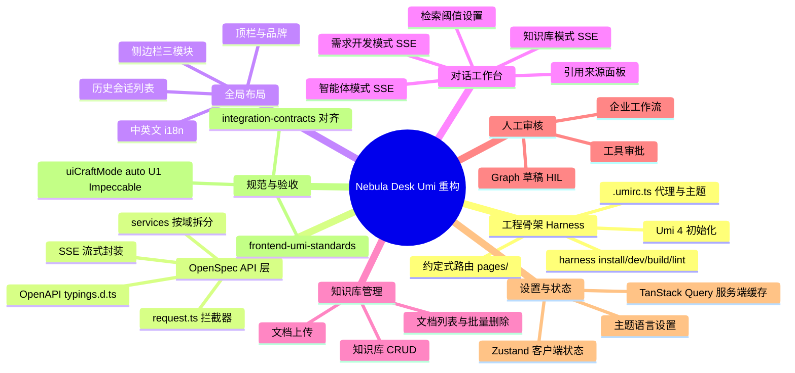

## Why
（为什么要做）

### 背景与目标
- **背景**：关联仓库 **ai_react**（Nebula Desk）当前为 **Vite 8 + JavaScript（JSX）** 单页应用，API 分散在 `src/api/`、SSE 解析在 `utils/request.js`，无 TypeScript 类型安全、无约定式路由、无统一工程 CLI。业务已覆盖知识库对话、智能体对话、需求开发对话、知识库管理、文档上传、会话历史、人工审核工作台、设置页等，且与后端 `integration-contracts.md` 中 REST/SSE 契约深度耦合。治理层已发布 **`frontend-umi-standards.md`**（Harness + OpenSpec + Superpower），但存量代码架构与之不兼容，继续叠加功能将导致维护成本与规范偏离持续扩大。
- **目标**：**从零重构** Nebula Desk——**原实现代码全部弃用**（不拷贝业务逻辑），仅从存量项目中提取 **API 交互语义** 与 **页面/导航布局结构** 作为参考；用 **React 18 + Umi 4 + TypeScript + Ant Design 5 + Zustand + OpenAPI 自动生成类型** 重新实现，工程操作统一 **`harness` CLI**，使前端与 AetherStack 前端规范、OpenSpec 接口契约驱动开发对齐。重构后在视觉与交互上与现网 Nebula Desk **保持一致**（侧边栏模块、聊天模式、知识库管理、人工审核等），后端 REST/SSE **行为不变（非 BREAKING）**。

## Jira / 需求链接

- 无工单

## What Changes
（变更内容）

### 需求概览（全局）

- **工程弃用与重建**：弃用现有 Vite 入口、`src/api/*.js` 直连模式及单文件巨型 `HomePage.jsx` 编排方式；在 **ai_react** 仓库内新建 Umi 4 工程结构（或分支级全量替换），**禁止**从旧代码拷贝实现逻辑。
- **接口层 OpenSpec 化**：基于后端 springdoc OpenAPI（或从存量 `integration-contracts.md` + 存量 API 文件推导的规范片段）生成 `src/openapi/typings.d.ts` 与 `src/openapi/request.ts`；所有 REST/SSE 调用经 `src/services/` 暴露，类型引用生成产物，**禁止**业务层手写 DTO。
- **布局与导航复刻**：用 Ant Design 5 `Layout` / `Menu` / `Sider` 重建全局壳层（`src/layouts/`），保留现网信息架构：
  - **对话**分组：知识库对话、智能体对话、需求开发对话、人工审核；
  - **知识库**分组：文档上传、知识库管理；
  - **Agent Hub** 运行时浏览（skills / agents / tools / mcpCallbacks）；
  - **设置**入口；会话历史侧栏（按 chatMode 过滤）。
- **核心页面重写**（Umi 约定式路由 + Ant Design 5）：
  - 聊天主工作台（三种 SSE 模式、消息流、打字机效果、知识库 meta/citations）；
  - 知识库管理与上传；
  - 人工审核工作台（三类 HIL Tab）；
  - 设置页（主题、语言、检索阈值等）。
- **状态管理分层**：Zustand（`src/models/useXxxStore.ts`）管理主题、侧边栏折叠、UI 偏好等**纯客户端状态**；服务端数据（会话列表、知识库、Agent 状态）使用 Umi `useRequest` 或 TanStack Query，**不**写入全局 Store。
- **SSE 契约保持**：继续支持 `integration-contracts.md` 所列路径与事件语义（含 knowledge 模式 `event: meta` 与 citations）；错误由全局拦截器统一处理。
- **SuperAgents 对接**：智能体对话优先对齐 `POST /api/super-agents/chat`（存量注释已指向此路径）；P1 管理接口（agents 列表/注册/health）可在后续 phase 或本变更 scope 内按 design 评估。
- **国际化**：保留中英文切换能力，文案组织方式在 design 中确定（Umi locale 或等价方案）。
- **UI-Craft**：`uiCraftMode: auto`——design 阶段列出 U1 界面清单；命中 U1 的任务在 apply 阶段走 Impeccable shape/craft 或 audit/polish。
- **文档**：更新 `ai_react/ARCHITECTURE.md`、`CHANGELOG.md`；`integration-contracts.md` 中前端引用路径改为新 `services/` 结构；`.aetherstack/context/api-contracts.yaml` 同步。

## Capabilities
（能力范围）

### New Capabilities（新增能力）
- `aether-frontend/umi-desk`：Nebula Desk 全量 Umi 4 重构（工程骨架、OpenAPI 类型层、布局、对话/知识库/人工审核/设置页面、Zustand 客户端状态、Harness 工程命令）

### Modified Capabilities（变更能力）
- （无独立 MODIFIED capability；后端 REST/SSE 契约行为不变，仅前端实现栈与目录结构变更）

## Impact
（影响分析）

> proposal.md 不做技术分析，完整 Impact 清单在 design.md 中展开。

- **前端（ai_react）**：**全仓库级重构**——技术栈由 Vite+JS 迁移至 Umi 4+TS；目录由 `src/api/` 迁移至 `services/` + `openapi/`；单页视图切换改为 Umi 约定式路由 + Layout；新增 `harness` CLI 封装；存量 Vite 构建脚本在迁移完成后退役或保留短期并行（由 design 决策）。
- **后端（ai）**：**无 BREAKING 变更**；需确保 springdoc OpenAPI 可被前端 harness dev 拉取或导出，供类型生成；SSE 事件格式不变。
- **治理层（AetherStack）**：`integration-contracts.md`、`tech-stack.md` 前端章节、`api-contracts.yaml` 引用路径更新；OpenSpec 变更 `frontend-umi-refactor` 驱动 spec/design/tasks。
- **UI-Craft**：大量 U1 界面（布局、聊天、知识库、人工审核、设置）预计触发 `uiCraftMode: enabled`；tasks 须含 Impeccable 任务与 `impeccable:` 验收标记。
- **AI-TDD**：`aiTddMode: disabled`——本变更不涉及后端 L1 AI 模块。
- **范围外**：不改造后端 Agent 编排；不新增业务 API；不包含 E2E 测试框架从零建设（除非 design 明确纳入）；springai Demo HIL 路径若与生产 Human Loop 分离，前端仅复刻已对接的 REST 网关（见存量 `humanLoop.js`）。
