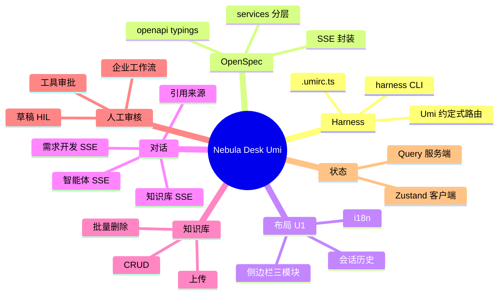

# Nebula Desk Umi 重构

## 前端工作台 / Nebula Desk 需求说明（前提/操作/结果）
> 将 Nebula Desk（ai_react）从 Vite + JavaScript 单页实现 **全量重构** 为 Umi 4 + TypeScript + Ant Design 5 工程。
> **原业务代码全部弃用**，仅从存量实现提取 API 交互语义与页面布局结构；后端 REST/SSE 契约 **行为不变（非 BREAKING）**。
> 工程须符合 `frontend-umi-standards.md`（Harness 工程化、OpenSpec 类型层、Superpower 组件与状态规范）。

---

## ADDED Requirements
（新增用户故事）

### 功能组 1：工程骨架与 Harness

### Requirement: 1. Umi 4 工程可通过 harness 命令完成安装、开发、构建与检查

系统应当（SHALL）在 ai_react 仓库提供符合 Umi 4 约定式目录结构的 Nebula Desk 工程，且所有工程操作（安装依赖、启动开发服务器、生产构建、代码检查）均通过 **harness** CLI 完成；开发者不得依赖直接调用 npm/yarn/pnpm 作为官方入口。

#### 场景: 新开发者首次启动
- **前提**：已克隆 ai_react 仓库，已配置 `.env`（含后端代理等），后端 ai 服务可选启动。
- **操作**：执行 `harness install`，再执行 `harness dev`。
- **结果**：依赖安装成功；开发服务器启动；浏览器可访问 Nebula Desk 入口页；`.umi/` 等生成目录由工具自动维护，无需手改。

#### 场景: 提交前质量检查
- **前提**：开发者完成一批前端改动。
- **操作**：执行 `harness lint`，再执行 `harness build`。
- **结果**：ESLint、Stylelint 与 TypeScript 编译检查通过；生产构建成功产出可部署静态资源；任一失败则命令以非零退出码结束。

#### 场景: 环境变量不可硬编码
- **前提**：工程需连接不同环境的后端地址。
- **操作**：审查业务源码与 `.umirc.ts`。
- **结果**：API 基址、代理目标等均来自 `.env` 或 Umi `define`；源码中无硬编码的后端 URL 或密钥。

---

### 功能组 2：OpenSpec API 类型层

### Requirement: 2. 接口类型由 OpenAPI 生成且业务层经 services 调用

系统应当（SHALL）基于后端 OpenAPI 规范自动生成 `src/openapi/typings.d.ts` 与 `src/openapi/request.ts`；所有 REST 与 SSE 请求经 `src/services/` 按业务域封装暴露；页面与组件 **不得** 直接调用 fetch/axios 或手写接口 DTO 类型。

#### 场景: 类型生成与引用
- **前提**：后端 springdoc OpenAPI 可用或等效规范片段已就绪。
- **操作**：执行 `harness dev`（或约定的类型生成步骤）。
- **结果**：`src/openapi/typings.d.ts` 更新；services 方法入参/返回值类型引用该文件；业务组件 import 的类型来自 openapi 或 services 导出，无重复定义。

#### 场景: 页面不直连 API
- **前提**：代码审查任意 `pages/` 或 `components/` 文件。
- **操作**：检查 import 与网络调用。
- **结果**：无对 `fetch`、`axios` 或 Umi `request` 的直接调用；网络访问仅出现在 `services/` 与 `openapi/request.ts` 配置层。

#### 场景: 全局错误处理
- **前提**：后端返回 4xx/5xx 或网络异常。
- **操作**：用户触发任意 REST 请求。
- **结果**：全局拦截器展示用户可读错误提示；业务页面无需重复 try-catch 网络错误（业务校验除外）。

---

### 功能组 3：全局布局与导航

### Requirement: 3. 全局布局复刻现网 Nebula Desk 信息架构（Impeccable U1）

系统应当（SHALL）在 `src/layouts/` 提供 Ant Design 5 全局壳层（侧边栏 + 主内容区），复刻现网信息架构：**对话**（知识库对话、智能体对话、需求开发对话、人工审核）、**知识库**（文档上传、知识库管理）、**Agent Hub 运行时浏览**（skills / agents / tools / mcpCallbacks）、**设置**；布局须通过 Umi 约定式路由与 `outlet` 渲染子页面；U1 界面须满足 Impeccable 视觉与可访问性基线。

#### 场景: 侧边栏模块与菜单切换
- **前提**：用户打开 Nebula Desk 主界面。
- **操作**：用户在对话、知识库、Agent Hub 各分组间切换子菜单。
- **结果**：主内容区切换为对应页面；当前菜单项呈选中态；侧边栏结构与现网 Nebula Desk 语义一致（分组名称与条目数量不减少）。

#### 场景: 会话历史侧栏
- **前提**：用户处于某一聊天模式（知识库 / 智能体 / 需求开发）。
- **操作**：用户查看侧边栏会话历史列表。
- **结果**：列表仅展示当前聊天模式下的会话；支持新建、选中、重命名、删除；选中后加载对应历史消息。

#### 场景: 中英文切换
- **前提**：用户在设置或顶栏切换语言。
- **操作**：切换中文与英文。
- **结果**：侧边栏、页面标题与主要按钮文案同步切换；无未翻译的占位 key 裸露展示。

---

### 功能组 4：SSE 对话工作台

### Requirement: 4. 三种聊天模式支持 SSE 流式对话与知识库引用展示

系统应当（SHALL）提供聊天主工作台，支持 **知识库模式**、**智能体模式**、**需求开发模式** 三种 SSE 流式对话；请求路径与语义对齐 `integration-contracts.md`（含 knowledge 模式流结束后的 meta 事件与 citations）；界面展示消息流、发送中状态，知识库模式须展示引用来源面板。

#### 场景: 知识库模式 SSE 与 citations
- **前提**：用户选择知识库对话，后端与向量库可用。
- **操作**：用户发送一条问题并等待流式响应完成。
- **结果**：助手回复以 token 流式展示；流结束后展示 session/meta 信息；若有 citations，引用来源面板列出文档名、预览与相关度；正文不含未解析的 meta JSON 残留。

#### 场景: 智能体模式 SSE
- **前提**：用户选择智能体对话，SuperAgents 或 Agent Hub 后端可用。
- **操作**：用户发送消息。
- **结果**：流式展示助手回复；错误时展示友好提示；对话可写入当前会话历史。

#### 场景: 需求开发模式 SSE
- **前提**：用户选择需求开发对话。
- **操作**：用户发送需求描述类消息。
- **结果**：流式展示编排回复；行为与现网需求开发对话一致；可持久化到会话历史。

#### 场景: 发送中防重复提交
- **前提**：上一轮 SSE 尚未结束。
- **操作**：用户再次点击发送。
- **结果**：发送按钮或输入区处于禁用或 loading 态；不产生并发重复请求。

---

### 功能组 5：会话历史持久化

### Requirement: 5. 会话与消息可与后端 conversation API 同步

系统应当（SHALL）支持通过 `integration-contracts.md` 所列 conversation 接口创建/列出/重命名/删除会话，以及读取与追加消息；前端会话 ID 与后端持久化语义保持一致，切换会话时正确加载历史消息。

#### 场景: 新建会话并首条消息后落库
- **前提**：用户在新会话中发送首条消息且后端可用。
- **操作**：完成一轮 SSE 对话。
- **结果**：服务端创建或更新会话元数据；侧边栏历史列表出现新条目；标题由首条消息推导或默认模式标题。

#### 场景: 切换历史会话
- **前提**：历史列表存在多条会话。
- **操作**：用户点击另一条历史记录。
- **结果**：主区加载该会话全部历史消息；输入框可继续对话；当前 chatMode 与条目 mode 一致。

#### 场景: 重命名与删除
- **前提**：用户拥有至少一条历史会话。
- **操作**：用户重命名或删除某会话。
- **结果**：重命名后列表与后端一致；删除后会话及消息从列表消失且后端已删除；若删除当前会话则进入新会话态。

---

### 功能组 6：知识库管理

### Requirement: 6. 知识库 CRUD、文档上传与批量删除可在 UI 完成

系统应当（SHALL）提供知识库管理页与文档上传页，覆盖知识库创建/编辑/删除/列表、文档上传、按知识库查看文档列表、批量删除文档；接口对齐 `integration-contracts.md` 中 knowledge-bases 与 upload 相关路径。

#### 场景: 创建并列出知识库
- **前提**：用户进入知识库管理页，后端可用。
- **操作**：用户创建新知识库并保存。
- **结果**：列表刷新并展示新知识库；可查看名称、描述等元数据。

#### 场景: 上传文档到知识库
- **前提**：至少存在一个知识库。
- **操作**：用户在文档上传页选择文件并提交。
- **结果**：上传进度或结果反馈清晰；成功后可在该知识库文档列表中看到新文档。

#### 场景: 批量删除文档
- **前提**：某知识库下存在多条文档。
- **操作**：用户多选并确认批量删除。
- **结果**：调用 batch-delete 接口；列表移除已删项；失败项有明确提示（若后端返回部分成功明细）。

---

### 功能组 7：人工审核工作台

### Requirement: 7. 人工审核工作台覆盖三类 HIL 场景（Impeccable U1）

系统应当（SHALL）在「人工审核」入口提供单页多 Tab 工作台，覆盖 Graph 草稿审核（step1/step2）、危险工具审批（invoke/resume）、企业工作流演示（合同审核、电商客服、自媒体发布）；REST 路径与语义与现网对接的 HIL 演示网关一致；U1 须 Impeccable 验收。

#### 场景: Graph 草稿审核完整流程
- **前提**：用户填写有效 threadId 与 prompt。
- **操作**：触发 step1，查看草稿后提交 step2（采纳或编辑）。
- **结果**：展示草稿、checkpoint 与最终答复；与迁移前 HIL step1/step2 语义一致。

#### 场景: 工具审批 invoke 与 resume
- **前提**：用户提供 threadId 与触发工具的问题。
- **操作**：invoke 后对待审批工具做出 APPROVED / EDITED / REJECTED 决策并 resume。
- **结果**：展示待审批列表与最终助手回复；决策类型均可提交。

#### 场景: 企业工作流 Tab
- **前提**：用户切换至企业工作流 Tab。
- **操作**：分别触发合同审核、电商客服、自媒体发布场景。
- **结果**：各场景返回结构与现网一致；自媒体敏感词场景支持 step1 中断与 step2 人工放行/驳回。

---

### 功能组 8：设置与客户端状态

### Requirement: 8. 主题、语言与检索阈值等客户端偏好可配置且由 Zustand 管理

系统应当（SHALL）提供设置页，支持主题（如明/暗）、语言、知识库检索阈值等用户偏好配置；**纯客户端 UI 状态**（主题、侧边栏折叠、语言选择等）由 `src/models/` 下 Zustand Store 管理；**服务端数据**（会话列表、知识库列表等）不得写入 Zustand，须使用 Umi `useRequest` 或 TanStack Query 缓存。

#### 场景: 主题切换持久化
- **前提**：用户在设置页切换主题。
- **操作**：刷新浏览器或重新打开应用。
- **结果**：主题偏好保持；全局 Ant Design ConfigProvider 主题同步更新。

#### 场景: 检索阈值配置
- **前提**：用户打开检索阈值相关设置（若现网已提供）。
- **操作**：修改阈值并保存。
- **结果**：后续知识库对话请求携带更新后的阈值参数；界面展示当前生效值。

#### 场景: Store 按需订阅
- **前提**：某页面仅依赖主题状态。
- **操作**：其他 Store 字段变更。
- **结果**：该页面不因无关 Store 字段变化而整页重渲染（按需 select）。

---

### 功能组 9：Agent Hub 运行时浏览

### Requirement: 9. Agent Hub 运行时状态可在 UI 浏览

系统应当（SHALL）在 Agent Hub 分组下提供 skills、agents、tools、mcpCallbacks 等运行时信息浏览视图，数据来自 `GET /api/agent-hub/status` 或 design 明确的等价接口；展示 loading、空态与错误态。

#### 场景: 查看运行时状态
- **前提**：后端 Agent Hub 已启动。
- **操作**：用户进入 Agent Hub 下任一运行时视图。
- **结果**：展示结构化状态信息（如技能/智能体/工具列表）；加载中有反馈；后端不可用时展示可读错误而非空白页。

---

### 功能组 10：契约对齐、规范合规与文档

### Requirement: 10. 重构交付物对齐 integration-contracts 且通过规范门禁

系统应当（SHALL）在交付时满足：`integration-contracts.md` 所列生产 REST/SSE 路径在前端均有 services 封装且行为非 BREAKING；代码符合 `frontend-umi-standards.md` 禁止项（无 `any` 滥用、无 console.log/debugger 提交、不修改 openapi 生成类型文件）；更新 ai_react 架构文档与 AetherStack 契约引用路径。

#### 场景: 契约路径全覆盖
- **前提**：对照 `integration-contracts.md` 白名单（不含明确标注 P1 可选的管理接口）。
- **操作**：审查 `src/services/` 目录。
- **结果**：每条必需接口有对应 service 方法；SSE 封装支持 meta/citations 约定。

#### 场景: 规范静态检查
- **前提**：变更代码已提交至 PR 分支。
- **操作**：执行 `harness lint` 与 `harness build`。
- **结果**：无 ESLint/TS 阻断项；无违反 frontend-umi-standards 的目录结构（pages 不直连 API 等）。

#### 场景: 文档同步
- **前提**：重构主路径已可运行。
- **操作**：检查 `ai_react/ARCHITECTURE.md`、`CHANGELOG.md` 及 AetherStack `integration-contracts.md` 前端引用列。
- **结果**：文档描述 Umi 4 栈与 harness 命令；契约表中前端引用路径指向新 `services/` 文件。
