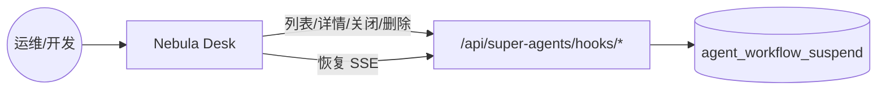
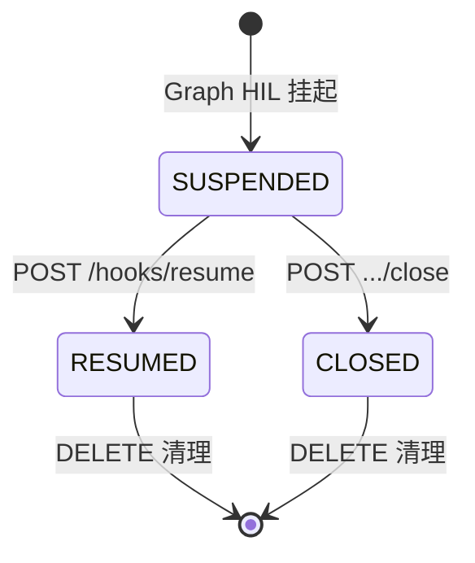
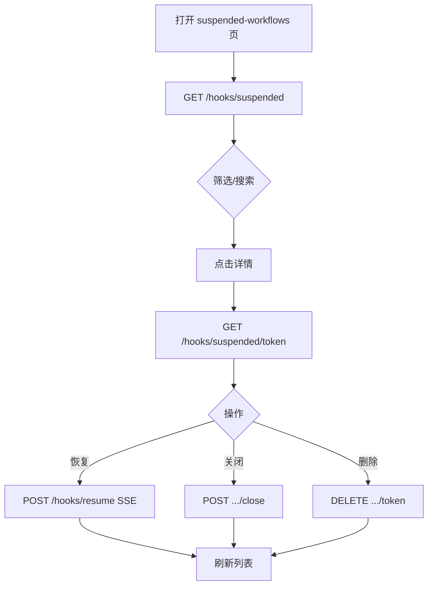
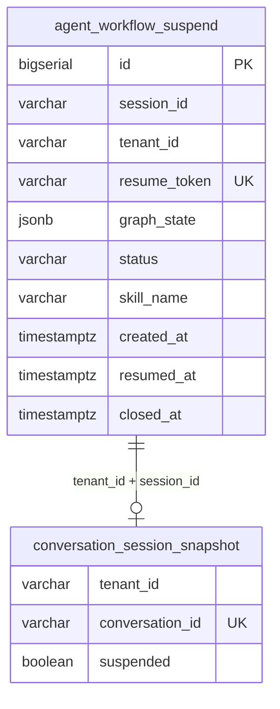
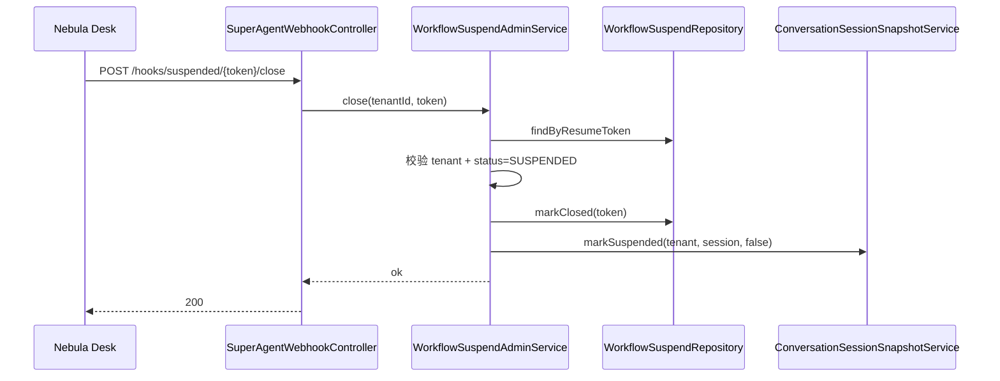
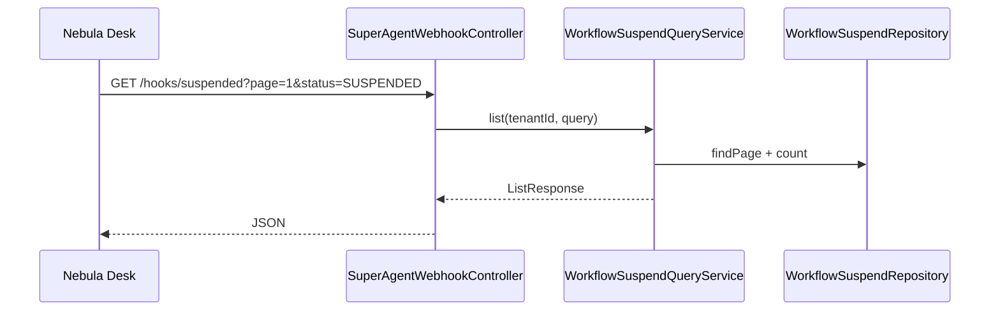

# 挂起工作流管理 - 技术方案

> 用户选择 **C（跳过 design-draft 确认）**，本方案直接基于 `design-draft.md` 草案与代码现状编写。  
> 业务需求详见：  
> - `specs/aether-agent-suspended-workflow-mgmt/spec.md`  
> - `specs/aether-agent-async-resume/spec.md`

**Status**: Reviewed（design-review v0.2 阻塞项已修订并归档确认）

**design-review 修订记录（v0.2）**：
- §4.1 Flyway 脚本版本 `V15` → `V19`（V15/V16 已占用 aether-platform；V17/V18 已占用 agent-hub）
- §3.2 / §6.3 `WorkflowSuspendRecord` / `WorkflowSuspendParam` 增补 `closedAt` 字段映射
- §6.2 close 用例补充 `markClosed` 影响行数校验（并发安全）

---

## 一. 概述

### 1.1 术语

| 术语 | 英文 | 说明 |
|------|------|------|
| 挂起记录 | Workflow Suspend Record | `agent_workflow_suspend` 表一行，含 `resumeToken` 与 `graph_state` |
| 恢复令牌 | resumeToken | UUID 无连字符，唯一索引；恢复/详情主键 |
| 挂起中 | SUSPENDED | 可被恢复或关闭 |
| 已恢复 | RESUMED | 已通过 Webhook 恢复，`resumed_at` 有值 |
| 已关闭 | CLOSED | 人工放弃恢复，`closed_at` 有值（本期新增语义） |
| Webhook 控制器 | SuperAgentWebhookController | `/api/super-agents/hooks/*` 统一入口 |

### 1.2 需求背景

**需求描述**：在既有挂起（`WorkflowSuspendService`）与恢复（`POST /hooks/resume`）闭环上，新增挂起工作流的**列表查询、搜索、详情、关闭、删除** REST 接口（集中于 `SuperAgentWebhookController`），并在 Nebula Desk 提供管理页面。

**产品 PRD**：无工单；OpenSpec proposal + spec 为需求来源。

### 1.3 本期目标

| 序号 | 内容 | 任务点 |
|------|------|--------|
| 1 | 仓储扩展 | Repository + Mapper 分页查询 / close / delete |
| 2 | 应用层用例 | `WorkflowSuspendQueryService`、`WorkflowSuspendAdminService` |
| 3 | Webhook REST | `SuperAgentWebhookController` 新增 4 个端点；resume 保持不变 |
| 4 | 数据迁移 | `closed_at` 列 + 租户状态索引（Flyway **V19**） |
| 5 | 前端 service | `platformSuspendedWorkflowService` + types |
| 6 | 前端 U1 页面 | `/agent-hub/suspended-workflows` 列表/搜索/详情/操作 |
| 7 | 路由与 i18n | `.umirc.ts`、`menuConfig`、`routes.ts`、`ApiPaths` |
| 8 | Impeccable 验收 | `uiCraftMode: auto` → shape + craft |
| 9 | 契约与文档 | `api-contracts.yaml`、CHANGELOG、ARCHITECTURE |

### 1.4 影响分析

**受影响的系统：**
- [x] 后端 **ai** — `superAgents/web`、`application/async`、`domain/async`、`infrastructure/async`、`db/migration`
- [x] 前端 **ai_react** — 新页面、services、路由、i18n
- [x] 治理层 **AetherStack** — `api-contracts.yaml`
- [ ] 消息队列 — 无
- [ ] 外部 Webhook 集成 — **恢复接口不变**

**AI-TDD 评估（aiTddMode: disabled）**：不涉及 L1 AI 模块，常规 `AUTO-UT` 覆盖应用服务与 Controller 参数校验即可。

**UI-Craft 评估（uiCraftMode: auto）**：命中 U1 界面 1 个（挂起工作流管理页），apply 须 Impeccable + `impeccable:` 验收标记。

---

## 二. 业务分析

### 2.1 业务用例



### 2.2 业务流程

#### 2.2.1 挂起记录生命周期



#### 2.2.2 管理页操作流程



### 2.3 业务场景

详见：
- `openspec/changes/add-suspended-workflow-management/specs/aether-agent-suspended-workflow-mgmt/spec.md`
- `openspec/changes/add-suspended-workflow-management/specs/aether-agent-async-resume/spec.md`

---

## 三. 系统设计

### 3.1 业务实体状态图

见 §2.2.1。本期在 DB `status` 字段增加 `CLOSED` 取值；`markResumed` 逻辑不变。

### 3.2 领域模型图

**增量（superAgents async 子域）**：

| 层 | 类型 | 职责 |
|----|------|------|
| domain | `WorkflowSuspendRecord` | 增补 `closedAt` 字段；status 语义扩展 CLOSED |
| domain | `WorkflowSuspendRepository` | 新增分页查询、markClosed、delete |
| application | `WorkflowSuspendQueryService` | 列表/详情 DTO 组装 |
| application | `WorkflowSuspendAdminService` | close/delete 用例 |
| application | `WorkflowResumeService` | **不变** |
| web | `SuperAgentWebhookController` | 暴露 REST + 既有 resume |

### 3.3 数据模型图

**修改既有表** `agent_workflow_suspend`（V14 已创建），无新表。



---

## 四. 详细设计

### 4.1 数据表定义

#### 修改表：agent_workflow_suspend

**Flyway：`V19__workflow_suspend_admin.sql`**（V15/V16 已占用 aether-platform；V17/V18 已占用 agent-hub，勿复用）

```sql
-- 关闭时间（CLOSED 时写入）
ALTER TABLE agent_workflow_suspend
    ADD COLUMN IF NOT EXISTS closed_at TIMESTAMPTZ;

-- 管理列表：按租户 + 状态 + 时间倒序
CREATE INDEX IF NOT EXISTS idx_workflow_suspend_tenant_status
    ON agent_workflow_suspend (tenant_id, status, created_at DESC);

-- 关键词搜索：session / skill（已有 session+status 索引保留）
CREATE INDEX IF NOT EXISTS idx_workflow_suspend_skill
    ON agent_workflow_suspend (tenant_id, skill_name);
```

| 字段 | 类型 | 说明 |
|------|------|------|
| status | VARCHAR(32) | `SUSPENDED` / `RESUMED` / `CLOSED` |
| closed_at | TIMESTAMPTZ | 关闭时间；RESUMED 用 resumed_at |

**无初始化数据。**

### 4.2 应用内部组件划分

```text
superAgents/
├── web/
│   ├── SuperAgentWebhookController.java      # 扩展
│   └── dto/
│       ├── WorkflowSuspendListResponse.java
│       ├── WorkflowSuspendItemResponse.java
│       ├── WorkflowSuspendDetailResponse.java
│       └── WorkflowSuspendQueryRequest.java  # 查询参数（或 @RequestParam）
├── application/async/
│   ├── WorkflowSuspendQueryService.java      # 新增
│   ├── WorkflowSuspendAdminService.java      # 新增
│   └── WorkflowResumeService.java            # 不变
├── domain/async/
│   └── WorkflowSuspendRepository.java        # 扩展接口
└── infrastructure/async/
    ├── WorkflowSuspendMapper.java / .xml     # 扩展 SQL
    └── MyBatisWorkflowSuspendRepository.java
```

### 4.3 组件时序图

#### 关闭挂起



#### 列表查询



### 4.4 核心算法逻辑

**删除准入**（`WorkflowSuspendAdminService.delete`）：

```text
IF status == SUSPENDED → 拒绝（须先 close 或 resume）
IF status IN (RESUMED, CLOSED) → 允许物理 DELETE
IF record.tenantId != requestTenant → 404（不泄露）
```

**列表关键词**：对 `session_id`、`skill_name`、`resume_token` 做 `ILIKE %keyword%`（tenant 强制过滤）。

### 4.5 定时任务

无定时任务变更。

---

## 五. 接口设计

### 5.1 本期新增接口列表

| 方法 | 路径 | 说明 |
|------|------|------|
| GET | `/api/super-agents/hooks/suspended` | 分页列表 + 搜索筛选 |
| GET | `/api/super-agents/hooks/suspended/{resumeToken}` | 详情 |
| POST | `/api/super-agents/hooks/suspended/{resumeToken}/close` | 关闭（写，需 Admin Key） |
| DELETE | `/api/super-agents/hooks/suspended/{resumeToken}` | 删除（写，需 Admin Key） |
| POST | `/api/super-agents/hooks/resume` | **既有**，SSE 恢复，**不变** |

`SuperAgentApiPaths` 新增常量：

```java
public static final String HOOKS_SUSPENDED = BASE + "/hooks/suspended";
public static final String HOOKS_SUSPENDED_TOKEN = BASE + "/hooks/suspended/{resumeToken}";
public static final String HOOKS_SUSPENDED_CLOSE = BASE + "/hooks/suspended/{resumeToken}/close";
public static final String HOOKS_RESUME = BASE + "/hooks/resume";
```

### 5.2 接口详细设计

#### GET /api/super-agents/hooks/suspended

**功能**：分页查询当前租户挂起记录。

**请求头**：
- `X-Tenant-Id`（可选，经 `PlatformTenantApplicationService.resolveActiveTenantId` 解析）

**Query 参数**：

| 参数 | 类型 | 必填 | 说明 |
|------|------|------|------|
| page | int | 否 | 默认 1 |
| pageSize | int | 否 | 默认 20，最大 100 |
| keyword | string | 否 | 匹配 sessionId / skillName / resumeToken |
| status | string | 否 | `SUSPENDED` / `RESUMED` / `CLOSED`；空=全部 |
| skillName | string | 否 | 精确或前缀匹配 skill |

**响应**：

```json
{
  "items": [
    {
      "resumeToken": "abc123...",
      "resumeTokenMasked": "abc1****...89ef",
      "sessionId": "conv-001",
      "tenantId": "default",
      "skillName": "refund-policy-lookup-hil",
      "status": "SUSPENDED",
      "createdAt": "2026-06-07T10:00:00Z",
      "resumedAt": null,
      "closedAt": null,
      "pendingMessagePreview": "等待人工审批..."
    }
  ],
  "page": 1,
  "pageSize": 20,
  "total": 42
}
```

**错误码**：
- `400`：pageSize 超限
- `500`：数据库异常

---

#### GET /api/super-agents/hooks/suspended/{resumeToken}

**功能**：单条详情（含 graphState 摘要，非完整 JSON）。

**响应**：

```json
{
  "resumeToken": "abc123...",
  "sessionId": "conv-001",
  "tenantId": "default",
  "skillName": "refund-policy-lookup-hil",
  "status": "SUSPENDED",
  "createdAt": "2026-06-07T10:00:00Z",
  "resumedAt": null,
  "closedAt": null,
  "pendingMessage": "等待人工审批，请使用 resumeToken 回调恢复。",
  "graphStateSummary": {
    "hasWorkflowResumeToken": true
  }
}
```

**错误码**：
- `404`：token 不存在或租户不匹配

---

#### POST /api/super-agents/hooks/suspended/{resumeToken}/close

**功能**：关闭挂起中工作流，不再恢复。

**请求头**：`X-Tenant-Id`、`X-Admin-Api-Key`（配置非空时必填，对齐 `AgentRegistryController`）

**响应**：`204 No Content`

**错误码**：
- `401`：Admin Key 无效
- `404`：不存在或租户不匹配
- `409`：状态非 SUSPENDED

---

#### DELETE /api/super-agents/hooks/suspended/{resumeToken}

**功能**：删除已结束记录（RESUMED / CLOSED）。

**请求头**：同上

**响应**：`204 No Content`

**错误码**：
- `401`：Admin Key 无效
- `404`：不存在或租户不匹配
- `409`：状态仍为 SUSPENDED

---

#### POST /api/super-agents/hooks/resume（既有，不变）

**请求体**：`{ "resumeToken": "..." }`  
**响应**：`text/event-stream`  
**逻辑**：`WorkflowResumeService.resumeByToken` — 见 `SuperAgentWebhookController.java:33-40`

---

## 六. 代码改造分析

### 6.1 入口链路 — SuperAgentWebhookController

**代码位置**：`SuperAgentWebhookController.java:24-41`

**现状代码**：

```java
@RestController
@RequestMapping(SuperAgentApiPaths.BASE)
public class SuperAgentWebhookController {

    @Autowired
    private WorkflowResumeService workflowResumeService;

    @PostMapping(value = "/hooks/resume", produces = MediaType.TEXT_EVENT_STREAM_VALUE)
    public Flux<String> resume(@RequestBody WorkflowResumeRequest request) {
        if (request == null || StringUtils.isBlank(request.resumeToken())) {
            return Flux.error(new IllegalArgumentException("resumeToken required"));
        }
        return workflowResumeService.resumeByToken(request.resumeToken().trim());
    }
}
```

**风险点**：管理接口与 SSE 恢复混在同一 Controller，需避免路径冲突（`/hooks/suspended` 须在 `/hooks/resume` 同级明确定义）。

**改造要点**：

```java
@Autowired
private WorkflowSuspendQueryService workflowSuspendQueryService;
@Autowired
private WorkflowSuspendAdminService workflowSuspendAdminService;
@Autowired
private PlatformTenantApplicationService platformTenantApplicationService;
@Autowired
private SuperAgentsPlatformProperties properties;

@GetMapping("/hooks/suspended")
public WorkflowSuspendListResponse listSuspended(
        @RequestHeader(value = "X-Tenant-Id", required = false) String tenantId,
        @RequestParam(defaultValue = "1") int page,
        @RequestParam(defaultValue = "20") int pageSize,
        @RequestParam(required = false) String keyword,
        @RequestParam(required = false) String status,
        @RequestParam(required = false) String skillName) {
    String resolved = platformTenantApplicationService.resolveActiveTenantId(tenantId);
    return workflowSuspendQueryService.list(resolved, page, pageSize, keyword, status, skillName);
}

@GetMapping("/hooks/suspended/{resumeToken}")
public WorkflowSuspendDetailResponse getSuspended(...) { ... }

@PostMapping("/hooks/suspended/{resumeToken}/close")
public ResponseEntity<Void> closeSuspended(...) {
    assertAdminApiKey(apiKey);
    workflowSuspendAdminService.close(resolvedTenant, resumeToken);
    return ResponseEntity.noContent().build();
}

@DeleteMapping("/hooks/suspended/{resumeToken}")
public ResponseEntity<Void> deleteSuspended(...) { ... }

// resume() 方法保持不动
```

---

### 6.2 核心校验 — WorkflowResumeService（不变，引用对称）

**代码位置**：`WorkflowResumeService.java:32-62`

**现状代码**：

```java
if (!"SUSPENDED".equals(record.status())) {
    return Flux.error(new IllegalStateException("Workflow not suspended: " + record.status()));
}
workflowSuspendRepository.markResumed(resumeToken);
conversationSessionSnapshotService.markSuspended(record.tenantId(), record.sessionId(), false);
```

**风险点**：close 用例须复用相同「先校验 status → 改 DB → 清 suspended」顺序。

**改造要点**（新增 `WorkflowSuspendAdminService.close`）：

```java
public void close(String tenantId, String resumeToken) {
    WorkflowSuspendRecord record = loadForTenant(tenantId, resumeToken);
    if (!"SUSPENDED".equals(record.status())) {
        throw new ResponseStatusException(HttpStatus.CONFLICT, "Workflow not suspended");
    }
    // markClosed SQL 带 status=SUSPENDED 条件；updatedRows==0 时抛 409（并发 close/resume 竞态）
    int updated = workflowSuspendRepository.markClosed(resumeToken);
    if (updated == 0) {
        throw new ResponseStatusException(HttpStatus.CONFLICT, "Workflow already closed or resumed");
    }
    conversationSessionSnapshotService.markSuspended(record.tenantId(), record.sessionId(), false);
}
```

**WorkflowSuspendRecord / Param 扩展**：

```java
// WorkflowSuspendRecord 新增 closedAt 字段（resumedAt 之后）
public record WorkflowSuspendRecord(..., Instant resumedAt, Instant closedAt) {}
// WorkflowSuspendParam 同步 closedAt；Mapper SELECT 已含 closed_at AS closedAt
```

---

### 6.3 数据落点 — WorkflowSuspendRepository / Mapper

**代码位置**：`WorkflowSuspendRepository.java:10-29`、`WorkflowSuspendMapper.xml:28-32`

**现状代码**：

```java
void insert(WorkflowSuspendRecord record);
Optional<WorkflowSuspendRecord> findByResumeToken(String resumeToken);
void markResumed(String resumeToken);
```

```xml
<update id="markResumed">
    UPDATE agent_workflow_suspend
    SET status = 'RESUMED', resumed_at = NOW()
    WHERE resume_token = #{resumeToken}
</update>
```

**风险点**：无分页与租户过滤；无 close/delete。

**改造要点**：

```java
// Repository 扩展
PageResult<WorkflowSuspendRecord> findPage(String tenantId, WorkflowSuspendQuery query, int offset, int limit);
long count(String tenantId, WorkflowSuspendQuery query);
int markClosed(String resumeToken);
void deleteByResumeToken(String resumeToken);
```

```xml
<update id="markClosed">
    UPDATE agent_workflow_suspend
    SET status = 'CLOSED', closed_at = NOW()
    WHERE resume_token = #{resumeToken} AND status = 'SUSPENDED'
</update>

<delete id="deleteByResumeToken">
    DELETE FROM agent_workflow_suspend
    WHERE resume_token = #{resumeToken}
      AND status IN ('RESUMED', 'CLOSED')
</delete>

<select id="findPage" ...>
    SELECT ... FROM agent_workflow_suspend
    WHERE tenant_id = #{tenantId}
    <if test="status != null">AND status = #{status}</if>
    <if test="keyword != null">AND (... ILIKE ...)</if>
    ORDER BY created_at DESC
    LIMIT #{limit} OFFSET #{offset}
</select>
```

---

### 6.4 挂起写入（不变）

**代码位置**：`WorkflowSuspendService.java:36-61`

**现状代码**：insert 时 `status = "SUSPENDED"`，`markSuspended(true)`。

**改造要点**：**无代码变更**；仅文档注明 CLOSED 为管理面新增终态。

---

## 七. 非功能性需求设计

### 7.1 权限影响

| 操作 | 权限 |
|------|------|
| GET 列表/详情 | `X-Tenant-Id` 租户隔离 |
| POST close / DELETE | `X-Admin-Api-Key`（`adminApiKey` 配置非空时） |
| POST resume | **保持现状**（Webhook 回调兼容，不强制 Admin Key） |

### 7.2 数据清洗、迁移

- [x] Flyway V15 加列与索引，可回滚（DROP COLUMN/INDEX）
- [ ] 无历史数据回填

### 7.3 缓存设计

无缓存；列表直查 DB。

### 7.4 安全评估

- [x] 查询/写操作租户校验（`tenant_id` 条件 + find 后比对）
- [x] 列表 `resumeToken` 脱敏展示；详情需管理页场景可展示完整 token
- [x] `graph_state` 详情不返回完整 JSON，仅 `pendingMessage` 等摘要

### 7.5 限流降级评估

- [ ] 本期不限流；预期管理端 QPS 低

---

## 八. 前端设计

### 8.1 前端 UI 界面清单（uiCraftMode: auto）

| 路径 | 类型 | 说明 |
|------|------|------|
| `ai_react/src/pages/agent-hub/suspended-workflows/index.tsx` | **UI-CRAFT** | 挂起工作流管理主页（列表+筛选） |
| `ai_react/src/components/platformSuspendedWorkflow/PlatformSuspendedWorkflowManager.tsx` | **UI-CRAFT** | 表格、搜索、详情 Drawer、操作按钮 |
| `ai_react/src/services/platformSuspendedWorkflowService.ts` | UI-FUNC | API 客户端 |
| `ai_react/src/types/platformSuspendedWorkflow.ts` | UI-FUNC | 类型定义 |
| `ai_react/src/constants/ApiPaths.ts` | UI-FUNC | 路径常量 |
| `ai_react/.umirc.ts` + `menuConfig.ts` | UI-FUNC | 路由与导航 |

**Impeccable 验收**：`impeccable: shape+craft`（挂起管理页）。

### 8.2 前端实现要点

- 复用 `usePlatformAdminConfig` + `platformHeaders()`（与 `PlatformAgentRegistryManager` 一致）
- 列表：`useQuery` + Ant Design `Table`，状态 Tag 配色 `SUSPENDED=warning`、`RESUMED=success`、`CLOSED=default`
- 详情：`Drawer` 展示 `pendingMessage`、时间线、完整 `resumeToken`（支持复制）
- **恢复**：`fetch(POST /hooks/resume)` + `ReadableStream` 解析，复用 `dispatchSuperAgentSsePayload`；成功后 `invalidateQueries`
- **关闭/删除**：`Modal.confirm` + `useMutation`，写操作 `platformWriteRequestOptions`
- 路由：`/agent-hub/suspended-workflows`，菜单项置于 Agent Hub 分组（建议紧跟 `uncovered-intents` 后）

### 8.3 目标目录（ai_react 增量）

```text
ai_react/src/
├── pages/agent-hub/suspended-workflows/index.tsx
├── components/platformSuspendedWorkflow/
│   └── PlatformSuspendedWorkflowManager.tsx
├── services/platformSuspendedWorkflowService.ts
├── types/platformSuspendedWorkflow.ts
├── constants/ApiPaths.ts          # superAgents.suspendedWorkflows*
├── constants/routes.ts            # AGENT_HUB_SUSPENDED_WORKFLOWS
└── layouts/BasicLayout/menuConfig.ts
```

---

## 九. 开发补充要求

### 9.1 Spring AI / 铁三角设计清单

**不适用**（`aiTddMode: disabled`；无 LLM/Graph/RAG 变更）。

### 9.2 测试建议

| 类型 | 范围 |
|------|------|
| AUTO-UT | `WorkflowSuspendAdminService` close/delete 分支 |
| AUTO-UT | `WorkflowSuspendQueryService` 分页与租户过滤 |
| AUTO-UT | `SuperAgentWebhookController` 参数校验 |
| MANUAL | 前端列表/恢复 SSE/关闭/删除 E2E |

---

## 十. 阶段准入（apply 前自检）

| 检查项 | 结论 |
|--------|------|
| design-review | **待完成**（本稿完成后须 brainstorming 审查） |
| 外部 Webhook resume 兼容 | 不变 |
| 租户隔离 | 全链路强制 |
| U1 Impeccable | tasks 须含 `1.2a` |
