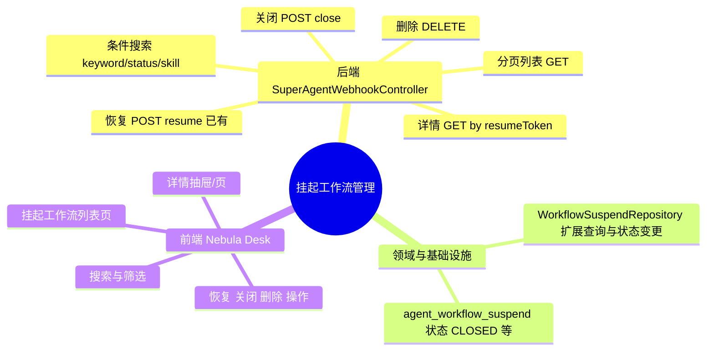

## Why

（为什么要做）

### 背景与目标

- **背景**：SuperAgents 异步工作流在 Graph HIL（人工审批）等节点挂起时，由 `WorkflowSuspendService` 写入 `agent_workflow_suspend` 表并生成 `resumeToken`；客户端可通过 `POST /api/super-agents/hooks/resume`（`SuperAgentWebhookController`）携带 token 以 SSE 恢复执行。当前**仅有恢复入口，缺少可观测与管理能力**——运维/业务人员无法查看哪些工作流处于挂起状态，也无法在控制台进行搜索、详情审阅及关闭/清理。
- **目标**：补齐挂起工作流的**列表查询、条件搜索、详情查看**能力，并在同一 Webhook 控制器内扩展**恢复、关闭、删除**管理接口；在 **ai_react**（Nebula Desk）新增管理页面，与现有 SuperAgents 平台运维页风格一致，形成挂起→审阅→恢复/关闭/删除的完整闭环。

## Jira / 需求链接

- 无工单（口头需求）

## What Changes

（变更内容）

### 需求概览（全局）

- **新增** `SuperAgentWebhookController` 管理类 REST 接口：分页列表、搜索筛选、按 `resumeToken` 查详情、关闭挂起、删除记录（恢复沿用现有 `POST /hooks/resume`）。
- **扩展** `WorkflowSuspendRepository` / MyBatis Mapper：支持按租户、会话、Skill、状态、关键词分页查询；支持 `markClosed`、`deleteByResumeToken`（或等价领域操作）。
- **扩展** `agent_workflow_suspend` 状态机：`SUSPENDED` → `RESUMED`（已有）/ `CLOSED`（人工放弃恢复）/ 物理或逻辑删除（design 定稿）。
- **新增** ai_react 管理页面：挂起工作流列表 + 搜索 + 详情 + 操作按钮（恢复走 SSE 或跳转既有对话流，design 定稿）。
- **不改动** 挂起触发逻辑（`WorkflowSuspendService`、`HumanApprovalSkillGraphNode`）与 Graph Interrupt 机制本身。

## Capabilities

（能力范围）

### New Capabilities（新增能力）

- `aether-agent/suspended-workflow-mgmt`：SuperAgents 挂起工作流查询与管理（Webhook 控制器 REST + 仓储扩展 + Nebula Desk 列表/详情/操作 UI）

### Modified Capabilities（变更能力）

- `aether-agent/async-resume`：在既有挂起/恢复闭环上补充可观测与管理面（列表/搜索/关闭/删除），不改变 resume token 生成与 SSE 恢复主路径语义。

## Impact

（影响分析）

> proposal.md 不做技术分析，仅简述影响。完整 Impact 清单在 design.md 中展开。

- **后端（ai）**：`superAgents/web/SuperAgentWebhookController`、`application/async` 用例服务、`domain/async/WorkflowSuspendRepository`、MyBatis Mapper 与可能的表结构/状态枚举扩展。
- **前端（ai_react）**：新增 SuperAgents 挂起工作流管理页、OpenAPI 类型与 `services/` 封装、`ApiPaths` 常量、导航入口与 i18n。
- **契约**：`integration-contracts.md` / `api-contracts.yaml` 需同步新增 Webhook 管理端点；`uiCraftMode: auto` 命中 U1 界面，实施阶段走 Impeccable。
