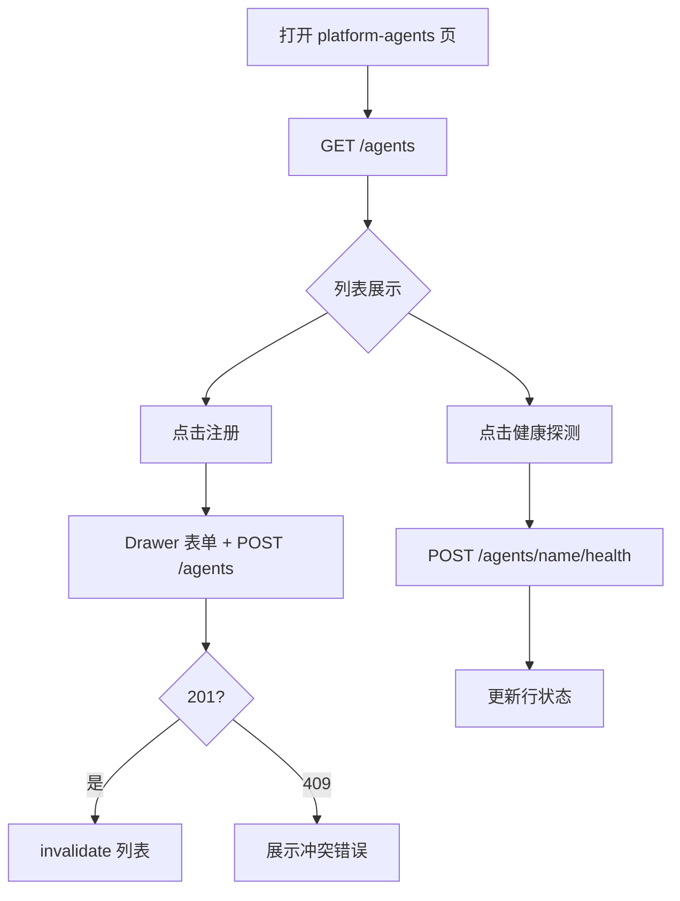
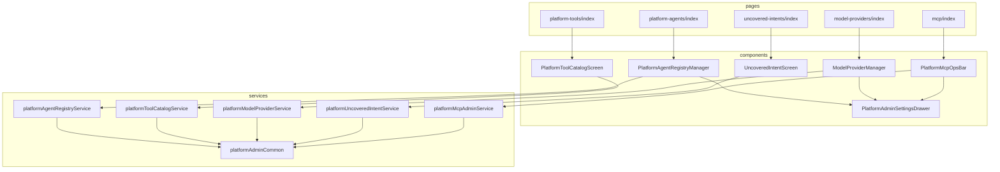
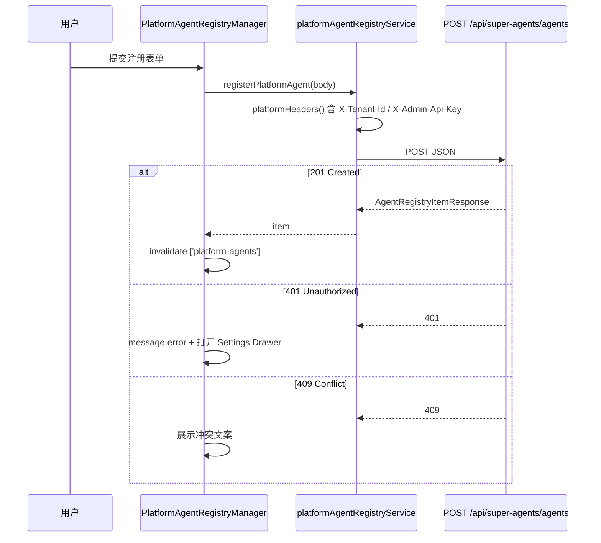

# SuperAgents 前端接口补全 - 技术方案

> 基于 `design-draft.md`（用户选项 B 确认）。  
> 业务需求详见：  
> - `specs/aether-agent-superagents-registry-ui/spec.md`  
> - `specs/aether-agent-superagents-platform-ops-ui/spec.md`  
> - `specs/aether-agent-superagents-tools-catalog-ui/spec.md`

**Status**: Reviewed（design-review 已确认，2026-06-07）  
**design-draft 修订记录**：无阻塞修订；draft 路由/矩阵方案全文采纳。

---

## 一. 概述

### 1.1 术语

| 术语 | 英文 | 说明 |
|------|------|------|
| SuperAgents 平台 API | `/api/super-agents/*` | ai 仓库 `superAgents/web` 暴露的 REST，与 Agent Hub 本地 status 分离 |
| 本地 Bean 快照 | agent-hub/status | `GET /api/agent-hub/status` 返回的 subAgents/tools/mcp 运行时快照 |
| 平台注册表 | Platform Agent Registry | PostgreSQL 持久化的 Agent 元数据（`GET/POST /agents`） |
| Admin API Key | `X-Admin-Api-Key` | 写操作管理密钥（后端 `SuperAgentsPlatformProperties.adminApiKey` 非空时校验） |
| 租户 | `X-Tenant-Id` | 多租户隔离 Header，默认 `default` |

### 1.2 需求背景

**需求描述**：排查 `ai/aether-platform/.../superAgents/web` 全部 Controller，补全 Nebula Desk 未实现的前端页面与 API 客户端；增量挂载于 Agent Hub，不破坏既有对话、知识库、Skill 管理台及 agents/tools/mcp 快照页。

**产品 PRD**：无工单；OpenSpec proposal + 三份 spec 为需求来源。

### 1.3 本期目标

| 序号 | 内容 | 任务点 |
|------|------|--------|
| 1 | API 对照矩阵落地 | ApiPaths + 5 个 service + types |
| 2 | 公共 Admin 层 | `platformAdminCommon` 抽取；Skill 页回归 |
| 3 | 平台 Agent 注册表 U1 | 列表 / 注册 / 健康探测 |
| 4 | 平台 Tool 摘要 U1 | GET tools + 搜索/来源筛选 |
| 5 | ModelProvider 管理 U1 | 列表 / Switch / 全量 refresh |
| 6 | 未覆盖意图 U1 | GET uncovered-intents + limit |
| 7 | MCP 刷新增量 | mcp 页顶栏 OpsBar |
| 8 | 路由与 i18n | 4 新路由 + menuConfig |
| 9 | Impeccable + 工程验收 | shape → craft；lint/build |
| 10 | 文档与契约 | ARCHITECTURE、CHANGELOG、api-contracts.yaml |

### 1.4 影响分析

**受影响的系统：**
- [x] 前端 **ai_react** — 增量 pages/services/components/routes
- [x] 治理层 **AetherStack** — `api-contracts.yaml` 引用补全
- [ ] 后端 **ai** — **无代码变更**；消费既有 SuperAgents REST
- [ ] 数据库 — 无

**AI-TDD 评估（aiTddMode: disabled）**：纯前端对接，**不适用**。

**UI-Craft 评估（uiCraftMode: enabled）**：5 个 U1 界面 + 1 个 UI-AUDIT 增量；apply 须 Impeccable + `impeccable:` 验收标记。

---

## 二. 业务分析

### 2.1 业务用例

```mermaid
flowchart LR
  Ops((运维/开发))
  Desk[Nebula Desk]
  SA[/api/super-agents/*]
  AHStatus[/api/agent-hub/status]

  Ops --> Desk
  Desk -->|平台 REST 读写| SA
  Desk -->|本地快照只读| AHStatus
```

**图例**：蓝色虚线框为本次新增前端消费路径；AHStatus 路径保持不变。

### 2.2 业务流程

#### 2.2.1 平台 Agent 注册与健康探测



#### 2.2.2 Agent Hub 导航（增量后）

```mermaid
flowchart TD
  L[BasicLayout Agent Hub 分组]
  L --> S[/agent-hub/skills 已有]
  L --> A1[/agent-hub/agents 本地快照]
  L --> T1[/agent-hub/tools 本地快照]
  L --> M1[/agent-hub/mcp + OpsBar]
  L --> PA[/agent-hub/platform-agents 新增]
  L --> PT[/agent-hub/platform-tools 新增]
  L --> MP[/agent-hub/model-providers 新增]
  L --> UI[/agent-hub/uncovered-intents 新增]
```

### 2.3 业务场景

详见：
- `openspec/changes/superagents-frontend-page-completion/specs/aether-agent-superagents-registry-ui/spec.md`
- `openspec/changes/superagents-frontend-page-completion/specs/aether-agent-superagents-platform-ops-ui/spec.md`
- `openspec/changes/superagents-frontend-page-completion/specs/aether-agent-superagents-tools-catalog-ui/spec.md`

---

## 三. 系统设计

### 3.1 领域模型图

**无 DDD 聚合变更。** 前端按 **UI 域 + services 域** 划分：

| 域 | services | 页面/组件 |
|----|----------|-----------|
| Platform Registry | `platformAgentRegistryService` | `pages/agent-hub/platform-agents` |
| Platform Tools | `platformToolCatalogService` | `pages/agent-hub/platform-tools` |
| Platform Ops | `platformModelProviderService`, `platformUncoveredIntentService`, `platformMcpAdminService` | model-providers、uncovered-intents、mcp OpsBar |
| Platform Admin | `platformAdminCommon` | 各页 Settings Drawer |
| Skill（既有） | `platformSkillService` | skills（refactor import） |
| Agent Hub 快照（既有） | `agentHubService` | agents/tools/mcp（**不改**） |

### 3.2 数据模型图

**无数据模型变更。** 前端 sessionStorage 键沿用 Skill 管理台：

| 键 | 用途 |
|----|------|
| `aether.platform.tenantId` | `X-Tenant-Id` |
| `aether.platform.adminApiKey` | `X-Admin-Api-Key`（写操作） |

### 3.3 目标目录结构（ai_react 增量）

```text
ai_react/src/
├── constants/
│   ├── ApiPaths.ts              # 扩展 superAgents 路径
│   └── routes.ts                # +4 ROUTES
├── services/
│   ├── platformAdminCommon.ts   # 新增：header/storage
│   ├── platformSkillService.ts # refactor：引用 common
│   ├── platformAgentRegistryService.ts
│   ├── platformToolCatalogService.ts
│   ├── platformModelProviderService.ts
│   ├── platformUncoveredIntentService.ts
│   └── platformMcpAdminService.ts
├── types/
│   ├── platformAgentRegistry.ts
│   ├── platformToolCatalog.ts
│   ├── platformModelProvider.ts
│   └── platformUncoveredIntent.ts
├── components/
│   ├── platformAdmin/
│   │   └── PlatformAdminSettingsDrawer.tsx   # 从 Skill 抽取
│   ├── platformAgent/
│   │   └── PlatformAgentRegistryManager.tsx
│   ├── platformTool/
│   │   └── PlatformToolCatalogScreen.tsx
│   ├── platformOps/
│   │   ├── ModelProviderManager.tsx
│   │   └── UncoveredIntentScreen.tsx
│   └── agentHub/
│       └── PlatformMcpOpsBar.tsx
├── pages/agent-hub/
│   ├── platform-agents/index.tsx
│   ├── platform-tools/index.tsx
│   ├── model-providers/index.tsx
│   ├── uncovered-intents/index.tsx
│   └── mcp/index.tsx            # 仅追加 OpsBar
└── layouts/BasicLayout/menuConfig.ts
```

### 3.4 前端 UI 界面清单（uiCraftMode: enabled）

| 界面/组件 | 路径（ai_react） | UI 类型 | Impeccable | 说明 |
|-----------|------------------|---------|------------|------|
| 平台 Agent 注册表 | `components/platformAgent/PlatformAgentRegistryManager.tsx` | U1 | **UI-CRAFT** | Table + 注册 Drawer + 健康探测 |
| 平台 Tool 摘要 | `components/platformTool/PlatformToolCatalogScreen.tsx` | U1 | **UI-CRAFT** | 列表 + 搜索 + 来源筛选 |
| ModelProvider 管理 | `components/platformOps/ModelProviderManager.tsx` | U1 | **UI-CRAFT** | Switch + refresh |
| 未覆盖意图 | `components/platformOps/UncoveredIntentScreen.tsx` | U1 | **UI-CRAFT** | Table + limit 选择 |
| MCP 运维栏 | `components/agentHub/PlatformMcpOpsBar.tsx` | U1 | **UI-AUDIT** | mcp 页顶栏增量 |
| Admin 设置 Drawer | `components/platformAdmin/PlatformAdminSettingsDrawer.tsx` | U1 | **UI-AUDIT** | 从 Skill 抽取复用 |
| services/types/constants | `src/services/**`, `src/types/**` | U3 | UI-FUNC | 无视觉 |
| 既有 agents/tools/mcp/skills | 不变 | — | 不强制 | 回归即可 |

**Impeccable 执行顺序（apply）**：`PlatformAdminSettingsDrawer` shape → 各 U1 页 shape → craft → mcp OpsBar audit → `npm run lint` + `npm run build`。

---

## 四. 详细设计

### 4.1 数据表定义

**无数据表变更。**

### 4.2 应用内部组件划分



**pages 规则**：每个 page 仅 `export default` 薄包装组件，禁止 page 内 `request()`。

### 4.3 组件时序图

#### 4.3.1 注册 Agent（写操作）



### 4.4 核心算法逻辑

#### 4.4.1 Tool 摘要客户端筛选

```typescript
// PlatformToolCatalogScreen 内 useMemo
function filterTools(
  items: PlatformToolSummaryItem[],
  keyword: string,
  sourceFilter: 'all' | 'agent-hub' | 'mcp',
): PlatformToolSummaryItem[] {
  const kw = keyword.trim().toLowerCase();
  return items.filter((item) => {
    if (sourceFilter !== 'all' && item.source !== sourceFilter) return false;
    if (!kw) return true;
    return (
      item.name.toLowerCase().includes(kw) ||
      item.summary.toLowerCase().includes(kw)
    );
  });
}
```

`source` 字段与后端 `PlatformToolSummaryItem.source` 对齐（如 `agent-hub` / `mcp`）。

#### 4.4.2 uncovered-intents limit clamp

```typescript
export function clampUncoveredIntentLimit(raw: number): number {
  if (!Number.isFinite(raw)) return 20;
  return Math.min(100, Math.max(1, Math.floor(raw)));
}
```

### 4.5 定时任务

**无定时任务变更。**

### 4.6 ApiPaths 扩展（`src/constants/ApiPaths.ts`）

```typescript
superAgents: {
  chat: '/api/super-agents/chat',
  agents: '/api/super-agents/agents',
  agentHealth: (name: string) =>
    `/api/super-agents/agents/${encodeURIComponent(name)}/health`,
  skills: '/api/super-agents/skills',
  skillStatus: (name: string, version: number) => /* 已有 */,
  tools: '/api/super-agents/tools',
  modelProviders: '/api/super-agents/model-providers',
  modelProvider: (providerId: string) =>
    `/api/super-agents/model-providers/${encodeURIComponent(providerId)}`,
  modelProvidersRefresh: '/api/super-agents/model-providers/refresh',
  uncoveredIntents: '/api/super-agents/uncovered-intents',
  mcpRefresh: '/api/super-agents/mcp/refresh',
},
```

### 4.7 路由与菜单

| 常量 | 路径 | menu labelId |
|------|------|--------------|
| `AGENT_HUB_PLATFORM_AGENTS` | `/agent-hub/platform-agents` | `layout.nav.platformAgents` |
| `AGENT_HUB_PLATFORM_TOOLS` | `/agent-hub/platform-tools` | `layout.nav.platformTools` |
| `AGENT_HUB_MODEL_PROVIDERS` | `/agent-hub/model-providers` | `layout.nav.modelProviders` |
| `AGENT_HUB_UNCOVERED_INTENTS` | `/agent-hub/uncovered-intents` | `layout.nav.uncoveredIntents` |

`.umirc.ts` 在 agent-hub 区块追加 4 条 route；`menuConfig.ts` 的 `agentHub` 分组在 skills 之后追加 4 item（快照页 agents/tools/mcp 顺序不变）。

### 4.8 i18n 键名（新增，zh-CN 示意）

| 键 | 中文 |
|----|------|
| `layout.nav.platformAgents` | 平台 Agent 注册表 |
| `layout.nav.platformTools` | 平台 Tool 摘要 |
| `layout.nav.modelProviders` | 模型厂商 |
| `layout.nav.uncoveredIntents` | 未覆盖意图 |
| `platformAgent.subtitle` | 持久化注册表（SuperAgents API）；本地 Bean 快照见「Agents」 |
| `platformTool.subtitle` | 平台 Tool 描述摘要；本地 Bean 见「Tools」 |
| `platformOps.mcpRefresh` | 刷新 MCP 外部工具 |
| `platformAdmin.unauthorized` | 管理密钥无效或未配置，请在设置中填写 |
| `platformModelProvider.label.dashscope` | 通义 DashScope |
| `platformModelProvider.label.openai` | OpenAI |
| `platformModelProvider.label.azure` | Azure OpenAI |
| `platformModelProvider.label.unknown` | `{providerId}`（未知厂商回退显示 raw id） |

### 4.9 ModelProvider 可读说明（spec REQ-1 对齐）

后端 `ProviderStateRow` 仅含 `providerId` + `enabled`，**无** description 字段（见 `ModelProviderStateResponse.java` / `ProviderStateRow.java`）。

**处置（design-review DR-01）**：Table 展示两列——**厂商**（i18n 友好名，键 `platformModelProvider.label.{providerId}`，缺失时回退 `platformModelProvider.label.unknown` 插值）、**状态**（Switch）。不在 UI 伪造后端未返回的长描述。

---

## 五. 接口设计

### 5.1 本期新增接口 & 更新接口列表

**后端无新增/修改接口。** 本节描述前端**首次消费**的既有 SuperAgents REST（契约真源：`SuperAgentApiPaths.java`）。

**排除 UI**：`POST /api/super-agents/hooks/resume`（Webhook 外部回调）。

#### 5.1.1 前端消费矩阵

| 方法 | 路径 | Service | UI |
|------|------|---------|-----|
| GET | `/api/super-agents/agents` | `listPlatformAgents` | platform-agents |
| POST | `/api/super-agents/agents` | `registerPlatformAgent` | 注册 Drawer |
| POST | `/api/super-agents/agents/{name}/health` | `probePlatformAgentHealth` | 行操作 |
| GET | `/api/super-agents/tools` | `listPlatformToolSummaries` | platform-tools |
| GET | `/api/super-agents/model-providers` | `listModelProviders` | model-providers |
| PATCH | `/api/super-agents/model-providers/{providerId}` | `setModelProviderEnabled` | Switch |
| POST | `/api/super-agents/model-providers/refresh` | `refreshModelProviders` | 按钮 |
| POST | `/api/super-agents/mcp/refresh` | `refreshMcpTools` | PlatformMcpOpsBar |
| GET | `/api/super-agents/uncovered-intents?limit=` | `listUncoveredIntents` | uncovered-intents |

**公共 Header**（读/写按需）：

| Header | 说明 |
|--------|------|
| `X-Tenant-Id` | 租户 ID，默认 `default` |
| `X-Admin-Api-Key` | 写操作必填（后端配置非空时） |

### 5.2 接口详细设计

#### GET /api/super-agents/agents

**功能**：列出租户下已注册 Agent（含非 ACTIVE）。

**请求**：无 body；Header `X-Tenant-Id` 可选。

**响应**：
```json
{
  "items": [
    {
      "name": "order-agent",
      "displayName": "订单助手",
      "status": "active",
      "version": "1.0.0"
    }
  ]
}
```

#### POST /api/super-agents/agents

**功能**：注册 Agent。

**请求**：
```json
{
  "name": "order-agent",
  "displayName": "订单助手",
  "capabilityDescription": "处理订单查询与状态说明",
  "beanName": "orderSubAgent",
  "healthCheckUrl": "http://localhost:8080/actuator/health",
  "permissionTags": ["tenant:default"]
}
```

**响应**：`201 Created`，body 同 `AgentRegistryItemResponse`。

**错误**：`401` Invalid admin API key；`409` 同名冲突。

#### POST /api/super-agents/agents/{name}/health

**功能**：触发健康探测。

**响应**：
```json
{
  "name": "order-agent",
  "status": "active",
  "checkedAt": "2026-06-07T08:00:00Z"
}
```

#### GET /api/super-agents/tools

**响应**：
```json
{
  "tools": [
    {
      "source": "agent-hub",
      "name": "searchPlatformKnowledge",
      "summary": "检索平台知识库…"
    },
    {
      "source": "mcp",
      "name": "mcp_filesystem_read",
      "summary": "MCP 文件读取…"
    }
  ]
}
```

#### GET /api/super-agents/model-providers

**响应**：
```json
{
  "providers": [
    { "providerId": "dashscope", "enabled": true },
    { "providerId": "openai", "enabled": false }
  ]
}
```

#### PATCH /api/super-agents/model-providers/{providerId}

**请求**：`{ "enabled": true }`

**响应**：同 GET list 结构 `ModelProviderStateResponse`。

#### POST /api/super-agents/model-providers/refresh

**响应**：
```json
{
  "refreshed": true,
  "providers": [
    { "providerId": "dashscope", "enabled": true }
  ]
}
```

#### POST /api/super-agents/mcp/refresh

**响应**：
```json
{
  "externalToolsBefore": 3,
  "externalToolsAfter": 5,
  "mcpCallbacks": ["filesystem", "github"]
}
```

#### GET /api/super-agents/uncovered-intents?limit=20

**响应**：
```json
{
  "items": [
    {
      "id": 1,
      "conversationId": "conv-abc",
      "userQuery": "帮我订机票",
      "createdAt": "2026-06-07T07:30:00Z"
    }
  ]
}
```

### 5.3 前端 HTTP 错误映射

| HTTP | 场景 | 前端 UX |
|------|------|---------|
| 401 | Admin Key 无效 | `message.error(platformAdmin.unauthorized)` + 打开 Settings Drawer |
| 409 | Agent 重名 | 表单级 Alert，展示后端 message |
| 4xx/5xx 其他 | 网络/服务错误 | Alert + 重试按钮（对齐 Skill 页） |

---

## 六. 代码改造分析

### 6.1 公共 Header 抽取

**代码位置**：`ai_react/src/services/platformSkillService.ts:10-44`

**现状代码**：
```typescript
const ADMIN_KEY_STORAGE = 'aether.platform.adminApiKey';
const TENANT_STORAGE = 'aether.platform.tenantId';
// getStoredAdminApiKey / setStoredAdminApiKey / platformHeaders() 内联于此文件
```

**风险点**：各新 service 复制粘贴导致 storage 键不一致。

**改造要点**：新建 `platformAdminCommon.ts` 导出 storage 与 `platformHeaders()`；`platformSkillService.ts` 改为 `import { platformHeaders, ... } from './platformAdminCommon'`。

---

### 6.2 Agent 快照页（保持不变）

**代码位置**：`ai_react/src/pages/agent-hub/agents/index.tsx:1-19`

**现状代码**：
```typescript
const { data, isLoading, isError, refetch } = useAgentHubStatus();
return <AgentHubListScreen items={data?.subAgents ?? []} ... />;
```

**风险点**：误将数据源改为 SuperAgents API 会破坏 spec REQ-2。

**改造要点**：**不修改**本文件；新能力仅在 `platform-agents/index.tsx`。

---

### 6.3 MCP 页增量 OpsBar

**代码位置**：`ai_react/src/pages/agent-hub/mcp/index.tsx:1-16`

**现状代码**：
```typescript
return (
  <AgentHubMcpScreen
    providers={data?.mcpProviders ?? []}
    callbacks={data?.mcpCallbacks ?? []}
    ...
  />
);
```

**改造要点**：
```typescript
return (
  <>
    <PlatformMcpOpsBar onRefreshComplete={() => void refetch()} />
    <AgentHubMcpScreen ... />
  </>
);
```
`AgentHubMcpScreen` props 不变；OpsBar 独立 mutation。

---

### 6.4 platformAgentRegistryService

**代码位置**：新增 `ai_react/src/services/platformAgentRegistryService.ts`

**改造要点**（骨架）：
```typescript
export async function listPlatformAgents(): Promise<PlatformAgentRegistryItem[]> {
  const res = await request<PlatformAgentRegistryListResponse>(
    API_PATHS.superAgents.agents,
    { method: 'GET', headers: platformHeaders() },
  );
  return res?.items ?? [];
}

export async function registerPlatformAgent(
  input: RegisterPlatformAgentInput,
): Promise<PlatformAgentRegistryItem> {
  return request(API_PATHS.superAgents.agents, {
    method: 'POST',
    headers: platformHeaders(),
    data: input,
  });
}

export async function probePlatformAgentHealth(name: string): Promise<AgentHealthResponse> {
  return request(API_PATHS.superAgents.agentHealth(name), {
    method: 'POST',
    headers: platformHeaders(),
  });
}
```

---

### 6.5 PlatformAdminSettingsDrawer 抽取

**代码位置**：`PlatformSkillManager.tsx:275-300`（租户/密钥 Drawer）

**改造要点**：抽取为 `PlatformAdminSettingsDrawer`；Skill 页与新平台页共用；props：`open`, `onClose`, `tenantId`, `adminKey`, `onTenantChange`, `onAdminKeyChange`。

---

### 6.6 分支覆盖清单

| 分支 | 处理位置 |
|------|----------|
| GET 列表空 | 各 Screen 空状态 i18n |
| GET 失败 | Alert + retry（同 Skill） |
| POST 401 | 统一 unauthorized handler |
| POST 409 注册冲突 | Form Alert |
| PATCH Switch 乐观更新失败 | Switch 回滚 + message |
| MCP refresh 成功 | Modal/Alert 展示 before/after |
| limit 非法输入 | clamp 1–100 |

---

## 七. 非功能性需求

### 7.1 性能

- 列表页 React Query `staleTime: 30_000`；mutation 后 `invalidateQueries`。
- Tool 摘要客户端 filter，单次 GET 无分页（后端全量摘要，条目规模预期 <200）。

### 7.2 安全

- Admin Key 仅存 sessionStorage，不出现在 URL；Input.Password 组件。
- 不在 console 打印密钥。

### 7.3 可观测性

- 无新增 Micrometer；前端错误经 Ant Design `message` / `Alert` 暴露。

### 7.4 测试策略

| 类型 | 范围 |
|------|------|
| MANUAL | 各页联调 SuperAgents 后端 |
| e2e smoke | 可选：4 新路由 HTTP 200 + h1 可见 |
| AUTO-UT | 不适用（无后端 L1；前端单测非本期强制） |

### 7.5 Assumptions

1. 开发环境 `.umirc.ts` proxy `/api` → `localhost:8080` 可用。
2. 默认租户 `default`；与 `SUPER_AGENTS_TENANT_ID` define 无冲突（页面 sessionStorage 优先）。
3. `adminApiKey` 未配置时后端写操作不校验；前端仍展示 Settings 入口以备生产启用。
4. Webhook resume 无 UI；集成方直接 POST。

### 7.6 文档与契约同步（apply 后）

- `ai_react/ARCHITECTURE.md` § SuperAgents 表格补全 7 组 API
- `ai_react/CHANGELOG.md`
- `.aetherstack/context/api-contracts.yaml` 前端消费列

### 7.7 实施分期（tasks 引用）

| Phase | 交付 |
|-------|------|
| P0 | platformAdminCommon + ApiPaths + types + Skill refactor |
| P1 | platform-agents + Impeccable |
| P2 | platform-tools + Impeccable |
| P3 | model-providers + uncovered-intents + mcp OpsBar + Impeccable |
| P4 | lint/build + 文档 + e2e smoke |

---

## design.md 修订记录

| 版本 | 日期 | 说明 |
|------|------|------|
| Draft | 2026-06-07 | 初稿，基于 design-draft 与用户「继续」 |
| Draft v0.2 | 2026-06-07 | design-review DR-01：§4.8/§4.9 ModelProvider i18n 友好名 |
