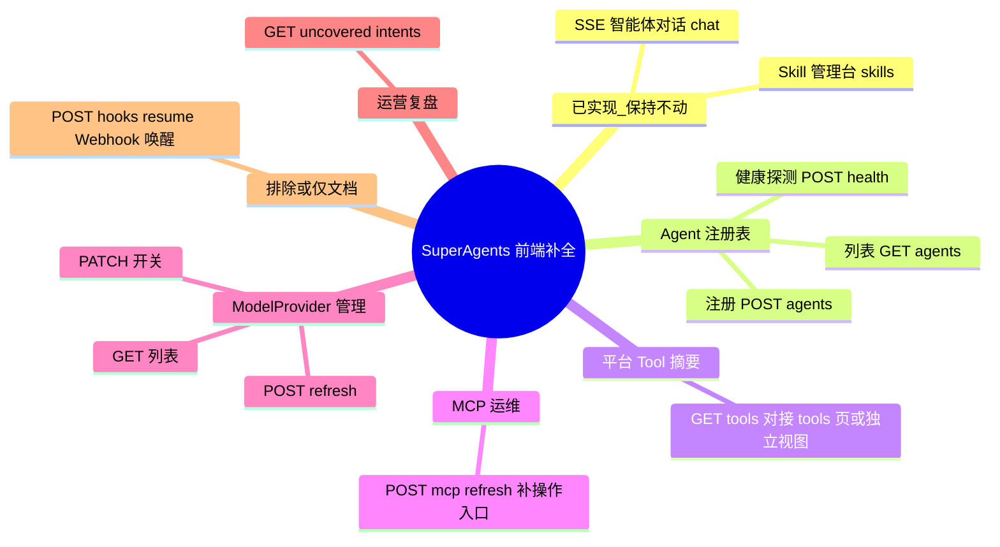

## Why
（为什么要做）

### 背景与目标
- **背景**：**ai** 仓库 `superAgents/web` 包已交付 SuperAgents 平台 REST 能力（Agent 注册、Skill 生命周期、ModelProvider 开关、MCP 刷新、未覆盖意图复盘、Tool 描述摘要、SSE 对话与 Webhook 恢复等），但 **ai_react**（Nebula Desk）侧仅部分对接：`POST /api/super-agents/chat` 与 Skill 管理台（`/agent-hub/skills`）已落地；其余管理类接口在 `ApiPaths.ts` 中仅有路径常量或未定义，现有 Agent Hub 页面（agents/tools/mcp）仍依赖 `GET /api/agent-hub/status` 的**本地 Bean 快照**，与 SuperAgents 平台 API 语义不一致，运维/注册/模型开关等能力无法在 UI 操作。
- **目标**：系统梳理 `superAgents/web` 全部 Controller 接口，识别前端未实现或未正确对接的部分；在 **ai_react** 内按现有 Umi 4 + Ant Design 5 + services 分层惯例补全页面与 API 客户端，**增量挂载**于 Agent Hub 导航体系，**不改动**既有对话、知识库、Skill 管理台及整体布局行为。

## Jira / 需求链接

- 无工单

## What Changes
（变更内容）

### 需求概览（全局）

### 后端接口盘点（初筛，design 阶段做前后端逐条对照）

| Controller | 方法 | 路径 | 前端现状 |
|------------|------|------|----------|
| `SuperAgentChatController` | POST | `/api/super-agents/chat` | ✅ 已对接（`chatService.sendAgentChat`） |
| `SkillController` | GET/POST/PATCH | `/skills`、状态 PATCH | ✅ 已对接（`platformSkillService` + `/agent-hub/skills`） |
| `AgentRegistryController` | GET | `/api/super-agents/agents` | ❌ 未对接（agents 页用 agent-hub/status） |
| `AgentRegistryController` | POST | `/api/super-agents/agents` | ❌ 未对接 |
| `AgentRegistryController` | POST | `/api/super-agents/agents/{name}/health` | ❌ 路径常量存在，无 service/页面 |
| `PlatformToolsDocumentationController` | GET | `/api/super-agents/tools` | ❌ 未对接（tools 页用 agent-hub/status） |
| `McpAdminController` | POST | `/api/super-agents/mcp/refresh` | ❌ 未对接（mcp 页只读展示） |
| `ModelProviderAdminController` | GET/PATCH/POST | `/model-providers` 系列 | ❌ 完全未对接 |
| `UncoveredIntentController` | GET | `/api/super-agents/uncovered-intents` | ❌ 完全未对接 |
| `SuperAgentWebhookController` | POST | `/api/super-agents/hooks/resume` | ⚪ 外部 Webhook 回调，默认**不建 UI**（design 确认） |

### 变更要点
- **对照清单**：产出「后端接口 ↔ 前端 service ↔ 路由/页面」矩阵，作为 spec/design 输入。
- **增量页面**：在 Agent Hub 分区下新增或增强页面（如平台 Agent 注册、ModelProvider 开关、未覆盖意图列表、MCP 刷新、SuperAgents Tool 摘要），复用 `AgentHubListScreen` / 现有卡片与 i18n 模式。
- **API 层**：扩展 `ApiPaths.ts`、`services/*`、`openapi/typings.d.ts`（或 OpenAPI 同步），禁止 pages 直连 fetch。
- **布局隔离**：不修改 BasicLayout 结构；新路由与菜单项增量添加；既有 `/agent-hub/skills`、对话页、知识库页逻辑与样式保持不变。
- **uiCraftMode: enabled**：所有新增 U1 界面走 Impeccable shape → craft。
- **后端无变更**：本变更默认 **不修改** ai 后端 Controller 与契约，仅前端补全；若对照发现契约缺口，在 design 中单列。

## Capabilities
（能力范围）

### New Capabilities（新增能力）
- `aether-agent/superagents-registry-ui`：SuperAgents 平台 Agent 注册表列表、注册表单、健康探测操作界面
- `aether-agent/superagents-platform-ops-ui`：ModelProvider 开关管理、MCP 工具刷新、未覆盖意图运营复盘列表
- `aether-agent/superagents-tools-catalog-ui`：对接 `GET /api/super-agents/tools` 的平台 Tool 描述摘要展示（与 agent-hub/status 本地 Tool 列表并存或分 Tab，design 定稿）

### Modified Capabilities（变更能力）
- `aether-agent/platform-skill-ui`：**无需求层行为变更**（已实现 Skill 管理台保持不动；仅确保同导航体系下新页面风格一致）

## Impact
（影响分析）

- **前端（ai_react）**：新增/增强 Agent Hub 下若干页面、services、类型、路由与菜单；`uiCraftMode: enabled` 要求 Impeccable 验收。
- **后端（ai）**：无代码变更预期；依赖既有 SuperAgents REST 契约。
- **契约**：需更新 `.aetherstack/context/api-contracts.yaml`（治理仓）与 `ai_react/ARCHITECTURE.md` / `CHANGELOG.md`。
- **风险**：agents/tools/mcp 页当前展示 agent-hub/status 数据，与 SuperAgents API 并存时需避免用户混淆——design 须明确「只读本地快照 vs 平台注册表」的信息架构，**不破坏**现有只读页默认行为（推荐新增子路由而非替换）。
