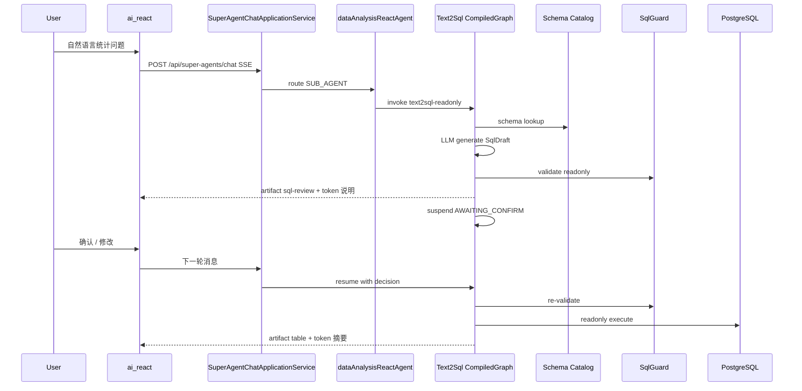

# Text2SQL + Schema Catalog + Artifact 展示 — 设计草案

> **变更 ID**：`add-text2sql-schema-artifacts`  
> **复杂度**：复杂（跨 Agent / Integration / Frontend；新增表；定时同步；Requirement ≥ 28）  
> **草案来源**：用户选择 **B — AI 起草**（会话「继续」）

---

## 1. 整体方案（三句话）

1. **Schema Catalog**：Flyway SQL 解析 + `pg_catalog` 校验双源，写入 `text2sql_schema_*` 表；启动与增量迁移后自动同步；text2sql 只读白名单目录。
2. **Text2SQL**：以 **CompiledGraph Skill** 固化「理解 → 查 schema → 生成 SQL → Guard → 挂起确认 → 执行 → 摘要」；`dataAnalysisReactAgent` 通过 `@Tool` 入口触发；会话状态落 `text2sql_query_session` + WORKING 记忆。
3. **Artifact 协议**：`PlatformSseFormatter` 新增 `type=artifact` JSON 事件；前端 `SuperAgentSse` / `useChatStream` / `ArtifactRenderer` 统一渲染 SQL（MySQL 展示风格）、表格、代码。

---

## 2. 关键决策

| 决策 | 选择 | 理由 | 备选 |
|------|------|------|------|
| text2sql 编排 | CompiledGraph Skill Bean | 确认/修改/执行步骤固定，需 HIL 挂起；禁止手写 while | 纯 DB Skill steps（难表达 Guard/HIL） |
| Schema 来源 | Flyway 解析 + 运行时元数据 | 历史与未来迁移全覆盖；执行以 DB 事实为准 | 仅 information_schema（缺注释与未执行脚本） |
| SQL 安全 | 服务端 JSQLParser + 白名单 | LLM 不可信；必须拦截 DML/DDL | 仅 Prompt 约束 |
| 确认交互 | 复用 suspended session 模式 + artifact actions | 与现有 `SuspendedSessionResumeBridge` 一致 | 新增独立 WebSocket |
| 展示方言 | displayDialect=mysql, executionDialect=postgresql | 用户要求 MySQL 风格展示；后端 PG 执行 | 统一 PG 展示 |
| 前端高亮 | react-syntax-highlighter + sql-formatter（动态 import） | 包体可控；与现有轻依赖一致 | shiki（更重） |

---

## 3. 模块边界

```text
ai/aether-platform/superAgents/
  domain/text2sql/          SchemaTable, SqlDraft, SqlGuardPolicy, Text2SqlSession
  application/text2sql/     Text2SqlApplicationService, SchemaCatalogSyncService
  application/skill/        Text2SqlSkillExecutor (CompiledGraph invoke)
  infrastructure/text2sql/  FlywaySchemaParser, PgCatalogValidator, ReadOnlyQueryExecutor
  tool/                     Text2SqlPlatformTool
  graph/skill/template/     Text2SqlReadonlySkillTemplate
  application/sse/          PlatformSseFormatter.formatArtifact

ai_react/
  utils/SuperAgentSse.ts    + artifact 解析
  hooks/useChatStream.ts    + artifacts 聚合
  components/artifacts/     ArtifactRenderer, Sql/Table/Code views
```

---

## 4. 核心流程（草案）



---

## 5. 风险与假设（Assumptions）

| 假设 | 失效风险 | 降级 |
|------|----------|------|
| Flyway 脚本是 schema 真源之一 | 手工改库未写迁移 | pg_catalog 覆盖并告警 |
| 首版仅 superAgents 平台表 | 业务库在其他 schema | Catalog 按配置 schema 白名单扫描 |
| 用户通过聊天确认 SQL | 前端未升级 | token 正文仍含 SQL 与确认提示 |
| JSQLParser 覆盖 PG 方言子集 | 复杂语法误拦/漏拦 | 白名单 + 只读连接 + statement 级拦截 |

---

## 6. 交付切片

| 切片 | 内容 |
|------|------|
| S1 | Flyway V21 表 + Catalog 同步 + 管理刷新 API |
| S2 | SqlGuard + Text2SqlPlatformTool + CompiledGraph Skill |
| S3 | SSE artifact + 前端渲染 + dataAnalysisReactAgent 接线 |
| S4 | 审计、指标、AI-TDD 单测、UI-Craft 验收 |

---
