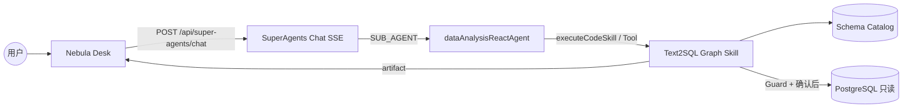
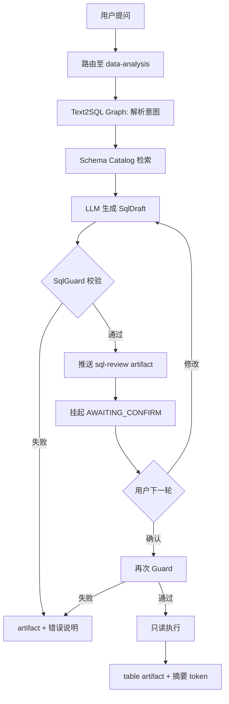
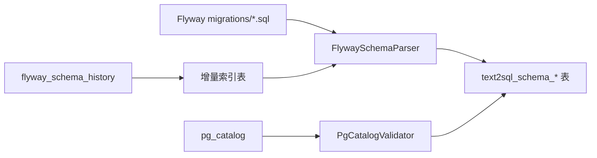
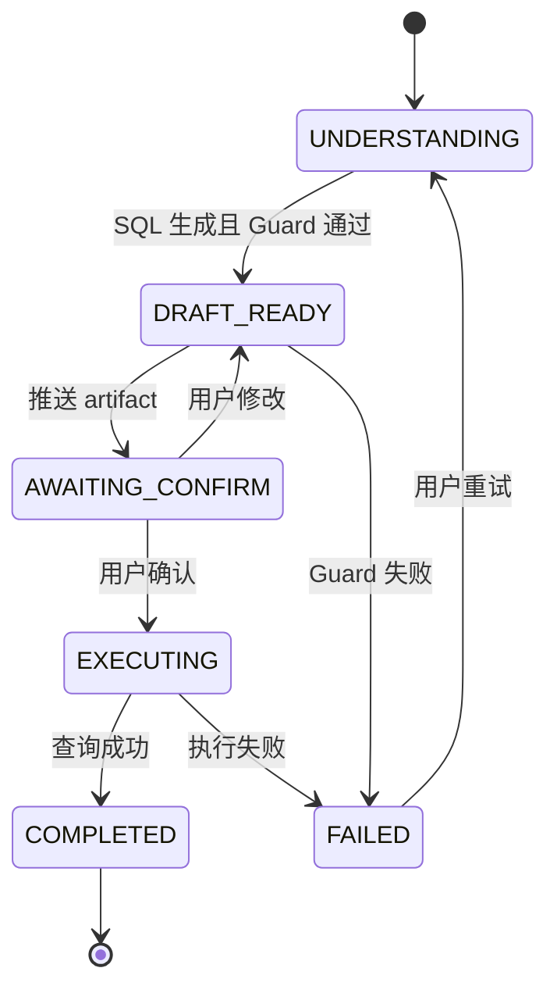
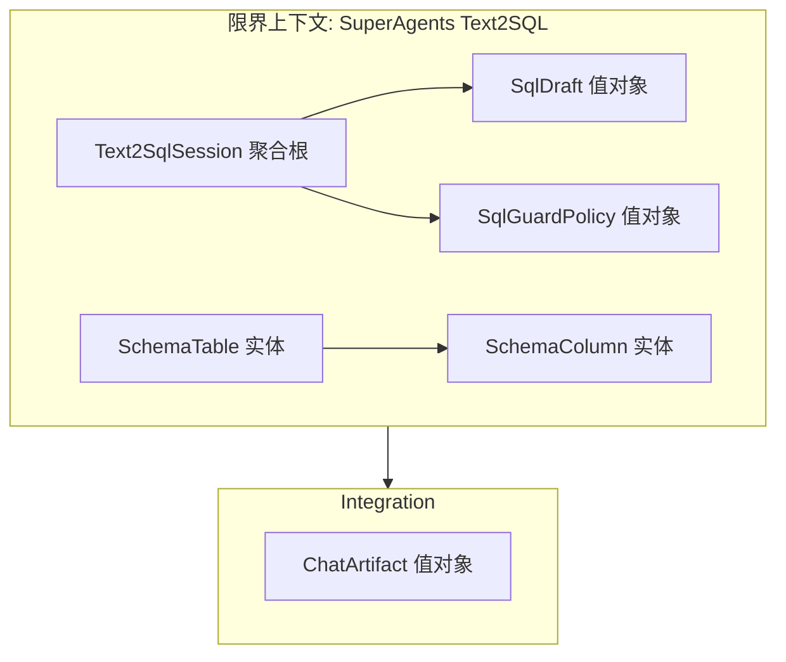
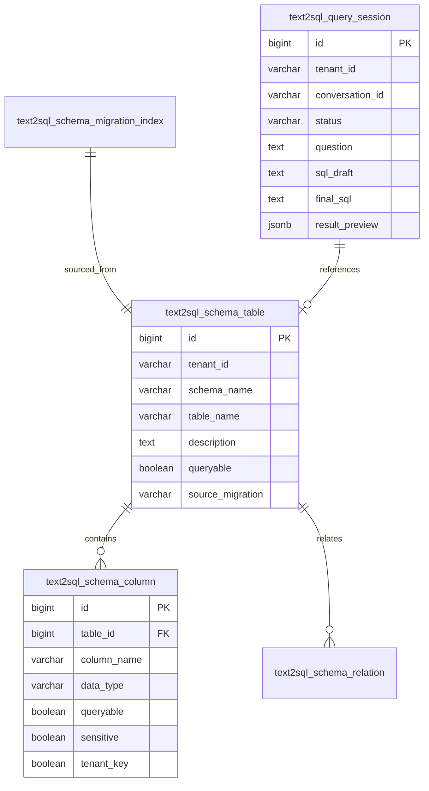
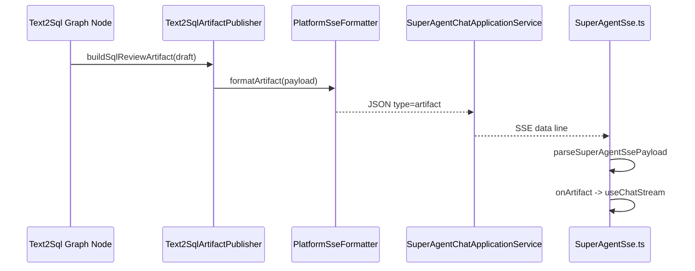

# Text2SQL + Schema Catalog + Artifact 展示 — 技术设计

> **变更 ID**：`add-text2sql-schema-artifacts`  
> **Schema**：`standard-spec-driven`  
> **design-draft**：用户选择 **B — AI 起草**（见 `design-draft.md`）  
> **Status**：`Reviewed`（design-review 已确认，2026-06-09）  
> **配置**：`aiTddMode: enabled` | `uiCraftMode: enabled`

---

## 一. 概述

### 1.1 术语

| 术语 | 英文 | 说明 |
|------|------|------|
| Schema Catalog | Schema Catalog | 基于 Flyway + 运行时元数据的表结构目录，供 text2sql 检索 |
| SqlDraft | SQL Draft | LLM 生成的只读 SQL 草案，待用户确认 |
| SqlGuard | SQL Guard | 服务端 SQL 安全校验（只读、白名单、租户、LIMIT） |
| Artifact | Chat Artifact | SSE 结构化消息块（SQL/表格/代码/JSON） |
| displayDialect | Display Dialect | 前端展示用 SQL 方言（本变更默认 mysql） |
| executionDialect | Execution Dialect | 实际执行方言（PostgreSQL） |

### 1.2 需求背景

**需求描述**：建设 Flyway 驱动的 Schema Catalog、SuperAgents text2sql 多轮确认只读查询能力，以及 Nebula Desk 统一 artifact 渲染协议。

**产品 PRD**：proposal + specs（无工单）。

**现状痛点**：
- `dataAnalysisReactAgent`（`AgentHubReactAgentConfiguration.java`）仅有 `RagPlatformTool` + `SkillRouterTool`，无 schema 目录与受控 SQL 执行。
- SSE 仅支持 `token` / `progress`（`PlatformSseFormatter.java`），前端 `SuperAgentSse.ts` 无法区分 SQL 与表格。
- 用户消息以纯 `text` 存储（`ConversationMessage`），靠正则解析路由前缀（`agentChatDisplay.ts`），不可扩展。

### 1.3 本期目标

| 序号 | 内容 | 任务点 |
|------|------|--------|
| 1 | Schema Catalog 初始化与增量同步 | Flyway V21 表、解析器、启动同步 Job、租户白名单 |
| 2 | Text2SQL CompiledGraph Skill | SqlGuard、Tool、Graph 节点、挂起确认、只读执行、审计 |
| 3 | SSE artifact 契约 | `formatArtifact`、错误码、integration-contracts 登记 |
| 4 | 前端 artifact 渲染 | `ArtifactRenderer`、SQL/Table/Code 视图、Impeccable U1 |
| 5 | AI-TDD + 门禁 | L1 单测：SqlGuard、Prompt、Graph 路由、SSE 解析 |

**代码落点（强制）**：
- 后端：`D:\cache\workspace\ai\aether-platform\src\main\java\com\yxy\deepseek\superAgents\`
- 单测：`D:\cache\workspace\ai\deepseek\src\test\java\com\yxy\deepseek\superAgents\`
- ReactAgent 接线：`aether-platform/.../agents/agent/react/AgentHubReactAgentConfiguration.java`
- Flyway：`aether-platform/src/main/resources/db/migration/V21__text2sql_schema_catalog.sql`
- 前端：`D:\cache\workspace\ai_react\src\`

### 1.4 影响分析

**受影响的系统：**
- [x] **ai / aether-platform** — Schema Catalog、Text2SQL Graph、Tool、SSE、Flyway
- [x] **ai_react** — SSE 解析、消息模型、聊天 artifact UI（U1）
- [x] **PostgreSQL** — 新增 `text2sql_schema_*`、`text2sql_query_session`
- [x] **integration-contracts** — SSE artifact 事件、可选 Catalog 管理 API
- [x] **api-changelog.md** — SSE 增量登记
- [ ] 外部 LLM — 沿用 DashScope；无新供应商

### 1.5 前端 UI 界面清单（uiCraftMode: enabled）

| 界面/组件 | 路径（ai_react） | UI 类型 | 说明 |
|-----------|------------------|---------|------|
| Artifact 渲染入口 | `src/components/artifacts/ArtifactRenderer.tsx` | UI-CRAFT | 按 kind 分发 SQL/Table/Code |
| SQL 确认卡片 | `src/components/artifacts/SqlReviewArtifactView.tsx` | UI-CRAFT | MySQL 风格高亮、确认/修改/复制 |
| 查询结果表格 | `src/components/artifacts/TableArtifactView.tsx` | UI-CRAFT | Ant Design Table、分页、空态 |
| 代码块视图 | `src/components/artifacts/CodeArtifactView.tsx` | UI-CRAFT | json/java/python 高亮与折叠 |
| SSE artifact 解析 | `src/utils/SuperAgentSse.ts` | UI-FUNC | 扩展 type=artifact |
| 流式消息聚合 | `src/hooks/useChatStream.ts` | UI-FUNC | `artifacts[]` 写入 ConversationMessage |
| 助手消息组合 | `src/components/chat/AgentAssistantMessageContent.tsx` | UI-FUNC | 插入 ArtifactRenderer |

---

## 二. 业务分析

### 2.1 业务用例



### 2.2 业务流程

#### 2.2.1 Text2SQL 活动图



#### 2.2.2 Schema Catalog 同步



### 2.3 业务场景

详见：`openspec/changes/add-text2sql-schema-artifacts/specs/**/spec.md`

---

## 三. 系统设计

### 3.1 Text2SQL 会话状态机



### 3.2 领域模型



| 类型 | 名称 | 职责 |
|------|------|------|
| 聚合根 | `Text2SqlSession` | 会话内 SQL 草案、状态、确认记录 |
| 实体 | `SchemaTable` / `SchemaColumn` | Catalog 条目 |
| 值对象 | `SqlDraft` | sqlText、displayDialect、executionDialect、explain |
| 值对象 | `SqlGuardResult` | allowed、violations |
| 领域服务 | `SqlGuardDomainService` | 只读/白名单/租户/limit 规则（纯 JDK） |
| 端口 | `SchemaCatalogRepository` | Catalog CRUD + 语义检索 |
| 端口 | `ReadOnlyQueryPort` | 参数化只读执行 |

### 3.3 数据模型图



---

## 四. 详细设计

### 4.1 数据表定义

#### Flyway：`V21__text2sql_schema_catalog.sql`

**新增表：text2sql_schema_table**

| 字段 | 类型 | 说明 |
|------|------|------|
| id | BIGSERIAL PK | |
| tenant_id | VARCHAR(64) NOT NULL | 租户；平台表可用 default |
| schema_name | VARCHAR(64) NOT NULL DEFAULT 'public' | PG schema |
| table_name | VARCHAR(128) NOT NULL | |
| description | TEXT | COMMENT 或业务说明 |
| queryable | BOOLEAN NOT NULL DEFAULT FALSE | text2sql 是否可查 |
| risk_level | VARCHAR(16) DEFAULT 'normal' | normal/sensitive |
| source_migration | VARCHAR(256) | 来源 Flyway 脚本 |
| updated_at | TIMESTAMPTZ | |

**索引**：`UNIQUE (tenant_id, schema_name, table_name)`；`idx_text2sql_schema_table_queryable`

**新增表：text2sql_schema_column**

| 字段 | 类型 | 说明 |
|------|------|------|
| id | BIGSERIAL PK | |
| table_id | BIGINT FK | |
| column_name | VARCHAR(128) | |
| data_type | VARCHAR(64) | |
| description | TEXT | |
| queryable | BOOLEAN DEFAULT TRUE | |
| sensitive | BOOLEAN DEFAULT FALSE | |
| tenant_key | BOOLEAN DEFAULT FALSE | 是否租户隔离字段 |

**新增表：text2sql_schema_migration_index**

| 字段 | 类型 | 说明 |
|------|------|------|
| id | BIGSERIAL PK | |
| script_name | VARCHAR(256) UNIQUE | |
| version | VARCHAR(64) | flyway version |
| checksum | BIGINT | |
| processed_at | TIMESTAMPTZ | |

**新增表：text2sql_query_session**

| 字段 | 类型 | 说明 |
|------|------|------|
| id | BIGSERIAL PK | |
| tenant_id | VARCHAR(64) | |
| conversation_id | VARCHAR(128) | |
| user_id | VARCHAR(128) | |
| status | VARCHAR(32) | 状态机枚举 |
| question | TEXT | 原始问题 |
| sql_draft | TEXT | 当前草案 |
| final_sql | TEXT | 确认后 SQL |
| artifact_payload | JSONB | 最近 artifact 快照 |
| result_row_count | INT | |
| error_code | VARCHAR(64) | |
| created_at / updated_at | TIMESTAMPTZ | |

**初始化 DML**：将 SuperAgents 平台表（`skills`、`agent_registry`、`trace_spans`、`audit_log` 等）标记 `queryable=true`（非敏感列）；`audit_log` 响应字段级 `sensitive`。

### 4.2 应用内部组件划分

| 层 | 类 | 职责 |
|----|-----|------|
| domain | `SqlGuardDomainService` | 只读/白名单/租户/limit 规则 |
| domain | `Text2SqlSession` | 状态迁移 composeFrom |
| application | `SchemaCatalogSyncApplicationService` | 编排 Flyway 解析 + pg 校验 + 落库 |
| application | `Text2SqlApplicationService` | 用例：lookup / generate / confirm / execute |
| application | `Text2SqlArtifactPublisher` | 组装 SSE artifact payload |
| infrastructure | `FlywaySchemaParser` | 解析 CREATE/ALTER/COMMENT |
| infrastructure | `PgCatalogSchemaValidator` | information_schema 对齐 |
| infrastructure | `JsqlParserSqlGuard` | 语句级拦截 |
| infrastructure | `ReadOnlyJdbcQueryExecutor` | 只读连接/超时/行数上限 |
| graph | `Text2SqlReadonlySkillTemplate` | CompiledGraph 节点链 |
| tool | `Text2SqlPlatformTool` | @Tool 四段式，供 ReactAgent 调用 |
| web | `SchemaCatalogAdminController` | 可选：POST refresh |

### 4.3 组件时序图 — SSE artifact 推送



### 4.4 核心算法 — SqlGuard

**输入**：`SqlDraft`、租户 ID、Catalog 白名单、`SqlGuardPolicy`（maxRows=100、requireTenantFilter=true）

**步骤**：
1. JSQLParser 解析为单条 `SELECT`/`WITH`；拒绝多语句、`;` 链、DML/DDL 关键字。
2. 提取引用表/列，必须在 Catalog `queryable=true` 集合内。
3. 若表含 `tenant_key` 列，断言 WHERE 含 `tenant_id = :tenant`（或 Graph 自动注入后再校验）。
4. 断言含 `LIMIT` 或自动追加 `LIMIT :maxRows`（配置项 `aether.platform.text2sql.default-limit`）。
5. 输出 `SqlGuardResult`；失败码：`SQL_NOT_READONLY`、`TABLE_NOT_ALLOWED`、`TENANT_FILTER_MISSING`、`LIMIT_EXCEEDED`。

### 4.5 定时任务

| Job 名称 | 触发规则 | 功能 | 部署 |
|----------|----------|------|------|
| SchemaCatalogStartupSync | ApplicationReadyEvent | 全量/增量同步 | aether-platform |
| SchemaCatalogScheduledSync | `@Scheduled` cron 默认 03:00 | 补偿同步 | 可配置开关 |

---

## 五. 接口设计

### 5.1 本期新增/更新接口列表

| 接口 | 变更类型 | 说明 |
|------|----------|------|
| `POST /api/super-agents/chat` SSE | **修改（非 BREAKING）** | 新增 `type=artifact` 事件 |
| `POST /api/super-agents/schema-catalog/refresh` | **新增（可选管理端）** | 手动触发 Catalog 同步 |

HTTP 路径无 BREAKING；老客户端忽略 artifact 事件。

### 5.2 SSE artifact 事件（结构化）

**启用条件**：`aether.platform.sse.structured-events=true`（与现有 token/progress 一致）

**payload 示例 — sql-review**：

```json
{
  "type": "artifact",
  "artifact": {
    "id": "sql-draft-20260609-1",
    "kind": "sql-review",
    "title": "待确认 SQL",
    "displayDialect": "mysql",
    "executionDialect": "postgresql",
    "content": "SELECT tenant_id, COUNT(*) AS cnt FROM trace_spans WHERE tenant_id = 'default' GROUP BY tenant_id LIMIT 100",
    "summary": "统计 default 租户 trace 调用次数",
    "actions": ["confirm", "edit", "copy"],
    "status": "awaiting_confirm"
  }
}
```

**payload 示例 — table**：

```json
{
  "type": "artifact",
  "artifact": {
    "id": "result-20260609-1",
    "kind": "table",
    "title": "查询结果",
    "columns": [
      { "key": "tenant_id", "title": "租户", "valueType": "string" },
      { "key": "cnt", "title": "次数", "valueType": "number" }
    ],
    "rows": [{ "tenant_id": "default", "cnt": 128 }],
    "page": { "current": 1, "pageSize": 100, "total": 1, "truncated": false }
  }
}
```

**payload 示例 — code**：

```json
{
  "type": "artifact",
  "artifact": {
    "id": "code-1",
    "kind": "code",
    "language": "python",
    "title": "示例脚本",
    "content": "print('hello')",
    "actions": ["copy"]
  }
}
```

**错误码（ToolResult / 正文）**：

| errorCode | 说明 |
|-----------|------|
| `SQL_NOT_READONLY` | 非只读语句 |
| `TABLE_NOT_ALLOWED` | 表不在白名单 |
| `TENANT_FILTER_MISSING` | 缺少租户条件 |
| `SQL_GUARD_REJECTED` | 其他 Guard 失败 |
| `TEXT2SQL_SESSION_NOT_FOUND` | 无挂起会话 |
| `TEXT2SQL_EXEC_TIMEOUT` | 查询超时 |

**用户确认语义（聊天文本，非新 HTTP）**：

| 用户输入 | 解析为 |
|----------|--------|
| 「确认执行」「确认」 | `CONFIRM` |
| 「修改…」/ 自然语言改条件 | `REVISE` + revisionText |
| 「取消」 | `CANCEL` |

### 5.3 会话消息持久化（artifact 与 text2sql 状态）

**变更类型**：扩展 `POST /api/agent-hub/conversations/{id}/messages` 请求体（非 BREAKING：新字段可选）

**assistant 消息扩展字段**：

```json
{
  "id": "assistant-xxx",
  "role": "assistant",
  "kind": "text",
  "text": "已生成 SQL 草案，请确认是否执行。",
  "meta": {
    "artifacts": [
      { "id": "sql-draft-1", "kind": "sql-review", "content": "SELECT ..." }
    ],
    "text2sqlSessionId": "ts-20260609-1"
  }
}
```

- 前端 `persistAgentTurn` 写入 `meta.artifacts`；历史加载经 `normalizeConversationMessage` 还原。
- 后端 `text2sql_query_session` 为 text2sql 编排真源；`meta.text2sqlSessionId` 仅用于前端历史展示与续聊提示。

---

## 六. 代码改造分析

### 6.1 入口链路 — SuperAgents SSE 聊天

**代码位置**：`SuperAgentChatApplicationService.java:streamAgentChat:95-164`

**现状代码**：

```java
// prep 图定路由 → resolveBodyStream → wrapSseBody(formatToken)
Flux<String> body = attachLifecycleHooks(
    wrapSseBody(resolveBodyStream(prep, tenantId, memoryPrefix)), ...);
return Flux.concat(
    Flux.just(sseFormatter.formatProgress(...)),
    routed,
    Flux.just(sseFormatter.formatProgress(...)));
```

**风险点**：仅 token/progress，text2sql 结构化 SQL/表格无法传输。

**改造要点**：

```java
// 1. PlatformSseFormatter 新增 formatArtifact(ChatArtifact artifact)
// 2. Text2Sql 流式分支 map(formatToken) 改为 concat artifact 事件
// 3. resolveBodyStream 的 SUB_AGENT 分支识别 data-analysis + 活跃 text2sql session
```

---

### 6.2 SSE 格式化 — PlatformSseFormatter

**代码位置**：`PlatformSseFormatter.java:17-76`

**现状代码**：

```java
public String formatToken(String text) {
    if (!properties.getSse().isStructuredEvents()) {
        return text;
    }
    return toJson(Map.of("type", "token", "text", text == null ? "" : text));
}
// 无 formatArtifact
```

**改造要点**：

```java
public String formatArtifact(ChatArtifact artifact) {
    if (!properties.getSse().isStructuredEvents()) {
        return artifact.fallbackPlainText(); // 降级为 token 兼容
    }
    Map<String, Object> payload = new LinkedHashMap<>();
    payload.put("type", "artifact");
    payload.put("artifact", artifact.toMap());
    return toJson(payload);
}
```

---

### 6.3 子 Agent 接线 — dataAnalysisReactAgent

**代码位置**：`AgentHubReactAgentConfiguration.java:49-66`

**现状代码**：

```java
.methodTools(ragPlatformTool, skillRouterTool)
.instruction(""" ... 有匹配流程时用 skill_router ... """)
```

**改造要点**：

```java
// 注入 Text2SqlPlatformTool（≤5 工具：rag + skill_router + text2sql_* 合并为单一 Tool 入口）
.methodTools(ragPlatformTool, skillRouterTool, text2SqlPlatformTool)
.instruction("""
  ... 数据分析/SQL 问题优先 text2sqlQuery；
  必须在用户确认 SQL 后才可 text2sqlExecute；
  禁止自行编造表名，须先 text2sqlSchemaLookup。
""")
```

---

### 6.4 核心校验 — SqlGuard（新增）

**代码位置**：`superAgents/domain/text2sql/SqlGuardDomainService.java`（新增）

**改造要点（伪代码）**：

```java
public SqlGuardResult validate(SqlDraft draft, SqlGuardContext ctx) {
    Statement stmt = parser.parseSingle(draft.sqlText());
    if (!(stmt instanceof Select)) return reject("SQL_NOT_READONLY");
    if (!whitelist.containsAll(extractTables(stmt))) return reject("TABLE_NOT_ALLOWED");
    if (ctx.requireTenantFilter() && !containsTenantPredicate(stmt, ctx.tenantId()))
        return reject("TENANT_FILTER_MISSING");
    if (!hasLimit(stmt)) draft = draft.withAppendedLimit(ctx.maxRows());
    return SqlGuardResult.ok(draft);
}
```

**AUTO-AI-UT**：`SqlGuardDomainServiceTest` — 覆盖 DML、缺 tenant、非白名单表、正常 SELECT。

---

### 6.5 Schema Catalog 同步（新增）

**代码位置**：`SchemaCatalogSyncApplicationService.java` + `FlywaySchemaParser.java`

**Flyway 扫描范围（强制）**：

- **首版仅扫描** `aether-platform/src/main/resources/db/migration/*.sql`（SuperAgents 平台表）；与运行时 `flyway_schema_history` 同源。
- `knowledgehub/**`、`deepseek/**` 等其他模块迁移**不在首版范围**；后续通过 `aether.platform.text2sql.catalog-extra-locations` 扩展（tasks 可选）。
- 解析器支持：`CREATE TABLE`、`ALTER TABLE ... ADD/DROP COLUMN`、`COMMENT ON`；复杂 `ALTER`（重命名、分区）记录待人工标注。

**改造要点**：

```java
public void syncIncremental() {
    List<FlywayMigration> pending = migrationIndexRepository.findUnprocessed(
        flywaySchemaHistory.list());
    for (FlywayMigration m : pending) {
        CatalogDelta delta = flywaySchemaParser.parse(m.scriptContent());
        pgCatalogValidator.mergeWithRuntime(delta);
        catalogRepository.upsert(delta);
        migrationIndexRepository.markProcessed(m);
    }
}
```

**语义检索（MVP）**：首版用 `table_name`/`column_name`/`description` **ILIKE + 租户过滤** Top-K；`description_embedding vector` 列预留，P4 可选向量化（对齐 spec REQ-6，不阻塞首版）。

**数据落点**：`text2sql_schema_*` 表；同事务 upsert 表/列。

---

### 6.6 挂起确认 — 与 Workflow 挂起优先级

**代码位置**：`SuperAgentChatApplicationService.java:108-115`（suspended 检测）、新增 `Text2SqlSessionResumeBridge`

**prep 前优先级（强制，避免与 Graph HIL 冲突）**：

```text
1. conversationSessionSnapshotService.isSuspended → WorkflowResumeBridge（既有）
2. text2sqlQuerySessionRepository.findAwaitingConfirm(tenant, conversationId) → Text2SqlSessionResumeBridge
3. 常规 prep 图路由
```

**改造要点**：

- text2sql 挂起**不**复用 `agent_workflow_suspend` 表；独立 `text2sql_query_session`，避免与审批 Graph 恢复线混淆（对照 `SkillExecutionStateMachine` 与 `WorkflowResumeService` 双恢复线注释）。
- 用户「确认/修改/取消」经 `Text2SqlUserDecisionParser`（应用层）解析，更新 session 后 CompiledGraph `invoke` resume。
- Workflow 挂起与 text2sql 待确认**互斥**：同一 conversation 同时仅一种挂起态；text2sql 进入 AWAITING_CONFIRM 前须校验无 active workflow suspend。

---

### 6.7 会话持久化 — persistAgentTurn

**代码位置**：`ai_react/src/services/conversationPersist.ts:40-80`

**现状代码**：

```typescript
await appendConversationMessage(conversationId, {
  id: assistantMessageId,
  role: 'assistant',
  kind: 'text',
  text: assistantText,
  meta,
});
// meta 仅 KnowledgeChatMeta，无 artifacts
```

**改造要点**：

```typescript
await appendConversationMessage(conversationId, {
  id: assistantMessageId,
  role: 'assistant',
  kind: 'text',
  text: assistantText,
  meta: { ...meta, artifacts: assistantArtifacts, text2sqlSessionId },
});
```

**openapi**：扩展 `ConversationMessage.meta` 类型定义（`typings.d.ts`），`artifacts?: MessageArtifact[]`。

---

### 6.8 前端 SSE 解析

**代码位置**：`SuperAgentSse.ts:21-55`、`useChatStream.ts:138-209`

**现状**：仅 `token` | `progress`。

**改造要点**：

```typescript
export interface SuperAgentArtifactEvent {
  type: 'artifact';
  artifact: MessageArtifact;
}

// dispatchSuperAgentSsePayload 增加 onArtifact 回调
// useChatStream onArtifact: 追加到 assistantMessage.artifacts[]
```

**代码位置**：`AgentAssistantMessageContent.tsx` — 在 `TypewriterText` 后渲染 `<ArtifactList artifacts={item.artifacts} />`。

---

## 七. 非功能性需求设计

### 7.1 权限

| 权限 Tag | 说明 |
|----------|------|
| `TOOL_TEXT2SQL` | text2sql Tool 调用 |
| `TOOL_TEXT2SQL_EXECUTE` | 确认后执行（可拆分） |
| `ADMIN_SCHEMA_CATALOG` | Catalog 刷新 API |

沿用 `PlatformAuthorizationService` + `@ToolPermission` 模式。

### 7.2 数据迁移

- [x] Flyway V21 新增表
- [x] 启动时自动 Catalog 初始化（从 `db/migration/*.sql` + pg_catalog）
- [x] 回滚：删除 V21 表不影响存量 SuperAgents 功能

### 7.3 缓存

| Key | TTL | 说明 |
|-----|-----|------|
| `{tenantId}:text2sql:schema-menu` | 5min | 可查询表摘要 |
| `{tenantId}:text2sql:session:{conversationId}` | 会话级 | 可选 Redis；首版 DB |

### 7.4 安全评估

- [x] 查询越权：租户过滤 + 表白名单 + **强制只读事务**（`SET TRANSACTION READ ONLY` + `statement_timeout`）
- [x] 执行连接：**禁止**复用应用读写 DataSource 直接执行；经 `ReadOnlyJdbcQueryExecutor` 包装，仅允许单条 SELECT
- [x] 敏感列：`sensitive=true` 结果脱敏
- [x] Prompt 注入：用户问题参数化，禁止拼接 SQL
- [x] LLM 不可信：Guard 必须在执行前
- [x] Maven 新增 `jsqlparser`（版本由 BOM 管理）仅用于 SqlGuard，不用于执行 SQL

### 7.5 限流降级

- text2sql 执行纳入 `rate_limit_config` dimension=TOOL
- 超时默认 10s；超返回 `TEXT2SQL_EXEC_TIMEOUT` + 友好 token

### 7.6 可观测性清单

| 项 | 验证口径 |
|----|----------|
| `platform_text2sql_requests_total` | tag: status, tenant |
| `platform_text2sql_guard_rejections_total` | tag: errorCode |
| `audit_log` operation `TEXT2SQL_EXECUTE` | 含 sql 摘要（脱敏） |
| `trace_spans` span_type `TEXT2SQL` | prep/generate/guard/execute |
| SSE artifact | 集成测试解析 `type=artifact` |

### 7.7 Assumptions

| 假设 | 失效风险 | 降级 |
|------|----------|------|
| SuperAgents 表均在 `public` schema | 多 schema 业务库 | 配置 `aether.platform.text2sql.schemas` |
| 首版不暴露任意 JDBC 数据源 | 用户要跨库 | 仅 Catalog 登记库 |
| structured-events 已开启 | 纯文本 SSE | artifact.fallbackPlainText() |

### 7.8 并发与幂等

- 同 `conversationId` 同时仅允许一个 `AWAITING_CONFIRM` session；新 text2sql 请求取消旧 session。
- 确认执行幂等：同 `final_sql` + sessionId 重复确认不重复执行（返回缓存结果）。

### 7.9 性能

- Catalog 检索 Top-K ≤ 10 表；Prompt 注入 schema 片段 ≤ 4000 字符。
- 查询结果 artifact 默认最多 100 行；超出 `truncated=true`。

---

## 八. Spring AI / 铁三角设计清单

- [x] **编排选型**：Text2SQL 用 **CompiledGraph Skill**（`Text2SqlReadonlySkillTemplate`）；`dataAnalysisReactAgent` 用 **ReactAgent** 调用 `@Tool` 入口；Schema 检索用 **ChatClient** 生成 SQL 草案（L1 单测 Mock）。
- [x] **Spring AI 核心**：Prompt 外部化 `prompts/text2sql-*.st`；DashScope 环境变量；异常 → ToolResult；traceId 贯穿。
- [x] **多 Agent**：总路由仍仅 transfer 子 Agent；text2sql Tool 仅注入 `dataAnalysisReactAgent`（≤5 tools：rag + skill_router + text2sql 入口）。
- [x] **RAG**：可选 `searchPlatformKnowledge` 补充业务口径；不替代 Catalog。
- [x] **React/Graph**：Graph 单例 compile；节点：understand → schemaLookup → generateSql → guard → publishArtifact → awaitConfirm → execute → summarize；HIL 在 awaitConfirm；maxIterations 对 ReactAgent 保持 10。

---

## 九. 外部系统改造点

| 系统 | 改造 |
|------|------|
| DashScope ChatModel | 无 API 变更；Prompt 模板新增 text2sql |
| PostgreSQL | 新增表 + 只读查询；建议只读 role（design 可选） |
| Nebula Desk | SSE 解析 + U1 artifact 组件 |

---

## 十. 追溯映射（spec → design）

| Spec 能力 | Design 章节 |
|-----------|-------------|
| aether-agent-schema-catalog | §4.1、§4.5、§6.5 |
| aether-agent-text2sql | §3.1、§4.4、§6.4、§6.6 |
| aether-integration-chat-artifacts | §5.2、§6.2 |
| aether-frontend-artifact-rendering | §1.5、§6.7 |
| aether-agent-orchestrator (delta) | §6.3、§6.6 |
| aether-integration-chat-sse-contract (delta) | §5.1、§5.2、§6.2 |

---

**Revision**

| 版本 | 日期 | 说明 |
|------|------|------|
| v0.1 | 2026-06-09 | 初稿（基于 design-draft B） |
| v0.2 | 2026-06-09 | design-review 阻塞项修订：挂起优先级、artifact 持久化、Flyway 范围、只读执行 |
