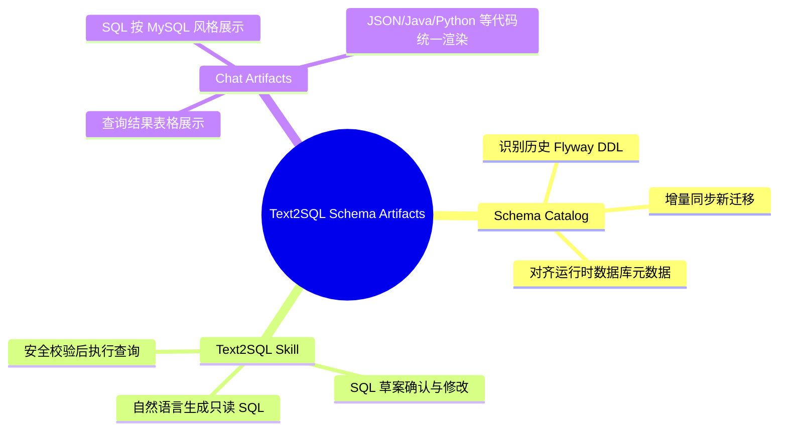

## Why
（为什么要做）

### 背景与目标
- 背景：SuperAgents 已具备 Skill、Tool、CompiledGraph、挂起恢复与前端 SSE 聊天基础，但数据分析类问题仍缺少基于项目真实表结构的 text2sql 能力；如果仅依赖模型上下文猜测表名和字段，容易产生错误 SQL、越权查询或结果不可解释。
- 目标：以 Flyway 迁移和 PostgreSQL 元数据为来源建立可查询 Schema Catalog，让 SuperAgents 能先生成受控 SQL 草案，询问用户确认或修改后再执行只读查询，并让前端以统一 artifact 协议展示 SQL、查询结果表格、JSON 与多语言代码片段。

## Jira / 需求链接

- 无工单

## What Changes
（变更内容）

### 需求概览（全局）

- 新增后端 Schema Catalog 能力：识别项目 Flyway 历史建表与改表语句，并在后续迁移新增或变更时同步更新 text2sql 可识别目录。
- 新增 SuperAgents text2sql Skill 能力：针对数据分析类问题，先生成只读 SQL 草案，进入用户确认或修改环节，最终在安全校验通过后执行查询并返回结果。
- 新增前后端结构化 artifact 契约：在 SSE/消息中明确区分正文、SQL 草案、查询结果表格、JSON 与代码片段，避免前端依赖正则猜测内容类型。
- 新增前端 artifact 渲染能力：SQL 按 MySQL 展示风格呈现，查询结果以表格呈现，后续 JSON、Java、Python 等代码语言通过统一渲染入口兼容。
- 强化安全与审计要求：text2sql 默认只支持只读查询、表字段白名单、租户过滤、LIMIT/分页约束、敏感字段屏蔽和执行审计。

## Capabilities
（能力范围）

### New Capabilities（新增能力）
- `aether-agent/schema-catalog`: 为 text2sql 提供基于 Flyway 与运行时数据库元数据的表结构识别目录。
- `aether-agent/text2sql`: 支持 SuperAgents 数据分析场景下的 SQL 草案生成、确认/修改、只读查询执行与结果返回。
- `aether-integration/chat-artifacts`: 定义聊天 SSE/消息中的结构化 artifact 契约，覆盖 SQL、表格、JSON 与代码片段。
- `aether-frontend/artifact-rendering`: 在 Nebula Desk 聊天界面统一渲染 SQL、查询结果表格与多语言代码 artifact。

### Modified Capabilities（变更能力）
- `aether-agent/orchestrator`: 数据分析类意图需要能路由到 text2sql Skill，并在多轮确认场景中保持会话上下文。
- `aether-integration/chat-sse-contract`: SuperAgents SSE 需要兼容结构化 artifact 事件，同时保持现有 token/progress 事件可用。

## Impact
（影响分析）

> proposal.md 不做技术分析，仅简述影响。完整 Impact 清单在 design.md 中展开（详见 openspec/references/aether-rules.md）。

- 后端影响 `ai` 仓库的 SuperAgents Skill、Tool、CompiledGraph、数据库迁移、Schema Catalog、SQL 安全校验、审计与测试；前端影响 `ai_react` 仓库的 SSE 解析、消息模型、聊天渲染组件与 artifact UI。
- 前后端契约将新增 artifact 类型与 text2sql 多轮确认语义，需要同步更新 OpenSpec specs、API 契约、测试用例与完成门禁。
