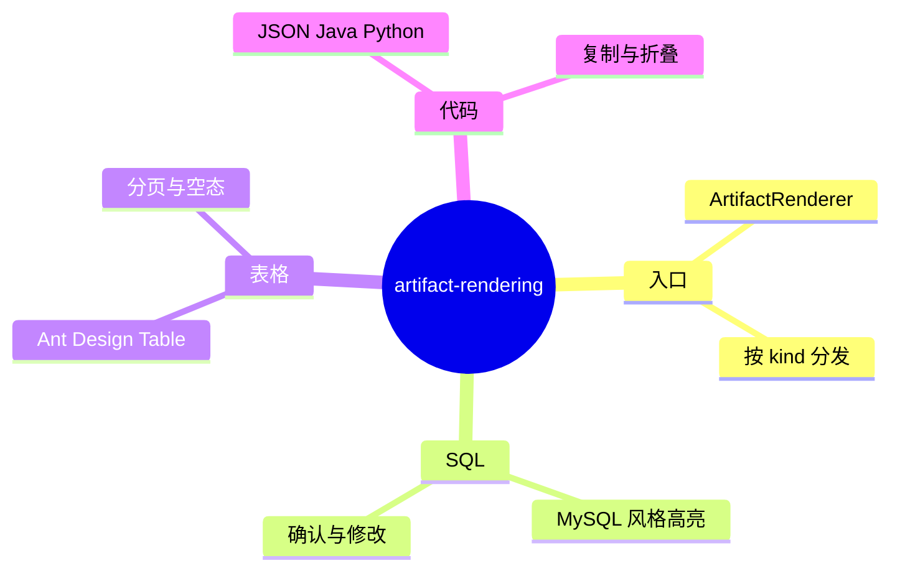

# 聊天 Artifact 统一渲染

## Nebula Desk / Artifact 渲染 需求说明（前提/操作/结果）
> 在智能体聊天界面统一渲染 SQL、查询结果表格、JSON 与多语言代码 artifact；子能力，协议定义见 `aether-integration/chat-artifacts`。
> `uiCraftMode: enabled`；U1 界面须走 Impeccable。

---

## ADDED Requirements
（新增用户故事）

### 功能组 1：统一渲染框架

### Requirement: 1. 统一 Artifact 渲染入口

系统应当（SHALL）在助手消息中通过统一渲染入口按 artifact 类型分发到对应视图组件；新增类型时仅需扩展注册表，不得在各聊天页面重复编写解析逻辑。

#### 场景: 单条消息含多种 artifact
- **前提**：assistant 消息含 SQL 草案 artifact 与 table 结果 artifact。
- **操作**：用户查看该消息。
- **结果**：同一气泡内按顺序渲染 SQL 卡片与结果表格；正文摘要与 artifact 分区清晰。

---

### Requirement: 2. 未知 artifact 类型降级

系统应当（SHALL）对未知或未实现的 artifact 类型提供降级展示（如纯文本或 JSON 折叠块），并记录可观测告警；不得导致整页聊天崩溃。

#### 场景: 后端新增未升级客户端的类型
- **前提**：后端推送客户端尚未实现的 chart 类型 artifact。
- **操作**：用户打开聊天页。
- **结果**：显示友好降级内容；其余消息正常渲染。

---

### 功能组 2：各类型展示

### Requirement: 3. SQL 按 MySQL 风格展示

系统应当（SHALL）对 SQL 类 artifact 使用 MySQL 方言风格进行语法高亮与格式化展示；若执行方言与展示方言不同，须在 UI 上明确标注，避免用户误解。

#### 场景: 展示 PostgreSQL 执行、MySQL 风格 SQL
- **前提**：artifact 含 displayDialect=mysql、executionDialect=postgresql。
- **操作**：用户查看 SQL 草案卡片。
- **结果**：SQL 以 MySQL 风格高亮；卡片说明实际在 PostgreSQL 只读执行。

---

### Requirement: 4. 查询结果以表格展示

系统应当（SHALL）对 table 类型 artifact 使用表格组件展示列与行；支持横向滚动、空结果态、超宽列省略与分页或「仅展示前 N 行」提示。

#### 场景: 100 行查询结果
- **前提**：table artifact 含 100 行与分页信息。
- **操作**：用户查看结果区。
- **结果**：表格可读；超量数据有分页或截断提示；空结果显示空态文案。

---

### Requirement: 5. JSON 与多语言代码展示

系统应当（SHALL）对 json/java/python 等 code 类 artifact 提供语法高亮、复制按钮与折叠/展开；JSON 优先格式化展示，非法 JSON 降级为纯文本。

#### 场景: 展示 Python 代码片段
- **前提**：artifact language=python。
- **操作**：用户查看代码块。
- **结果**：Python 语法高亮；一键复制可用；长代码可折叠。

---

### Requirement: 6. SQL 确认与修改交互

系统应当（SHALL）对含 confirm/edit 语义的 SQL 草案 artifact 提供明确交互：用户可通过快捷操作或输入框确认执行、发起修改；交互结果作为下一轮用户消息发送给 SuperAgents。

#### 场景: 用户点击确认执行
- **前提**：SQL 草案卡片展示确认按钮。
- **操作**：用户点击「确认执行」。
- **结果**：发送确认语义的用户消息；聊天流进入执行与结果展示阶段。

---
