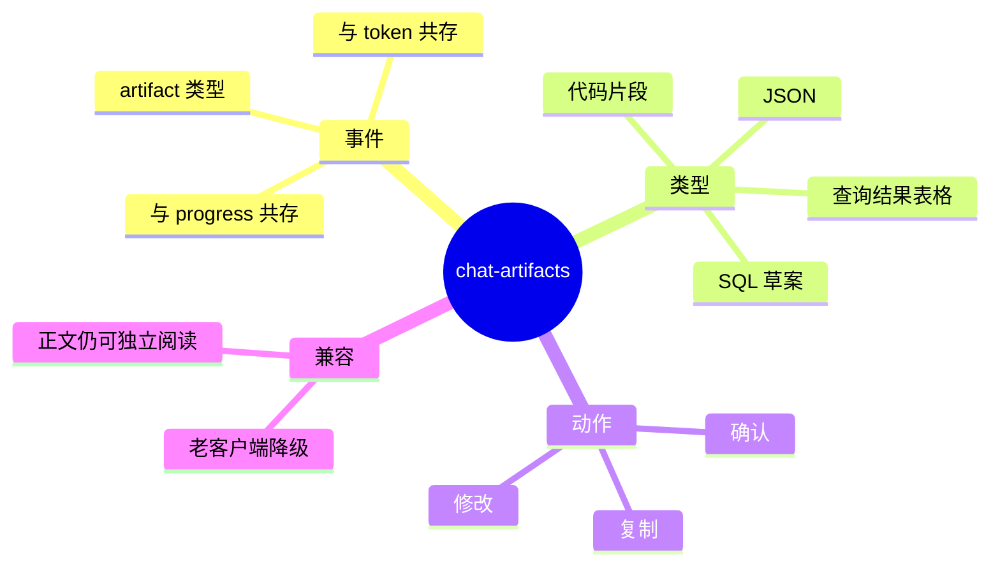

# 聊天结构化 Artifact 契约

## Integration / 聊天 Artifact 协议 需求说明（前提/操作/结果）
> 定义 SuperAgents 聊天 SSE/消息中的结构化 artifact 契约，明确区分正文、SQL 草案、查询结果表格、JSON 与多语言代码片段；避免客户端依赖正则猜测内容类型。
> 详见 proposal「Chat Artifacts」节点；与 `aether-integration/chat-sse-contract` 增量协同。

---

## ADDED Requirements
（新增用户故事）

### 功能组 1：协议基础

### Requirement: 1. Artifact 结构化事件类型

系统应当（SHALL）在 SuperAgents 聊天流中推送结构化 artifact 事件；每个 artifact 至少包含：唯一标识、类型（code/table/json/sql-review 等）、标题、内容与可选操作按钮语义（如 confirm、edit、copy）。

#### 场景: 推送 SQL 草案 artifact
- **前提**：text2sql 已生成待确认 SQL。
- **操作**：监听 SuperAgents SSE 流。
- **结果**：收到 artifact 事件，类型表明为 SQL 草案，内容含 SQL 文本与确认/修改动作语义。

---

### Requirement: 2. Artifact 与正文、Progress 共存

系统应当（SHALL）使 artifact 事件与存量 token 正文、progress 事件在同一条 SSE 连接上交错推送；正文仍可用于自然语言解释，artifact 承载可交互结构化内容。

#### 场景: 同轮回复含正文与表格
- **前提**：text2sql 查询完成。
- **操作**：监听 SSE。
- **结果**：先/后收到自然语言摘要 token 与 table 类型 artifact；两者归属同一 assistant 消息。

---

### Requirement: 3. 老客户端兼容降级

系统应当（SHALL）保证未实现 artifact 解析的客户端仍可收到可读的 token 正文摘要；artifact 为增强能力，不得导致老客户端崩溃或丢失最终答案。

#### 场景: 老客户端接收 text2sql 结果
- **前提**：客户端仅解析 token/progress。
- **操作**：完成一轮含 artifact 的 text2sql 对话。
- **结果**：老客户端至少展示自然语言摘要；忽略未知 artifact 事件类型不报错。

---

### 功能组 2：各类型 Artifact 契约

### Requirement: 4. SQL 草案 Artifact 契约

系统应当（SHALL）对 SQL 草案 artifact 提供：SQL 文本、展示方言标识（如 mysql 风格展示）、执行方言说明（如 postgresql）、口径摘要、风险提示与 confirm/edit 动作语义。

#### 场景: 前端渲染 SQL 确认卡片
- **前提**：后端推送 sql-review 或等价类型 artifact。
- **操作**：客户端解析 artifact。
- **结果**：可渲染 SQL 高亮区块与确认/修改入口，无需从正文正则提取 SQL。

---

### Requirement: 5. 查询结果表格 Artifact 契约

系统应当（SHALL）对查询结果 artifact 提供：列定义（键、展示名、值类型）、行数据、分页信息（当前页、页大小、总行数）；敏感列须标记脱敏或不可展示。

#### 场景: 前端渲染查询结果
- **前提**：只读查询返回 3 列 100 行。
- **操作**：客户端解析 table artifact。
- **结果**：可按列定义渲染 Ant Design 表格；分页信息可用于翻页或「仅展示前 N 行」提示。

---

### Requirement: 6. 代码与 JSON Artifact 契约

系统应当（SHALL）对代码类 artifact 提供 language 标识（如 json、java、python、sql）与 content 文本；JSON 类 artifact 可额外提供结构化 payload，便于树形展示或格式化。

#### 场景: 返回 JSON 配置片段
- **前提**：Agent 需向用户展示一段 JSON 配置。
- **操作**：推送 code/json 类型 artifact。
- **结果**：客户端按 language 选择渲染器；支持复制与折叠展开。

---
