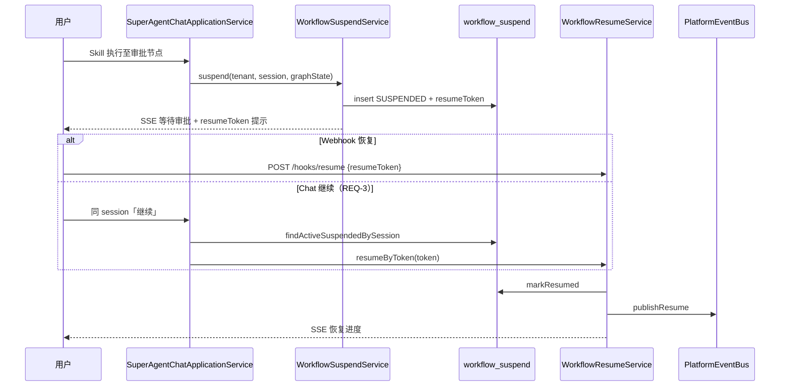

# P3 异步挂起与唤醒 — 技术设计

> 变更 ID：`p3-async-resume`  
> Schema：`standard-spec-driven` · `aiTddMode: disabled` · `uiCraftMode: disabled`  
> 复杂度判定：**中等**（存量实现为主 + session 继续桥接 + AUTO-UT 闭环；无新 REST 路径）

---

## 一. 概述

### 1.1 术语

| 术语 | 说明 |
|------|------|
| `resumeToken` | 挂起记录唯一令牌，Webhook 与 chat 继续共用 |
| `WorkflowSuspendRecord` | 挂起聚合：sessionId、tenantId、graphState、status |
| 继续桥接 | 挂起 session 上用户输入命中 `FollowUpRouteHeuristics`「继续」→ 自动 resume |

### 1.2 需求背景

存量 `aether-platform` 已实现挂起/恢复主干，但 collaboration REQ-3 要求 **同 session 用户说「继续」即可恢复**，当前 chat 仅返回静态提示。本设计在不大改 Graph 的前提下补齐桥接与测试 trace。

### 1.3 本期目标

| 序号 | 内容 | 任务点 |
|------|------|--------|
| 1 | 挂起验收 | `WorkflowSuspendService` + `HumanApprovalSkillGraphNode` AUTO-UT |
| 2 | Webhook 唤醒验收 | `WorkflowResumeService` + Controller AUTO-UT |
| 3 | 状态查询验收 | `WorkflowSuspendQueryService` AUTO-UT |
| 4 | Chat 继续桥接 | `findActiveSuspendedBySession` + `SuperAgentChatApplicationService` 分支 |
| 5 | 治理 | ROADMAP + verification-report |

### 1.4 影响分析

**受影响的系统：**

- [x] **ai** `aether-platform`（Repository 查询、Chat 桥接、单测）
- [x] **AetherStack** `docs/ROADMAP.md`
- [ ] ai_react（无 API 变更；管理页已对接 hooks）
- [ ] knowledge-hub / agent-hub 全量 Graph（本期不覆盖）

---

## 二. 业务分析

### 2.2 流程图（挂起 → 继续恢复）



---

## 三. 系统设计

### 3.3 数据模型变更

**无表结构变更。** 复用 `workflow_suspend`（已有 `tenant_id`、`session_id`、`resume_token`、`status`、`graph_state`）。

新增查询：按 `(tenant_id, session_id, status=SUSPENDED)` 取最新一条（`ORDER BY created_at DESC LIMIT 1`）。

---

## 四. 详细设计

### 4.2 新增/改造组件

| 组件 | 包路径 | 职责 |
|------|--------|------|
| `WorkflowSuspendRepository.findActiveSuspendedBySession` | `domain.async` + `infrastructure.async` | 协作 REQ-3 查 token |
| `SuspendedSessionResumeBridge` | `application.async` | 判定继续意图 + 查 token + 委托 resume |
| `SuperAgentChatApplicationService` | `application` | 挂起 session 优先走桥接，非继续则保留原提示 |
| `HumanApprovalSkillGraphNodeTest` | `src/test` | TC-REQ1-01 挂起写库 |
| `SuperAgentChatSuspendedResumeTest` | `src/test` | TC-COLLAB-03-01 chat 继续 |

### 4.3 核心逻辑

#### 4.3.1 挂起（REQ-1，存量增强测试）

`HumanApprovalSkillGraphNode` 未批准时调用 `WorkflowSuspendService.suspend`：

- `workflow_suspend` insert
- `conversationSessionSnapshotService.markSuspended(true)`
- `platformEventBus.publishSuspended`

#### 4.3.2 Webhook 唤醒（REQ-2，存量增强测试）

`POST /api/super-agents/hooks/resume` → `WorkflowResumeService.resumeByToken`：

- 校验 status=SUSPENDED
- `markResumed` → `markSuspended(false)` → `publishResume`
- 返回 SSE progress + token 正文

#### 4.3.3 状态查询（REQ-3，存量增强测试）

- `GET /hooks/suspended` 分页列表（tenant 隔离，已有多租户守卫）
- `GET /hooks/suspended/{resumeToken}` 详情含 `pendingMessage` 摘要

#### 4.3.4 Chat 继续桥接（collaboration REQ-3，**本期新增**）

```java
// SuperAgentChatApplicationService.streamAgentChat 入口
if (conversationSessionSnapshotService.isSuspended(tenantId, conversationId)) {
    if (FollowUpRouteHeuristics.isLikelyFollowUp(userInput)
            || isExplicitContinueIntent(userInput)) {
        return suspendedSessionResumeBridge.tryResumeFromChat(tenantId, conversationId);
    }
    return Flux.just(sseFormatter.formatToken(
        "会话已挂起。发送「继续」恢复，或使用 resumeToken 调用 POST /hooks/resume。"));
}
```

`tryResumeFromChat`：

1. `workflowSuspendRepository.findActiveSuspendedBySession(tenantId, sessionId)`
2. empty → 友好错误 SSE
3. present → `workflowResumeService.resumeByToken(token)`

`isExplicitContinueIntent`：trim 后 equals「继续」/「continue」/「恢复」。

---

## 五. 接口设计

### 5.1 本期接口变更

**无新增路径。** 行为增强：

| 场景 | 变更 |
|------|------|
| 挂起 session + chat「继续」 | 由静态提示 → SSE 恢复流（与 hooks/resume 一致） |
| 挂起 session + 其他输入 | 仍提示如何继续 |
| Webhook / 管理 API | 行为不变 |

---

## 六. 代码改造分析

### 6.1 存量与缺口对照

| 能力 | 存量 | 缺口 |
|------|------|------|
| 挂起写库 | `WorkflowSuspendService` | 缺 Graph 节点级 AUTO-UT trace |
| Webhook 恢复 | `WorkflowResumeService` | 缺 Controller trace 映射 |
| 状态查询 | `WorkflowSuspendQueryService` | 已有测试，补 DisplayName/trace |
| Chat 继续 | 仅 block chat | **缺 session→token 查询与桥接** |

### 6.2 测试策略

| TC | 测试类 | 模块 |
|----|--------|------|
| TC-REQ1-01 | `WorkflowSuspendServiceTest` | aether-platform |
| TC-REQ1-02 | `HumanApprovalSkillGraphNodeTest` | aether-platform |
| TC-REQ2-01 | `WorkflowResumeServiceTest` | aether-platform |
| TC-REQ2-02 | `SuperAgentWebhookControllerTest` | aether-platform |
| TC-REQ3-01 | `WorkflowSuspendQueryServiceTest` | aether-platform |
| TC-COLLAB-03-01 | `SuperAgentChatSuspendedResumeTest` | aether-platform |

单测模块：**aether-platform**（`deepseek` 聚合模块排除 superAgents 测试）。

---

## 七. 关键决策

| ID | 决策 | 原因 | 后果 |
|----|------|------|------|
| DR-01 | 不新增 REST，chat 桥接复用 `WorkflowResumeService` | 避免双份恢复逻辑 | Webhook 仍为外部集成主路径 |
| DR-02 | 同 session 多条挂起取最新 SUSPENDED | 简化歧义 | 运维应 close 陈旧挂起 |
| DR-03 | 继续判定复用 `FollowUpRouteHeuristics` | 与粘性路由一致 | 误判概率低（短句「继续」） |

---

## 八. 风险与验证

- **风险**：用户非「继续」短句误触发 — 仅 `isSuspended` 为 true 时走桥接，正常会话不受影响
- **验证**：scoped `mvn -pl aether-platform test -Dtest=...` + `make completion-gate`
