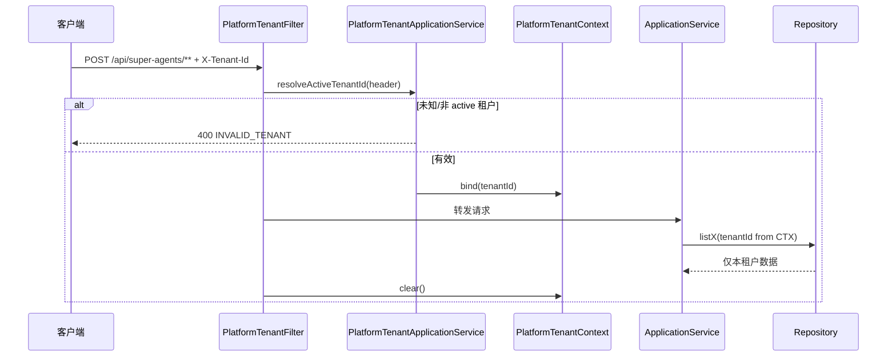

# P3 多租户强制隔离 — 技术设计

> 变更 ID：`p3-multi-tenant-enforcement`  
> Schema：`standard-spec-driven` · `aiTddMode: disabled` · `uiCraftMode: disabled`  
> 复杂度判定：**中等**（Flyway 补缺 + 请求上下文 + 核心 Repository/Cache/RAG 验收；无新 REST 路径）

---

## 一. 概述

### 1.1 术语

| 术语 | 说明 |
|------|------|
| `PlatformTenantContext` | 请求级 ThreadLocal，持有已校验的 `tenantId` |
| `TenantScopedPlatformCache` | 装饰 `PlatformCache`，自动为逻辑 Key 加 `tenantId:` 前缀 |
| 核心 Repository | 本变更强制守卫：`SkillRepository`、`AgentRegistryRepository`、`WorkflowSuspendRepository` |

### 1.2 需求背景

**需求描述**：对 `aether-platform-multi-tenant` REQ-1~4 与 `aether-knowledge-memory` REQ-4 做**验收闭环**。存量平台表大多有 `tenant_id`，但依赖 Controller 手工传参，存在遗漏与跨租户泄露风险；`session_memory` 无租户列。

### 1.3 本期目标

| 序号 | 内容 | 任务点 |
|------|------|--------|
| 1 | 请求级租户绑定 | `PlatformTenantFilter` + `PlatformTenantContext` |
| 2 | 写入必填校验 | `PlatformTenantApplicationService` 集成 + 领域守卫 |
| 3 | 核心 DAL 隔离 | Repository 层 assert tenant 参数非空且与 Context 一致 |
| 4 | 缓存 Key 规范 | `TenantScopedPlatformCache` + 存量调用迁移 |
| 5 | 向量/RAG 隔离 | knowledge-hub 检索 SQL + `agent_memory` 向量查询 |
| 6 | Flyway 补缺 | `session_memory.tenant_id` backfill |

### 1.4 影响分析

**受影响的系统：**

- [x] **ai** `aether-platform`（Filter、Context、Cache、Repository）
- [x] **ai** `knowledge-hub`（Flyway、RAG 检索）
- [x] **AetherStack** `docs/ROADMAP.md`
- [ ] ai_react（无变更；继续透传 `X-Tenant-Id`）
- [ ] agent-hub 全量 Mapper（本期不覆盖）

---

## 二. 业务分析

### 2.2 流程图（请求租户绑定）



详见 delta spec：`specs/aether-platform-multi-tenant/spec.md`、`specs/aether-knowledge-memory/spec.md`。

---

## 三. 系统设计

### 3.3 数据模型变更

| 表 | 变更 | 迁移 |
|----|------|------|
| `session_memory` | 新增 `tenant_id VARCHAR(64) NOT NULL DEFAULT 'default'` | `V20__session_memory_tenant.sql`（knowledge-hub 或 platform-persistence 聚合路径，与现有 Flyway 聚合策略一致） |
| 平台核心表 | **无结构变更** | 已有 `tenant_id`（V5~V19） |

索引建议：`idx_session_memory_tenant_session ON session_memory (tenant_id, session_id, created_at DESC)`。

---

## 四. 详细设计

### 4.2 新增/改造组件

| 组件 | 包路径 | 职责 |
|------|--------|------|
| `PlatformTenantContext` | `superAgents.application.tenant` | `bind` / `current` / `clear`；与 `PlatformTraceContext` 并列 |
| `PlatformTenantFilter` | `superAgents.infrastructure.web` | `OncePerRequestFilter`；`/api/super-agents/**`；Order 在 RateLimit 之前 |
| `TenantScopedPlatformCache` | `superAgents.infrastructure.cache` | 装饰器：`getOrLoad(logicalKey)` → `tenantId:logicalKey` |
| `TenantGuard` | `superAgents.domain.tenant` | 静态 `requireTenantId(String)`；blank 抛 `IllegalArgumentException` |
| `PlatformTenantFilterTest` | `aether-platform/src/test` | TC-REQ2 列表隔离 |
| `TenantScopedPlatformCacheTest` | 同上 | TC-REQ3 缓存隔离 |
| `KnowledgeRetrievalTenantTest` | `knowledge-hub/src/test` | TC-REQ4 RAG 隔离 |

### 4.3 核心逻辑

#### 4.3.1 请求绑定

- Header：`X-Tenant-Id`（与 `api-conventions.md` 一致）
- 缺省：回落 `aether.platform.default-tenant-id`（默认 `default`）
- 校验：复用 `PlatformTenantApplicationService.resolveActiveTenantId`
- 错误：未知租户 → HTTP **400**，body `code=INVALID_TENANT`（复用 `PlatformApiErrorWriter` 或同级 writer）
- 路径：`/api/super-agents/**`；排除 `/actuator/**`、swagger

#### 4.3.2 Repository 守卫（本期范围）

改造原则：**不引入全局 MyBatis 拦截器**（降低回归面），在以下 Repository 实现类入口强制：

```java
String tid = TenantGuard.requireTenantId(
    StringUtils.defaultIfBlank(explicitTenantId, PlatformTenantContext.current()));
```

覆盖：

- `MyBatisSkillRepository` — `listActive`、`findByName`、`save`
- `MyBatisAgentRegistryRepository` — `listActiveForChat`、`listAll`、`save`
- `MyBatisWorkflowSuspendRepository` — `findPage`、`findByResumeToken`

#### 4.3.3 缓存

存量 `SkillMenuCacheKeys`、`AgentRegistryApplicationService` 已手工加租户前缀。本期：

1. 注册 `TenantScopedPlatformCache` 为 `@Primary` `PlatformCache`（开发 profile 仍可用 InMemory）
2. 迁移仍手写前缀的调用方为 **逻辑 Key**（如 `skill-menu`），由装饰器统一加前缀
3. `invalidateAll()` 行为：仅清除当前租户前缀下的 Key（通过 key 命名空间扫描或维护租户索引 Set——本期采用 **显式 invalidate(tenantId, pattern)** 避免全局 clear）

#### 4.3.4 向量 / RAG

- **knowledge-hub**：`MyBatisKnowledgeChunkRepository.searchByEmbedding` 已带 `tenantId` 参数；补集成测试断言 SQL/参数绑定
- **agent_memory**：`PlatformLayeredMemoryService` 向量召回查询须 `WHERE tenant_id = ?`
- **Skill 描述向量**（若有）：检索前附加 tenant 过滤

---

## 五. 接口设计

### 5.1 本期接口变更

**无新增路径。** 下列行为增强：

| 场景 | 变更 |
|------|------|
| 未知 `X-Tenant-Id` | 新增可能返回 **400** `INVALID_TENANT` |
| 合法租户 | 行为不变；内部隔离加强 |

---

## 六. 代码改造分析

### 6.1 存量与缺口对照

| 能力 | 存量 | 缺口 |
|------|------|------|
| 表 `tenant_id` | V5~V19 平台表已有 | `session_memory` 无列 |
| Header 解析 | `PlatformTenantApplicationService` | 无请求级 Context |
| 缓存前缀 | 部分 Service 手写 | 无统一装饰器；存在遗漏风险 |
| RAG tenant | `KnowledgeRetrievalPortService` 有 `existsByIdAndTenantId` | 缺 AUTO-UT 闭环 |
| 记忆 tenant | `agent_memory` 有列 | 读取路径须断言 Context |

### 6.2 测试策略

| TC | 测试类 | 模块 |
|----|--------|------|
| TC-REQ1-01 | `PlatformTenantApplicationServiceTest` | aether-platform |
| TC-REQ2-01 | `MyBatisSkillRepositoryTenantTest` 或 `PlatformTenantFilterTest` | aether-platform |
| TC-REQ3-01 | `TenantScopedPlatformCacheTest` | aether-platform |
| TC-REQ4-01 | `KnowledgeRetrievalTenantIsolationTest` | knowledge-hub |
| TC-REQ4-02 | `PlatformLayeredMemoryServiceTenantTest` | aether-platform |

执行命令：

```bash
mvn -pl aether-platform test -Dtest=PlatformTenantFilterTest,TenantScopedPlatformCacheTest,...
mvn -pl knowledge-hub test -Dtest=KnowledgeRetrievalTenantIsolationTest
```

---

## 七. 关键决策

| 决策 | 选择 | 后果 |
|------|------|------|
| D1 全局 MyBatis 插件 vs 核心 Repository 守卫 | **核心 Repository 守卫** | 回归面小；agent-hub 存量 Mapper 后续波次 |
| D2 Cache 迁移方式 | **装饰器 + 逻辑 Key** | 调用方简化；须迁移手写前缀代码 |
| D3 session_memory 迁移归属 | **knowledge-hub Flyway** | 与表归属一致；application 聚合启动不变 |
| D4 非法租户 HTTP 码 | **400**（非 403） | 与「未知租户 ID」语义一致；文档写入 api-conventions 可选子节 |

---

## 八. 风险与实施计划

| 风险 | 缓解 |
|------|------|
| Flyway backfill 失败 | 默认 `default`；迁移前 COUNT 校验 |
| Filter 顺序与 RateLimit 冲突 | Tenant Filter Order = `HIGHEST_PRECEDENCE + 10`（限流 +20） |
| 双写 tenant 前缀 | 迁移期 Code Review 清单：禁止 `tenant + ":" + tenant + ":"` |

**实施顺序**：Flyway → Context/Filter → Repository 守卫 → Cache 装饰器 → RAG/记忆测试 → ROADMAP 更新。

---

## 九. 与 ROADMAP / 后续波次

完成后 ROADMAP 将 `aether-platform-multi-tenant` 标为 **🟡 partial**（全量 Mapper 插件未做）或 **✅ done**（若本期验收覆盖全部 REQ 场景）。`aether-knowledge-memory` REQ-4 标 **🟡 partial** 或合入 done。

后续：`p3-async-resume`、全量 MyBatis 租户插件、限流 userId/IP 维度。
