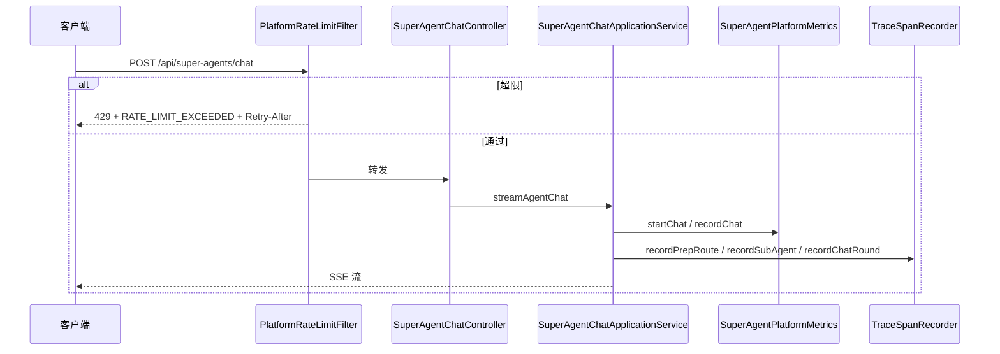

# P3 可观测与弹性底座 — 技术设计

> 变更 ID：`p3-observability-resilience-foundation`  
> Schema：`standard-spec-driven` · `aiTddMode: disabled` · `uiCraftMode: disabled`  
> 复杂度判定：**简单**（单模块 `aether-platform`、无新表、无新 REST 路径；仅行为增强 + 单测验收）

---

## 一. 概述

### 1.1 术语

| 术语 | 说明 |
|------|------|
| Trace Span | `trace_spans` 表一行，表示 ROUTER/SUB_AGENT/SKILL/TOOL/CHAT 一层耗时 |
| MeterRegistry | Micrometer 指标注册表，`/actuator/prometheus` 暴露 |
| 租户限流窗口 | 按 `X-Tenant-Id`（缺省 `default`）计数的固定时间窗请求配额 |

### 1.2 需求背景

**需求描述**：对 `aether-agent-observability` REQ-1/5 与 `aether-agent-resilience` REQ-1/3 做**验收闭环**——存量代码已有 Metrics/Trace/ToolRetry，缺 429 限流与专项 AUTO-UT/trace 归档。

**产品 PRD**：无工单；见 `proposal.md` 与 delta spec。

### 1.3 本期目标

| 序号 | 内容 | 任务点 |
|------|------|--------|
| 1 | Prometheus 指标可抓取验收 | `SuperAgentPlatformMetricsTest` + `/actuator/prometheus` |
| 2 | Trace parent-child 落库验收 | 增强 `TraceSpanRecorderTest`（parentSpanId 链） |
| 3 | Tool 重试可配置验收 | 复用/标注 `PlatformToolRetryExecutorTest` trace |
| 4 | 租户维度 HTTP 429 限流 | 新增 `PlatformRateLimitFilter` + 配置 + 单测 |
| 5 | 治理文档同步 | `api-changelog.md`、`docs/ROADMAP.md` |

### 1.4 影响分析

**受影响的系统：**

- [x] **ai** 仓库 `aether-platform`（指标、Trace、Filter、配置）
- [x] **AetherStack** 治理层（changelog、ROADMAP；无代码）
- [ ] ai_react（无变更；429 由 Umi 代理透传）
- [ ] 数据库表结构（复用 `trace_spans`，无 DDL）
- [ ] 消息队列 / 外部 LLM 契约

**前端 UI**：无 U1 界面（`uiCraftMode: disabled`）。

---

## 二. 业务分析

### 2.3 业务场景

详见：

- `openspec/changes/p3-observability-resilience-foundation/specs/aether-agent-observability/spec.md`
- `openspec/changes/p3-observability-resilience-foundation/specs/aether-agent-resilience/spec.md`

### 2.2 流程图（限流 + 对话主路径）



---

## 三. 系统设计

### 3.3 数据模型图

**无数据模型变更。** 复用存量表 `trace_spans`（`TraceSpanMapper` / `TraceSpanRepository`）。

```text
trace_spans (已有)
  trace_id, parent_span_id, tenant_id, span_type, span_name, status, duration_ms, ...
```

---

## 四. 详细设计

### 4.1 数据表定义

**无数据表变更。**

### 4.2 新增组件（应用内）

| 组件 | 包路径 | 职责 |
|------|--------|------|
| `PlatformRateLimitFilter` | `superAgents.infrastructure.web` | Servlet Filter，租户窗口计数，429 短路 |
| `PlatformRateLimitRegistry` | `superAgents.infrastructure.resilience` | 内存滑动窗口（`ConcurrentHashMap` + 窗口起始时间） |
| `PlatformApiErrorWriter` | `superAgents.web.support` | 写统一 JSON 错误体 + `Retry-After` |
| `SuperAgentPlatformMetricsTest` | `deepseek/src/test/.../metrics/` | 断言 MeterRegistry 计数器/计时器注册 |

### 4.3 限流算法（核心逻辑）

- **维度**：本变更仅 **tenantId**（从 `X-Tenant-Id` 解析，缺省 `aether.platform.default-tenant-id`）。
- **窗口**：固定窗口 `windowSeconds`（默认 60s）。
- **配额**：`maxRequestsPerWindow`（默认 120，开发环境可配 10000 避免误伤）。
- **路径范围**：`/api/super-agents/**`；**本期不纳入** `/api/agent-hub/**`（留后续波次）；**排除** `/actuator/**`、`/swagger-ui.html`、`/v3/api-docs`。
- **SSE**：在 Controller 之前拦截，超限时不建立流。
- **存储**：进程内内存；与 `SuperAgentsPlatformProperties.Cache` 一致，后续可换 Redis（本变更不引入）。

配置示例（`application.yml` 新增段）：

```yaml
aether:
  platform:
    rate-limit:
      enabled: true
      max-requests-per-window: 120
      window-seconds: 60
```

### 4.5 定时任务

**无定时任务变更。**

---

## 五. 接口设计

### 5.1 本期新增接口 & 更新接口列表

**无新增 REST 路径。** 下列路径在超限时新增 **429 行为**（对齐 `api-conventions.md` §3、§5）：

| 方法 | 路径 | 变更类型 |
|------|------|----------|
| POST | `/api/super-agents/chat` | 行为：可返回 429 |
| GET/POST | `/api/super-agents/**`（管理类 REST） | 行为：可返回 429 |

### 5.2 429 响应契约

**功能**：租户请求频率超限。

**响应（HTTP 429）**：

```json
{
  "code": "RATE_LIMIT_EXCEEDED",
  "message": "请求过于频繁，请稍后重试",
  "traceId": ""
}
```

> **traceId 口径**：Filter 执行时尚未绑定 `PlatformTraceContext`，429 响应 `traceId` 允许为空字符串；若需关联日志，Filter 内可生成临时 UUID 写入 WARN 日志，**不强制**写入响应体（与 `api-conventions.md` 兼容）。

**响应 Header**：

- `Retry-After`: 剩余窗口秒数（整数）
- `Content-Type`: `application/json`

**错误码**：

| code | HTTP | 说明 |
|------|------|------|
| `RATE_LIMIT_EXCEEDED` | 429 | 租户窗口配额耗尽 |

> 须在 `api-changelog.md` [Unreleased] 追加 **Changed** 条目（非 BREAKING；客户端应处理 429）。

---

## 六. 代码改造分析

### 6.1 入口链路 — Prometheus 指标（存量验收）

**代码位置**：`aether-platform/.../metrics/SuperAgentPlatformMetrics.java`

**现状代码**：

```java
private static final String CHAT_STARTED = "spring_ai_platform_chat_requests_total";
private static final String CHAT_DURATION = "spring_ai_platform_chat_duration_seconds";

public Timer.Sample startChat(String tenantId) {
    Counter.builder(CHAT_STARTED).tag("tenant", tenantId).register(meterRegistry).increment();
    return Timer.start(meterRegistry);
}
```

**风险点**：无单测断言指标名；spec REQ-5 要求 `agent_tool_calls_total` 与存量 `platform_skill_executions_total` 命名不一致。

**改造要点**：

- **不更名**存量指标（避免破坏已有 Grafana/告警）。
- 新增 `SuperAgentPlatformMetricsTest`：Mock `MeterRegistry` 或 `SimpleMeterRegistry`，调用 `startChat`/`recordChat` 后断言 `spring_ai_platform_chat_requests_total` 与 `spring_ai_platform_chat_duration_seconds` 存在。
- 在 design/tasks 注明：REQ-5「agent_tool_calls_total」验收映射为 `platform_skill_executions_total`（Tool 经 Skill 路径统计）+ `recordTool` span；若需独立 counter 留后续波次。

**调用链**：`SuperAgentChatApplicationService` → `platformMetrics.startChat` / `recordChat`（已接线）。

---

### 6.2 核心分支 — Trace parent-child（存量增强验收）

**代码位置**：`aether-platform/.../observability/TraceSpanRecorder.java`

**现状代码**：

```java
traceSpanRepository.insert(new TraceSpanRecord(
    ctx.traceId(),
    PlatformTraceContext.currentParentSpanId(),
    ...
));
PlatformTraceContext.pushSpanId(spanId);
```

**风险点**：`TraceSpanRecorderTest#nestedSpansShareTraceId` 未断言第二条 span 的 `parentSpanId`；无法证明 parent-child 链。

**改造要点**：

```java
// TraceSpanRecorderTest 增补断言
assertNotNull(spans.get(1).parentSpanId());
assertEquals(spans.get(0) 对应 spanId, spans.get(1).parentSpanId()); // 通过 captor 顺序或 mock 回调取 spanId
```

需在测试中捕获第一次 `insert` 后 `PlatformTraceContext` 栈行为，或验证第二条记录的 `parentSpanId` 非空且与 ROUTER 层关联。

---

### 6.3 核心分支 — Tool 重试（存量验收）

**代码位置**：

- `PlatformToolRetryConfiguration.java` — `maxAttempts` 来自 `aether.platform.tool-retry`
- `PlatformToolRetryExecutor.java` — `RetryTemplate` + `RETRIABLE_CODES`

**现状代码**：

```java
// PlatformToolRetryExecutorTest 已覆盖：
// - retriesTransientFailureThenSucceeds (3 attempts)
// - exhaustsRetriesReturnsFriendlyError (TOOL_RETRY_EXHAUSTED)
// - doesNotRetryBusinessErrors (FORBIDDEN 不重试)
```

**风险点**：测试未挂 `trace:` 到 OpenSpec TC；无 tasks 追溯。

**改造要点**：

- `PlatformToolRetryExecutorTest` 当前仅注入 `retryTemplate`，耗尽路径依赖 `PlatformDegradationService`；apply 时须 **mock 注入** `platformDegradationService`（或 `@InjectMocks` + `@Mock`）。
- 默认 `aether.platform.security.ha.degradation-enabled=true`，耗尽后期望 `errorCode=DEGRADED`（非文档误写的 `TOOL_RETRY_EXHAUSTED`）；若测试断言与实现不一致，**以生产代码为准修订测试**。
- apply 阶段在 `tasks.md` 标注 **复用/修订** `PlatformToolRetryExecutorTest`，补 `@DisplayName("TC-REQ1-01")` 与 `trace:` 行。

---

### 6.4 入口链路 — HTTP 429 限流（新增）

**代码位置**（新建）：`superAgents.infrastructure.web.PlatformRateLimitFilter`

**现状代码**：无 Filter；请求直达 `SuperAgentChatController`。

**改造要点**：

```java
@Component
@Order(Ordered.HIGHEST_PRECEDENCE + 20)
public class PlatformRateLimitFilter extends OncePerRequestFilter {

    @Override
    protected void doFilterInternal(HttpServletRequest req, HttpServletResponse res, FilterChain chain) {
        if (!properties.getRateLimit().isEnabled() || !pathMatches(req)) {
            chain.doFilter(req, res);
            return;
        }
        String tenant = resolveTenant(req);
        RateLimitDecision decision = registry.tryAcquire(tenant);
        if (decision.denied()) {
            PlatformApiErrorWriter.write429(res, decision.retryAfterSeconds());
            return;
        }
        chain.doFilter(req, res);
    }
}
```

**注册**：Spring Boot `@Component` 自动注册；或 `FilterRegistrationBean` 限定 `urlPatterns=/api/super-agents/*`。

**风险点**：

- 开发环境默认阈值过低影响联调 → `enabled=false` 或 `max-requests-per-window: 10000` 在 `application-dev.yml`。
- SSE 已建立后无法限流 → 本设计仅在 Filter 层拦截，符合 spec。

**单测**：`PlatformRateLimitFilterTest`（MockMvc）：连续 N+1 次 POST 同 tenant → 最后一次 429 + `Retry-After` + body `RATE_LIMIT_EXCEEDED`。

---

### 6.5 配置类扩展

**代码位置**：`SuperAgentsPlatformProperties.java`

**改造要点**：新增嵌套类 `RateLimit { enabled, maxRequestsPerWindow, windowSeconds }`，前缀 `aether.platform.rate-limit`。

---

## 七. 非功能性需求设计

### 7.1 权限影响

无新增权限项。429 在租户解析之前执行，不泄露资源存在性。

### 7.3 缓存设计

| Key 模式 | 过期策略 | 说明 |
|----------|----------|------|
| `rate:{tenantId}:{windowEpoch}` | 窗口结束自动失效 | 进程内计数，本变更不引入 Redis |

### 7.4 安全评估

- [x] 限流降低租户级 DoS 风险
- [x] 429 响应不含堆栈
- [ ] 跨租户越权：不适用（仅计数）

### 7.5 限流降级评估

- [x] 需要限流（本变更实现 REQ-3）
- [x] 预期：单租户默认 120 req/min（可配置）
- [ ] 降级：429 后客户端退避；Agent 层不介入

### 可观测性清单

| 项 | 验证口径 |
|----|----------|
| Prometheus | `GET /actuator/prometheus` 含 `spring_ai_platform_chat_requests_total` |
| Trace 落库 | `TraceSpanRecorderTest` parent-child 通过 |
| 限流日志 | WARN 级：`rate limit exceeded tenant={}`（脱敏） |
| 审计 | 不限流成功请求；429 可选 DEBUG 计数 |

### 并发与幂等验收口径

- 限流计数器使用 `AtomicInteger` 或同步块，单 JVM 一致即可。
- 窗口边界并发：允许极少数 burst 超过 1 条（固定窗口已知限制）；文档注明 P3 不承诺严格令牌桶。

### 性能与容量验收口径

- Filter 额外耗时 < 1ms（内存 map 查找）。
- 不影响 SSE 流内吞吐。

---

## 八. Spring AI / 铁三角设计清单

本变更**不触及** LLM 编排、Graph、RAG、新 `@Tool`。仅平台横切可观测与 HTTP 弹性。

- [x] 无新 ChatClient / Prompt / Graph 节点
- [x] 指标与 Trace 在既有 `SuperAgentChatApplicationService` 链路上验收

---

## 九. 不在范围（回写 ROADMAP）

| REQ | 后续变更 |
|-----|----------|
| observability REQ-2/3/4 | `p3-observability-phase-2` |
| resilience REQ-2/4/5 | 后续 resilience 波次 |
| multi-tenant REQ-1~4 | `p3-multi-tenant-enforcement` |
