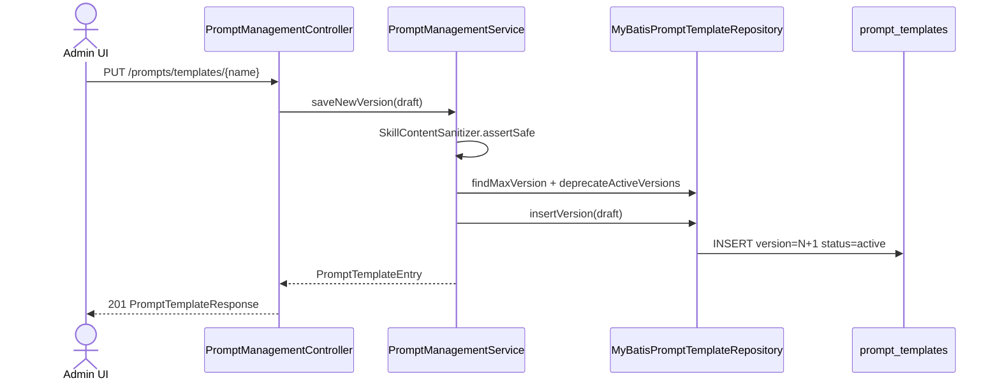
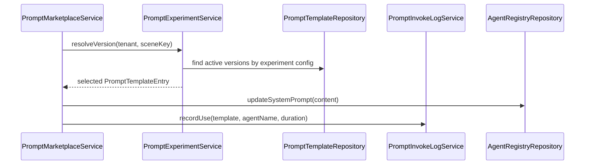

# Prompt 模板管理 — 技术方案（简版）

## 一. 需求摘要

- **需求描述**：在已归档 `add-prompt-marketplace` 基础上，补齐 Prompt **管理端 CRUD**、**版本历史与回滚**、**A/B 实验分流**、**调用记录追踪**；与现有市场浏览/选用/生成分层，不重复建设。
- **JIRA/需求来源**：无工单；对标 JeecgBoot Prompt 模板管理 + 实验能力。
- **关键约束**：
  1. 复用 `prompt_templates` 表与 `PromptTemplateRepository` 版本模型（`tenant_id + name + version`），新增表仅承载实验与调用日志。
  2. 管理 API 与 `/prompts/marketplace/*` 消费 API 分离；市场接口行为不变。
  3. `uiCraftMode: enabled`：新增独立管理页面（U1），市场弹窗仅增量入口（UI-FUNC）。

---

## 二. 影响范围和核心场景

### 2.1 本期影响范围

| 维度 | 影响点 |
|---|---|
| 前端 | 新增 `pages/prompt-management/` 管理页（列表/编辑/版本/实验/调用记录）；市场弹窗增加「管理」入口链接 |
| 后端服务 | `aether-platform` 新增 `PromptManagementService`、`PromptExperimentService`、`PromptInvokeLogService` + `PromptManagementController` |
| 异步任务 | 无 |
| 数据库 | Flyway `V27__prompt_management.sql`：`prompt_experiments`、`prompt_invoke_logs`；扩展 `PromptTemplateMapper` 查询 |
| 配置权限 | 管理 API 需平台管理员角色（复用 `PlatformUserContext` + 租户 Guard）；preset 模板禁止删除 |

### 2.2 核心场景

**UC-01 创建/编辑模板（正常）**
- 前置：管理员已登录，租户 active
- 验收：`POST/PUT /prompts/templates` 保存成功；content 含 `{{var}}`；新版本号自增；旧 active 行 status→deprecated

**UC-02 模板列表分页筛选（正常）**
- 前置：租户下存在多模板/多版本
- 验收：`GET /prompts/templates?page=&size=&category=&keyword=` 返回分页；每 `name` 仅展示当前 active 版本摘要

**UC-03 版本回滚（正常）**
- 前置：模板 name=`code-review` 存在 v1/v2/v3
- 验收：`POST /prompts/templates/{name}/rollback` body `{version:2}` → v2 变 active，其余 deprecated

**UC-04 配置 A/B 实验（正常）**
- 前置：同 scene `agent.system.default` 下 v2(70%) + v3(30%)
- 验收：保存后权重合计 100%；`PromptExperimentService.resolve(scene)` 按权重返回版本

**UC-05 查看调用记录（正常）**
- 前置：模板已被选用/生成/实验解析
- 验收：`GET /prompts/templates/{name}/invokes?from=&to=` 返回 version、inputSummary、tokens、durationMs

**UC-06 删除自定义模板（边界）**
- 前置：source=`custom` 且无进行中实验引用
- 验收：软删除（status=deprecated 全版本）成功；source=`preset` 返回 403

**UC-07 实验权重非法（异常）**
- 前置：同 scene 权重合计 ≠ 100%
- 验收：400 + 明确错误码 `PROMPT_EXPERIMENT_WEIGHT_INVALID`

**UC-08 并发保存同一模板（异常）**
- 前置：两管理员同时保存同名模板
- 验收：第二笔因 version 唯一约束或应用层校验失败；不产生双 active

**UC-09 调用日志写入失败（异常）**
- 前置：DB 写入 invoke_log 失败
- 验收：主业务（选用/生成）仍成功；WARN 日志 + 指标 `prompt_invoke_log_errors_total`

---

## 三. 方案总览

### 3.1 整体思路

1. **增量扩展**：管理域新建 ApplicationService，消费域继续用 `PromptMarketplaceService`；共享 `PromptTemplateRepository`。
2. **版本策略对齐 Skill**：保存 = `deprecateActiveVersions` + `insertVersion`（已有 `MyBatisPromptTemplateRepository` 能力）。
3. **实验与日志解耦**：实验配置独立表；解析结果与每次调用异步写 `prompt_invoke_logs`（同事务内 best-effort，失败不阻断）。

### 3.2 关键实现点

1. `PromptManagementService`：create/update/delete/listVersions/rollback + `SkillContentSanitizer` 校验。
2. `PromptExperimentService`：scene 级加权随机（`ThreadLocalRandom` + 累计权重），供 `usePrompt`/未来 chat 解析 hook。
3. `PromptInvokeLogService`：在 `usePrompt`、`PromptGenerateService` 完成路径记录摘要（输出截断 500 字）与 token（来自 `LlmUsageRecorder` 快照，生成场景）。

### 3.3 与现有代码关系

- **复用**：`PromptTemplateEntry`、`PromptTemplateRepository`、`MyBatisPromptTemplateRepository`、`PromptMarketplaceController`（不改动契约）、`SkillContentSanitizer`、`TenantGuard`、`SuperAgentApiPaths` 模式。
- **新增**：`PromptManagementController`、`PromptExperiment*`、`PromptInvokeLog*`、Flyway V26、前端管理页。
- **变更**：`PromptMarketplaceService.usePrompt` 增加 invoke 日志；可选 experiment resolve（scene 来自 request 或 agent 默认）。

---

## 四. 方案梳理

### 4.1 时序图：保存模板新版本

说明：管理端保存触发版本链，与现有 `saveGenerated` 同模式但支持完整字段编辑。



### 4.2 时序图：A/B 解析 + 调用日志



---

## 五. 代码改造分析

### 5.1 入口链路

- **现状实现**：`PromptMarketplaceController` 仅提供市场浏览/收藏/选用/生成（`SuperAgentApiPaths.PROMPTS_MARKETPLACE*`）；无管理 CRUD。
- **现状代码（最小片段）**：

```java
// PromptMarketplaceService.saveGenerated — 已有版本递增，仅支持 AI 生成保存
int nextVersion = promptTemplateRepository.findMaxVersion(resolved, safeName) + 1;
return promptTemplateRepository.insertVersion(draft);
```

- **改造代码（目标形态）**：

```java
// PromptManagementService.saveTemplate — 管理端完整 CRUD + 版本
promptTemplateRepository.deprecateActiveVersions(tenantId, name);
PromptTemplateEntry saved = promptTemplateRepository.insertVersion(
    new PromptTemplateEntry(null, tenantId, name, description, maxVersion + 1,
        PromptTemplateStatus.ACTIVE, category, content, tags, "custom", userId, null, null));
promptInvokeLogService.recordSave(saved, userId);
```

### 5.2 核心校验

- **现状实现**：`saveGenerated` 校验 name/content 长度 + sanitizer；无实验权重校验。
- **改造代码（目标形态）**：

```java
// PromptExperimentService.validateWeights
int total = variants.stream().mapToInt(PromptExperimentVariant::weightPercent).sum();
if (total != 100) throw new IllegalArgumentException("PROMPT_EXPERIMENT_WEIGHT_INVALID");
```

### 5.3 数据落点/后置处理

- **现状实现**：`prompt_templates` 已有版本行；无 invoke/experiment 表。
- **改造 SQL（V26 摘要）**：

```sql
CREATE TABLE prompt_experiments (
  id BIGSERIAL PRIMARY KEY, tenant_id VARCHAR(64) NOT NULL, scene_key VARCHAR(128) NOT NULL,
  template_name VARCHAR(128) NOT NULL, version INT NOT NULL, weight_percent INT NOT NULL,
  enabled BOOLEAN NOT NULL DEFAULT TRUE, UNIQUE(tenant_id, scene_key, template_name, version)
);
CREATE TABLE prompt_invoke_logs (
  id BIGSERIAL PRIMARY KEY, tenant_id VARCHAR(64), template_name VARCHAR(128), version INT,
  scene_key VARCHAR(128), invoke_type VARCHAR(32), input_summary TEXT, output_summary TEXT,
  prompt_tokens INT, completion_tokens INT, duration_ms BIGINT, created_at TIMESTAMPTZ DEFAULT NOW()
);
```

---

## 六. 接口与交互契约

### 6.1 前后端交互契约

| 方法 | 路径 | 说明 |
|------|------|------|
| GET | `/api/super-agents/prompts/templates` | 管理列表（分页 category/keyword） |
| POST | `/api/super-agents/prompts/templates` | 创建模板 v1 |
| PUT | `/api/super-agents/prompts/templates/{name}` | 保存新版本 |
| DELETE | `/api/super-agents/prompts/templates/{name}` | 软删除（custom only） |
| GET | `/api/super-agents/prompts/templates/{name}/versions` | 版本历史 |
| POST | `/api/super-agents/prompts/templates/{name}/rollback` | 回滚 `{version}` |
| GET/PUT | `/api/super-agents/prompts/experiments/{sceneKey}` | 实验配置 CRUD |
| GET | `/api/super-agents/prompts/templates/{name}/invokes` | 调用记录分页 |

响应包装遵循 `api-conventions.md`；列表分页 `page/size/total`。

### 6.2 外部系统交互

无。

### 6.3 错误码

| code | 含义 |
|---|---|
| PROMPT_TEMPLATE_NOT_FOUND | 模板不存在 |
| PROMPT_PRESET_IMMUTABLE | preset 不可删 |
| PROMPT_EXPERIMENT_WEIGHT_INVALID | 实验权重合计非 100% |
| PROMPT_CONTENT_TOO_LONG | content > 8000 |

---

## 七. 非功能性需求设计

### 7.1 边界与异常分支

| 场景 | 处理策略 | 结果 |
|---|---|---|
| 回滚目标版本不存在 | 400 | 不修改 active |
| 实验 scene 无配置 | 回退最新 active 版本 | usePrompt 正常 |
| invoke 表写入失败 | WARN + 计数器 | 主流程成功 |

### 7.2 权限影响

| 权限路径 | 说明 |
|---|---|
| `/prompts/templates/*` | 平台管理员 / tenant admin |
| `/prompts/marketplace/*` | 保持现有任意登录用户 |

### 7.3 数据清洗、迁移

- [ ] 无需历史数据迁移；V26 仅增表
- [x] 可回滚：DROP 新表即可
- [x] 对线上业务无阻塞

### 7.4 缓存设计

无新增缓存；列表查询 < 200ms（索引 tenant_id + name + created_at）。

### 7.5 安全评估

- [x] 查询带 tenant_id 过滤，防越权
- [x] 修改走 sanitizer + 管理员校验
- [x] invoke 日志 output 截断，不含完整用户 PII

### 7.6 限流降级

- [ ] 管理 API 可复用平台 RateLimit（可选 P4）
- 预期 QPS < 10（管理端）

### 7.7 日志审计

| 日志类型 | 触发点 | 关键字段 |
|---|---|---|
| PROMPT_TEMPLATE_SAVE | 管理保存 | tenantId, name, version, userId |
| PROMPT_EXPERIMENT_UPDATE | 实验配置 | sceneKey, variants |
| PROMPT_INVOKE | 选用/生成 | templateName, version, durationMs |

### 7.8 可观测性清单

| 观测点 | 验证口径 | 关联场景 |
|---|---|---|
| 接口返回 | 201/400/403 与错误码 | UC-01~08 |
| 数据库 | `prompt_templates.status` 唯一 active/name | UC-01, UC-03 |
| invoke 表 | 选用后 1 条记录 | UC-05 |
| Micrometer | `prompt_invoke_total` tag invoke_type | UC-05 |

### 7.9 并发与性能验收口径

#### 7.9.1 并发与幂等

- 同名模板并发保存：DB `UNIQUE(tenant_id,name,version)` 兜底；应用层先 deprecate 再 insert（单事务）。
- rollback 幂等：目标已是 active 时返回 200 无变更。

#### 7.9.2 性能与容量

- 模板 ≤ 500/租户；invoke 日志按月分区（aether-debt: 首期全表，>100 万行加分区）。
- 调用记录查询 P95 < 300ms（limit 50 + 索引 template_name, created_at）。

### 7.10 Spring AI / 铁三角

- **编排选型**：无新 LLM 编排；实验解析为纯 Java 加权随机（豁免 Graph/ReactAgent）。
- **调用追踪**：`PromptGenerateService` 完成后读取 `LlmUsageRecorder` token 快照写入 invoke_log。
- **RAG / 多 Agent**：无变更。

---

## 八. 配置影响矩阵

| 配置项 | 常规流程 | 本方案 |
|---|---|---|
| `prompt_templates` | 市场只读 + saveGenerated | 管理端可 CRUD + rollback |
| 实验 scene | 无 | `prompt_experiments.scene_key` 配置 |
| 市场 API | 不变 | 不变 |

---

## 九. 前端 UI 界面清单（uiCraftMode: enabled）

| 界面 | 路由/组件 | UI 类型 | 说明 |
|------|-----------|---------|------|
| Prompt 模板管理主页 | `pages/prompt-management/index.tsx` | UI-CRAFT | Table 分页 + 分类/标签筛选 + 新建按钮 |
| 模板编辑 Drawer | `PromptTemplateEditorDrawer` | UI-CRAFT | 名称/分类/标签/内容（`{{var}}` 提示）+ 保存 |
| 版本历史 Modal | `PromptVersionHistoryModal` | UI-CRAFT | 版本列表 + 回滚确认 |
| 实验配置 Panel | `PromptExperimentPanel` | UI-CRAFT | scene 选择 + 版本权重 Slider（合计 100%） |
| 调用记录 Drawer | `PromptInvokeLogDrawer` | UI-FUNC | 时间范围 + 表格（tokens/耗时） |
| 市场入口链接 | `prompt-marketplace` 内 Link | UI-FUNC | 「管理模板」跳转管理页 |

Impeccable：`shape` → `craft` 管理主页与编辑 Drawer；`audit` → `polish` 实验 Panel。
