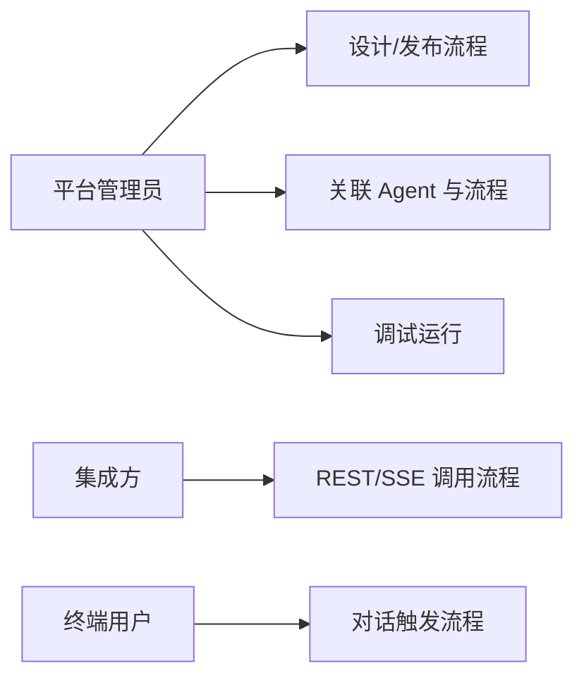
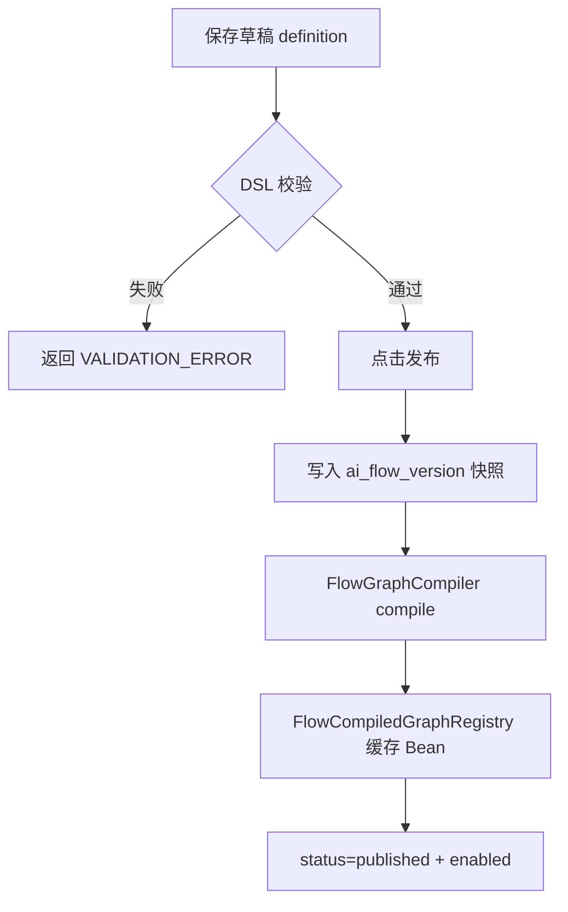
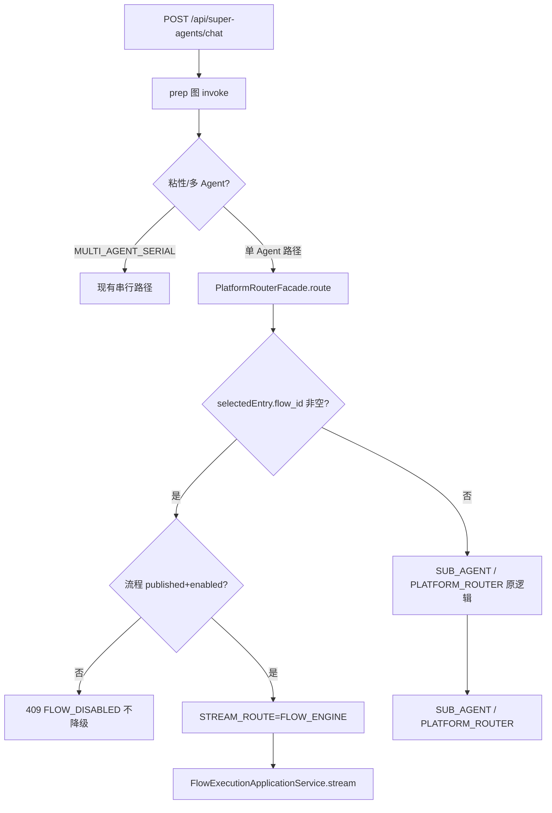
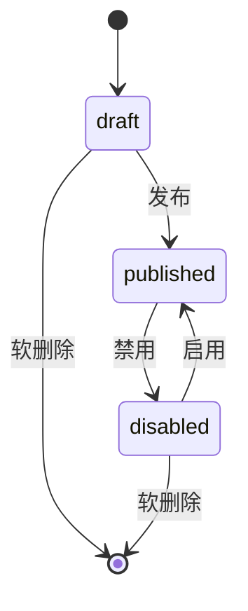
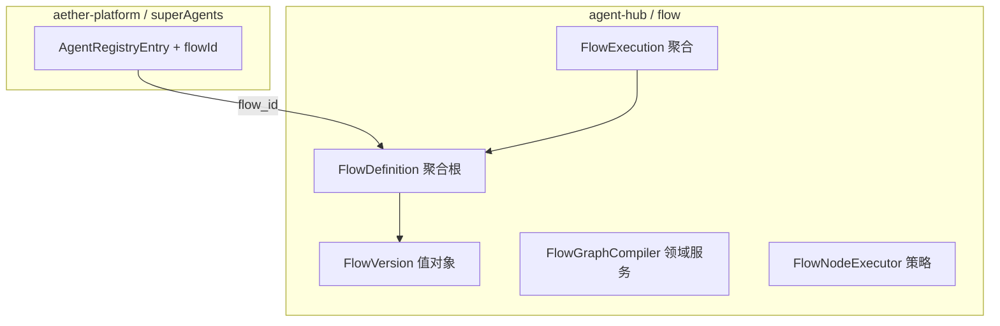
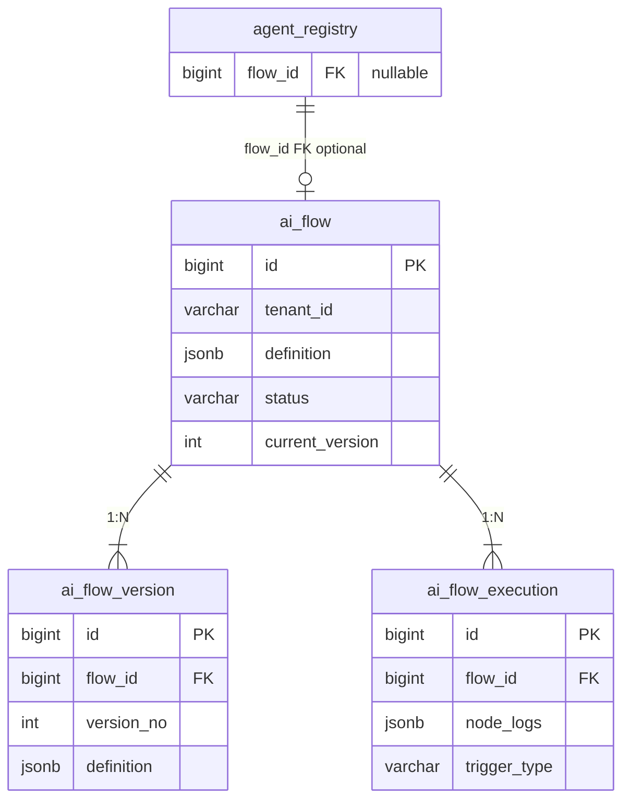
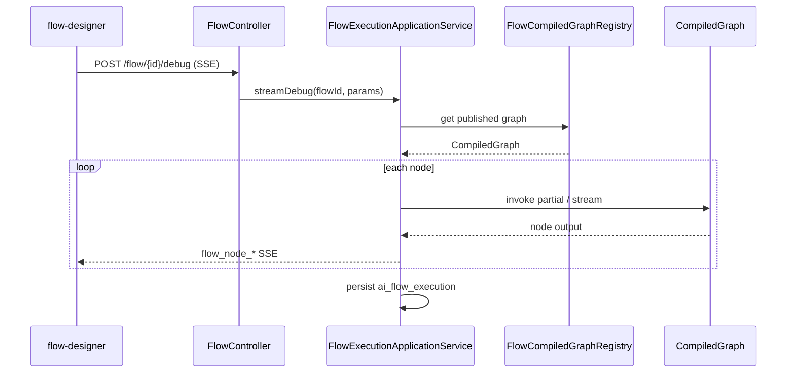
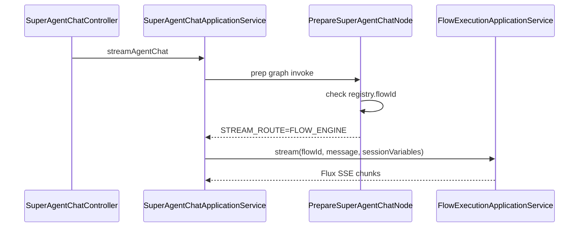

# AI 流程编排 — 技术设计

> **Change**：`add-ai-flow-orchestration`  
> **Schema**：`standard-spec-driven`  
> **Status**：`Reviewed`（2026-06-30 用户确认 design-review）  
> **基于**：`design-draft.md`（技术决策保持一致；应用关联落点修正为 `agent_registry`）  
> **design-review**：待生成 `design-review.md` 并用户确认 `Reviewed` 后方可进入 `tasks.md`

---

## 一. 概述

### 1.1 术语

| 术语 | 英文 | 说明 |
|------|------|------|
| 流程定义 | Flow Definition | 画布产出的 JSON DSL（节点 + 边 + 配置） |
| 流程版本 | Flow Version | 发布时生成的不可变快照 |
| 编译图 | CompiledGraph | Spring AI Alibaba Graph 运行时单例 Bean |
| 应用（Agent） | Agent Registry Entry | `agent_registry` 表一行，可关联 `flow_id` |
| 调试运行 | Debug Run | 设计器内 SSE 推送节点级 progress 的执行模式 |

### 1.2 需求背景

**需求描述**：引入可视化 AI 流程编排（设计器 + 引擎 + 管理 + 应用集成），替代纯硬编码路由，降低 AI 工作流搭建门槛。

**产品 PRD**：`openspec/changes/add-ai-flow-orchestration/proposal.md`（无 Jira 工单）

**现状痛点**（已读代码确认）：

- SuperAgents 主聊天路径：`SuperAgentChatApplicationService` → prep 图 `PrepareSuperAgentChatNode` → `PlatformRouterFacade` LLM 路由（`aether-platform/.../superAgents/`）
- 存量 Agent Hub prep 图：`AgentChatApplicationService` → `PrepareAgentChatNode` → `AgentHubRouter`（`agent-hub/.../agents/`），经 `AgentHubController` 委托 SuperAgents
- 二者均为**启动期 compile 单例 CompiledGraph**，请求内仅 `invoke`（见 `SuperAgentGraphConfiguration`、`AgentGraphConfiguration`）

### 1.3 本期目标

| 序号 | 内容 | 任务点 |
|------|------|--------|
| 1 | 流程 CRUD、版本、发布/启用/禁用 | Flyway + REST + 管理页 |
| 2 | 可视化设计器（React Flow）+ 节点配置 + 调试 SSE | ai_react U1 + Impeccable |
| 3 | 流程引擎：DSL 校验 → 发布时 compile → 执行/流式/调试 | agent-hub `flow` 子包 |
| 4 | `agent_registry.flow_id` 关联；对话优先走流程 | `PrepareSuperAgentChatNode` 扩展 |
| 5 | 流程 REST/SSE API + 执行记录 + MCP Tool 注册 | 契约 + ToolCatalog |
| 6 | 编排路由 MODIFIED：关联流程不可用时不静默降级 | `SuperAgentStreamRoute.FLOW_ENGINE` |

### 1.4 影响分析

**受影响的系统（AetherStack 口径）：**

- [x] 后端 **ai**（`agent-hub` 新增 flow 子包；`aether-platform` 扩展 registry + prep 路由）
- [x] 前端 **ai_react**（流程设计器、管理、执行记录页）
- [x] PostgreSQL（`ai_flow*` 表 + `agent_registry.flow_id`）
- [ ] 外部 MQ / 第三方系统（无）
- [x] API 契约（`integration-contracts.md`、`api-changelog.md` 须追加）

**修正说明（相对 design-draft）**：draft 中 `ai_app` 表在本项目不存在；应用实体为 **`agent_registry`**（`V5__agent_platform_registry.sql`）。

### 1.5 OpenSpec 模式评估

| 开关 | 判定 | 写入 `.openspec.yaml` |
|------|------|------------------------|
| `aiTddMode` | 命中 L1（Graph 编译、prep 分支、SSE 组装） | `enabled` |
| `uiCraftMode` | 命中 U1（设计器画布、管理页） | `enabled` |

---

## 二. 业务分析

### 2.1 业务用例



### 2.2 业务流程

#### 2.2.1 发布与编译（活动图）



#### 2.2.2 对话走路由（流程优先）



### 2.3 业务场景

详见 delta spec：

- `specs/aether-agent-flow-designer/spec.md`
- `specs/aether-agent-flow-engine/spec.md`
- `specs/aether-agent-flow-management/spec.md`
- `specs/aether-agent-flow-integration/spec.md`
- `specs/aether-agent-orchestrator/spec.md`

---

## 三. 系统设计

### 3.1 流程状态机



### 3.2 领域模型（限界上下文：Flow Orchestration）



**聚合入口**：

- `FlowDefinition`：草稿编辑、发布、启用/禁用
- `FlowExecution`：一次运行的节点日志与终态

### 3.3 数据模型（E-R）



### 3.4 模块与包结构

| 层 | 路径（ai 仓库） | 职责 |
|----|----------------|------|
| web | `agent-hub/.../agents/flow/web/` | `FlowController` REST/SSE |
| application | `agent-hub/.../agents/flow/application/` | CRUD、执行、调试、MCP 注册 |
| domain | `agent-hub/.../agents/flow/domain/` | 聚合、DSL 校验、Repository 接口 |
| infrastructure | `agent-hub/.../agents/flow/infrastructure/` | MyBatis、Graph 编译缓存 |
| graph | `agent-hub/.../agents/flow/graph/` | 各 `FlowNodeAction`、StateKeys |
| platform 扩展 | `aether-platform/.../superAgents/` | `flow_id` 字段、prep 路由、注册表 API |
| 跨模块桥接 | `agent-hub/.../flow/application/FlowExecutionBridge`（接口） | SuperAgents 调用流程执行，避免 platform → hub 反向依赖 |

**模块依赖约束**（强制）：

- `agent-hub` **不**依赖 `aether-platform`（现有 `pom.xml` 已确认）
- AI 节点 LLM 调用复用 **agent-hub** 既有 `AgentChatService` / `ChatClient`（`ai-core`），**禁止**直接注入 superAgents 的 `ModelRouter`
- RAG 节点复用 **knowledge-hub** 已有检索 ApplicationService（agent-hub 已依赖 knowledge-hub）
- `FlowExecutionBridge` 接口定义在 agent-hub；`SuperAgentChatApplicationService` 经 Spring 注入实现类

**参考实现**（须对齐，禁止 per-request compile）：

- `ConfigurableGraphBuilder`（`ai-alibaba/.../knowledgehub/graph/`）— 按配置序列表构建线性图
- `AgentGraphConfiguration` / `SuperAgentGraphConfiguration` — 启动期 compile 单例
- `CompileGraphSkillGraphFactory`（superAgents skill）— 模板 → CompiledGraph

### 3.5 前端 UI 界面清单（uiCraftMode: enabled）

| 页面/组件 | 路径 | 类型 | 说明 |
|-----------|------|------|------|
| 流程管理列表 | `ai_react/src/pages/flow-management/index.tsx` | UI-CRAFT | Table + 筛选 + 状态 Tag |
| 流程设计器 | `ai_react/src/pages/flow-designer/index.tsx` | UI-CRAFT | React Flow 画布 + 节点面板 |
| 节点属性面板 | `ai_react/src/pages/flow-designer/components/NodeInspector.tsx` | UI-CRAFT | 按节点类型动态表单 |
| 调试面板 | `ai_react/src/pages/flow-designer/components/DebugPanel.tsx` | UI-CRAFT | SSE 节点高亮 + 日志 |
| Agent 关联流程 | `PlatformAgentRegistryManager` 扩展 | UI-FUNC | Select flowId |
| 执行记录列表/详情 | `ai_react/src/pages/flow-executions/` | UI-AUDIT | 只读审计 UI |
| OpenAPI 服务层 | `ai_react/src/services/flowService.ts` | UI-FUNC | 禁止 pages 直连 fetch |

---

## 四. 详细设计

### 4.1 数据表定义

**Flyway**：`V28__ai_flow_orchestration.sql`（`V27` 已被 prompt_management 占用）

```sql
-- 流程主表
CREATE TABLE IF NOT EXISTS ai_flow (
    id              BIGSERIAL PRIMARY KEY,
    tenant_id       VARCHAR(64)  NOT NULL DEFAULT 'default',
    name            VARCHAR(128) NOT NULL,
    description     TEXT,
    status          VARCHAR(32)  NOT NULL DEFAULT 'draft', -- draft | published | disabled
    current_version INT          NOT NULL DEFAULT 0,
    definition      JSONB        NOT NULL DEFAULT '{}'::jsonb,
    enabled         BOOLEAN      NOT NULL DEFAULT FALSE,
    mcp_tool_name   VARCHAR(128),
    created_by      VARCHAR(64),
    updated_by      VARCHAR(64),
    created_at      TIMESTAMPTZ  NOT NULL DEFAULT NOW(),
    updated_at      TIMESTAMPTZ  NOT NULL DEFAULT NOW(),
    deleted         BOOLEAN      NOT NULL DEFAULT FALSE,
    CONSTRAINT uq_ai_flow_tenant_name UNIQUE (tenant_id, name)
);
CREATE INDEX idx_ai_flow_tenant_status ON ai_flow (tenant_id, status) WHERE deleted = FALSE;

-- 版本快照
CREATE TABLE IF NOT EXISTS ai_flow_version (
    id           BIGSERIAL PRIMARY KEY,
    flow_id      BIGINT       NOT NULL REFERENCES ai_flow(id),
    version_no   INT          NOT NULL,
    definition   JSONB        NOT NULL,
    published_by VARCHAR(64),
    published_at TIMESTAMPTZ  NOT NULL DEFAULT NOW(),
    remark       VARCHAR(512),
    CONSTRAINT uq_ai_flow_version UNIQUE (flow_id, version_no)
);

-- 执行记录
CREATE TABLE IF NOT EXISTS ai_flow_execution (
    id             BIGSERIAL PRIMARY KEY,
    tenant_id      VARCHAR(64)  NOT NULL,
    flow_id        BIGINT       NOT NULL REFERENCES ai_flow(id),
    flow_version   INT          NOT NULL,
    trigger_type   VARCHAR(32)  NOT NULL, -- api | app | mcp | debug
    status         VARCHAR(32)  NOT NULL, -- running | success | failed | cancelled
    input_params   JSONB        NOT NULL DEFAULT '{}'::jsonb,
    output_result  JSONB,
    node_logs      JSONB        NOT NULL DEFAULT '[]'::jsonb,
    duration_ms    BIGINT,
    token_usage    JSONB,
    trace_id       VARCHAR(64),
    created_at     TIMESTAMPTZ  NOT NULL DEFAULT NOW()
);
CREATE INDEX idx_ai_flow_execution_flow ON ai_flow_execution (flow_id, created_at DESC);

-- Agent 关联流程
ALTER TABLE agent_registry ADD COLUMN IF NOT EXISTS flow_id BIGINT REFERENCES ai_flow(id);
CREATE INDEX IF NOT EXISTS idx_agent_registry_flow ON agent_registry (tenant_id, flow_id);
```

**批量/失败策略**：

- 删除流程：仅 `draft`/`disabled` 且未被 `agent_registry` 引用；否则 `409 CONFLICT`
- 发布失败（compile 异常）：事务回滚，保持原 `current_version`，返回 `400 FLOW_COMPILE_ERROR`

### 4.2 流程 DSL 规范（JSON）

```json
{
  "schemaVersion": 1,
  "nodes": [
    {
      "id": "start_1",
      "type": "start",
      "position": { "x": 0, "y": 0 },
      "data": {
        "inputs": [
          { "name": "question", "type": "string", "required": true }
        ]
      }
    },
    {
      "id": "ai_1",
      "type": "ai",
      "data": {
        "modelTask": "CHAT",
        "systemPrompt": "你是助手",
        "userPromptTemplate": "{{start_1.question}}",
        "temperature": 0.3,
        "maxTokens": 2048,
        "retry": { "maxAttempts": 2, "backoffMs": 1000 }
      }
    }
  ],
  "edges": [
    { "id": "e1", "source": "start_1", "target": "ai_1" }
  ]
}
```

**校验规则（`FlowDefinitionValidator` 领域服务）**：

| 规则 | 错误码 |
|------|--------|
| 必须有且仅 1 个 `start`、≥1 个 `end` | `FLOW_MISSING_START_END` |
| 边引用节点存在 | `FLOW_INVALID_EDGE` |
| DAG 无环（Kahn 拓扑） | `FLOW_CYCLE_DETECTED` |
| 节点数 ≤ 50 | `FLOW_NODE_LIMIT_EXCEEDED` |
| 上下文序列化 ≤ 1MB | `FLOW_CONTEXT_TOO_LARGE` |

**v1 内置节点类型**：`start` | `end` | `ai` | `knowledge` | `classifier` | `branch` | `script` | `http` | `subflow` | `reply`

> // aether-debt: `classifier` v1 简化为单 LLM 意图分类节点；JS 脚本 v2 再开，v1 仅 Groovy Sandbox

### 4.3 流程引擎核心设计

#### 4.3.1 编译策略（强制）

**禁止** per-request `StateGraph.compile()`（`backend-ai.md`）。

```text
保存草稿 → 仅校验 JSON
发布     → FlowGraphCompiler.compile(definition) → 注册到 FlowCompiledGraphRegistry
执行     → registry.get(tenantId, flowId, versionNo).invoke(state)
版本变更 → 发布成功后 refresh 缓存；禁用时不 evict（保留审计 invoke 能力可选关闭）
```

`FlowCompiledGraphRegistry` 结构：

```java
// 伪代码 — 实现于 infrastructure
ConcurrentHashMap<FlowGraphKey, CompiledGraph> cache;
// FlowGraphKey = tenantId + flowId + versionNo
```

参考 `CompileGraphSkillGraphFactory.compile()` 模式：条件边在 compile 时注册全部目标节点名。

#### 4.3.2 State Keys（`FlowGraphStateKeys`）

| Key | 说明 |
|-----|------|
| `TRACE_ID` | 链路追踪 |
| `TENANT_ID` | 租户 |
| `FLOW_ID` / `FLOW_VERSION` | 执行标识 |
| `INPUT_PARAMS` | 开始节点入参 Map |
| `NODE_OUTPUTS` | `Map<nodeId, Object>` 节点输出 |
| `VARIABLES` | 模板替换上下文 |
| `LAST_ERROR` | 失败节点信息 |
| `ASSISTANT_ANSWER` | 最终回复（reply/end 汇总） |

#### 4.3.3 节点执行器

| type | 执行器 | 依赖 |
|------|--------|------|
| `ai` | `AiFlowNodeAction` | agent-hub `AgentChatService` + `AgentPromptService`；Prompt 模板 `resources/prompts/flow/` |
| `knowledge` | `KnowledgeFlowNodeAction` | 复用 knowledgehub 检索 ApplicationService；阈值/Top-K 见节点配置 |
| `branch` | 条件边 | `EdgeCondition` 只读 `VARIABLES` |
| `script` | `ScriptFlowNodeAction` | Groovy Sandbox；超时 30s |
| `http` | `HttpFlowNodeAction` | Spring `RestClient`；禁止内网 SSRF（URL 白名单配置） |
| `subflow` | `SubflowFlowNodeAction` | 调用子流程 published 版本 |
| `reply` | 直接写 `ASSISTANT_ANSWER` | 无 LLM |

**RAG 节点**须输出 `[来源: {source}] {content}` 格式（`spring-ai-rag.md`）。

**节点重试**（对齐 engine spec REQ-4）：各节点 `data.retry` 可选；默认 `maxAttempts=1`（不重试）；LLM/HTTP 节点默认 `maxAttempts=2`；重试间隔指数退避，耗尽后写 `node_logs` 并标记节点 failed。

#### 4.3.4 SSE 事件（调试 / stream API）

与 `PlatformSseFormatter` / AgentProgress 对齐，新增事件类型（非破坏性扩展）：

```json
{"type":"flow_node_start","nodeId":"ai_1","nodeType":"ai","timestamp":"..."}
{"type":"flow_node_complete","nodeId":"ai_1","durationMs":1200,"outputPreview":"..."}
{"type":"flow_node_error","nodeId":"script_1","code":"FLOW_NODE_TIMEOUT","message":"..."}
{"type":"flow_complete","executionId":123,"status":"success"}
```

流建立前 HTTP 错误按 `api-conventions.md` JSON；流内错误用 `flow_node_error` 事件。

### 4.4 时序图

#### 4.4.1 调试运行



#### 4.4.2 对话集成



### 4.5 定时任务

无定时任务变更。

### 4.6 MCP 插件化

`FlowMcpToolRegistrar`（application 层）：

- 管理员「发布为 MCP 工具」→ 写 `ai_flow.mcp_tool_name` + 注册 `PlatformToolCatalog`
- `@Tool` 四段式描述；内部调用 `FlowExecutionApplicationService.invokeSync`
- 参数 schema 来自 `start` 节点 `inputs`

---

## 五. 接口设计

### 5.1 新增/修改接口列表

| 方法 | 路径 | 变更 |
|------|------|------|
| POST | `/api/agent-hub/flows` | 新增 |
| GET | `/api/agent-hub/flows` | 新增（分页 `page`/`size`，见 api-conventions） |
| GET | `/api/agent-hub/flows/{id}` | 新增 |
| PUT | `/api/agent-hub/flows/{id}` | 新增（更新 definition 草稿） |
| DELETE | `/api/agent-hub/flows/{id}` | 新增（软删） |
| POST | `/api/agent-hub/flows/{id}/publish` | 新增 |
| POST | `/api/agent-hub/flows/{id}/enable` | 新增 |
| POST | `/api/agent-hub/flows/{id}/disable` | 新增 |
| GET | `/api/agent-hub/flows/{id}/versions` | 新增 |
| POST | `/api/agent-hub/flows/{id}/rollback` | 新增 |
| POST | `/api/agent-hub/flows/{id}/invoke` | 新增（同步） |
| POST | `/api/agent-hub/flows/{id}/stream` | 新增（SSE） |
| POST | `/api/agent-hub/flows/{id}/debug` | 新增（SSE 调试） |
| POST | `/api/agent-hub/flows/{id}/register-mcp-tool` | 新增 |
| GET | `/api/agent-hub/flow-executions` | 新增 |
| GET | `/api/agent-hub/flow-executions/{id}` | 新增 |
| PUT | `/api/super-agents/agents/{name}/flow` | 新增（绑定/解绑 flowId） |
| GET | `/api/super-agents/agents/{name}/flow` | 新增 |

写操作须 `X-Admin-Api-Key`；读写带 `X-Tenant-Id`。

### 5.2 接口详细设计（节选）

#### GET `/api/agent-hub/flows`

**Query**：`page`（默认 1）、`size`（默认 20，最大 100）、`status`、`name`（模糊）

**响应**：

```json
{
  "items": [{ "id": 1, "name": "...", "status": "published", "currentVersion": 2 }],
  "page": 1,
  "size": 20,
  "total": 42
}
```

#### POST `/api/agent-hub/flows`

**请求**：

```json
{
  "name": "customer-faq-flow",
  "description": "客服 FAQ 编排"
}
```

**响应**：

```json
{
  "id": 1,
  "name": "customer-faq-flow",
  "status": "draft",
  "currentVersion": 0,
  "definition": { "schemaVersion": 1, "nodes": [], "edges": [] }
}
```

#### PUT `/api/agent-hub/flows/{id}`

**请求**：

```json
{
  "definition": { "schemaVersion": 1, "nodes": [], "edges": [] },
  "expectedUpdatedAt": "2026-06-30T10:00:00Z"
}
```

**并发**：`expectedUpdatedAt` 不匹配 → `409 CONFLICT`。

#### POST `/api/agent-hub/flows/{id}/publish`

**响应**：

```json
{
  "flowId": 1,
  "versionNo": 3,
  "publishedAt": "2026-06-30T10:05:00Z"
}
```

#### POST `/api/agent-hub/flows/{id}/stream`（SSE）

**请求**：

```json
{
  "params": { "question": "如何退款？" },
  "conversationId": "optional"
}
```

**Accept**：`text/event-stream`

#### PUT `/api/super-agents/agents/{name}/flow`

**请求**：

```json
{ "flowId": 1 }
```

解绑：`{ "flowId": null }`

### 5.3 错误码（Flow 域）

| HTTP | code | 说明 |
|------|------|------|
| 400 | `VALIDATION_ERROR` | 参数校验 |
| 400 | `FLOW_MISSING_START_END` | DSL 缺 start/end |
| 400 | `FLOW_CYCLE_DETECTED` | 有环 |
| 400 | `FLOW_COMPILE_ERROR` | 发布 compile 失败 |
| 404 | `NOT_FOUND` | 流程不存在 |
| 409 | `CONFLICT` | 乐观锁 / 被引用不可删 |
| 409 | `FLOW_DISABLED` | 流程禁用（对话/API 不降级） |
| 429 | `RATE_LIMIT_EXCEEDED` | 平台限流 |
| 503 | `SERVICE_UNAVAILABLE` | LLM 不可用 |

---

## 六. 代码改造分析

### 6.1 入口链路 — Flow REST

**代码位置**：新增 `agent-hub/.../flow/web/FlowController.java`

**现状代码**：无 flow 相关 Controller。

**风险点**：Controller 直连 Repository / CompiledGraph。

**改造要点**：

```java
@RestController
@RequestMapping("/api/agent-hub/flows")
public class FlowController {
    @Autowired
    private FlowManagementApplicationService flowManagementService;
    @Autowired
    private FlowExecutionApplicationService flowExecutionService;

    @PostMapping(value = "/{id}/stream", produces = MediaType.TEXT_EVENT_STREAM_VALUE)
    public Flux<String> stream(@PathVariable long id, @RequestBody FlowInvokeRequest req) {
        return flowExecutionService.stream(id, req.params(), req.conversationId());
    }
}
```

### 6.2 核心校验/分支 — SuperAgents prep 流程路由

**代码位置**：`PrepareSuperAgentChatNode.java:43-92`

**现状代码**：

```java
PlatformRouteDecision decision = platformRouterFacade.route(userInput, tenantId, conversationId);
updates.put(SuperAgentGraphStateKeys.STREAM_ROUTE, decision.streamRoute().name());
```

**风险点**：未检查 `AgentRegistryEntry.flowId`；spec 要求流程优先。

**改造要点**（路由决策**之后**检查绑定流程，对齐 orchestrator spec）：

```java
PlatformRouteDecision decision = platformRouterFacade.route(userInput, tenantId, conversationId);
AgentRegistryEntry entry = decision.selectedEntry();
if (entry != null && entry.getFlowId() != null) {
    flowAccessGuard.assertPublishedAndEnabled(tenantId, entry.getFlowId()); // 失败抛 FLOW_DISABLED
    updates.put(SuperAgentGraphStateKeys.STREAM_ROUTE, SuperAgentStreamRoute.FLOW_ENGINE.name());
    updates.put(SuperAgentGraphStateKeys.FLOW_ID, entry.getFlowId());
    updates.put(SuperAgentGraphStateKeys.SELECTED_REGISTRY_ENTRY, entry);
    updates.put(SuperAgentGraphStateKeys.ROUTING_SUMMARY_PREFIX,
            PlatformRoutingSummaryFormatter.formatFlowPrefix(entry));
    return updates;
}
// 未绑定 flow_id：保持原有 SUB_AGENT / PLATFORM_ROUTER 分支
updates.put(SuperAgentGraphStateKeys.STREAM_ROUTE, decision.streamRoute().name());
```

**输入映射**：对话 `message` → 流程 `start` 节点默认参数 `question`；`sessionVariables` 合并进 `INPUT_PARAMS`（与应用变量 spec 对齐）。

**同步扩展**：

- `SuperAgentStreamRoute` 新增 `FLOW_ENGINE`
- `SuperAgentGraphStateKeys` 新增 `FLOW_ID`
- `SuperAgentChatApplicationService.resolveBodyStream()` 增加 `case FLOW_ENGINE -> flowExecutionBridge.stream(...)`
- 新增 `FlowExecutionBridge` 接口（agent-hub），避免 aether-platform 直接依赖 CompiledGraph 细节

### 6.3 核心校验 — DSL 与 compile

**代码位置**：新增 `FlowDefinitionValidator.java`、`FlowGraphCompiler.java`

**现状代码**：无。

**风险点**：per-request compile；环路未检出导致运行时死循环。

**改造要点**：

```java
public CompiledGraph compile(FlowDefinition definition) {
    FlowDefinitionValidator.validateDag(definition); // 抛领域异常 → 400
    StateGraph graph = buildStateGraph(definition);
    return graph.compile(CompileConfig.builder().build());
}

@Transactional
public FlowVersion publish(long flowId, String operator) {
    FlowDefinition draft = repository.loadDraft(flowId);
    CompiledGraph compiled = compiler.compile(draft);
    registry.put(key, compiled);
    return repository.appendVersion(flowId, draft, operator);
}
```

### 6.4 数据落点 — AgentRegistryEntry

**代码位置**：`AgentRegistryEntry.java`、`AgentRegistryMapper.java`、`V28__*.sql`

**现状代码**：无 `flowId` 字段。

**改造要点**：

```java
private final Long flowId;

public AgentRegistryEntry withFlowId(Long nextFlowId) {
    return new AgentRegistryEntry(..., nextFlowId, ...);
}
```

`AgentRegistryController` 新增 `PUT .../agents/{name}/flow`，调用 `AgentRegistryApplicationService.bindFlow()`。

### 6.5 存量 Agent Hub 路径（兼容）

**代码位置**：`AgentChatApplicationService.java:58-67`

**现状**：仍走 `AgentHubRouter` prep 图。

**改造**：v1 **不修改** agent-hub prep 图；SuperAgents 为主路径（`AgentHubController` 已委托 `SuperAgentChatApplicationService`）。orchestrator spec 的 MODIFIED 行为在 SuperAgents 路径落地；存量 prep 图保持原样并在 design-review 记录豁免理由。

---

## 七. 非功能性需求设计

### 7.1 权限

| 操作 | 鉴权 |
|------|------|
| 流程 CRUD/发布/MCP 注册 | `X-Admin-Api-Key` |
| 流程执行 API | 租户 active + 流程 enabled |
| 执行记录查询 | 租户隔离 |

### 7.2 数据迁移

- [x] Flyway `V28` 向前迁移
- [x] 可回滚：DROP COLUMN / TABLE（无存量数据依赖）
- [x] 对线上无破坏性（纯新增）

### 7.3 缓存

| Key | 过期 | 说明 |
|-----|------|------|
| `flow:compiled:{tenant}:{flowId}:{version}` | 发布刷新 | JVM 内 ConcurrentHashMap；// aether-debt: 多实例需 Redis 广播 evict |

### 7.4 安全

- [x] 租户隔离：`tenant_id` 全链路过滤
- [x] 脚本节点 Groovy Sandbox + 禁止 `System`/`Runtime`/反射
- [x] HTTP 节点 URL 白名单防 SSRF
- [x] Prompt 模板参数化，禁止用户输入直拼 Prompt

### 7.5 限流与超时

| 项 | 值 |
|----|-----|
| 单流程执行超时 | 120s（可配置 `aether.flow.execution-timeout`） |
| LLM 节点超时 | 60s |
| 脚本节点超时 | 30s |
| 限流 | 复用平台 `RateLimitFilter`（429） |

### 7.6 可观测性

Micrometer 指标（标签 `flow_id`、`node_type`）：

- `flow_execution_duration_seconds`
- `flow_node_errors_total`
- `flow_compilations_total`

日志含 `traceId`；节点 Thought/Action/Observation 脱敏写入 `node_logs`。

---

## 八. Spring AI / 铁三角设计清单

- [x] **编排选型**：**CompiledGraph** — 固定 DAG + 条件边 + 可复用节点；非 ReactAgent（无动态工具循环）；理由见 `backend-ai.md`
- [x] **Spring AI 核心**：AI 节点经 agent-hub `AgentChatService`（ChatClient 统一入口）；Prompt 在 `resources/prompts/flow/`；密钥环境变量；429/503 退避；Micrometer
- [x] **多 Agent**：流程走路由时不调用 `PlatformRouterFacade`；MCP 注册走 `@Tool` 四段式 + ToolCatalog
- [x] **RAG**：knowledge 节点 Top-K ≤5、阈值默认 0.7、来源格式化
- [x] **React/Graph**：发布时 compile 单例；State 键显式声明；条件边仅读 State；HIL v2（挂起节点）// aether-debt: 本期不含 Interrupt

**新依赖论证**：

| 依赖 | 用途 | 理由 |
|------|------|------|
| `@xyflow/react` | 前端画布 | spec 要求可视化；AntV X6 更重 |
| Groovy sandbox（已有或新增） | script 节点 | JVM 内隔离 |

---

## 九. design.md 修订记录

| 版本 | 日期 | 说明 |
|------|------|------|
| Draft v1 | 2026-06-30 | 初稿；修正 draft 中 ai_app → agent_registry；明确 SuperAgents 主路径 |
| Draft v1.1 | 2026-06-30 | design-review 修订：flow 路由改在 route 后检查；模块依赖与 FlowExecutionBridge；节点重试与分页契约 |

---

## 十. 下一阶段门禁

1. invoke Superpowers `brainstorming` → 生成 `design-review.md`
2. 用户回复「确认 design-review」→ Status `Reviewed`
3. 测试同学提供 `test-cases.md`（或指定 AI 辅助起草）
4. 生成 `tasks.md` → `/opsx-apply`
