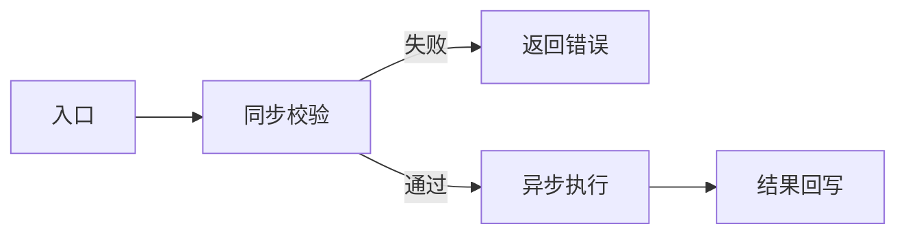
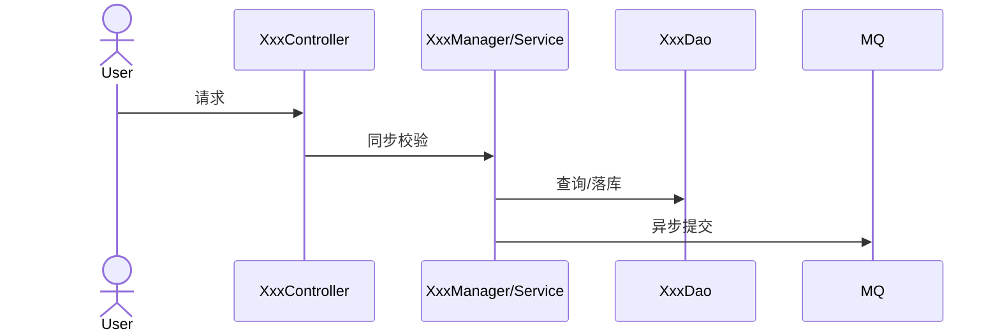
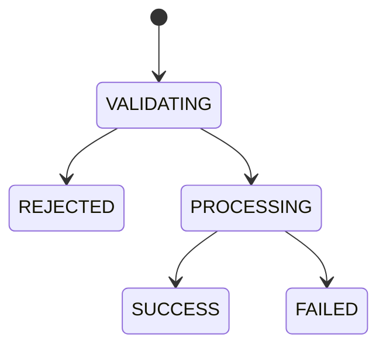

# 技术方案（简版）

> 写作原则：
> 1) 一条信息只写一次，避免与 proposal/spec/tasks 重复。
> 2) 先讲业务与范围，再讲总体思路，再讲图和实现分析。
> 3) 代码只放在「代码改造分析」章节，其他章节不贴实现细节。
> 4) 技术方案必须结合现有代码实现进行分析，结论需可落地、可验证。
> 5) 采用“判定先行”：先判定本期涉及哪些影响域，再展开对应章节；判定为不涉及的项必须写明依据。
> 6) 影响域由 AI 在内部先判定；正文只保留最终展开结论，不展示判定过程表。

## 一. 需求摘要
- **需求描述**：[一句话描述需求]
- **JIRA/需求来源**：[链接或说明]
- **关键约束**：[最多 3 条]

## 二. 影响范围和核心场景

### 2.1 本期影响范围（必填）
| 维度 | 影响点 |
|---|---|
| 前端 | [页面/交互] |
| 后端服务 | [接口/服务] |
| 异步任务 | [队列/任务中心] |
| 数据库 | [表/字段] |
| 配置权限 | [参数/权限] |

### 2.2 核心场景（必填）

> 场景数量要求：
> - 常规需求：至少 3 个核心场景
> - 若涉及跨系统、异步任务、配置门禁（如库位/参数）任一项：至少 6 个核心场景
> - 必须覆盖正常、边界、异常三类

**UC-01 [场景名称]**
- 前置：[前置条件]
- 验收：[系统验收结果]

**UC-02 [场景名称]**
- 前置：[前置条件]
- 验收：[系统验收结果]

**UC-03 [场景名称]**
- 前置：[前置条件]
- 验收：[系统验收结果]

<!--
内部影响域检查清单（不在正文展示）：
1) 外部系统交互（OMS/EDI/三方）
2) 前后端交互（入口/返回/结果）
3) 日志审计（操作日志/任务日志）
4) 权限与鉴权
5) 数据库/配置变更
6) 数据迁移/清洗
7) 缓存/限流/降级
要求：AI先判定是否涉及；涉及项必须在后续章节展开，不涉及项需有依据。
-->

## 三. 方案总览

### 3.1 整体思路（必填）
- 1. [整体方案主线：如同步准入 + 异步执行]
- 2. [核心取舍：如复用优先/兼容优先]
- 3. [关键控制：如幂等/事务/回写]

### 3.2 关键实现点（必填）
1. [关键点1]
2. [关键点2]
3. [关键点3]

### 3.3 与现有代码关系（必填）
- **复用**：[复用模块/能力]
- **新增**：[新增模块/能力]
- **变更**：[修改模块/行为]

## 四. 方案梳理（按需）

> 说明：仅当本期改造涉及跨模块流程、异步编排、状态流转时，才需要补充以下图示。
> 图示粒度强制：如补流程图/时序图，必须优先画“组件/模块级”链路，参与者名称应尽量对应真实代码中的 controller/manager/service/listener/dao/external adapter 等；不得只写成 `User -> System -> MQ` 这类应用级摘要图。

### 4.1 流程图（按需）
说明：[该流程图主要展示什么，影响哪些模块/链路]


### 4.2 时序图（按需）
说明：[该时序图主要展示什么，影响哪些调用顺序；优先体现入口组件、核心编排组件、关键依赖与回写节点]


### 4.3 状态机图（按需）
说明：[该状态机图主要展示什么，影响哪些状态与回写]


## 五. 代码改造分析【强制】

> 说明：本章用于说明“基于现有代码，准备如何改造”，只贴必要的最小代码片段。
> 要求：至少覆盖入口链路、核心校验、数据落点/后置处理三类改造点。

### 5.1 入口链路
- **现状实现**：[简述相关实现位置/行为]
- **现状代码（最小片段）**：

```java
// 现状关键片段
```

- **改造代码（目标形态）**：

```java
// 改造关键片段
```

### 5.2 核心校验
- **现状实现**：[简述相关实现位置/行为]
- **现状代码（最小片段）**：

```java
// 现状关键片段
```

- **改造代码（目标形态）**：

```java
// 改造关键片段
```

### 5.3 数据落点/后置处理
- **现状实现**：[简述相关实现位置/行为]
- **现状代码（最小片段）**：

```java
// 现状关键片段
```

- **改造代码（目标形态）**：

```java
// 改造关键片段
```

## 六. 接口与交互契约【按需填写】

### 6.1 前后端交互契约（涉及则必填）
- **接口**：`POST /api/path`
- **请求示例**：

```json
{
  "field": "value"
}
```

- **响应示例**：

```json
{
  "code": 0,
  "message": "success",
  "data": {}
}
```

### 6.2 外部系统交互（涉及则必填）
| 系统 | 交互方向 | 协议/接口 | 关键字段 | 失败处理 |
|---|---|---|---|---|
| [OMS/EDI] | [入/出] | [接口名] | [字段] | [策略] |

> 若需求包含 OMS/ERP/EDI 改造，必须新增独立小节“OMS 改造点”（或对应系统名），至少包含：
> - 改造接口与调用方向
> - 新增/修改字段（含示例，如 `header.asnTagList[]`）
> - 兼容策略（老版本调用、字段缺失处理）
> - 联调验收口径（请求、回写、查询一致性）

### 6.3 错误码（推荐）
| code | 含义 |
|---|---|
| ERR_XXX | [说明] |

## 七. 非功能性需求设计

### 7.1 边界与异常分支（汇总）
| 场景 | 处理策略 | 结果 |
|---|---|---|
| [边界场景] | [策略] | [结果] |

### 7.2 权限影响（推荐）
| 权限路径 | 权限名称 | 说明 |
|---|---|---|
| [路径] | [名称] | [说明] |

### 7.3 数据清洗、迁移（复杂）
- [ ] 是否需要数据迁移脚本
- [ ] 迁移是否可回滚
- [ ] 迁移对线上业务的影响

### 7.4 缓存设计（复杂）
| 缓存 Key | 过期策略 | 说明 |
|---|---|---|
| [key] | [ttl] | [说明] |

### 7.5 安全评估（推荐）
- [ ] 查询操作是否存在越权风险
- [ ] 修改操作是否存在越权风险
- [ ] 敏感数据是否加密

### 7.6 限流降级评估（复杂）
- [ ] 是否需要限流
- [ ] 是否需要降级策略
- [ ] 预期 QPS/TPS

### 7.7 日志审计（涉及则必填）

> 说明：日志审计属于按需能力，不是所有需求都需要新增日志；仅在第二章影响域判定为“涉及”时填写。

| 日志类型 | 触发点 | 关键字段 | 用途 |
|---|---|---|---|
| [操作日志/任务日志] | [节点] | [字段] | [审计/排障] |

### 7.8 可观测性清单（必填）
| 观测点 | 验证口径 | 关联场景 |
|---|---|---|
| 接口返回 | [返回码/错误码/关键字段] | [UC-xx] |
| 任务中心 | [任务状态/明细成功失败] | [UC-xx] |
| 数据库 | [核心表字段变化] | [UC-xx] |
| 库存 | [库存数量/库位变化] | [UC-xx] |
| 外部反馈 | [回调/消息/反馈时机] | [UC-xx] |

### 7.9 并发与性能验收口径（必填）
#### 7.9.1 并发与幂等
- [并发提交场景]
- [幂等策略]
- [重复执行保护与预期结果]

#### 7.9.2 性能与容量
- [批量规模与数据量假设]
- [可接受处理时长/超时阈值]
- [失败重试与降级策略]

### 7.10 Spring AI / 铁三角（AI 相关需求必填）

触及 LLM、Agent、Graph、RAG、`@Tool` 时填写（详见 `aether-rules.md` §5.11）：

- **编排选型**：[CompiledGraph / ReactAgent / ChatClient + 理由]
- **多 Agent / Tool**：[Router / 工具数 / 动态注入]
- **RAG**：[阈值 / Top-K / 元数据 / 来源格式]
- **React/Graph**：[maxIterations / Graph Bean / State]

## 八. 配置影响矩阵（推荐）
| 配置项 | 常规流程 | 本方案 |
|---|---|---|
| [配置] | [行为] | [行为] |
