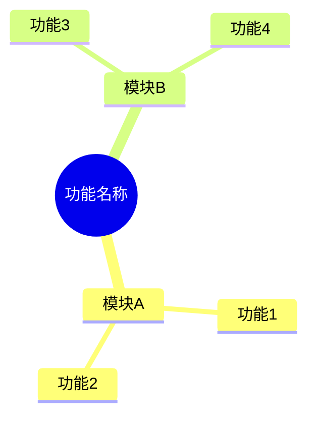

## Why
（为什么要做）

### 背景与目标
- 背景：
- 目标：

<!-- 1-2 句话说明问题/机会。为什么现在要做？ -->

## Jira / 需求链接

<!-- 在开始提案前提供 Jira/需求链接 -->
- 

## What Changes
（变更内容）

### 需求概览（全局）

<!-- 用要点列出新增/修改/删除的内容，破坏性变更标记 **BREAKING** -->
- 

## Capabilities
（能力范围）

### New Capabilities（新增能力）
<!-- 遵循 DDD 目录： [系统]-[领域]/[子域]/[功能] -->
- `gwms-outbound/order`: 

### Modified Capabilities（变更能力）
<!-- 仅当需求层面发生变化才填写 -->
- `gwms-outbound/order`: 

## Impact
（影响分析）

> proposal.md 不做技术分析，仅简述影响。完整 Impact 清单在 design-lite.md 中展开（详见 openspec/references/qwms-rules.md）。

<!-- 简述影响范围（1-3 句即可） -->
- 
